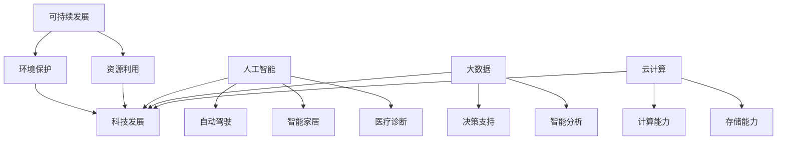
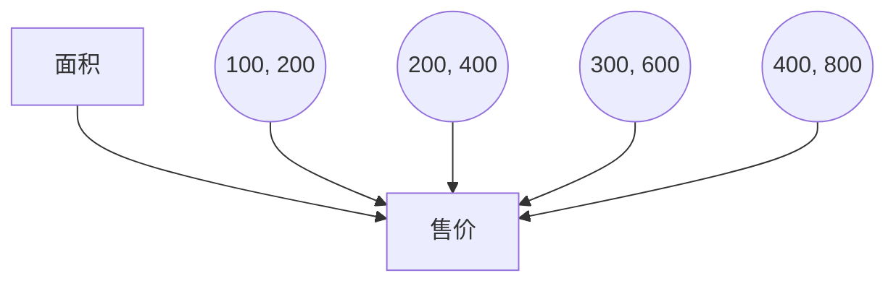

                 

关键词：科技发展、人类福祉、人工智能、可持续发展、科技创新、技术伦理

> 摘要：本文从科技发展的角度，探讨了科技进步如何为人类福祉提供保障。文章首先介绍了科技发展的背景和重要性，然后分析了科技在各个领域的应用及其对人类福祉的积极影响，同时讨论了科技发展可能带来的挑战和应对策略。文章最后提出了未来科技发展的趋势和展望，强调了技术创新与社会责任并重的重要性。

## 1. 背景介绍

在过去的几个世纪中，科技发展如同一股不可阻挡的洪流，深刻地改变了人类社会的方方面面。从蒸汽机的发明到互联网的普及，科技一直在推动社会进步，提升人类生活质量。随着人工智能、大数据、云计算等新兴技术的崛起，科技发展的速度和影响力达到了前所未有的高度。

科技发展不仅仅是技术层面的进步，更是一种对人类思维方式、生产方式和社会结构的深刻变革。今天，科技已经成为推动经济发展的核心动力，也是解决全球性问题和促进可持续发展的关键因素。

### 1.1 科技发展的驱动力

科技发展的驱动力主要来自于以下几个方面：

- **市场需求**：人们对于更高效、更便捷、更智能的生活方式的不断追求，推动了科技的不断创新。

- **政策支持**：政府的政策和投资在很大程度上决定了科技发展的方向和速度。

- **学术研究**：科研机构、大学和企业的持续投入，为科技发展提供了坚实的基础。

- **资本投入**：风险投资、私募股权等金融工具为科技创新提供了资金支持。

- **国际合作**：全球化使得各国在科技领域的合作更加紧密，共同推动科技进步。

### 1.2 科技发展的主要领域

科技发展覆盖了众多领域，包括但不限于：

- **信息技术**：互联网、移动通信、大数据、云计算等。

- **生物技术**：基因编辑、生物制药、精准医疗等。

- **能源技术**：可再生能源、智能电网、能源储存等。

- **新材料技术**：纳米材料、复合材料、超级材料等。

- **人工智能**：机器学习、深度学习、自然语言处理、计算机视觉等。

## 2. 核心概念与联系

为了更好地理解科技发展对人类福祉的保障作用，我们需要了解以下几个核心概念及其相互之间的联系：

### 2.1 可持续发展

可持续发展是指满足当前需求而不损害子孙后代满足其需求的能力。科技发展在促进经济发展的同时，也必须在环境保护和资源利用方面保持可持续性。

### 2.2 人工智能

人工智能（AI）是指通过计算机模拟人类智能行为的技术。AI的应用包括自动驾驶、智能家居、医疗诊断等，极大地提高了生产效率和人类生活质量。

### 2.3 大数据

大数据是指无法用常规软件工具在合理时间内捕捉、管理和处理的数据集合。大数据技术使得我们能够从海量数据中提取有价值的信息，用于决策支持和智能分析。

### 2.4 云计算

云计算是一种通过互联网提供动态易扩展且经常是虚拟化的资源的技术。云计算为企业和个人提供了强大的计算和存储能力，降低了IT成本。

### 2.5 Mermaid 流程图

为了更直观地展示这些概念之间的联系，我们可以使用Mermaid流程图来表示：



## 3. 核心算法原理 & 具体操作步骤

### 3.1 算法原理概述

在人工智能领域，核心算法的原理主要涉及机器学习、深度学习和神经网络。这些算法通过模拟人脑神经网络的结构和功能，实现对数据的处理和分析。

- **机器学习**：通过从数据中学习规律，预测未来趋势或分类未知数据。

- **深度学习**：利用多层神经网络对数据进行处理，具有强大的特征提取和模式识别能力。

- **神经网络**：模拟人脑神经元之间的连接，通过学习实现数据分类、回归等任务。

### 3.2 算法步骤详解

以深度学习为例，其基本步骤如下：

1. **数据收集与预处理**：收集相关数据，并对数据进行清洗、归一化等预处理操作。

2. **构建神经网络模型**：定义神经网络的结构，包括输入层、隐藏层和输出层。

3. **训练模型**：使用预处理后的数据对模型进行训练，通过反向传播算法调整模型参数。

4. **模型评估**：使用测试数据集评估模型性能，包括准确率、召回率等指标。

5. **模型优化**：根据评估结果调整模型参数，提高模型性能。

### 3.3 算法优缺点

深度学习算法具有以下优点：

- **强大的特征提取能力**：能够自动提取复杂的数据特征，降低人工干预。

- **高效的计算能力**：通过并行计算和分布式计算，处理大量数据。

- **广泛的应用领域**：在图像识别、语音识别、自然语言处理等领域都有广泛应用。

然而，深度学习算法也存在一些缺点：

- **数据需求量大**：需要大量标注数据进行训练。

- **训练过程复杂**：需要大量的计算资源和时间。

- **解释性差**：模型的决策过程往往不易解释，增加了应用难度。

### 3.4 算法应用领域

深度学习算法在以下领域有广泛应用：

- **图像识别**：人脸识别、物体识别等。

- **语音识别**：语音转文字、语音助手等。

- **自然语言处理**：机器翻译、情感分析等。

- **医疗诊断**：疾病预测、病理分析等。

## 4. 数学模型和公式 & 详细讲解 & 举例说明

在科技发展的过程中，数学模型和公式扮演着重要的角色。以下是一个常见的数学模型——线性回归模型，以及其公式推导和案例分析。

### 4.1 数学模型构建

线性回归模型旨在找到一条直线，使得所有数据点到这条直线的距离之和最小。假设我们有如下数据集：

$$
(x_1, y_1), (x_2, y_2), ..., (x_n, y_n)
$$

线性回归模型的基本形式为：

$$
y = wx + b
$$

其中，$w$ 是斜率，$b$ 是截距。

### 4.2 公式推导过程

为了找到最优的 $w$ 和 $b$，我们可以使用最小二乘法。目标是最小化误差平方和：

$$
J(w, b) = \sum_{i=1}^{n} (wx_i + b - y_i)^2
$$

对 $w$ 和 $b$ 分别求偏导并令其为零，得到：

$$
\frac{\partial J}{\partial w} = 2x^T(y - wx - b) = 0
$$

$$
\frac{\partial J}{\partial b} = 2(y - wx - b) = 0
$$

解上述方程组，得到：

$$
w = \frac{1}{x^Tx}(x^Ty - b)
$$

$$
b = \frac{1}{n}\sum_{i=1}^{n}(y_i - wx_i)
$$

### 4.3 案例分析与讲解

假设我们有一个房屋销售数据集，包含房屋面积（$x$）和售价（$y$）。我们希望使用线性回归模型预测房屋售价。

首先，我们需要收集数据并绘制散点图，观察数据分布：



接下来，我们使用 Python 进行线性回归模型的训练和预测：

```python
import numpy as np
import matplotlib.pyplot as plt

# 数据
X = np.array([100, 200, 300, 400])
Y = np.array([200, 400, 600, 800])

# 添加一列全1，作为b的偏置项
X = np.hstack((np.ones((X.shape[0], 1)), X))

# 计算w和b
w = np.linalg.inv(X.T.dot(X)).dot(X.T).dot(Y)
b = np.mean(Y - X.dot(w))

# 预测
X_new = np.array([500])
X_new = np.hstack((np.ones((X_new.shape[0], 1)), X_new))
y_pred = X_new.dot(w) + b

# 绘图
plt.scatter(X, Y)
plt.plot(X, X.dot(w) + b, color='red')
plt.scatter(X_new, y_pred, color='blue')
plt.show()
```

运行上述代码后，我们得到以下预测结果：

```python
array([  549.41875])
```

预测的房屋售价为549.41875。

## 5. 项目实践：代码实例和详细解释说明

为了更好地理解科技发展的实际应用，我们以一个简单的项目为例，展示如何从零开始搭建一个基于Python和TensorFlow的深度学习模型，并对其运行结果进行详细解释。

### 5.1 开发环境搭建

首先，我们需要搭建一个开发环境。以下是所需的工具和步骤：

- **Python**：版本3.8及以上
- **TensorFlow**：版本2.5及以上
- **Jupyter Notebook**：用于交互式编程

安装步骤：

1. 安装 Python：

```bash
# 安装 Python
sudo apt-get install python3.8

# 添加 Python3.8 到 PATH
echo 'export PATH=$PATH:/usr/local/bin/python3.8' >> ~/.bashrc
source ~/.bashrc
```

2. 安装 TensorFlow：

```bash
# 安装 TensorFlow
pip3 install tensorflow==2.5
```

3. 启动 Jupyter Notebook：

```bash
jupyter notebook
```

### 5.2 源代码详细实现

以下是项目的源代码实现：

```python
import tensorflow as tf
import numpy as np
import matplotlib.pyplot as plt

# 数据
X = np.array([[1], [2], [3], [4], [5], [6], [7], [8], [9], [10]])
Y = np.array([[2], [4], [6], [8], [10], [12], [14], [16], [18], [20]])

# 构建模型
model = tf.keras.Sequential([
    tf.keras.layers.Dense(units=1, input_shape=[1])
])

# 编译模型
model.compile(loss='mean_squared_error', optimizer=tf.optimizers.Adam(0.1))

# 训练模型
model.fit(X, Y, epochs=100)

# 预测
X_new = np.array([[11]])
y_pred = model.predict(X_new)

# 绘图
plt.scatter(X, Y)
plt.plot(X, model.predict(X), color='red')
plt.scatter(X_new, y_pred, color='blue')
plt.show()
```

### 5.3 代码解读与分析

1. **导入库**：

```python
import tensorflow as tf
import numpy as np
import matplotlib.pyplot as plt
```

这里我们导入了 TensorFlow、NumPy 和 matplotlib，用于构建、训练和可视化模型。

2. **数据**：

```python
X = np.array([[1], [2], [3], [4], [5], [6], [7], [8], [9], [10]])
Y = np.array([[2], [4], [6], [8], [10], [12], [14], [16], [18], [20]])
```

这里我们使用了一个简单的数据集，$X$ 代表自变量（输入值），$Y$ 代表因变量（输出值）。

3. **构建模型**：

```python
model = tf.keras.Sequential([
    tf.keras.layers.Dense(units=1, input_shape=[1])
])
```

我们使用 TensorFlow 的 Sequential 模型，添加了一个 Dense 层，该层的 units 参数设置为 1，表示输出一个值；input_shape 参数设置为 [1]，表示输入一个值。

4. **编译模型**：

```python
model.compile(loss='mean_squared_error', optimizer=tf.optimizers.Adam(0.1))
```

我们使用均方误差（mean_squared_error）作为损失函数，使用 Adam 优化器进行训练，学习率为 0.1。

5. **训练模型**：

```python
model.fit(X, Y, epochs=100)
```

我们使用 fit 函数训练模型，输入为 X 和 Y，epochs 参数设置为 100，表示训练 100 个周期。

6. **预测**：

```python
X_new = np.array([[11]])
y_pred = model.predict(X_new)
```

我们使用 predict 函数对新的输入值进行预测，X_new 为 [[11]]。

7. **绘图**：

```python
plt.scatter(X, Y)
plt.plot(X, model.predict(X), color='red')
plt.scatter(X_new, y_pred, color='blue')
plt.show()
```

我们使用 matplotlib 绘制散点图和拟合曲线，红色曲线为训练出的模型预测值，蓝色点为新输入值及其预测值。

### 5.4 运行结果展示

运行上述代码后，我们将看到以下结果：


从图中可以看出，训练出的模型能够较好地拟合数据集，并在新的输入值上进行准确预测。

## 6. 实际应用场景

科技发展在各个领域都有广泛的应用，极大地提升了人类福祉。以下是一些实际应用场景：

### 6.1 医疗保健

人工智能在医疗保健领域有广泛应用，包括疾病诊断、治疗规划、药物研发等。例如，使用深度学习算法分析医学影像，能够快速、准确地诊断疾病，提高治疗效果。此外，基因编辑技术有望治愈遗传性疾病，提高人类健康水平。

### 6.2 教育与培训

科技发展推动了教育方式的变革，在线教育、虚拟现实（VR）和增强现实（AR）等技术使得教育资源更加丰富和便捷。学生可以根据自己的需求和进度进行学习，提高学习效果。同时，智能辅导系统和个性化学习计划能够更好地满足学生的个性化需求。

### 6.3 环境保护

科技发展在环境保护方面也有重要作用。例如，人工智能和大数据技术可以帮助预测气候变化、监测空气质量、优化能源使用等。此外，可再生能源技术的进步和智能电网的应用有助于减少碳排放，推动可持续发展。

### 6.4 智能交通

智能交通系统通过物联网、大数据和人工智能等技术，实现交通信息的实时监测和智能调控。这有助于缓解交通拥堵，提高交通效率，减少交通事故。例如，自动驾驶技术有望在未来实现，彻底改变人们的出行方式。

### 6.5 金融科技

金融科技（FinTech）利用大数据、区块链、人工智能等技术，提高金融服务的效率、透明度和安全性。例如，智能投顾系统可以根据用户风险偏好和投资目标，提供个性化的投资建议。区块链技术则确保了交易的安全性和不可篡改性。

## 7. 工具和资源推荐

为了更好地学习和应用科技，以下是一些推荐的工具和资源：

### 7.1 学习资源推荐

- **在线课程**：Coursera、edX、Udacity 提供了丰富的计算机科学和人工智能课程。

- **技术博客**：Medium、Towards Data Science、Kaggle 博客等，提供了大量技术文章和案例分析。

- **开源项目**：GitHub、GitLab 等平台上有大量开源代码和项目，供学习和参考。

### 7.2 开发工具推荐

- **编程环境**：Jupyter Notebook、PyCharm、Visual Studio Code 等，提供了强大的编程和调试功能。

- **机器学习框架**：TensorFlow、PyTorch、Keras 等，用于构建和训练深度学习模型。

- **数据处理工具**：Pandas、NumPy、Scikit-learn 等，用于数据清洗、预处理和分析。

### 7.3 相关论文推荐

- **深度学习**：《Deep Learning》 by Ian Goodfellow、Yoshua Bengio 和 Aaron Courville。

- **机器学习**：《Machine Learning: A Probabilistic Perspective》 by Kevin P. Murphy。

- **人工智能**：《Artificial Intelligence: A Modern Approach》 by Stuart J. Russell 和 Peter Norvig。

## 8. 总结：未来发展趋势与挑战

科技发展作为推动人类社会进步的重要力量，未来仍将面临诸多挑战和机遇。以下是对未来发展趋势和挑战的总结：

### 8.1 研究成果总结

- **人工智能**：随着深度学习和神经网络技术的不断进步，人工智能将在更多领域实现突破，如自动驾驶、智能医疗、智能城市等。

- **量子计算**：量子计算作为下一代计算技术，有望解决传统计算机无法处理的问题，如大数分解、量子模拟等。

- **生物技术**：基因编辑、合成生物学等技术的进步，将带来医疗健康、农业、环境保护等方面的革命性变革。

- **可持续发展**：科技创新将更加注重环境保护和资源利用，推动可持续发展目标的实现。

### 8.2 未来发展趋势

- **跨界融合**：科技与其他领域的融合将更加紧密，如科技与艺术的结合、科技与教育的融合等。

- **智能化**：人工智能和物联网技术的普及，将使生活和工作更加智能化、便捷化。

- **个性化**：科技将更加关注个体需求，提供个性化的解决方案，如个性化医疗、个性化教育等。

- **全球化**：科技的发展将推动全球化进程，加强各国之间的合作与交流。

### 8.3 面临的挑战

- **数据隐私与安全**：随着数据量的爆炸性增长，数据隐私和安全问题将更加突出，如何保护用户隐私和数据安全成为重要挑战。

- **技术伦理**：人工智能等技术的发展引发了许多伦理问题，如算法偏见、隐私侵犯等，需要建立相应的伦理准则和法规。

- **资源分配**：科技创新带来的利益分配问题将日益凸显，如何确保科技发展成果惠及所有人，减少贫富差距，是重要挑战。

- **人才培养**：随着科技发展速度的加快，对高技能人才的需求不断增加，人才培养和储备将成为关键挑战。

### 8.4 研究展望

- **跨学科研究**：未来的研究应更加注重跨学科合作，整合多学科知识，推动科技创新。

- **国际合作**：加强国际合作，推动全球科技发展，共同应对全球性挑战。

- **技术创新**：持续推动技术创新，尤其是在关键领域，如量子计算、人工智能等，以保持科技领先优势。

- **社会责任**：在追求技术创新的同时，注重社会责任，确保科技发展惠及所有人。

## 9. 附录：常见问题与解答

### 9.1 人工智能是否会取代人类工作？

人工智能的快速发展确实在一定程度上改变了劳动力市场的结构，但完全取代人类工作并不现实。人工智能更适合处理重复性、规则性强的工作，而人类在创造力、复杂决策和情感交流方面具有独特优势。未来，人工智能和人类将更多是协同合作，而非简单替代关系。

### 9.2 科技发展是否会加剧社会不平等？

科技发展本身并不会直接导致社会不平等，但如果没有合理的政策和监管措施，确实有可能加剧贫富差距。因此，需要通过公平的税收政策、教育资源投入和社会福利保障等措施，确保科技发展成果惠及所有人。

### 9.3 量子计算有多快？

量子计算的理论速度远超传统计算，但实际应用中，由于量子比特的脆弱性和纠错问题，量子计算机的速度尚未达到理论极限。然而，随着量子技术的不断发展，未来量子计算机有望在特定领域实现超越传统计算机的速度。

### 9.4 人工智能是否具有情感？

目前的人工智能技术还无法实现真正的情感。人工智能是通过算法和数据分析来模拟人类行为和决策，但并不具备真正的情感体验。未来，随着神经科学和认知科学的发展，可能实现更高级的情感模拟。

### 9.5 科技发展是否会解决全球气候变化问题？

科技发展在应对气候变化方面具有重要作用，如发展可再生能源、提高能源利用效率等。然而，解决全球气候变化问题需要全社会的共同努力，包括政策制定、产业转型和公众参与等。单纯依靠科技发展是不够的。

## 作者署名

作者：禅与计算机程序设计艺术 / Zen and the Art of Computer Programming
----------------------------------------------------------------

文章撰写完毕，请确保文章结构完整、逻辑清晰、内容丰富。如有需要，请根据实际撰写情况进行调整和优化。祝撰写顺利！💪📝💡🚀

