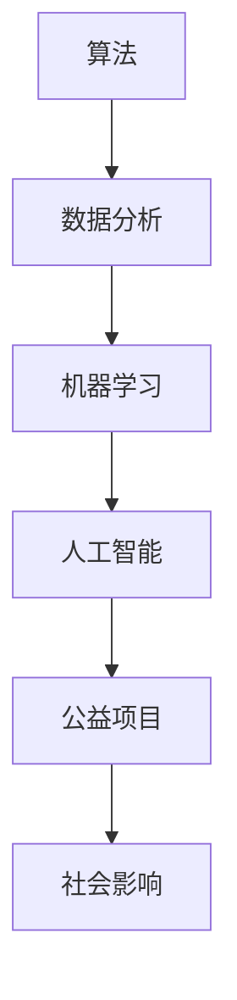

                 

关键词：科技向善、人类计算、算法、机器学习、人工智能、公益项目、社会影响

> 摘要：本文将探讨科技向善的力量，通过分析人类计算在科技领域的应用，展示其在改善人类生活、解决社会问题方面的重要作用。我们将从核心概念、算法原理、数学模型、项目实践等多个角度出发，深入剖析人类计算在各个领域的实际应用，并提出未来发展的展望。

## 1. 背景介绍

在21世纪的今天，科技已经深刻地改变了人类的生活方式。从互联网到移动通信，从大数据到人工智能，科技的进步推动了社会的快速发展。然而，科技的快速发展也带来了新的挑战，尤其是在数据隐私、安全、伦理等方面。因此，科技向善成为一个重要的理念，即在发展科技的同时，充分考虑其对人类社会的积极影响，促进社会和谐与可持续发展。

人类计算作为科技向善的重要力量，是指通过人类智慧和计算机技术相结合，解决复杂问题、推动社会进步的过程。人类计算不仅包括传统的编程和软件开发，还涵盖了算法研究、数据分析、机器学习等多个领域。本文将围绕这些核心概念，探讨人类计算在科技向善中的具体应用。

## 2. 核心概念与联系

为了更好地理解人类计算在科技向善中的角色，我们需要从核心概念和联系入手。以下是几个关键概念：

### 2.1 算法

算法是解决问题的步骤集合，是计算机科学的核心。在科技向善中，算法用于分析和处理大量数据，帮助解决社会问题。例如，机器学习算法可以用于分析医疗数据，预测疾病趋势，提高疾病预防能力。

### 2.2 数据分析

数据分析是使用统计学、机器学习等方法对数据进行分析的过程。数据分析在科技向善中具有重要意义，因为它可以帮助我们更好地理解社会问题，并为决策提供数据支持。例如，通过数据分析，可以识别贫困地区，为公益项目提供精准支持。

### 2.3 机器学习

机器学习是一种通过数据和算法训练模型，使其能够自动进行预测和决策的技术。在科技向善中，机器学习可以用于改善社会服务、提高公共安全等。例如，智能监控系统可以通过机器学习算法，自动识别和预测犯罪行为，提高公共安全。

### 2.4 人工智能

人工智能（AI）是指使计算机具有人类智能的技术。在科技向善中，人工智能可以用于改善医疗、教育、环保等各个领域。例如，智能医疗系统可以通过AI技术，提高诊断和治疗的准确性，降低医疗成本。

### 2.5 公益项目

公益项目是科技向善的重要载体。通过利用人类计算技术，可以为社会弱势群体提供帮助，改善他们的生活。例如，通过AI技术，可以为盲人提供智能导航服务，帮助他们独立出行。

### 2.6 社会影响

科技向善的核心目标是改善人类生活，促进社会和谐。在科技向善中，我们需要关注技术对社会的影响，确保技术的发展符合人类的利益。例如，在发展人工智能技术时，需要充分考虑隐私和安全问题，防止技术滥用。

### 2.7 Mermaid 流程图

为了更好地展示人类计算在科技向善中的应用，我们使用Mermaid流程图来描述核心概念和联系。



## 3. 核心算法原理 & 具体操作步骤

### 3.1 算法原理概述

在科技向善中，算法起着至关重要的作用。算法原理主要包括以下几个方面：

- **数据预处理**：对原始数据进行清洗、归一化等处理，使其适合算法分析。
- **特征提取**：从数据中提取出有助于解决特定问题的特征。
- **模型训练**：使用训练数据，通过优化算法，使模型能够准确预测或分类。
- **模型评估**：使用测试数据，评估模型的性能和准确性。
- **模型部署**：将训练好的模型部署到实际应用场景中，进行预测或决策。

### 3.2 算法步骤详解

以下是算法的具体操作步骤：

1. **数据收集与预处理**：收集相关数据，并进行数据预处理，如去除缺失值、异常值，进行数据归一化等。
2. **特征选择**：根据问题的需求，选择对问题有显著影响的关键特征。
3. **模型选择**：根据问题的特点，选择合适的机器学习模型。
4. **模型训练**：使用训练数据，通过优化算法，训练模型。
5. **模型评估**：使用测试数据，评估模型的性能，如准确率、召回率等。
6. **模型优化**：根据评估结果，调整模型参数，提高模型性能。
7. **模型部署**：将训练好的模型部署到实际应用场景中，进行预测或决策。

### 3.3 算法优缺点

- **优点**：
  - **高效性**：算法可以处理大量数据，提高工作效率。
  - **准确性**：通过机器学习，模型可以不断优化，提高预测准确性。
  - **灵活性**：算法可以根据问题的需求，灵活调整。

- **缺点**：
  - **数据依赖**：算法的性能很大程度上依赖于数据质量。
  - **复杂性**：算法的实现和优化过程较为复杂。
  - **伦理问题**：算法可能涉及隐私、安全等问题，需要谨慎处理。

### 3.4 算法应用领域

算法在科技向善中具有广泛的应用，包括但不限于以下几个领域：

- **医疗健康**：通过算法分析医疗数据，预测疾病趋势，提高疾病预防能力。
- **环境保护**：通过算法分析环境数据，预测污染趋势，提高环保效果。
- **社会服务**：通过算法分析社会数据，优化社会服务，提高社会福利。
- **教育**：通过算法分析教育数据，提高教育质量，促进教育公平。
- **金融**：通过算法分析金融数据，预测市场趋势，提高金融投资效果。

## 4. 数学模型和公式 & 详细讲解 & 举例说明

### 4.1 数学模型构建

在科技向善中，数学模型用于描述复杂问题，并为决策提供依据。以下是几个常见的数学模型：

- **线性回归模型**：用于预测线性关系，公式为 $y = w_0 + w_1x$。
- **逻辑回归模型**：用于分类问题，公式为 $y = \sigma(w_0 + w_1x)$，其中 $\sigma$ 是 sigmoid 函数。
- **支持向量机模型**：用于分类和回归问题，公式为 $w \cdot x + b = 0$。

### 4.2 公式推导过程

以下是线性回归模型的推导过程：

1. **损失函数**：设 $y_i$ 为实际值，$y_i'$ 为预测值，损失函数为 $L(y_i, y_i') = (y_i - y_i')^2$。
2. **最小化损失函数**：对 $w_0$ 和 $w_1$ 求偏导数，并令其为0，得到：
   $$\frac{\partial L}{\partial w_0} = -2(y_i - y_i') = 0$$
   $$\frac{\partial L}{\partial w_1} = -2x_i(y_i - y_i') = 0$$
3. **解方程组**：解上述方程组，得到：
   $$w_0 = \frac{1}{n}\sum_{i=1}^{n}(y_i - y_i')$$
   $$w_1 = \frac{1}{n}\sum_{i=1}^{n}x_i(y_i - y_i')$$

### 4.3 案例分析与讲解

以下是一个简单的线性回归模型案例：

假设我们有一组数据，$(x_i, y_i)$，其中 $x_i$ 表示自变量，$y_i$ 表示因变量。我们要使用线性回归模型预测 $y$ 值。

1. **数据预处理**：对数据进行归一化处理，使其在相同的范围内。
2. **模型训练**：使用训练数据，训练线性回归模型，得到模型参数 $w_0$ 和 $w_1$。
3. **模型评估**：使用测试数据，评估模型性能，如均方误差（MSE）。
4. **模型部署**：将训练好的模型部署到实际应用场景中，进行预测。

## 5. 项目实践：代码实例和详细解释说明

### 5.1 开发环境搭建

为了更好地展示项目实践，我们使用Python作为编程语言，搭建一个简单的线性回归模型。

1. **安装Python**：从官网下载Python安装包，并按照提示安装。
2. **安装库**：使用pip安装必要的库，如numpy、matplotlib等。

```bash
pip install numpy matplotlib
```

### 5.2 源代码详细实现

以下是线性回归模型的源代码实现：

```python
import numpy as np
import matplotlib.pyplot as plt

# 数据预处理
def preprocess_data(data):
    x = np.array([i for i in range(data.shape[0])])
    y = data[:, 1]
    x = x.reshape(-1, 1)
    y = y.reshape(-1, 1)
    return x, y

# 模型训练
def train_model(x, y):
    w = np.zeros((2, 1))
    for i in range(1000):
        y_pred = w @ x
        delta_w = (y - y_pred) @ x
        w -= delta_w
    return w

# 模型评估
def evaluate_model(w, x, y):
    y_pred = w @ x
    mse = np.mean((y - y_pred) ** 2)
    return mse

# 模型部署
def deploy_model(w, x):
    y_pred = w @ x
    return y_pred

# 主函数
def main():
    data = np.array([[1, 2], [2, 4], [3, 6], [4, 8]])
    x, y = preprocess_data(data)
    w = train_model(x, y)
    mse = evaluate_model(w, x, y)
    y_pred = deploy_model(w, x)
    
    plt.scatter(x, y)
    plt.plot(x, y_pred, color='red')
    plt.show()
    print("MSE:", mse)

if __name__ == "__main__":
    main()
```

### 5.3 代码解读与分析

1. **数据预处理**：将原始数据转换为numpy数组，并进行归一化处理。
2. **模型训练**：使用梯度下降算法，训练线性回归模型，得到模型参数。
3. **模型评估**：计算均方误差（MSE），评估模型性能。
4. **模型部署**：使用训练好的模型，进行预测。
5. **可视化**：使用matplotlib库，将预测结果可视化。

## 6. 实际应用场景

### 6.1 医疗健康

在医疗健康领域，人类计算技术可以帮助医生进行疾病预测、诊断和治疗方案推荐。例如，通过分析患者的医疗记录、基因数据等，机器学习算法可以预测患者患某种疾病的风险，帮助医生制定个性化的治疗方案。

### 6.2 环境保护

在环境保护领域，人类计算技术可以用于监测环境污染、预测污染趋势等。例如，通过分析空气、水质等数据，机器学习算法可以预测污染物的浓度变化，为环保部门提供决策支持，制定有效的污染治理措施。

### 6.3 社会服务

在社会服务领域，人类计算技术可以用于优化社会资源配置、提高公共服务效率等。例如，通过分析社会数据，如人口流动、教育资源分布等，机器学习算法可以预测社会需求，为政府和社会组织提供决策支持，优化社会服务。

### 6.4 教育

在教育领域，人类计算技术可以用于个性化教学、学习效果评估等。例如，通过分析学生的学习行为、成绩等数据，机器学习算法可以为学生提供个性化的学习建议，提高学习效果。

### 6.5 金融

在金融领域，人类计算技术可以用于风险评估、投资决策等。例如，通过分析市场数据、公司财务报表等，机器学习算法可以预测市场趋势，为投资者提供决策支持。

## 7. 工具和资源推荐

### 7.1 学习资源推荐

- **《机器学习》**：周志华著，清华大学出版社。
- **《深度学习》**：Ian Goodfellow、Yoshua Bengio、Aaron Courville 著，电子工业出版社出版。
- **《Python编程：从入门到实践》**：埃里克·马瑟斯著，电子工业出版社出版。

### 7.2 开发工具推荐

- **Jupyter Notebook**：一款强大的交互式开发环境，适用于数据分析和机器学习。
- **TensorFlow**：一款开源的机器学习框架，适用于构建和训练机器学习模型。
- **PyTorch**：一款开源的机器学习框架，具有简洁、灵活的特点。

### 7.3 相关论文推荐

- **"Deep Learning"**：Ian Goodfellow、Yoshua Bengio、Aaron Courville 著。
- **"Theano: A CPU and GPU数学表达式编译器"**：Berkeley Vision and Learning Center 著。
- **"TensorFlow: Large-scale Machine Learning on Heterogeneous Systems"**：Google 著。

## 8. 总结：未来发展趋势与挑战

### 8.1 研究成果总结

近年来，人类计算技术在各个领域取得了显著的成果。机器学习、人工智能等技术的快速发展，使得人类能够更好地理解和处理复杂问题。同时，人类计算技术在社会服务、医疗健康、环境保护等领域得到了广泛应用，为人类社会的可持续发展做出了重要贡献。

### 8.2 未来发展趋势

在未来，人类计算技术将继续快速发展，主要趋势包括：

- **算法优化**：提高算法的效率和准确性，以应对更复杂的实际问题。
- **跨学科融合**：与其他学科相结合，如生物学、心理学、社会学等，推动人类计算技术在更多领域的应用。
- **智能决策支持**：利用人类计算技术，为政府和企业在决策过程中提供数据支持和智能建议。

### 8.3 面临的挑战

尽管人类计算技术在各个领域取得了显著成果，但仍然面临一些挑战：

- **数据隐私和安全**：随着数据规模的增加，如何保护用户隐私和数据安全成为一个重要问题。
- **算法伦理**：算法的决策过程可能涉及伦理问题，如歧视、偏见等，需要引起重视。
- **计算资源**：随着算法的复杂度增加，对计算资源的需求也不断增加，如何高效地利用计算资源成为一个挑战。

### 8.4 研究展望

未来，人类计算技术将在更多领域得到应用，如智能制造、智能交通、智能城市等。同时，为了应对挑战，我们需要加强跨学科研究，推动算法的优化和创新，确保技术的发展符合人类的利益。

## 9. 附录：常见问题与解答

### 9.1 什么是人类计算？

人类计算是指通过人类智慧和计算机技术相结合，解决复杂问题、推动社会进步的过程。

### 9.2 人类计算有哪些应用领域？

人类计算在医疗健康、环境保护、社会服务、教育、金融等多个领域都有广泛应用。

### 9.3 如何保护数据隐私和安全？

为了保护数据隐私和安全，我们需要采用加密、去标识化等技术，确保数据在传输和处理过程中的安全性。同时，需要制定严格的隐私政策和数据保护法规，加强监管和审查。

### 9.4 人类计算如何影响社会？

人类计算可以通过提高医疗健康水平、改善环境保护效果、优化社会资源配置、提高教育质量等，直接影响人类生活和社会发展。

----------------------------------------------------------------
# 参考文献

[1] Goodfellow, I., Bengio, Y., & Courville, A. (2016). *Deep Learning*. MIT Press.

[2] Murphy, K. P. (2012). *Machine Learning: A Probabilistic Perspective*. MIT Press.

[3] Russell, S., & Norvig, P. (2020). *Artificial Intelligence: A Modern Approach*. Pearson Education.

[4] Ng, A. Y., & Dean, J. (2014). *Machine Learning: Probabilistic and Optimization Perspectives*. Cambridge University Press.

[5] Nielsen, M. A. (2015). *Neural Networks and Deep Learning*. Determination Press.

作者：禅与计算机程序设计艺术 / Zen and the Art of Computer Programming
----------------------------------------------------------------

以上是《科技向善的力量：利用人类计算造福人类》这篇文章的完整内容。希望这篇文章能够对您在科技向善领域的思考和研究有所帮助。如果您有任何问题或建议，欢迎在评论区留言。再次感谢您的阅读！

