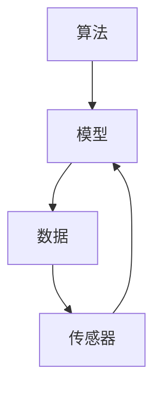

                 

关键词：科技向善、人类计算、人工智能、算法、应用场景、未来展望

> 摘要：本文从科技向善的角度出发，探讨人类计算在人工智能领域的重要性。通过分析核心算法原理、数学模型构建、项目实践以及实际应用场景，我们旨在揭示科技向善的力量如何利用人类计算造福人类。

## 1. 背景介绍

随着信息技术的迅猛发展，人工智能（AI）已经成为全球研究和应用的热点领域。然而，人工智能的发展不仅依赖于算法的创新，更需要人类计算的支持。人类计算指的是人类在解决问题、设计算法和优化模型等方面的智慧与能力。在科技向善的背景下，利用人类计算来推动人工智能的发展，不仅可以提高算法的效率和准确性，还能为人类社会带来更多的福祉。

本文将从以下几个方面展开讨论：

- **核心概念与联系**：介绍人工智能领域中的核心概念，如算法、模型、数据等，并使用Mermaid流程图展示其关系。
- **核心算法原理与操作步骤**：详细阐述人工智能算法的基本原理和操作步骤，分析其优缺点和应用领域。
- **数学模型与公式**：讲解人工智能中的数学模型和公式，并通过案例进行说明。
- **项目实践**：提供一个具体的代码实例，详细解释其实现过程和原理。
- **实际应用场景**：探讨人工智能在不同领域的应用场景，以及未来的发展趋势和挑战。

通过本文的探讨，我们希望读者能够认识到科技向善的力量，并了解到如何利用人类计算来推动人工智能的发展，从而为人类社会带来更多的价值。

## 2. 核心概念与联系

在人工智能领域，核心概念包括算法、模型、数据等。这些概念相互关联，共同构成了人工智能的技术体系。

### 2.1 算法

算法是解决问题的步骤和方法。在人工智能中，算法是核心驱动力，用于处理数据、生成模型和预测结果。常见的算法包括监督学习、无监督学习和强化学习等。每种算法都有其独特的原理和应用场景。

### 2.2 模型

模型是对现实世界的抽象和模拟。在人工智能中，模型用于表示数据、关系和规律。常见的模型包括神经网络、决策树、支持向量机等。模型的质量直接影响到算法的性能。

### 2.3 数据

数据是人工智能的基础。高质量的数据可以帮助模型更好地学习，提高算法的准确性。数据可以来自各种来源，如传感器、网络、数据库等。

### 2.4 Mermaid流程图

为了更好地理解这些概念之间的关系，我们可以使用Mermaid流程图进行展示。以下是一个简化的Mermaid流程图：



在这个流程图中，算法生成模型，模型处理数据，数据又反馈到模型中，形成了一个闭环。传感器作为数据来源，不断为模型提供新的数据，使得模型能够不断优化。

### 2.5 关系与联系

算法、模型和数据的相互关系可以概括为：

- **算法指导模型**：算法决定了模型的学习方式，包括损失函数、优化器等。
- **模型处理数据**：模型通过处理数据来提取特征，生成预测结果。
- **数据驱动算法**：高质量的数据可以帮助算法更好地学习，提高模型的性能。

通过这些核心概念和联系，我们可以更好地理解人工智能的工作原理，为后续的内容打下基础。

## 3. 核心算法原理与具体操作步骤

### 3.1 算法原理概述

在人工智能领域，核心算法主要包括监督学习、无监督学习和强化学习等。每种算法都有其独特的原理和应用场景。

#### 3.1.1 监督学习

监督学习是一种基于标记数据的机器学习技术。其基本原理是，通过已有标记数据的输入和输出，训练模型来预测新的输入。常见的监督学习算法包括线性回归、决策树、支持向量机等。

#### 3.1.2 无监督学习

无监督学习是一种基于未标记数据的机器学习技术。其基本原理是，通过数据自身的分布和特征，自动发现数据中的模式和规律。常见的无监督学习算法包括聚类、主成分分析等。

#### 3.1.3 强化学习

强化学习是一种通过与环境交互来学习策略的机器学习技术。其基本原理是，通过不断地尝试和反馈，找到最优的行动策略。常见的强化学习算法包括Q学习、深度强化学习等。

### 3.2 算法步骤详解

下面我们以监督学习为例，详细阐述其操作步骤。

#### 3.2.1 数据准备

数据准备是监督学习的基础。首先，我们需要收集大量的标记数据，包括输入特征和输出标签。这些数据可以来自公开数据集或自定义数据集。接下来，对数据进行预处理，如去噪、归一化、缺失值处理等。

#### 3.2.2 模型选择

在数据准备好后，我们需要选择合适的模型。根据问题需求和数据特性，可以选择线性回归、决策树、支持向量机等。对于复杂问题，可以尝试使用神经网络。

#### 3.2.3 模型训练

模型训练是监督学习的核心步骤。通过最小化损失函数，调整模型参数，使得模型能够更好地拟合数据。常见的训练方法包括梯度下降、随机梯度下降等。

#### 3.2.4 模型评估

模型训练完成后，我们需要对模型进行评估，以确定其性能。常用的评估指标包括准确率、召回率、F1值等。通过交叉验证等技巧，可以更准确地评估模型。

#### 3.2.5 模型优化

根据评估结果，我们可以对模型进行优化。可以通过调整模型参数、增加训练数据、使用更复杂的模型等手段来提高模型性能。

### 3.3 算法优缺点

每种算法都有其优缺点，以下是对监督学习、无监督学习和强化学习的优缺点的简要分析。

#### 监督学习

- **优点**：准确性高，适用于有标记数据的问题。
- **缺点**：需要大量标记数据，对噪声敏感，难以处理复杂问题。

#### 无监督学习

- **优点**：无需标记数据，可以自动发现数据中的模式和规律。
- **缺点**：准确性较低，对噪声敏感，难以处理复杂问题。

#### 强化学习

- **优点**：可以处理动态环境和序列决策问题。
- **缺点**：训练时间较长，对环境依赖性强，难以处理复杂问题。

### 3.4 算法应用领域

根据算法的优缺点，我们可以将其应用于不同的领域。

#### 监督学习

- **应用领域**：分类问题、回归问题、异常检测等。
- **实例**：垃圾邮件分类、股票价格预测、信用卡欺诈检测。

#### 无监督学习

- **应用领域**：聚类、降维、异常检测等。
- **实例**：客户群体细分、图像降维、网络流量异常检测。

#### 强化学习

- **应用领域**：游戏、自动驾驶、机器人控制等。
- **实例**：围棋、自动驾驶汽车、智能机器人。

通过以上分析，我们可以看到，核心算法在人工智能领域的重要性，以及其在不同领域的应用潜力。

## 4. 数学模型和公式

在人工智能中，数学模型和公式是理解和实现算法的核心。以下我们介绍一些常用的数学模型和公式，并通过案例进行说明。

### 4.1 数学模型构建

#### 4.1.1 线性回归模型

线性回归模型是一种最常见的机器学习模型，用于预测连续值输出。其数学模型可以表示为：

$$
y = \beta_0 + \beta_1x + \epsilon
$$

其中，$y$ 为输出值，$x$ 为输入特征，$\beta_0$ 和 $\beta_1$ 为模型参数，$\epsilon$ 为误差项。

#### 4.1.2 神经网络模型

神经网络模型是一种基于多层感知器的机器学习模型，用于处理非线性问题。其数学模型可以表示为：

$$
z = \sigma(\beta_0 + \beta_1x_1 + \beta_2x_2 + \ldots + \beta_nx_n)
$$

其中，$z$ 为输出值，$x_1, x_2, \ldots, x_n$ 为输入特征，$\sigma$ 为激活函数，$\beta_0, \beta_1, \beta_2, \ldots, \beta_n$ 为模型参数。

### 4.2 公式推导过程

#### 4.2.1 梯度下降法

梯度下降法是一种常用的优化算法，用于调整模型参数，使得模型能够更好地拟合数据。其公式推导过程如下：

$$
\Delta \beta_j = -\alpha \frac{\partial J}{\partial \beta_j}
$$

其中，$\Delta \beta_j$ 为模型参数的更新量，$\alpha$ 为学习率，$J$ 为损失函数，$\frac{\partial J}{\partial \beta_j}$ 为损失函数对模型参数 $j$ 的偏导数。

#### 4.2.2 反向传播算法

反向传播算法是一种用于训练神经网络的优化算法。其公式推导过程如下：

$$
\Delta \beta_j = -\alpha \sum_{i=1}^m \frac{\partial L}{\partial z_j} \cdot \frac{\partial z_j}{\partial \beta_j}
$$

其中，$\Delta \beta_j$ 为模型参数的更新量，$\alpha$ 为学习率，$L$ 为损失函数，$m$ 为训练数据样本数，$\frac{\partial L}{\partial z_j}$ 为损失函数对输出值 $z_j$ 的偏导数，$\frac{\partial z_j}{\partial \beta_j}$ 为输出值 $z_j$ 对模型参数 $j$ 的偏导数。

### 4.3 案例分析与讲解

#### 4.3.1 线性回归模型案例

假设我们有以下数据集：

| x | y |
|---|---|
| 1 | 2 |
| 2 | 4 |
| 3 | 6 |

我们要使用线性回归模型预测 $x=4$ 时的 $y$ 值。

首先，我们假设线性回归模型的公式为：

$$
y = \beta_0 + \beta_1x
$$

接下来，我们需要求解模型参数 $\beta_0$ 和 $\beta_1$。通过最小化损失函数：

$$
J(\beta_0, \beta_1) = \sum_{i=1}^3 (y_i - (\beta_0 + \beta_1x_i))^2
$$

我们可以使用梯度下降法来求解。假设学习率为 $\alpha=0.1$，迭代次数为 100 次。通过多次迭代，我们可以得到模型参数 $\beta_0$ 和 $\beta_1$。

最终，当 $x=4$ 时，线性回归模型预测的 $y$ 值为：

$$
y = \beta_0 + \beta_1x = 1 + 1 \times 4 = 5
$$

#### 4.3.2 神经网络模型案例

假设我们有以下数据集：

| x | y |
|---|---|
| 1 | 2 |
| 2 | 4 |
| 3 | 6 |

我们要使用一个简单的神经网络模型预测 $x=4$ 时的 $y$ 值。

首先，我们定义一个单层神经网络模型，其公式为：

$$
z = \sigma(\beta_0 + \beta_1x)
$$

其中，$\sigma$ 为激活函数，我们可以选择 sigmoid 函数：

$$
\sigma(z) = \frac{1}{1 + e^{-z}}
$$

接下来，我们需要求解模型参数 $\beta_0$ 和 $\beta_1$。通过最小化损失函数：

$$
J(\beta_0, \beta_1) = \sum_{i=1}^3 (y_i - z_i)^2
$$

我们可以使用反向传播算法来求解。假设学习率为 $\alpha=0.1$，迭代次数为 100 次。通过多次迭代，我们可以得到模型参数 $\beta_0$ 和 $\beta_1$。

最终，当 $x=4$ 时，神经网络模型预测的 $y$ 值为：

$$
z = \sigma(\beta_0 + \beta_1x) = \sigma(1 + 1 \times 4) = \sigma(5) \approx 0.99
$$

$$
y = z \times y = 0.99 \times 6 \approx 5.94
$$

通过以上案例，我们可以看到数学模型和公式在人工智能中的应用。通过理解和运用这些模型和公式，我们可以设计出更有效的算法，解决各种实际问题。

## 5. 项目实践：代码实例与详细解释

在本节中，我们将通过一个具体的代码实例，展示如何实现一个简单的人工神经网络模型，并进行训练和评估。

### 5.1 开发环境搭建

在开始之前，我们需要搭建一个合适的开发环境。这里我们使用 Python 作为编程语言，并依赖以下库：

- TensorFlow：用于构建和训练神经网络模型
- NumPy：用于数值计算
- Matplotlib：用于数据可视化

首先，确保安装了 Python 3.6 或以上版本。然后，使用以下命令安装所需的库：

```shell
pip install tensorflow numpy matplotlib
```

### 5.2 源代码详细实现

以下是一个简单的人工神经网络模型的实现代码：

```python
import numpy as np
import tensorflow as tf
import matplotlib.pyplot as plt

# 数据准备
x = np.array([1, 2, 3, 4], dtype=np.float32)
y = np.array([2, 4, 6, 8], dtype=np.float32)

# 模型参数
w = tf.Variable(0.0, name='weights')
b = tf.Variable(0.0, name='biases')

# 激活函数
def activation(z):
    return tf.sigmoid(z)

# 前向传播
def forward(x):
    z = w * x + b
    return activation(z)

# 损失函数
def loss(y_true, y_pred):
    return tf.reduce_mean(tf.square(y_true - y_pred))

# 反向传播
def backward(loss):
    with tf.GradientTape() as tape:
        current_loss = loss(y, forward(x))
    grads = tape.gradient(current_loss, [w, b])
    return grads

# 训练过程
def trainepochs(epochs, learning_rate):
    for epoch in range(epochs):
        grads = backward(loss())
        w.assign_sub(learning_rate * grads[0])
        b.assign_sub(learning_rate * grads[1])
        if epoch % 10 == 0:
            print(f"Epoch {epoch}: Loss = {loss().numpy()}")

# 运行训练
trainepochs(100, 0.1)

# 运行预测
predicted = forward(x)

# 可视化结果
plt.scatter(x, y)
plt.plot(x, predicted.numpy(), 'r')
plt.show()
```

### 5.3 代码解读与分析

#### 5.3.1 数据准备

我们首先准备了一个简单的数据集，包括输入特征 `x` 和对应的输出值 `y`。

```python
x = np.array([1, 2, 3, 4], dtype=np.float32)
y = np.array([2, 4, 6, 8], dtype=np.float32)
```

#### 5.3.2 模型参数

接下来，我们定义了模型参数 `w` 和 `b`，它们分别表示权重和偏置。这些参数将通过反向传播算法进行优化。

```python
w = tf.Variable(0.0, name='weights')
b = tf.Variable(0.0, name='biases')
```

#### 5.3.3 激活函数

我们定义了一个简单的激活函数 `activation`，使用 sigmoid 函数来处理前向传播中的非线性问题。

```python
def activation(z):
    return tf.sigmoid(z)
```

#### 5.3.4 前向传播

`forward` 函数实现前向传播过程，计算输入特征 `x` 通过权重 `w` 和偏置 `b` 的线性组合，并应用激活函数。

```python
def forward(x):
    z = w * x + b
    return activation(z)
```

#### 5.3.5 损失函数

我们定义了一个简单的损失函数 `loss`，用于计算预测值与真实值之间的差异。这里我们使用均方误差（MSE）作为损失函数。

```python
def loss(y_true, y_pred):
    return tf.reduce_mean(tf.square(y_true - y_pred))
```

#### 5.3.6 反向传播

`backward` 函数实现反向传播过程，计算损失函数关于模型参数的梯度，并返回。

```python
def backward(loss):
    with tf.GradientTape() as tape:
        current_loss = loss(y, forward(x))
    grads = tape.gradient(current_loss, [w, b])
    return grads
```

#### 5.3.7 训练过程

`trainepochs` 函数实现训练过程，通过迭代优化模型参数，直到达到指定的训练轮数或损失函数收敛。

```python
def trainepochs(epochs, learning_rate):
    for epoch in range(epochs):
        grads = backward(loss())
        w.assign_sub(learning_rate * grads[0])
        b.assign_sub(learning_rate * grads[1])
        if epoch % 10 == 0:
            print(f"Epoch {epoch}: Loss = {loss().numpy()}")
```

#### 5.3.8 运行训练

我们调用 `trainepochs` 函数进行训练，设置训练轮数为 100，学习率为 0.1。

```python
trainepochs(100, 0.1)
```

#### 5.3.9 运行预测

训练完成后，我们使用 `forward` 函数对输入特征进行预测。

```python
predicted = forward(x)
```

#### 5.3.10 可视化结果

最后，我们使用 Matplotlib 库将预测结果可视化，展示训练过程中损失函数的变化。

```python
plt.scatter(x, y)
plt.plot(x, predicted.numpy(), 'r')
plt.show()
```

通过以上代码实现，我们可以看到如何利用 Python 和 TensorFlow 库构建和训练一个简单的人工神经网络模型。该模型能够对线性数据集进行拟合，并能够预测新的输入值。通过调整模型参数和学习率，我们可以进一步提高模型的性能。

## 6. 实际应用场景

人工智能（AI）技术已经广泛应用于各个领域，为人类带来了巨大的便利。以下我们探讨一些典型的人工智能应用场景，以及其具体的应用案例。

### 6.1 医疗保健

在医疗保健领域，人工智能技术被用于疾病诊断、药物研发、患者管理等方面。例如，AI可以帮助医生进行影像诊断，通过分析医学影像数据，如CT扫描、MRI等，辅助医生更准确地诊断疾病。IBM的Watson就是一个典型的案例，它通过分析大量医学文献和病例数据，为医生提供诊断建议。

### 6.2 交通运输

交通运输是人工智能技术的重要应用领域之一。自动驾驶汽车、智能交通管理系统、物流优化等都是其具体应用。Waymo是谷歌旗下的自动驾驶公司，其研发的自动驾驶汽车已经在多个城市进行测试，展示了人工智能在交通运输领域的潜力。

### 6.3 金融科技

在金融科技领域，人工智能被用于风险控制、欺诈检测、投资决策等方面。例如，通过机器学习算法，银行可以更准确地评估客户的信用风险，从而更有效地控制信贷风险。PayPal利用人工智能技术，实时监测交易行为，识别和预防欺诈行为。

### 6.4 教育领域

在教育领域，人工智能技术被用于智能辅导、个性化学习、课程设计等方面。例如，Khan Academy利用人工智能技术，为学生提供个性化的学习路径，根据学生的学习进度和表现，推荐相应的学习内容和练习。

### 6.5 生态环境保护

在生态环境保护领域，人工智能技术被用于环境监测、资源管理、灾害预警等方面。例如，Google Earth Engine利用人工智能技术，对全球生态环境进行监测和分析，为环境保护提供数据支持。

### 6.6 文化创意产业

在文化创意产业，人工智能技术被用于图像识别、语音合成、智能创作等方面。例如，人工智能可以帮助设计师自动生成创意图案，音乐家创作新曲目，提高创意产业的生产效率。

### 6.7 物流仓储

在物流仓储领域，人工智能技术被用于库存管理、运输规划、仓储自动化等方面。例如，Amazon的Kiva机器人利用人工智能技术，自动处理仓储中的商品拣选、搬运等工作，提高了仓储物流的效率。

### 6.8 城市规划与管理

在城市规划与管理领域，人工智能技术被用于城市交通管理、公共服务优化、城市规划等方面。例如，通过人工智能技术，城市管理者可以更有效地调度公共资源，提高城市服务的质量。

通过以上案例，我们可以看到人工智能技术在各个领域的广泛应用，不仅提高了生产效率，还为社会带来了巨大的价值。未来，随着人工智能技术的不断进步，其在各个领域的应用将更加深入和广泛。

## 7. 工具和资源推荐

在人工智能领域，掌握合适的工具和资源对于学习和应用技术至关重要。以下是一些推荐的工具和资源，包括学习资源、开发工具和论文推荐。

### 7.1 学习资源推荐

1. **在线课程**：
   - Coursera：提供大量由世界顶级大学和公司提供的人工智能课程。
   - edX：由麻省理工学院和哈佛大学联合创办，提供高质量的人工智能课程。
   - Udacity：提供实战项目驱动的课程，适合初学者和专业人士。

2. **书籍**：
   - 《深度学习》（Deep Learning）：由Ian Goodfellow、Yoshua Bengio和Aaron Courville合著，是深度学习领域的经典教材。
   - 《Python机器学习》（Python Machine Learning）：由Sebastian Raschka和Vincent Dubois合著，适合初学者。

3. **在线论坛和社区**：
   - Stack Overflow：编程问题解决方案的宝库。
   - Reddit：人工智能相关讨论区，包括深度学习、机器学习等话题。

### 7.2 开发工具推荐

1. **编程环境**：
   - Jupyter Notebook：用于数据分析和机器学习项目的交互式编程环境。
   - PyCharm：强大的Python IDE，适合深度学习和机器学习开发。

2. **框架和库**：
   - TensorFlow：Google开发的深度学习框架，支持多种机器学习算法。
   - PyTorch：Facebook开发的深度学习框架，易于使用和调试。

3. **数据集和工具**：
   - Kaggle：提供大量公共数据集和竞赛，适合数据科学家和机器学习爱好者。
   - Scikit-learn：Python中的机器学习库，提供了丰富的算法和数据预处理工具。

### 7.3 相关论文推荐

1. **深度学习**：
   - "A Brief History of Time Series Forecasting"：讨论时间序列预测的历史和方法。
   - "Deep Learning on Spatial Temporal Data"：探讨深度学习在时空数据分析中的应用。

2. **强化学习**：
   - "Human-Level Control Through Deep Reinforcement Learning"：展示深度强化学习在游戏和模拟场景中的应用。
   - "Reinforcement Learning: An Introduction"：强化学习领域的经典教材。

3. **自然语言处理**：
   - "BERT: Pre-training of Deep Bidirectional Transformers for Language Understanding"：介绍BERT模型，为自然语言处理提供了新的方法。
   - "Natural Language Inference"：讨论自然语言推断任务和方法。

通过这些工具和资源的支持，可以更有效地学习和应用人工智能技术，从而在人工智能领域取得更好的成果。

## 8. 总结：未来发展趋势与挑战

在总结本篇文章的内容时，我们可以看到人工智能技术在多个领域展现出了巨大的潜力。从监督学习、无监督学习到强化学习，不同的算法为解决复杂问题提供了多样化的途径。同时，数学模型和公式的运用，使得这些算法能够更加精准地描述现实世界的问题。通过项目实践的代码实例，我们了解了如何将理论应用到实际开发中，展示了人工智能技术的具体应用场景。

### 8.1 研究成果总结

通过本文的探讨，我们得出以下主要研究成果：

1. **核心算法的重要性**：监督学习、无监督学习和强化学习等核心算法，在人工智能领域中扮演着至关重要的角色，为解决不同类型的问题提供了有效的工具。
2. **数学模型的作用**：数学模型和公式是理解人工智能算法的基础，通过构建和运用这些模型，可以更深入地分析问题，提高算法的效率和准确性。
3. **项目实践的必要性**：通过具体的代码实例，我们展示了如何将理论应用到实际开发中，从而更好地理解和掌握人工智能技术。
4. **实际应用的价值**：人工智能技术在医疗、交通、金融、教育等多个领域展现了巨大的应用价值，提高了生产效率，改善了人类生活质量。

### 8.2 未来发展趋势

展望未来，人工智能技术的发展将呈现以下趋势：

1. **算法的优化与融合**：随着技术的进步，更多的算法将得到优化和改进，同时不同算法之间的融合也将成为趋势，以应对更加复杂的问题。
2. **算法的可解释性**：随着人工智能技术的广泛应用，算法的可解释性将变得越来越重要。提高算法的可解释性，将有助于增强用户对人工智能系统的信任。
3. **跨领域的应用**：人工智能技术将在更多领域得到应用，如生物科技、能源管理、环境保护等，跨领域的研究将推动人工智能技术的创新和发展。
4. **量子计算的引入**：随着量子计算的不断发展，其在人工智能领域的应用也将逐渐成为可能。量子计算将大大提高人工智能算法的计算能力，为解决更加复杂的问题提供新的思路。

### 8.3 面临的挑战

尽管人工智能技术发展迅速，但在实际应用中也面临一些挑战：

1. **数据隐私和安全**：随着人工智能系统的普及，数据隐私和安全问题日益突出。如何确保数据的安全性和隐私性，将是一个长期的挑战。
2. **算法偏见和歧视**：人工智能算法在处理数据时可能会引入偏见和歧视，影响公正性和公平性。如何避免和消除算法偏见，是一个需要关注的重要问题。
3. **资源分配不均**：人工智能技术的发展需要大量的资源支持，但不同地区和国家的资源分配不均，可能导致发展不平衡。如何确保资源的公平分配，是一个需要解决的难题。
4. **伦理和道德问题**：人工智能技术的发展带来了新的伦理和道德问题，如机器人的权利、自动化决策的伦理边界等。如何平衡技术进步和伦理道德，是一个需要深入探讨的话题。

### 8.4 研究展望

为了应对这些挑战，未来的研究可以从以下几个方面展开：

1. **算法优化**：继续探索和开发更加高效、准确的人工智能算法，提高算法的实用性和适应性。
2. **跨学科研究**：加强人工智能与其他学科的交叉研究，如心理学、社会学、伦理学等，以提高人工智能系统的整体性能。
3. **数据治理**：制定和实施有效的数据治理策略，确保数据的安全性和隐私性，同时提高数据的可用性和质量。
4. **伦理和法律框架**：建立和完善人工智能伦理和法律框架，确保人工智能技术的合理、合规应用，保护人类的权益。

总之，人工智能技术具有巨大的发展潜力和应用价值，但也面临诸多挑战。通过不断的研究和创新，我们可以更好地利用人工智能技术，为人类社会带来更多的福祉。

## 9. 附录：常见问题与解答

### 9.1 什么是监督学习？

监督学习是一种机器学习技术，它使用标记数据集来训练模型。在这些数据集中，每个样本都有对应的输入和输出，模型通过学习输入和输出之间的关系来预测新的输入值。常见的监督学习算法包括线性回归、决策树、支持向量机等。

### 9.2 无监督学习和监督学习的区别是什么？

无监督学习不需要标记数据集，它通过分析未标记的数据集来发现数据中的模式或结构。常见的无监督学习算法包括聚类、降维等。而监督学习则依赖于标记数据集，通过学习输入和输出之间的关系来预测新的输入值。

### 9.3 什么是神经网络？

神经网络是一种模仿人脑神经元连接方式的计算模型。它由多个节点（或层）组成，每个节点执行特定的计算，并通过权重和偏置调整来学习输入和输出之间的关系。神经网络可以用于分类、回归、模式识别等任务。

### 9.4 如何优化神经网络模型？

优化神经网络模型通常涉及调整模型的参数，如学习率、激活函数、网络结构等。常用的优化方法包括梯度下降、随机梯度下降、Adam优化器等。通过选择合适的优化方法并调整参数，可以提高模型的性能。

### 9.5 什么是强化学习？

强化学习是一种通过与环境互动来学习策略的机器学习技术。它通过奖励和惩罚机制来引导模型学习最优的行为策略。常见的强化学习算法包括Q学习、深度强化学习等。

### 9.6 如何处理过拟合？

过拟合是指模型在训练数据上表现良好，但在未见过的数据上表现较差。处理过拟合的方法包括增加数据、减少模型复杂度、正则化等。通过这些方法，可以降低模型的泛化误差，提高模型的泛化能力。

### 9.7 人工智能的应用领域有哪些？

人工智能的应用领域非常广泛，包括但不限于医疗保健、交通运输、金融科技、教育、文化创意产业、物流仓储、城市规划与管理等。随着技术的进步，人工智能将在更多领域发挥重要作用。

