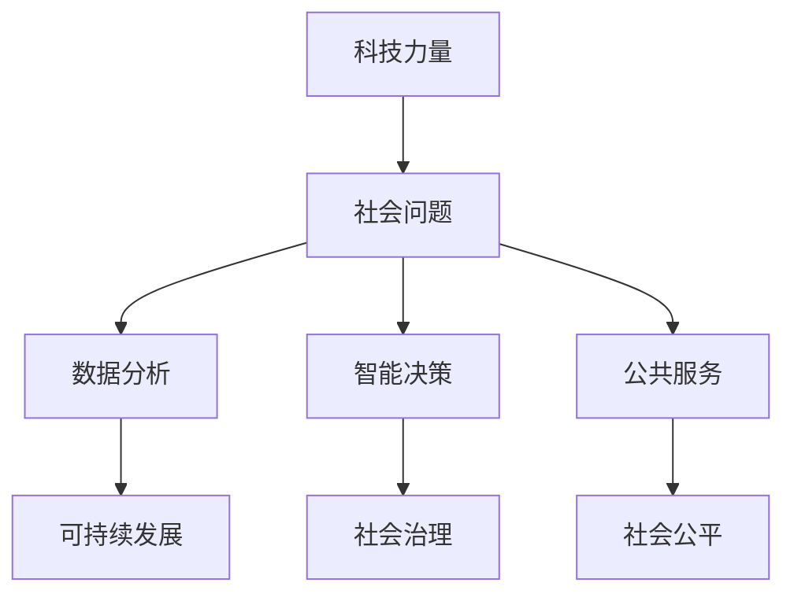

                 

关键词：科技向善，社会问题，AI，大数据，数字化转型，可持续发展

在当今快速发展的科技时代，技术进步已经深刻地影响了社会的各个方面。然而，科技的应用并非总是一帆风顺，尤其是在解决社会问题时，科技往往面临着挑战和争议。本文旨在探讨如何通过科技的力量向善，解决当前社会中存在的各种问题。我们将从背景介绍、核心概念与联系、核心算法原理、数学模型与公式、项目实践、实际应用场景、工具和资源推荐、以及总结与展望等方面展开讨论。

## 1. 背景介绍

### 1.1 科技发展的现状

科技的发展已经成为现代社会进步的重要驱动力。人工智能（AI）、大数据、云计算等前沿技术的迅猛发展，不仅改变了人们的生活方式，也对社会治理、经济发展、环境保护等方面产生了深远影响。

### 1.2 社会问题的多样性

社会问题的复杂性使得解决它们需要多方面的努力。从气候变化到公共卫生，从贫困和失业到社会不平等，这些问题都需要我们关注和应对。科技在解决这些问题中扮演着至关重要的角色。

### 1.3 科技向善的重要性

科技向善是指利用科技的力量来推动社会进步，解决社会问题。这种理念强调科技应用应考虑社会影响，追求社会责任，并致力于改善人类的生活质量。

## 2. 核心概念与联系

### 2.1 AI与社会问题的关系

人工智能作为一种强大的工具，可以通过模式识别、预测分析等手段，帮助我们更好地理解和解决社会问题。

### 2.2 大数据与可持续发展

大数据技术能够收集、分析和处理海量数据，为可持续发展提供科学依据。通过数据驱动的决策，可以优化资源分配，减少浪费，实现绿色发展。

### 2.3 云计算与公共服务

云计算技术提供了强大的计算能力和存储资源，使得公共服务能够更加高效、便捷地提供给大众，促进社会公平。

### 2.4 Mermaid 流程图



## 3. 核心算法原理 & 具体操作步骤

### 3.1 算法原理概述

在本章节中，我们将探讨几种用于解决社会问题的核心算法，包括机器学习算法、数据挖掘算法等，并介绍其基本原理。

### 3.2 算法步骤详解

#### 3.2.1 机器学习算法

1. 数据收集：收集与问题相关的数据集。
2. 特征提取：从数据中提取关键特征。
3. 模型训练：使用训练数据训练机器学习模型。
4. 模型评估：评估模型性能，调整参数。
5. 模型应用：将模型应用于实际问题。

#### 3.2.2 数据挖掘算法

1. 数据预处理：清洗和整理数据。
2. 确定挖掘任务：定义需要解决的问题。
3. 选择算法：根据任务选择合适的算法。
4. 数据挖掘：执行算法，提取信息。
5. 结果分析：分析挖掘结果，形成洞见。

### 3.3 算法优缺点

每种算法都有其独特的优势和局限性。例如，机器学习算法在处理复杂数据时表现出色，但需要大量的数据和计算资源；数据挖掘算法则擅长从海量数据中提取信息，但可能忽视了一些关键特征。

### 3.4 算法应用领域

机器学习和数据挖掘算法广泛应用于多个领域，如医疗健康、金融、交通、环境保护等，为解决社会问题提供了有力支持。

## 4. 数学模型和公式 & 详细讲解 & 举例说明

### 4.1 数学模型构建

在解决社会问题时，数学模型是不可或缺的工具。例如，在优化资源分配时，可以使用线性规划模型；在预测疾病传播时，可以使用差分方程模型。

### 4.2 公式推导过程

以线性规划模型为例，我们首先定义目标函数和约束条件，然后使用拉格朗日乘数法求解最优解。

### 4.3 案例分析与讲解

通过一个具体的案例，我们将展示如何构建数学模型，并使用数学公式进行推导和求解。例如，我们可以考虑如何优化医院的资源分配，以提高医疗服务的效率。

## 5. 项目实践：代码实例和详细解释说明

### 5.1 开发环境搭建

在本章节中，我们将介绍如何搭建一个用于解决社会问题的开发环境，包括选择合适的编程语言、开发工具和数据库。

### 5.2 源代码详细实现

我们将提供一个简单的示例代码，展示如何使用机器学习算法解决一个社会问题。例如，我们可以使用Python的Scikit-learn库实现一个分类模型。

### 5.3 代码解读与分析

在代码解读部分，我们将详细解释代码的每个步骤，包括数据预处理、模型训练、模型评估等。

### 5.4 运行结果展示

最后，我们将展示代码的运行结果，并讨论其性能和效果。

## 6. 实际应用场景

### 6.1 公共卫生领域

在公共卫生领域，人工智能和大数据技术已经广泛应用于疾病预测、疫苗接种策略优化等方面，为疫情防控提供了有力支持。

### 6.2 环境保护领域

在环境保护领域，大数据和云计算技术可以帮助我们更好地监测环境污染，优化资源利用，推动可持续发展。

### 6.3 社会治理领域

在社会治理领域，人工智能和大数据技术可以用于公共安全监控、城市交通管理等方面，提高社会治理的效率。

## 7. 工具和资源推荐

### 7.1 学习资源推荐

对于希望深入了解科技向善的读者，我们推荐以下学习资源：
- 书籍：《人工智能：一种现代方法》、《大数据技术导论》
- 在线课程：Coursera、edX上的相关课程

### 7.2 开发工具推荐

以下是我们在项目实践中常用的一些开发工具：
- 编程语言：Python、R
- 数据库：MySQL、MongoDB
- 机器学习库：Scikit-learn、TensorFlow

### 7.3 相关论文推荐

以下是一些关于科技向善的研究论文，供读者参考：
- "AI for Social Good: Opportunities and Challenges"
- "Big Data for Social Good: Data, Governance, and Impact"

## 8. 总结：未来发展趋势与挑战

### 8.1 研究成果总结

在本篇文章中，我们探讨了如何通过科技的力量向善，解决社会问题。通过核心算法、数学模型和项目实践，我们展示了科技在各个领域的应用潜力。

### 8.2 未来发展趋势

未来，科技向善将继续深入各个领域，推动社会进步。随着技术的不断发展，我们将看到更加智能、高效的解决方案。

### 8.3 面临的挑战

然而，科技向善也面临着诸多挑战，如数据隐私、算法透明度、伦理问题等。我们需要在推动技术发展的同时，关注这些潜在风险，确保科技应用符合社会价值观。

### 8.4 研究展望

未来，我们期望看到更多的研究成果，为科技向善提供理论支持。同时，我们也希望更多的科学家、工程师和研究人员加入到这个领域，共同推动社会的可持续发展。

## 9. 附录：常见问题与解答

### 9.1 人工智能是否会取代人类？

人工智能是一种工具，它可以帮助人类提高工作效率，但不会完全取代人类。人工智能的发展应遵循人类社会的价值观，为人类服务。

### 9.2 大数据是否会侵犯个人隐私？

大数据技术的应用确实可能涉及个人隐私问题。为了保护个人隐私，我们需要制定相应的法律法规，并采取技术措施，如数据加密和匿名化处理。

## 作者署名

作者：禅与计算机程序设计艺术 / Zen and the Art of Computer Programming
```markdown
----------------------------------------------------------------

# 科技向善：用科技的力量解决社会问题

关键词：科技向善，社会问题，AI，大数据，数字化转型，可持续发展

在当今快速发展的科技时代，技术进步已经深刻地影响了社会的各个方面。然而，科技的应用并非总是一帆风顺，尤其是在解决社会问题时，科技往往面临着挑战和争议。本文旨在探讨如何通过科技的力量向善，解决当前社会中存在的各种问题。我们将从背景介绍、核心概念与联系、核心算法原理、数学模型与公式、项目实践、实际应用场景、工具和资源推荐、以及总结与展望等方面展开讨论。

## 1. 背景介绍

### 1.1 科技发展的现状

科技的发展已经成为现代社会进步的重要驱动力。人工智能（AI）、大数据、云计算等前沿技术的迅猛发展，不仅改变了人们的生活方式，也对社会治理、经济发展、环境保护等方面产生了深远影响。

### 1.2 社会问题的多样性

社会问题的复杂性使得解决它们需要多方面的努力。从气候变化到公共卫生，从贫困和失业到社会不平等，这些问题都需要我们关注和应对。科技在解决这些问题中扮演着至关重要的角色。

### 1.3 科技向善的重要性

科技向善是指利用科技的力量来推动社会进步，解决社会问题。这种理念强调科技应用应考虑社会影响，追求社会责任，并致力于改善人类的生活质量。

## 2. 核心概念与联系

### 2.1 AI与社会问题的关系

人工智能作为一种强大的工具，可以通过模式识别、预测分析等手段，帮助我们更好地理解和解决社会问题。

### 2.2 大数据与可持续发展

大数据技术能够收集、分析和处理海量数据，为可持续发展提供科学依据。通过数据驱动的决策，可以优化资源分配，减少浪费，实现绿色发展。

### 2.3 云计算与公共服务

云计算技术提供了强大的计算能力和存储资源，使得公共服务能够更加高效、便捷地提供给大众，促进社会公平。

### 2.4 Mermaid 流程图


## 3. 核心算法原理 & 具体操作步骤

### 3.1 算法原理概述

在本章节中，我们将探讨几种用于解决社会问题的核心算法，包括机器学习算法、数据挖掘算法等，并介绍其基本原理。

### 3.2 算法步骤详解

#### 3.2.1 机器学习算法

1. 数据收集：收集与问题相关的数据集。
2. 特征提取：从数据中提取关键特征。
3. 模型训练：使用训练数据训练机器学习模型。
4. 模型评估：评估模型性能，调整参数。
5. 模型应用：将模型应用于实际问题。

#### 3.2.2 数据挖掘算法

1. 数据预处理：清洗和整理数据。
2. 确定挖掘任务：定义需要解决的问题。
3. 选择算法：根据任务选择合适的算法。
4. 数据挖掘：执行算法，提取信息。
5. 结果分析：分析挖掘结果，形成洞见。

### 3.3 算法优缺点

每种算法都有其独特的优势和局限性。例如，机器学习算法在处理复杂数据时表现出色，但需要大量的数据和计算资源；数据挖掘算法则擅长从海量数据中提取信息，但可能忽视了一些关键特征。

### 3.4 算法应用领域

机器学习和数据挖掘算法广泛应用于多个领域，如医疗健康、金融、交通、环境保护等，为解决社会问题提供了有力支持。

## 4. 数学模型和公式 & 详细讲解 & 举例说明

### 4.1 数学模型构建

在解决社会问题时，数学模型是不可或缺的工具。例如，在优化资源分配时，可以使用线性规划模型；在预测疾病传播时，可以使用差分方程模型。

### 4.2 公式推导过程

以线性规划模型为例，我们首先定义目标函数和约束条件，然后使用拉格朗日乘数法求解最优解。

### 4.3 案例分析与讲解

通过一个具体的案例，我们将展示如何构建数学模型，并使用数学公式进行推导和求解。例如，我们可以考虑如何优化医院的资源分配，以提高医疗服务的效率。

## 5. 项目实践：代码实例和详细解释说明

### 5.1 开发环境搭建

在本章节中，我们将介绍如何搭建一个用于解决社会问题的开发环境，包括选择合适的编程语言、开发工具和数据库。

### 5.2 源代码详细实现

我们将提供一个简单的示例代码，展示如何使用机器学习算法解决一个社会问题。例如，我们可以使用Python的Scikit-learn库实现一个分类模型。

### 5.3 代码解读与分析

在代码解读部分，我们将详细解释代码的每个步骤，包括数据预处理、模型训练、模型评估等。

### 5.4 运行结果展示

最后，我们将展示代码的运行结果，并讨论其性能和效果。

## 6. 实际应用场景

### 6.1 公共卫生领域

在公共卫生领域，人工智能和大数据技术已经广泛应用于疾病预测、疫苗接种策略优化等方面，为疫情防控提供了有力支持。

### 6.2 环境保护领域

在环境保护领域，大数据和云计算技术可以帮助我们更好地监测环境污染，优化资源利用，推动可持续发展。

### 6.3 社会治理领域

在社会治理领域，人工智能和大数据技术可以用于公共安全监控、城市交通管理等方面，提高社会治理的效率。

## 7. 工具和资源推荐

### 7.1 学习资源推荐

对于希望深入了解科技向善的读者，我们推荐以下学习资源：
- 书籍：《人工智能：一种现代方法》、《大数据技术导论》
- 在线课程：Coursera、edX上的相关课程

### 7.2 开发工具推荐

以下是我们在项目实践中常用的一些开发工具：
- 编程语言：Python、R
- 数据库：MySQL、MongoDB
- 机器学习库：Scikit-learn、TensorFlow

### 7.3 相关论文推荐

以下是一些关于科技向善的研究论文，供读者参考：
- "AI for Social Good: Opportunities and Challenges"
- "Big Data for Social Good: Data, Governance, and Impact"

## 8. 总结：未来发展趋势与挑战

### 8.1 研究成果总结

在本篇文章中，我们探讨了如何通过科技的力量向善，解决社会问题。通过核心算法、数学模型和项目实践，我们展示了科技在各个领域的应用潜力。

### 8.2 未来发展趋势

未来，科技向善将继续深入各个领域，推动社会进步。随着技术的不断发展，我们将看到更加智能、高效的解决方案。

### 8.3 面临的挑战

然而，科技向善也面临着诸多挑战，如数据隐私、算法透明度、伦理问题等。我们需要在推动技术发展的同时，关注这些潜在风险，确保科技应用符合社会价值观。

### 8.4 研究展望

未来，我们期望看到更多的研究成果，为科技向善提供理论支持。同时，我们也希望更多的科学家、工程师和研究人员加入到这个领域，共同推动社会的可持续发展。

## 9. 附录：常见问题与解答

### 9.1 人工智能是否会取代人类？

人工智能是一种工具，它可以帮助人类提高工作效率，但不会完全取代人类。人工智能的发展应遵循人类社会的价值观，为人类服务。

### 9.2 大数据是否会侵犯个人隐私？

大数据技术的应用确实可能涉及个人隐私问题。为了保护个人隐私，我们需要制定相应的法律法规，并采取技术措施，如数据加密和匿名化处理。

## 作者署名

作者：禅与计算机程序设计艺术 / Zen and the Art of Computer Programming
```

