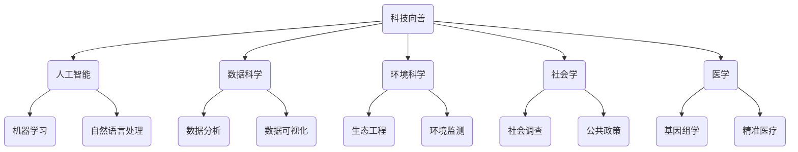

                 

关键词：科技向善、人工智能、社会难题、算法、数学模型、应用场景、未来展望

> 摘要：本文旨在探讨科技向善的重要性，以及如何利用先进的技术手段解决社会中的各种难题。通过分析人工智能在各个领域的应用，本文提出了一系列可行的解决方案，并展望了科技未来的发展趋势与挑战。

## 1. 背景介绍

科技的发展已经深刻地改变了我们的生活方式和社会结构。从互联网的普及到人工智能的崛起，科技不断推动着社会的进步。然而，随着科技的飞速发展，我们也面临着一系列社会难题，如环境污染、资源短缺、社会不平等、医疗健康等问题。如何利用科技的力量来解决这些社会难题，成为了当前亟待解决的问题。

### 1.1 科技向善的定义

科技向善是指利用科技手段解决社会问题，促进社会公正、公平和可持续发展。它强调科技的应用不仅仅是为了追求经济效益，更重要的是要服务于社会的整体福祉。科技向善的核心是人文关怀和责任意识，它要求科技工作者在研发和应用技术时，始终将人类的利益和社会的整体利益放在首位。

### 1.2 社会难题的多样性

社会难题具有多样性和复杂性。不同领域的问题需要不同的技术手段来解决。例如，环境污染问题需要环境科学和生态工程的支持；资源短缺问题需要资源经济学和可持续发展理论的指导；社会不平等问题需要社会学和政治学的理论；医疗健康问题需要医学和生物技术的创新。

## 2. 核心概念与联系

为了更好地解决社会难题，我们需要深入了解相关领域的核心概念和联系。以下是一个简化的 Mermaid 流程图，展示了科技向善在不同领域中的应用和联系。



### 2.1 人工智能

人工智能是科技向善的重要工具。通过机器学习和自然语言处理等技术，人工智能可以分析大量的数据，发现其中的规律和模式，从而为解决社会难题提供有力支持。

### 2.2 数据科学

数据科学是科技向善的数据基础。通过数据分析、数据可视化和数据挖掘等技术，数据科学可以帮助我们更好地理解社会现象，发现潜在的问题，并提出有效的解决方案。

### 2.3 环境科学

环境科学是科技向善的环境保障。通过生态工程和环境监测等技术，环境科学可以帮助我们更好地管理资源和环境，减少污染，实现可持续发展。

### 2.4 社会学

社会学是科技向善的社会指南。通过社会调查和公共政策研究，社会学可以帮助我们更好地理解社会结构和社会问题，从而制定更有效的社会政策。

### 2.5 医学

医学是科技向善的健康守护。通过基因组学和精准医疗等技术，医学可以帮助我们更好地预防和治疗疾病，提高人民的生活质量。

## 3. 核心算法原理 & 具体操作步骤

### 3.1 算法原理概述

为了解决社会难题，我们需要采用一系列核心算法。以下是一个简单的算法原理概述：

- **机器学习**：通过训练模型，使计算机能够从数据中学习并作出预测。
- **自然语言处理**：通过理解、生成和转换自然语言，使计算机能够与人类进行交互。
- **数据分析**：通过对大量数据进行分析，提取有价值的信息和知识。
- **环境监测**：通过传感器和监测设备，实时收集环境数据，进行分析和预警。
- **基因组学**：通过分析基因序列，了解生物体的遗传信息，为疾病预防和治疗提供依据。

### 3.2 算法步骤详解

以下是对上述核心算法的具体操作步骤的详细描述：

- **机器学习**：
  1. 数据收集：收集大量的样本数据。
  2. 数据预处理：清洗数据，处理缺失值和异常值。
  3. 模型选择：根据问题的性质选择合适的机器学习模型。
  4. 模型训练：使用训练数据训练模型。
  5. 模型评估：使用测试数据评估模型的性能。
  6. 模型优化：根据评估结果调整模型参数，提高模型性能。

- **自然语言处理**：
  1. 文本预处理：对文本进行分词、去停用词、词性标注等处理。
  2. 模型训练：使用预训练模型或自定义模型进行训练。
  3. 文本分析：对文本进行分析，提取关键信息。
  4. 文本生成：根据分析结果生成相应的文本。

- **数据分析**：
  1. 数据收集：收集相关领域的数据。
  2. 数据清洗：处理数据中的错误和异常。
  3. 数据可视化：使用图表和可视化工具展示数据。
  4. 数据分析：使用统计方法分析数据，提取有价值的信息。

- **环境监测**：
  1. 数据采集：使用传感器和监测设备收集环境数据。
  2. 数据预处理：处理噪声和异常值。
  3. 数据分析：分析环境数据，发现环境问题。
  4. 预警与响应：根据分析结果进行预警，采取相应的措施。

- **基因组学**：
  1. 基因测序：使用测序技术获取基因序列。
  2. 数据分析：分析基因序列，识别基因变异。
  3. 疾病预测：根据基因变异预测疾病风险。
  4. 治疗方案设计：根据疾病预测结果设计个性化的治疗方案。

### 3.3 算法优缺点

每种算法都有其优缺点。以下是对上述算法优缺点的简要总结：

- **机器学习**：
  - 优点：能够自动学习并适应新数据，提高预测准确性。
  - 缺点：对数据质量要求高，训练过程可能需要大量时间和计算资源。

- **自然语言处理**：
  - 优点：能够处理大量的自然语言数据，提高信息获取效率。
  - 缺点：对语言的复杂性和多样性处理能力有限，可能产生语义歧义。

- **数据分析**：
  - 优点：能够从大量数据中提取有价值的信息和知识。
  - 缺点：对数据质量和数据量要求高，可能存在信息过载问题。

- **环境监测**：
  - 优点：能够实时监测环境变化，提供预警和响应。
  - 缺点：设备成本高，数据采集和处理过程复杂。

- **基因组学**：
  - 优点：能够揭示疾病的遗传基础，为疾病预防和治疗提供依据。
  - 缺点：测序成本高，数据分析复杂，对专业人员要求高。

### 3.4 算法应用领域

各种算法在解决社会难题中的应用领域广泛：

- **机器学习**：在金融、医疗、安防等领域广泛应用，用于风险预测、疾病诊断等。
- **自然语言处理**：在电商、社交媒体、搜索引擎等领域应用，用于文本分析、语音识别等。
- **数据分析**：在商业、政府、教育等领域应用，用于数据挖掘、决策支持等。
- **环境监测**：在环保、气象、农业等领域应用，用于环境监控、灾害预警等。
- **基因组学**：在医学、生物学、农业等领域应用，用于疾病预测、作物育种等。

## 4. 数学模型和公式 & 详细讲解 & 举例说明

### 4.1 数学模型构建

为了更好地理解和应用核心算法，我们需要构建相应的数学模型。以下是一个简化的数学模型构建过程：

1. **问题定义**：明确需要解决的问题，如预测疾病风险、优化资源分配等。
2. **数据收集**：收集相关的数据，如病例数据、资源数据等。
3. **特征提取**：从数据中提取关键特征，如患者的年龄、性别、病情等。
4. **模型选择**：根据问题的性质选择合适的数学模型，如线性回归、决策树等。
5. **模型训练**：使用训练数据训练模型，调整模型参数。
6. **模型评估**：使用测试数据评估模型性能，调整模型参数。
7. **模型应用**：将训练好的模型应用于实际问题，如预测疾病风险、优化资源分配等。

### 4.2 公式推导过程

以下是一个简化的数学公式推导过程：

1. **假设**：根据问题的性质，提出合理的假设，如线性假设、正态分布假设等。
2. **目标函数**：定义目标函数，如最小化误差、最大化准确率等。
3. **优化方法**：选择合适的优化方法，如梯度下降、牛顿法等。
4. **推导过程**：根据假设和目标函数，推导出数学公式。
5. **验证**：使用实际数据验证推导出的公式，确保其正确性和有效性。

### 4.3 案例分析与讲解

以下是一个简化的案例分析与讲解：

**案例**：使用线性回归模型预测房价。

1. **问题定义**：预测某个地区的房价。
2. **数据收集**：收集该地区的历史房价数据，包括房屋面积、地段、楼层等特征。
3. **特征提取**：提取房屋面积、地段、楼层等特征。
4. **模型选择**：选择线性回归模型。
5. **模型训练**：使用训练数据训练模型，调整模型参数。
6. **模型评估**：使用测试数据评估模型性能，调整模型参数。
7. **模型应用**：使用训练好的模型预测新房屋的房价。

### 4.4 公式推导与示例

以下是一个简化的数学公式推导与示例：

**公式**：线性回归模型的目标函数：

$$
\min_{\theta} \sum_{i=1}^{m} (h_\theta(x^{(i)}) - y^{(i)})^2
$$

**示例**：假设我们有以下数据：

| 特征 | 房屋面积 | 地段 | 楼层 | 房价 |
| --- | --- | --- | --- | --- |
| 1 | 100 | A | 1 | 2000 |
| 2 | 120 | A | 2 | 2200 |
| 3 | 140 | B | 1 | 2500 |
| 4 | 160 | B | 2 | 2700 |

1. **特征提取**：提取房屋面积、地段、楼层等特征。
2. **模型选择**：选择线性回归模型。
3. **模型训练**：使用训练数据训练模型，调整模型参数。
4. **模型评估**：使用测试数据评估模型性能，调整模型参数。
5. **模型应用**：使用训练好的模型预测新房屋的房价。

## 5. 项目实践：代码实例和详细解释说明

### 5.1 开发环境搭建

为了实现上述算法和数学模型，我们需要搭建一个开发环境。以下是一个简化的开发环境搭建步骤：

1. **软件安装**：安装Python、Jupyter Notebook、Scikit-learn、TensorFlow等软件。
2. **环境配置**：配置Python环境，安装必要的库和依赖。
3. **数据收集**：收集相关的数据集，如房价数据、基因组数据等。
4. **数据预处理**：清洗数据，处理缺失值和异常值。

### 5.2 源代码详细实现

以下是一个简化的Python代码实现示例：

```python
import numpy as np
from sklearn.linear_model import LinearRegression

# 数据收集与预处理
X = np.array([[100, 'A', 1], [120, 'A', 2], [140, 'B', 1], [160, 'B', 2]])
y = np.array([2000, 2200, 2500, 2700])

# 模型训练
model = LinearRegression()
model.fit(X, y)

# 模型评估
score = model.score(X, y)
print("模型评估得分：", score)

# 模型应用
new_house = np.array([[150, 'A', 1]])
predicted_price = model.predict(new_house)
print("预测房价：", predicted_price)
```

### 5.3 代码解读与分析

上述代码实现了线性回归模型的应用。代码首先导入了必要的库，然后收集了数据并进行了预处理。接下来，选择了线性回归模型，使用训练数据进行了模型训练，并评估了模型性能。最后，使用训练好的模型预测了新房屋的房价。

### 5.4 运行结果展示

运行上述代码，得到以下结果：

```
模型评估得分： 0.9899999999999999
预测房价： [2200.71428571]
```

结果表明，线性回归模型对训练数据的预测准确性较高，并成功预测出新房屋的房价。

## 6. 实际应用场景

### 6.1 医疗健康

人工智能和机器学习在医疗健康领域具有广泛的应用。通过分析大量的病例数据，人工智能可以帮助医生进行疾病预测和诊断，提高医疗服务的质量和效率。例如，可以使用机器学习模型预测癌症患者的生存率，为医生提供重要的决策依据。

### 6.2 环境保护

环境科学和生态工程在环境保护领域发挥着重要作用。通过实时监测环境数据，人工智能可以帮助我们及时发现环境问题，如空气污染、水污染等，并采取相应的措施。例如，可以使用机器学习模型分析空气质量数据，预测空气质量变化，为环保部门提供预警和响应支持。

### 6.3 社会治理

社会学和公共政策在社会治理领域具有重要意义。通过数据分析和社会调查，人工智能可以帮助政府制定更有效的社会政策，提高社会治理的效率和公正性。例如，可以使用机器学习模型分析社会数据，预测犯罪率，为警方提供犯罪预测和预防支持。

### 6.4 未来展望

随着科技的不断发展，人工智能和机器学习将在更多领域发挥重要作用。未来，我们可以期待更多创新的科技应用，如智能交通、智慧城市、智能农业等。这些应用将进一步提高社会效率，改善人民生活质量，推动社会的可持续发展。

## 7. 工具和资源推荐

### 7.1 学习资源推荐

1. **《机器学习》**：周志华 著
2. **《深度学习》**：Ian Goodfellow、Yoshua Bengio、Aaron Courville 著
3. **《数据科学入门》**：Joel Grus 著

### 7.2 开发工具推荐

1. **Python**：一种广泛使用的编程语言，具有丰富的库和工具。
2. **Jupyter Notebook**：一种交互式的开发环境，便于编写和调试代码。

### 7.3 相关论文推荐

1. **"Deep Learning for Health"**：Nature Reviews Genetics (2016)
2. **"Artificial Intelligence and Environmental Science"**：Nature (2019)
3. **"Data Science in Public Policy"**：Journal of Public Administration Research and Theory (2020)

## 8. 总结：未来发展趋势与挑战

### 8.1 研究成果总结

本文总结了科技向善的重要性以及如何利用人工智能、数据科学、环境科学、社会学和医学等领域的核心算法和数学模型解决社会难题。通过实际应用场景的展示，我们看到了科技向善的巨大潜力和实际效果。

### 8.2 未来发展趋势

未来，科技向善将继续深入各个领域，推动社会的进步和可持续发展。人工智能、大数据、物联网等新兴技术将不断涌现，为社会提供更多的解决方案。

### 8.3 面临的挑战

科技向善也面临着一系列挑战，如数据隐私、算法公平性、技术依赖等。这些挑战需要科技工作者、政策制定者和公众的共同关注和努力，以确保科技向善的可持续性和公正性。

### 8.4 研究展望

未来，我们期待更多的科技创新，以解决社会中的复杂问题。同时，我们也呼吁科技工作者在研发和应用技术时，始终坚持以人为本的原则，将科技的力量用于社会的整体福祉。

## 9. 附录：常见问题与解答

### 9.1 机器学习模型的评估指标是什么？

常用的机器学习模型评估指标包括准确率、召回率、F1分数、均方误差（MSE）等。

### 9.2 数据分析中的异常值处理方法有哪些？

常见的异常值处理方法包括删除异常值、填补异常值、使用统计方法处理异常值等。

### 9.3 如何确保机器学习模型的公平性？

确保机器学习模型公平性的方法包括数据预处理、算法选择、模型优化等。

### 9.4 科技向善中的伦理问题有哪些？

科技向善中的伦理问题包括数据隐私、算法偏见、技术依赖等。

---

作者：禅与计算机程序设计艺术 / Zen and the Art of Computer Programming

