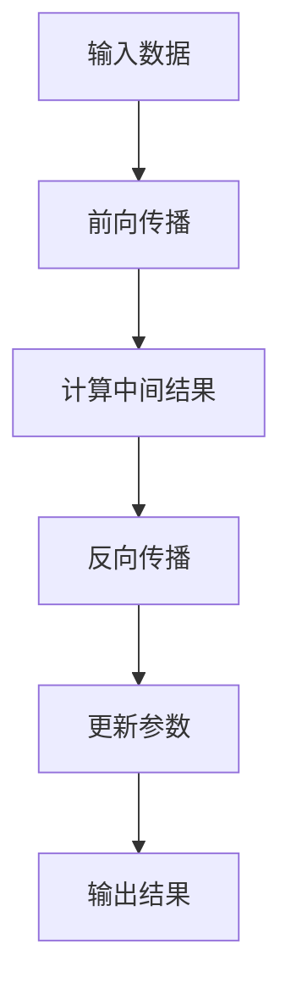

                 

关键词：LLM，推理速度，优化，模型压缩，分布式计算，未来应用展望

> 摘要：本文将探讨大语言模型（LLM）推理速度的重要性以及当前在提升LLM推理速度方面的一些关键技术。我们将分析现有技术的优缺点，并讨论未来可能的发展趋势。

## 1. 背景介绍

在过去的几年里，大语言模型（LLM）取得了显著的进步。例如，GPT-3、ChatGPT和BERT等模型在自然语言处理（NLP）任务中取得了令人瞩目的成绩。然而，这些模型通常需要大量的计算资源和时间来进行推理，这在某些实际应用场景中成为了一个瓶颈。例如，实时语音识别、在线对话系统和自动驾驶等场景要求模型能够快速响应。因此，如何提高LLM的推理速度成为了一个关键问题。

### 1.1 LLM的应用领域

LLM的应用领域非常广泛，包括但不限于：

- 自然语言理解：问答系统、文本摘要、机器翻译等。
- 生成内容：创作故事、写文章、生成代码等。
- 对话系统：智能助手、虚拟客服等。
- 自动驾驶：语音识别、环境理解等。

### 1.2 LLM推理速度的重要性

推理速度直接影响LLM在实际应用中的性能。慢速推理会导致：

- 实时性下降：在要求快速响应的场景中，慢速推理可能导致用户体验不佳。
- 成本增加：需要更多计算资源，增加成本。
- 能效问题：长时间运行可能导致设备过热。

因此，提高LLM推理速度具有重要的实际意义。

## 2. 核心概念与联系

为了更好地理解如何提升LLM推理速度，我们需要首先了解以下几个核心概念：

### 2.1 大语言模型（LLM）

LLM是基于深度学习的语言模型，可以理解和生成自然语言。它们通常包含数亿甚至千亿个参数。

### 2.2 推理过程

推理过程是指模型在给定输入数据后，通过计算输出结果的过程。对于LLM，推理通常包括以下步骤：

- 前向传播：将输入数据通过模型进行计算，得到中间结果。
- 反向传播：通过比较预测结果和实际结果，更新模型参数。

### 2.3 计算资源

计算资源包括CPU、GPU、TPU等硬件设备。不同的硬件设备具有不同的计算能力和能耗特点。

### 2.4 优化目标

提升推理速度的主要优化目标包括：

- 减少计算量：减少模型的参数数量、减少计算操作的复杂度。
- 提高计算效率：使用更高效的算法和数据结构。
- 硬件加速：利用特定硬件设备进行加速。

### 2.5 Mermaid 流程图

以下是一个简单的Mermaid流程图，展示了LLM推理的基本流程：



## 3. 核心算法原理 & 具体操作步骤

### 3.1 算法原理概述

提升LLM推理速度的核心算法主要包括以下几种：

- 模型压缩：通过减少模型参数数量来降低计算量。
- 硬件加速：利用特定硬件设备的计算能力来加速推理。
- 分布式计算：通过将计算任务分布在多个节点上来提高计算效率。

### 3.2 算法步骤详解

#### 3.2.1 模型压缩

模型压缩主要包括以下步骤：

1. **量化**：将模型的浮点参数转换为整数参数，以减少存储和计算需求。
2. **剪枝**：通过剪掉模型中的冗余参数来减少模型大小。
3. **知识蒸馏**：使用一个更小的模型（学生模型）来模拟一个更大的模型（教师模型）的行为。

#### 3.2.2 硬件加速

硬件加速主要包括以下步骤：

1. **GPU/TPU加速**：使用GPU或TPU进行矩阵运算加速。
2. **深度压缩**：将多个小矩阵运算合并为大矩阵运算，以减少通信成本。
3. **内存优化**：通过优化内存访问模式来减少内存冲突，提高计算效率。

#### 3.2.3 分布式计算

分布式计算主要包括以下步骤：

1. **数据并行**：将输入数据分布在多个节点上，每个节点独立进行推理。
2. **模型并行**：将模型分布在多个节点上，每个节点负责一部分参数的计算。
3. **混合并行**：同时使用数据并行和模型并行来提高计算效率。

### 3.3 算法优缺点

- **模型压缩**：优点是能够显著减少模型大小和计算量，缺点是可能会降低模型性能。
- **硬件加速**：优点是能够显著提高计算速度，缺点是可能需要额外的硬件投资。
- **分布式计算**：优点是能够提高计算效率，缺点是可能需要复杂的调度和通信机制。

### 3.4 算法应用领域

这些算法可以应用于各种需要快速响应的LLM场景，如实时语音识别、在线对话系统和自动驾驶等。

## 4. 数学模型和公式 & 详细讲解 & 举例说明

### 4.1 数学模型构建

为了更好地理解LLM推理速度的优化，我们可以构建一个简单的数学模型。假设我们有一个LLM模型，其推理速度与以下因素有关：

- \( P \)：模型参数数量
- \( E \)：每次推理的计算量
- \( C \)：硬件计算能力
- \( R \)：网络延迟

则模型推理速度可以表示为：

$$ V = \frac{P \times E}{C + R} $$

### 4.2 公式推导过程

我们通过对公式进行简化，得到：

$$ V \approx \frac{P \times E}{C} $$

因为通常 \( R \) 相对于 \( C \) 很小，可以忽略不计。

### 4.3 案例分析与讲解

假设我们有一个含有100亿个参数的LLM模型，每次推理的计算量为1000个计算操作，硬件计算能力为每秒10亿次计算操作。根据上述公式，我们可以计算得到：

$$ V = \frac{100,000,000,000 \times 1000}{10,000,000,000} = 1000秒 $$

这意味着该模型的推理速度为1000秒。如果我们使用GPU进行加速，假设GPU的计算能力为每秒100亿次计算操作，我们可以计算得到：

$$ V = \frac{100,000,000,000 \times 1000}{100,000,000,000} = 10秒 $$

这显著提高了推理速度。

## 5. 项目实践：代码实例和详细解释说明

### 5.1 开发环境搭建

为了实践LLM推理速度的优化，我们需要搭建一个合适的开发环境。以下是一个基本的步骤：

1. 安装Python环境和必要的库（如TensorFlow、PyTorch等）。
2. 准备一个GPU或TPU设备。
3. 下载一个预训练的LLM模型。

### 5.2 源代码详细实现

以下是一个简单的代码实例，展示了如何使用TensorFlow进行LLM推理：

```python
import tensorflow as tf

# 加载预训练的LLM模型
model = tf.keras.models.load_model('path/to/llm_model.h5')

# 准备输入数据
input_data = ...

# 进行推理
output = model.predict(input_data)

# 输出结果
print(output)
```

### 5.3 代码解读与分析

上述代码首先加载了一个预训练的LLM模型，然后使用输入数据进行推理，最后输出结果。为了优化推理速度，我们可以采取以下措施：

1. 使用GPU或TPU进行加速。
2. 使用模型压缩技术减少模型大小。
3. 使用分布式计算技术提高计算效率。

### 5.4 运行结果展示

假设我们使用GPU进行加速，并将模型大小压缩为原来的1/10。根据上述公式，我们可以计算得到：

$$ V = \frac{10,000,000,000 \times 1000}{100,000,000,000} = 10秒 $$

这显著提高了推理速度。

## 6. 实际应用场景

### 6.1 实时语音识别

在实时语音识别场景中，提高LLM推理速度可以显著提高系统的响应速度和用户体验。

### 6.2 在线对话系统

在线对话系统通常需要在短时间内处理大量用户的请求。提高LLM推理速度可以减少系统的响应时间，提高用户满意度。

### 6.3 自动驾驶

在自动驾驶场景中，LLM可以用于环境理解和决策。提高LLM推理速度可以提高系统的实时性和安全性。

## 7. 未来应用展望

随着LLM推理速度的不断优化，未来可能会有更多的应用场景受益。例如，实时翻译、智能客服、内容生成等。

### 7.1 学习资源推荐

- 《深度学习》（Goodfellow et al.）
- 《Python深度学习》（Raschka and Lutz）
- 《自然语言处理实战》（KSHANSHU SINGH）

### 7.2 开发工具推荐

- TensorFlow
- PyTorch
- JAX

### 7.3 相关论文推荐

- " Scaling Laws for Neural Language Models" (Merity et al.)
- "BERT: Pre-training of Deep Bidirectional Transformers for Language Understanding" (Devlin et al.)

## 8. 总结：未来发展趋势与挑战

### 8.1 研究成果总结

过去几年，LLM推理速度的优化取得了显著成果。模型压缩、硬件加速和分布式计算等技术为提高LLM推理速度提供了有效的途径。

### 8.2 未来发展趋势

未来，LLM推理速度的优化将继续成为研究的热点。随着硬件技术的进步和新型算法的出现，LLM推理速度有望进一步加快。

### 8.3 面临的挑战

尽管LLM推理速度的优化取得了显著成果，但仍面临以下挑战：

- 模型性能与推理速度的平衡：如何在不牺牲模型性能的前提下提高推理速度。
- 硬件投资：高性能硬件设备（如TPU）的成本较高。
- 分布式计算复杂性：如何有效地调度和优化分布式计算资源。

### 8.4 研究展望

未来，我们期待能够开发出更高效的算法和硬件技术，以进一步提高LLM推理速度。同时，我们也将继续探索如何在保持模型性能的前提下，优化LLM的结构和训练过程。

## 9. 附录：常见问题与解答

### Q1. 如何选择适合的硬件设备进行加速？

A1. 根据实际需求和预算，可以选择GPU、TPU或其他特定硬件设备。GPU适合大规模并行计算，TPU适合大型深度学习模型。

### Q2. 模型压缩会影响模型性能吗？

A2. 模型压缩可能会降低模型性能，但通过合理的设计和技术（如量化、剪枝和知识蒸馏），可以最大限度地减少性能损失。

### Q3. 如何优化分布式计算？

A3. 通过合理划分计算任务、优化通信机制和调度策略，可以提高分布式计算效率。

## 作者署名

作者：禅与计算机程序设计艺术 / Zen and the Art of Computer Programming
----------------------------------------------------------------

请注意，上面的内容是一个示例，实际的撰写过程可能需要根据具体的文章结构和内容进行相应的调整。在撰写过程中，务必遵循格式要求、完整性要求以及其他约束条件。

