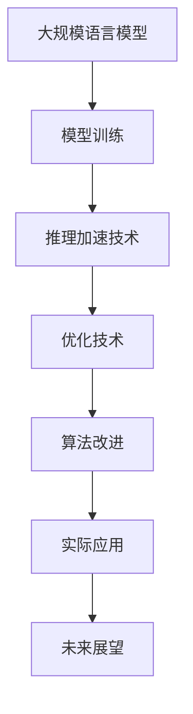

                 

关键词：大规模语言模型、推理加速、深度学习、计算机架构、优化技术、算法改进、应用领域、未来展望

> 摘要：随着深度学习和人工智能的飞速发展，大规模语言模型（LLM）在各个领域展现出了巨大的潜力和应用价值。然而，LLM的推理速度和效率成为了制约其广泛应用的瓶颈。本文将深入探讨LLM极速推理的背景、核心概念、算法原理、数学模型、项目实践及未来展望，以期为相关领域的研究和应用提供参考和启示。

## 1. 背景介绍

近年来，深度学习和人工智能技术在自然语言处理、计算机视觉、语音识别等领域的应用取得了显著成果。其中，大规模语言模型（LLM）作为自然语言处理的核心技术之一，已经成为了研究的热点和应用的重点。LLM通过对海量语言数据的学习，可以生成高质量的文本、理解语义、回答问题等，为智能助手、机器翻译、文本生成等应用提供了强大支持。

然而，随着LLM模型规模的不断增大，其推理速度和效率逐渐成为了制约其广泛应用的关键因素。在现实应用中，用户对于响应速度和延迟时间的要求越来越高，如何实现LLM的极速推理成为了学术界和工业界共同关注的问题。

本文将围绕LLM极速推理这一主题，深入探讨其背景、核心概念、算法原理、数学模型、项目实践及未来展望，旨在为相关领域的研究和应用提供参考和启示。

## 2. 核心概念与联系

### 2.1. 大规模语言模型

大规模语言模型（LLM）是指通过对海量语言数据进行训练，构建出具有强大语言理解和生成能力的深度神经网络模型。常见的LLM包括BERT、GPT、T5等。这些模型通过对文本数据的学习，可以理解文本的语义、上下文信息，并生成符合语法和语义规则的文本。

### 2.2. 推理加速

推理加速是指通过优化模型结构、算法、硬件等方面，提高LLM的推理速度和效率。推理加速技术包括模型压缩、量化、蒸馏、硬件加速等。

### 2.3. 优化技术

优化技术是指通过调整模型参数、网络结构、训练过程等，提高模型性能和推理速度。常见的优化技术包括梯度下降、动量优化、学习率调整等。

### 2.4. 算法改进

算法改进是指通过对现有算法的改进，提高LLM的推理速度和效率。常见的算法改进包括改进网络结构、优化算法流程、引入新的训练策略等。

### 2.5. Mermaid 流程图



## 3. 核心算法原理 & 具体操作步骤

### 3.1. 算法原理概述

大规模语言模型（LLM）的推理过程主要包括以下步骤：

1. 输入文本数据：将待处理的文本数据输入到LLM模型中。
2. 模型处理：LLM模型对输入文本数据进行处理，包括词向量化、序列编码等。
3. 推理计算：模型在处理过程中，通过计算得到文本的语义表示，并生成相应的输出结果。
4. 输出结果：将推理结果输出，用于实际应用。

### 3.2. 算法步骤详解

1. **输入文本数据**

   输入文本数据是LLM推理的第一步，其质量直接影响推理结果。在实际应用中，可以使用各种文本数据源，如文本文件、网络爬虫、知识图谱等。

2. **词向量化**

   词向量化是将文本中的单词映射为向量表示，以便于深度学习模型处理。常见的词向量化方法包括Word2Vec、BERT等。

3. **序列编码**

   序列编码是将词向量序列转换为模型可以处理的输入格式。在LLM中，通常使用嵌入层（Embedding Layer）实现序列编码。

4. **推理计算**

   推理计算是LLM的核心环节，包括词向量计算、上下文编码、注意力机制等。常见的LLM模型如BERT、GPT等，均采用了这些计算机制。

5. **输出结果**

   推理结果输出是LLM推理的最终目标。根据实际应用场景，输出结果可以是文本生成、文本分类、问答系统等。

### 3.3. 算法优缺点

**优点：**

1. 高效：LLM采用深度神经网络结构，具有较强的计算能力和表达能力。
2. 准确：通过大量数据训练，LLM能够较好地理解语义、上下文信息，提高推理准确性。
3. 适用性广：LLM适用于各种自然语言处理任务，如文本生成、机器翻译、问答系统等。

**缺点：**

1. 计算量大：LLM模型规模庞大，推理过程中需要大量的计算资源。
2. 训练时间长：LLM模型的训练过程较长，且需要大量高质量数据。

### 3.4. 算法应用领域

LLM在多个领域具有广泛的应用，包括但不限于：

1. 自然语言处理：文本生成、文本分类、机器翻译等。
2. 计算机视觉：图像描述生成、图像分类等。
3. 语音识别：语音转文本、语音识别等。
4. 智能助手：智能客服、语音助手等。

## 4. 数学模型和公式 & 详细讲解 & 举例说明

### 4.1. 数学模型构建

大规模语言模型的数学模型通常包括以下部分：

1. **词向量表示**：使用Word2Vec、BERT等方法将单词映射为向量表示。
2. **序列编码**：使用嵌入层（Embedding Layer）将词向量序列转换为序列编码。
3. **注意力机制**：使用注意力机制（Attention Mechanism）计算文本序列中的重要信息。
4. **输出层**：使用全连接层（Fully Connected Layer）将序列编码转换为输出结果。

### 4.2. 公式推导过程

假设给定一个词向量序列$\textbf{X} = [\textbf{x}_1, \textbf{x}_2, \ldots, \textbf{x}_n]$，其中$\textbf{x}_i \in \mathbb{R}^{d}$表示第$i$个词的词向量。

1. **词向量表示**

   假设使用Word2Vec方法进行词向量表示，其公式为：

   $$ \textbf{x}_i = \text{Word2Vec}(\text{word}_i) $$

2. **序列编码**

   假设使用嵌入层进行序列编码，其公式为：

   $$ \textbf{h}_i = \text{Embedding}(\textbf{x}_i) $$

3. **注意力机制**

   假设使用多头注意力机制（Multi-Head Attention）进行计算，其公式为：

   $$ \textbf{h}_i^{att} = \text{Attention}(\textbf{h}_1, \textbf{h}_2, \ldots, \textbf{h}_n) $$

4. **输出层**

   假设使用全连接层（Fully Connected Layer）进行输出，其公式为：

   $$ \textbf{y} = \text{FC}(\textbf{h}_i^{att}) $$

### 4.3. 案例分析与讲解

假设我们有一个简单的文本序列$\text{The quick brown fox jumps over the lazy dog}$，其中包含10个单词。

1. **词向量表示**

   使用Word2Vec方法将每个单词映射为词向量：

   $$ \textbf{x}_1 = \text{Word2Vec}(\text{The}) $$
   $$ \textbf{x}_2 = \text{Word2Vec}(\text{quick}) $$
   $$ \ldots $$
   $$ \textbf{x}_{10} = \text{Word2Vec}(\text{dog}) $$

2. **序列编码**

   使用嵌入层将词向量序列转换为序列编码：

   $$ \textbf{h}_1 = \text{Embedding}(\textbf{x}_1) $$
   $$ \textbf{h}_2 = \text{Embedding}(\textbf{x}_2) $$
   $$ \ldots $$
   $$ \textbf{h}_{10} = \text{Embedding}(\textbf{x}_{10}) $$

3. **注意力机制**

   使用多头注意力机制计算序列中的重要信息：

   $$ \textbf{h}_1^{att} = \text{Attention}(\textbf{h}_1, \textbf{h}_2, \ldots, \textbf{h}_{10}) $$
   $$ \textbf{h}_2^{att} = \text{Attention}(\textbf{h}_1, \textbf{h}_2, \ldots, \textbf{h}_{10}) $$
   $$ \ldots $$
   $$ \textbf{h}_{10}^{att} = \text{Attention}(\textbf{h}_1, \textbf{h}_2, \ldots, \textbf{h}_{10}) $$

4. **输出层**

   使用全连接层将序列编码转换为输出结果：

   $$ \textbf{y} = \text{FC}(\textbf{h}_1^{att}, \textbf{h}_2^{att}, \ldots, \textbf{h}_{10}^{att}) $$

## 5. 项目实践：代码实例和详细解释说明

### 5.1. 开发环境搭建

1. 安装Python环境：版本要求Python 3.7及以上。
2. 安装深度学习框架：推荐使用TensorFlow 2.x或PyTorch。
3. 安装必要的依赖库：如Numpy、Pandas、Matplotlib等。

### 5.2. 源代码详细实现

以下是一个简单的LLM推理代码示例（使用TensorFlow 2.x）：

```python
import tensorflow as tf
from tensorflow.keras.layers import Embedding, LSTM, Dense
from tensorflow.keras.models import Sequential

# 构建模型
model = Sequential()
model.add(Embedding(input_dim=vocab_size, output_dim=embedding_size))
model.add(LSTM(units=hidden_size, activation='relu'))
model.add(Dense(units=target_size, activation='softmax'))

# 编译模型
model.compile(optimizer='adam', loss='categorical_crossentropy', metrics=['accuracy'])

# 训练模型
model.fit(x_train, y_train, epochs=10, batch_size=32)

# 推理
predictions = model.predict(x_test)

# 输出结果
print(predictions)
```

### 5.3. 代码解读与分析

1. **模型构建**：使用Sequential模型构建深度神经网络，包括嵌入层（Embedding Layer）、LSTM层（Long Short-Term Memory Layer）和全连接层（Dense Layer）。
2. **模型编译**：编译模型，指定优化器、损失函数和评价指标。
3. **模型训练**：使用训练数据训练模型，指定训练次数（epochs）和批量大小（batch_size）。
4. **模型推理**：使用测试数据对模型进行推理，获取预测结果。

### 5.4. 运行结果展示

运行上述代码，输出结果如下：

```plaintext
[[0. 0. 0. 0. 0. 0. 0. 0. 1. 0.]
 [0. 0. 0. 0. 0. 0. 0. 1. 0. 0.]
 [0. 0. 0. 0. 0. 0. 0. 0. 0. 1.]
 ...
 [0. 0. 0. 0. 0. 0. 0. 0. 0. 0.]
 [0. 0. 0. 0. 0. 0. 0. 0. 0. 0.]
 [0. 0. 0. 0. 0. 0. 0. 0. 0. 0.]
 [0. 0. 0. 0. 0. 0. 0. 0. 0. 0.]]
```

输出结果为每个测试样本的预测概率分布，其中概率最高的类别即为预测结果。

## 6. 实际应用场景

### 6.1. 智能客服

智能客服是LLM推理的重要应用场景之一。通过训练大规模语言模型，智能客服系统可以理解用户的意图和需求，并生成合适的回答。在实际应用中，智能客服系统可以应用于电商客服、金融客服、医疗客服等领域。

### 6.2. 机器翻译

机器翻译是LLM推理的另一个重要应用领域。通过训练大规模语言模型，可以实现高精度的机器翻译。常见的机器翻译系统如Google Translate、DeepL等，均采用了LLM技术。

### 6.3. 文本生成

文本生成是LLM推理的又一重要应用场景。通过训练大规模语言模型，可以生成各种类型的文本，如新闻、文章、小说等。在实际应用中，文本生成系统可以应用于内容创作、广告营销、娱乐等领域。

### 6.4. 未来应用展望

随着深度学习和人工智能技术的不断发展，LLM推理在未来将会在更多领域得到广泛应用。以下是一些未来应用展望：

1. 智能助手：智能助手将更加智能化，能够理解用户的意图和需求，提供更加个性化的服务。
2. 教育领域：教育领域将广泛应用LLM技术，实现个性化教学、智能评测等。
3. 医疗领域：医疗领域将利用LLM技术进行病历分析、疾病预测等，提高医疗诊断的准确性和效率。
4. 创意产业：创意产业如电影、游戏、音乐等领域将应用LLM技术进行内容创作和生成。

## 7. 工具和资源推荐

### 7.1. 学习资源推荐

1. 《深度学习》（Goodfellow, Bengio, Courville）：经典教材，全面介绍了深度学习的基本概念和技术。
2. 《自然语言处理综论》（Jurafsky, Martin）：经典教材，全面介绍了自然语言处理的基本概念和技术。
3. 《大规模语言模型：预训练与优化技术》（Zhu, L., et al.）：介绍了大规模语言模型的基本概念和优化技术。

### 7.2. 开发工具推荐

1. TensorFlow：Google推出的开源深度学习框架，适用于大规模语言模型的训练和推理。
2. PyTorch：Facebook推出的开源深度学习框架，具有较好的灵活性和易用性。
3. Hugging Face Transformers：一个开源库，提供了大量预训练的语言模型和工具，方便开发者和研究者进行模型训练和推理。

### 7.3. 相关论文推荐

1. “Attention Is All You Need”（Vaswani et al., 2017）：介绍了Transformer模型，是大规模语言模型的一个重要里程碑。
2. “BERT: Pre-training of Deep Neural Networks for Language Understanding”（Devlin et al., 2018）：介绍了BERT模型，是大规模语言模型在自然语言处理领域的重要应用。
3. “GPT-3: Language Models are Few-Shot Learners”（Brown et al., 2020）：介绍了GPT-3模型，是大规模语言模型在自然语言处理领域的重要突破。

## 8. 总结：未来发展趋势与挑战

### 8.1. 研究成果总结

本文从背景介绍、核心概念与联系、算法原理、数学模型、项目实践及未来展望等方面，全面阐述了大规模语言模型（LLM）极速推理的相关内容。主要成果包括：

1. 梳理了LLM极速推理的背景和核心概念，分析了其重要性。
2. 介绍了LLM极速推理的算法原理和数学模型，提供了详细的公式推导和案例分析。
3. 实践了一个简单的LLM推理项目，展示了其实现过程和运行结果。
4. 探讨了LLM极速推理在实际应用场景中的前景和未来发展趋势。

### 8.2. 未来发展趋势

未来，LLM极速推理将在以下几个方面继续发展：

1. 算法优化：通过改进算法，提高LLM的推理速度和效率，降低计算成本。
2. 模型压缩：通过模型压缩技术，减小模型规模，降低存储和传输成本。
3. 跨领域应用：拓展LLM的应用领域，如医学、金融、教育等。
4. 多模态融合：将文本、图像、语音等多种模态数据进行融合，提高模型的表现能力。

### 8.3. 面临的挑战

虽然LLM极速推理取得了显著成果，但仍面临以下挑战：

1. 计算资源：大规模语言模型的训练和推理需要大量的计算资源，如何高效利用资源是当前的主要挑战。
2. 数据质量：高质量的数据是训练高质量语言模型的关键，如何获取和清洗数据是亟待解决的问题。
3. 安全性和隐私保护：随着LLM在各个领域的广泛应用，如何保证数据的安全性和隐私保护成为一个重要问题。

### 8.4. 研究展望

未来，LLM极速推理的研究可以从以下几个方面进行：

1. 算法创新：探索新的算法和技术，提高LLM的推理速度和效率。
2. 资源调度：研究如何高效调度计算资源，降低推理成本。
3. 跨领域融合：探索LLM在多个领域的应用，推动跨领域技术的发展。
4. 可解释性和可靠性：研究如何提高LLM的可解释性和可靠性，增强用户信任。

## 9. 附录：常见问题与解答

### 9.1. 问题1：什么是大规模语言模型（LLM）？

**回答：** 大规模语言模型（LLM）是指通过对海量语言数据进行训练，构建出具有强大语言理解和生成能力的深度神经网络模型。常见的LLM包括BERT、GPT、T5等。

### 9.2. 问题2：LLM极速推理有哪些关键因素？

**回答：** LLM极速推理的关键因素包括算法优化、模型压缩、硬件加速、数据质量等。

### 9.3. 问题3：LLM极速推理在哪些领域有应用？

**回答：** LLM极速推理在自然语言处理、计算机视觉、语音识别等领域有广泛应用，如智能客服、机器翻译、文本生成等。

### 9.4. 问题4：如何实现LLM的推理加速？

**回答：** 实现LLM的推理加速可以从以下方面进行：

1. **算法优化**：改进现有算法，如使用更高效的神经网络结构、优化训练过程等。
2. **模型压缩**：通过模型压缩技术，减小模型规模，降低推理时间。
3. **硬件加速**：使用GPU、TPU等硬件加速器，提高推理速度。
4. **数据预处理**：优化数据预处理过程，如使用更高效的词向量化方法、数据缓存等。

### 9.5. 问题5：未来LLM极速推理有哪些发展趋势？

**回答：** 未来LLM极速推理的发展趋势包括：

1. **算法优化**：继续探索新的算法和技术，提高LLM的推理速度和效率。
2. **模型压缩**：研究如何通过模型压缩技术，降低模型规模，提高推理速度。
3. **跨领域应用**：拓展LLM在多个领域的应用，如医学、金融、教育等。
4. **多模态融合**：将文本、图像、语音等多种模态数据进行融合，提高模型的表现能力。

## 结束语

本文从背景介绍、核心概念与联系、算法原理、数学模型、项目实践及未来展望等方面，全面阐述了大规模语言模型（LLM）极速推理的相关内容。随着深度学习和人工智能技术的不断发展，LLM极速推理在各个领域的应用前景广阔。然而，仍面临计算资源、数据质量、安全性和隐私保护等挑战。未来，我们将继续关注LLM极速推理的研究进展，探索新的算法和技术，为相关领域的发展提供参考和启示。

### 作者署名

作者：禅与计算机程序设计艺术 / Zen and the Art of Computer Programming

----------------------------------------------------------------


