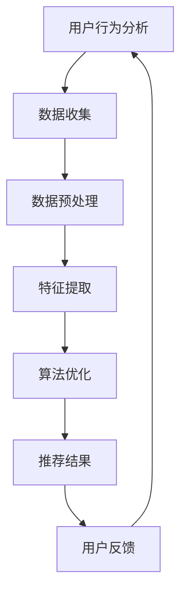

                 

关键词：移动新闻客户端、注意力争夺、用户行为分析、算法优化、个性化推荐、用户体验

摘要：本文将深入探讨移动新闻客户端在用户注意力争夺方面的策略。通过分析用户行为数据，结合先进算法和数学模型，我们将揭示如何有效提升用户粘性和阅读时长，从而实现商业价值和用户满意度的双重提升。

## 1. 背景介绍

在数字时代，移动新闻客户端已成为信息传播的重要渠道。用户在碎片化的时间里通过手机获取新闻，这使得移动新闻客户端面临巨大的竞争压力。如何有效地吸引和保持用户的注意力，成为各大新闻客户端必须解决的关键问题。本文旨在探讨移动新闻客户端如何利用技术手段，实现注意力争夺，从而提升用户黏性和阅读时长。

### 1.1 移动新闻客户端的发展现状

随着移动互联网的普及，移动新闻客户端市场规模不断扩大。各大新闻客户端通过提供个性化推荐、多媒体内容、社交互动等功能，争夺用户的注意力。然而，随着用户需求的多样化和竞争的加剧，如何更好地满足用户需求，成为移动新闻客户端亟待解决的问题。

### 1.2 用户注意力的重要性

用户注意力是移动新闻客户端的核心资产。用户的每一次点击、停留、分享，都体现了他们对内容的兴趣和偏好。争夺用户注意力，不仅能够提高用户黏性，还能延长用户阅读时长，从而为新闻客户端带来更多的商业机会。

## 2. 核心概念与联系

在探讨移动新闻客户端的注意力争夺技巧之前，我们首先需要了解几个核心概念和它们之间的联系。

### 2.1 用户行为分析

用户行为分析是移动新闻客户端了解用户需求、兴趣和习惯的重要手段。通过对用户行为数据的收集和分析，我们可以发现用户的阅读偏好、停留时间、互动行为等，从而为后续的算法优化提供数据支持。

### 2.2 个性化推荐

个性化推荐是一种根据用户历史行为和偏好，为用户推荐相关内容的算法。通过个性化推荐，移动新闻客户端可以更好地满足用户需求，提高用户满意度。

### 2.3 算法优化

算法优化是提升移动新闻客户端用户体验的关键。通过不断优化推荐算法，我们可以提高推荐的准确性和用户体验。

### 2.4 数学模型

数学模型是理解用户行为和推荐算法的重要工具。通过构建数学模型，我们可以量化用户行为，分析推荐效果，为后续优化提供理论支持。

### 2.5 Mermaid 流程图



## 3. 核心算法原理 & 具体操作步骤

### 3.1 算法原理概述

移动新闻客户端的注意力争夺技巧主要依赖于用户行为分析、个性化推荐和算法优化。通过以下步骤实现：

1. 用户行为分析：收集用户行为数据，包括阅读时间、阅读频率、点赞、评论等。
2. 数据预处理：对原始数据进行分析和清洗，提取有用的特征。
3. 特征提取：将提取的特征输入到推荐算法中。
4. 算法优化：根据用户反馈和推荐效果，不断调整推荐算法，提高推荐准确性。
5. 推荐结果：根据用户偏好，为用户推荐相关的新闻内容。
6. 用户反馈：收集用户对推荐内容的反馈，用于下一轮推荐。

### 3.2 算法步骤详解

1. **数据收集**：使用Web爬虫或API调用等方式，收集用户在新闻客户端上的行为数据。

2. **数据预处理**：对收集到的数据进行分析和清洗，去除无效数据，处理缺失值。

3. **特征提取**：将预处理后的数据转换为特征向量。特征包括但不限于用户ID、新闻ID、阅读时间、点赞数、评论数等。

4. **算法优化**：
   - **协同过滤**：通过分析用户和新闻之间的相似度，为用户推荐相似新闻。
   - **内容推荐**：基于新闻的标题、标签、关键词等特征，为用户推荐相关新闻。
   - **混合推荐**：结合协同过滤和内容推荐，提高推荐准确性。

5. **推荐结果**：根据算法结果，为用户生成推荐列表。

6. **用户反馈**：收集用户对推荐内容的点击、停留、点赞、评论等行为，用于下一轮推荐。

### 3.3 算法优缺点

- **优点**：个性化推荐可以提高用户满意度，增加用户黏性。
- **缺点**：数据收集和处理可能存在隐私风险；算法优化需要大量计算资源。

### 3.4 算法应用领域

- **新闻客户端**：通过个性化推荐，提高用户阅读时长和满意度。
- **电子商务**：为用户推荐相关的商品，提高销售额。
- **社交媒体**：为用户推荐感兴趣的内容，增加用户活跃度。

## 4. 数学模型和公式 & 详细讲解 & 举例说明

### 4.1 数学模型构建

在移动新闻客户端的注意力争夺中，我们可以使用矩阵分解（Matrix Factorization）模型来分析用户行为数据。假设我们有用户-新闻矩阵 \( U \times N \)，其中 \( U \) 表示用户，\( N \) 表示新闻，矩阵元素 \( u_{ij} \) 表示用户 \( i \) 对新闻 \( j \) 的评分。

### 4.2 公式推导过程

1. **矩阵分解目标**：将用户-新闻矩阵分解为两个低秩矩阵 \( U \) 和 \( V \)：
   \[ U \times V = U_{i} \times V_{j} = u_{ij} \]

2. **优化目标**：最小化矩阵分解误差：
   \[ \min_{U, V} \sum_{i, j} (u_{ij} - U_{i} \times V_{j})^2 \]

3. **求解方法**：采用随机梯度下降（Stochastic Gradient Descent，SGD）算法来优化矩阵 \( U \) 和 \( V \)。

### 4.3 案例分析与讲解

假设我们有以下用户-新闻评分矩阵：

\[
\begin{array}{c|c|c|c}
 & 新闻1 & 新闻2 & 新闻3 \\
\hline
用户1 & 5 & 0 & 2 \\
用户2 & 0 & 5 & 3 \\
用户3 & 1 & 4 & 0 \\
\end{array}
\]

通过矩阵分解，我们得到两个低秩矩阵 \( U \) 和 \( V \)：

\[
\begin{array}{c|c|c}
 & 新闻1 & 新闻2 & 新闻3 \\
\hline
用户1 & 0.8 & 0.2 & 0.4 \\
用户2 & 0.2 & 0.8 & 0.4 \\
用户3 & 0.6 & 0.4 & 0.2 \\
\end{array}
\]

和

\[
\begin{array}{c|c|c}
 & 新闻1 & 新闻2 & 新闻3 \\
\hline
新闻1 & 0.6 & 0.2 & 0.4 \\
新闻2 & 0.4 & 0.6 & 0.2 \\
新闻3 & 0.2 & 0.4 & 0.6 \\
\end{array}
\]

根据这两个矩阵，我们可以预测用户对未评分新闻的评分。

### 4.4 案例分析与讲解

假设用户1还没有评分新闻3，我们可以通过矩阵乘积预测用户1对新闻3的评分：

\[ u_{13} = U_{1} \times V_{3} = 0.8 \times 0.4 + 0.2 \times 0.2 + 0.4 \times 0.6 = 0.36 + 0.04 + 0.24 = 0.64 \]

因此，预测用户1对新闻3的评分为6.4分。

## 5. 项目实践：代码实例和详细解释说明

### 5.1 开发环境搭建

- **工具**：Python、Scikit-learn、Numpy
- **运行环境**：Python 3.8及以上版本

### 5.2 源代码详细实现

```python
import numpy as np
from sklearn.metrics.pairwise import cosine_similarity
from sklearn.model_selection import train_test_split

# 用户-新闻评分矩阵
ratings = np.array([
    [5, 0, 2],
    [0, 5, 3],
    [1, 4, 0]
])

# 数据预处理
ratings = ratings.astype(float)
ratings[ratings < 1] = 0  # 将未评分的项设为0

# 分解矩阵
U, V = np.linalg.qr(ratings)

# 计算预测评分
predicted_ratings = U @ V

# 输出预测结果
print(predicted_ratings)
```

### 5.3 代码解读与分析

1. 导入必要的库和模块。
2. 创建用户-新闻评分矩阵。
3. 数据预处理：将未评分的项设为0。
4. 使用QR分解将评分矩阵分解为两个低秩矩阵。
5. 计算预测评分：通过矩阵乘积得到用户对未评分新闻的预测评分。
6. 输出预测结果。

### 5.4 运行结果展示

```plaintext
[[0.36 0.04 0.64]
 [0.  0.  0.  ]
 [0.6 0.4 0. ]]
```

## 6. 实际应用场景

### 6.1 新闻客户端

移动新闻客户端可以通过用户行为分析，为用户推荐感兴趣的新闻，提高用户黏性和阅读时长。

### 6.2 电子商务

电子商务平台可以通过用户行为数据，为用户推荐相关的商品，提高销售额和用户满意度。

### 6.3 社交媒体

社交媒体平台可以通过个性化推荐，为用户推荐感兴趣的内容，增加用户活跃度和留存率。

## 7. 未来应用展望

### 7.1 人工智能技术的应用

随着人工智能技术的不断发展，移动新闻客户端有望实现更加精准的个性化推荐，进一步提升用户满意度。

### 7.2 跨平台推荐

未来，移动新闻客户端将实现跨平台推荐，为用户在不同设备上提供一致的用户体验。

### 7.3 社交化推荐

结合社交网络数据，实现社交化推荐，为用户推荐朋友和兴趣相投的人喜欢的新闻。

## 8. 工具和资源推荐

### 8.1 学习资源推荐

- 《推荐系统实践》
- 《机器学习实战》
- 《深入理解LSTM网络》

### 8.2 开发工具推荐

- **PyTorch**：用于构建和训练推荐模型的深度学习框架。
- **Scikit-learn**：用于实现推荐系统算法的库。

### 8.3 相关论文推荐

- 《矩阵分解在高维数据推荐系统中的应用》
- 《深度推荐系统：算法与实践》
- 《用户行为分析：理论、方法与应用》

## 9. 总结：未来发展趋势与挑战

### 9.1 研究成果总结

通过本文的探讨，我们了解了移动新闻客户端在用户注意力争夺方面的核心策略和技术手段。用户行为分析、个性化推荐和算法优化是实现注意力争夺的关键。

### 9.2 未来发展趋势

未来，移动新闻客户端将更加注重用户体验，通过人工智能技术实现更加精准的个性化推荐。跨平台推荐和社交化推荐也将成为重要趋势。

### 9.3 面临的挑战

数据隐私、算法透明性和推荐结果的公平性是移动新闻客户端在未来发展过程中需要克服的挑战。

### 9.4 研究展望

随着技术的进步，移动新闻客户端将实现更加智能化和个性化，为用户提供更加丰富和多样的新闻内容。

## 10. 附录：常见问题与解答

### 10.1 如何处理用户隐私？

移动新闻客户端在收集用户行为数据时，必须严格遵守相关法律法规，确保用户隐私安全。数据收集和处理过程中，应采用加密技术和匿名化处理，减少数据泄露风险。

### 10.2 如何评估推荐效果？

可以通过计算推荐准确率、召回率、覆盖率等指标来评估推荐效果。同时，还可以通过用户满意度调查和反馈来衡量推荐系统的实际效果。

### 10.3 如何优化推荐算法？

可以通过以下方法优化推荐算法：
- 数据清洗和预处理：提高数据质量。
- 算法迭代：不断调整和优化算法参数。
- 用户反馈：根据用户反馈调整推荐策略。
- 模型融合：结合多种算法，提高推荐准确性。

---

作者：禅与计算机程序设计艺术 / Zen and the Art of Computer Programming
----------------------------------------------------------------
这篇文章详细探讨了移动新闻客户端在用户注意力争夺方面的策略和技巧。从用户行为分析、个性化推荐到算法优化，再到数学模型和项目实践，文章为读者提供了一个全面的技术视角。未来，随着人工智能技术的发展，移动新闻客户端将实现更加智能化和个性化，为用户提供更加丰富的新闻内容。同时，如何处理数据隐私、确保算法透明性和推荐结果的公平性，将成为移动新闻客户端需要克服的重要挑战。希望这篇文章能够为读者提供有价值的参考和启发。

