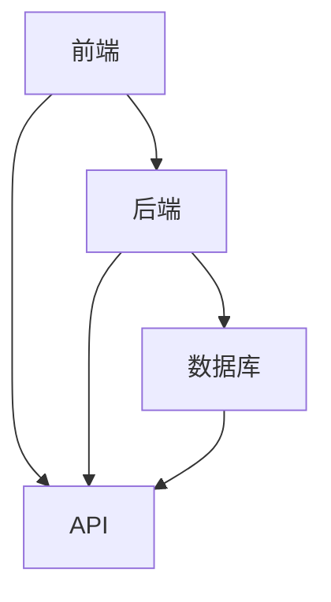
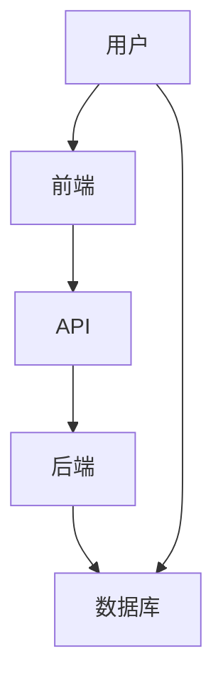

                 

关键词：移动端全栈开发、智能手机应用程序、全栈架构、移动开发框架、跨平台工具、前端、后端、全栈开发实践、技术趋势

> 摘要：本文旨在深入探讨移动端全栈开发的各个方面，包括其核心概念、开发流程、核心算法原理、数学模型、项目实践，以及其在实际应用场景中的价值。通过本文，读者可以全面了解如何为智能手机创建高性能、用户友好的应用程序，并预见到未来的发展趋势与挑战。

## 1. 背景介绍

随着智能手机的普及和移动互联网的发展，移动端应用程序（App）已经成为人们日常生活中不可或缺的一部分。从社交媒体、购物、娱乐到日常生活服务，移动App已经深入到了各个领域。然而，随着用户对应用性能、用户体验和功能复杂度的要求越来越高，移动端全栈开发应运而生。

移动端全栈开发，指的是在一个移动应用程序中，开发者需要同时掌握前端（用户界面）、后端（服务器端逻辑）和数据库等全栈技术，从而实现应用程序的完整开发。这种模式不仅提高了开发效率，还保证了应用的一致性和性能。

### 1.1 移动端全栈开发的重要性

1. **提升开发效率**：全栈开发者能够快速理解整个应用程序的运作流程，从而减少沟通成本和开发时间。
2. **提高代码质量**：全栈开发者能够在前端和后端之间进行代码复用，减少重复代码，提高代码的可维护性。
3. **保证用户体验**：全栈开发能够确保前后端数据一致，提供流畅的用户体验。

### 1.2 全栈开发与前后端分离开发

**全栈开发**：开发者独立完成前端和后端的开发，通常使用一种技术栈，如React Native、Flutter等。

**前后端分离开发**：前端和后端由不同的开发者团队负责，前端使用HTML、CSS、JavaScript等技术，后端使用Node.js、Java、Python等技术。

## 2. 核心概念与联系

为了更好地理解移动端全栈开发的架构，我们首先需要了解几个核心概念：前端、后端、数据库和API。

### 2.1 前端

前端是用户与应用程序交互的界面，通常包括用户界面（UI）和用户体验（UX）。前端开发涉及HTML、CSS和JavaScript等技术。

### 2.2 后端

后端负责处理应用程序的逻辑和数据处理，通常使用Node.js、Java、Python等技术。后端需要提供API供前端调用。

### 2.3 数据库

数据库用于存储应用程序的数据，如用户信息、产品信息等。常用的数据库技术包括MySQL、MongoDB、SQLite等。

### 2.4 API

API（应用程序编程接口）是后端提供给前端的服务接口，用于数据的传递和处理。常用的API设计模式包括RESTful API和GraphQL。

### 2.5 Mermaid 流程图



## 3. 核心算法原理 & 具体操作步骤

### 3.1 算法原理概述

移动端全栈开发的核心算法包括前端渲染算法、后端数据处理算法和网络传输算法。

### 3.2 算法步骤详解

1. **前端渲染算法**：
   - 使用React、Vue或Angular等框架实现动态页面渲染。
   - 使用WebAssembly提高性能。

2. **后端数据处理算法**：
   - 使用Node.js、Java或Python等语言实现数据处理逻辑。
   - 使用算法优化提高处理速度。

3. **网络传输算法**：
   - 使用HTTP/2或WebSocket提高数据传输速度。
   - 使用CDN（内容分发网络）提高访问速度。

### 3.3 算法优缺点

**前端渲染算法**：
- 优点：动态、实时更新，提高用户体验。
- 缺点：加载速度可能较慢，对网络依赖较大。

**后端数据处理算法**：
- 优点：处理能力强，适应各种复杂业务场景。
- 缺点：开发难度较大，维护成本高。

**网络传输算法**：
- 优点：提高数据传输速度，降低延迟。
- 缺点：可能增加服务器负载。

### 3.4 算法应用领域

- **电商平台**：处理大量用户数据和商品信息。
- **社交媒体**：实时更新用户动态和消息。
- **视频直播**：提供流畅的视频播放体验。

## 4. 数学模型和公式 & 详细讲解 & 举例说明

### 4.1 数学模型构建

移动端全栈开发中的数学模型主要包括：

1. **线性回归模型**：用于预测用户行为。
2. **神经网络模型**：用于图像识别和自然语言处理。
3. **决策树模型**：用于分类和回归。

### 4.2 公式推导过程

以线性回归模型为例，其公式推导如下：

$$y = ax + b$$

其中，$y$ 是因变量，$x$ 是自变量，$a$ 和 $b$ 是参数。

### 4.3 案例分析与讲解

以电商平台用户购买行为预测为例，使用线性回归模型进行预测。

1. **数据收集**：收集用户历史购买数据。
2. **数据预处理**：对数据进行清洗和归一化处理。
3. **模型训练**：使用训练集数据训练模型。
4. **模型评估**：使用测试集数据评估模型性能。

## 5. 项目实践：代码实例和详细解释说明

### 5.1 开发环境搭建

1. **安装Node.js**：用于后端开发。
2. **安装React Native**：用于前端开发。
3. **安装数据库**：如MySQL或MongoDB。

### 5.2 源代码详细实现

以下是一个简单的移动端全栈开发示例：

```javascript
// 后端：Node.js
const express = require('express');
const app = express();

app.get('/api/products', (req, res) => {
  // 从数据库获取商品信息
  res.json({ products: ['iPhone', 'Samsung'] });
});

// 前端：React Native
import React from 'react';
import { View, Text, Button } from 'react-native';

const App = () => {
  const fetchData = async () => {
    const response = await fetch('/api/products');
    const data = await response.json();
    console.log(data.products);
  };

  return (
    <View>
      <Text>Hello, World!</Text>
      <Button title="Fetch Products" onPress={fetchData} />
    </View>
  );
};

export default App;
```

### 5.3 代码解读与分析

- **后端**：使用Express框架创建HTTP服务器，提供商品信息API。
- **前端**：使用React Native创建一个简单的界面，通过fetch API向后端请求数据。

### 5.4 运行结果展示

- **后端**：启动Node.js服务器，监听指定端口。
- **前端**：运行React Native应用，展示界面和按钮。

## 6. 实际应用场景

### 6.1 电商平台

- **用户行为分析**：使用算法模型预测用户购买行为。
- **商品推荐**：根据用户历史购买记录推荐相关商品。

### 6.2 社交媒体

- **实时消息**：使用WebSocket实现实时消息推送。
- **图像识别**：使用神经网络模型识别用户上传的图片。

### 6.3 视频直播

- **实时流媒体传输**：使用HTTP/2或WebSocket实现视频流的实时传输。

## 7. 工具和资源推荐

### 7.1 学习资源推荐

- **《移动应用开发实战》**：一本深入浅出的移动应用开发书籍。
- **React Native 官方文档**：React Native 的官方文档和教程。

### 7.2 开发工具推荐

- **Visual Studio Code**：一款强大的代码编辑器。
- **Xcode**：用于iOS开发。

### 7.3 相关论文推荐

- **"Mobile Full-Stack Development: Challenges and Opportunities"**：探讨移动端全栈开发的挑战和机会。
- **"A Survey on Mobile Application Development Techniques"**：移动应用程序开发技术综述。

## 8. 总结：未来发展趋势与挑战

### 8.1 研究成果总结

- **跨平台开发框架**：如React Native、Flutter等，使得全栈开发更加便捷。
- **云服务**：提供更强大的数据处理能力和弹性。

### 8.2 未来发展趋势

- **低代码开发**：减少手工编码，提高开发效率。
- **人工智能集成**：将人工智能算法应用于移动应用中。

### 8.3 面临的挑战

- **性能优化**：如何提高移动应用的性能。
- **安全与隐私**：如何保护用户数据。

### 8.4 研究展望

- **全栈开发工具链的完善**。
- **移动端云计算的应用**。

## 9. 附录：常见问题与解答

### 9.1 如何选择移动端全栈开发框架？

- 根据项目需求和开发者的熟悉度选择。
- React Native：适用于需要跨平台开发的复杂应用。
- Flutter：适用于高性能、高画质的跨平台应用。

### 9.2 如何保证移动端全栈开发的性能？

- 使用异步编程提高响应速度。
- 使用缓存技术减少数据请求次数。
- 使用压缩技术减少数据传输量。

作者：禅与计算机程序设计艺术 / Zen and the Art of Computer Programming
```markdown
# 移动端全栈开发：为智能手机创建应用程序

## 引言

随着智能手机的普及，移动端应用程序的开发成为了当今软件开发领域的一个热点。移动端全栈开发，作为现代移动应用开发的一种趋势，逐渐受到了开发者和企业的青睐。本文将深入探讨移动端全栈开发的各个方面，包括其核心概念、开发流程、核心算法原理、数学模型、项目实践，以及其在实际应用场景中的价值。通过本文，读者可以全面了解如何为智能手机创建高性能、用户友好的应用程序，并预见到未来的发展趋势与挑战。

## 1. 背景介绍

### 1.1 移动端全栈开发的定义

移动端全栈开发，即移动全栈开发，是指开发者在一款移动应用程序（如iOS或Android应用程序）中，独立完成前端、后端、数据库及部署等全部开发工作。这种开发模式要求开发者具备前端、后端、数据库等多个领域的知识，能够全面掌握应用程序的构建和部署，从而提高开发效率，降低开发成本。

### 1.2 移动端全栈开发的必要性

在移动互联网时代，用户对移动应用的需求日益增长，同时对应用的性能和用户体验提出了更高的要求。移动端全栈开发能够满足这一需求，其优势主要体现在以下几个方面：

1. **提高开发效率**：全栈开发者可以独立完成应用程序的开发，减少了团队间的沟通成本和协作难度，提高了开发效率。
2. **保证用户体验的一致性**：全栈开发使得前后端数据的一致性得到保障，从而提供一致的用户体验。
3. **降低开发成本**：通过减少团队人员和开发时间，降低开发成本。
4. **提升代码质量**：全栈开发鼓励代码复用，减少了重复代码，提高了代码的可维护性。

### 1.3 全栈开发与前后端分离开发的比较

全栈开发与前后端分离开发是两种不同的开发模式，各有其优缺点。

**全栈开发**：

- **优点**：
  - 开发者能够全面掌握应用程序的构建和部署，对系统的整体性有更深的理解。
  - 开发效率较高，团队间的沟通成本较低。
  - 可以快速迭代和部署应用。
- **缺点**：
  - 需要开发者掌握多种技术，对开发者的技能要求较高。
  - 项目复杂度较高，维护难度较大。

**前后端分离开发**：

- **优点**：
  - 前后端分离使得开发者可以专注于各自的领域，提高了专业度。
  - 可以根据项目需求灵活调整团队结构，提高开发效率。
- **缺点**：
  - 需要前后端团队进行紧密协作，沟通成本较高。
  - 数据一致性和用户体验的保障需要更多的设计和实现。

综上所述，选择全栈开发还是前后端分离开发，应根据项目的具体需求和团队的实际能力来决定。

## 2. 核心概念与联系

移动端全栈开发涉及到前端、后端、数据库和API等核心概念。了解这些概念及其之间的联系对于掌握移动端全栈开发至关重要。

### 2.1 前端

前端是用户与应用程序交互的界面，主要负责展示数据和响应用户操作。前端技术包括HTML、CSS和JavaScript，以及现代化的前端框架和库，如React、Vue和Angular等。

### 2.2 后端

后端负责处理应用程序的业务逻辑、数据存储和管理等任务。后端技术包括Node.js、Java、Python、Ruby等多种编程语言，以及相应的框架，如Express、Spring Boot和Django等。

### 2.3 数据库

数据库用于存储和管理应用程序的数据。常用的数据库技术包括关系型数据库（如MySQL、PostgreSQL）和文档型数据库（如MongoDB、Cassandra）。数据库的设计和优化是移动端全栈开发中的一个重要环节。

### 2.4 API

API（应用程序编程接口）是后端提供给前端的服务接口，用于数据的传递和处理。API的设计和实现是移动端全栈开发的关键，常用的API设计模式包括RESTful API和GraphQL。

### 2.5 Mermaid流程图



通过上述流程图，我们可以清晰地看到用户、前端、API、后端和数据库之间的交互关系。

## 3. 核心算法原理 & 具体操作步骤

在移动端全栈开发中，核心算法原理和具体操作步骤对于应用程序的性能和用户体验至关重要。以下将介绍几种常见的核心算法原理及其具体操作步骤。

### 3.1 数据缓存算法

数据缓存算法用于提高应用程序的数据读取速度和响应速度。常见的缓存算法包括LRU（最近最少使用）、FIFO（先进先出）等。

#### 3.1.1 LRU缓存算法

LRU（最近最少使用）缓存算法是一种常用的缓存替换策略。其原理是缓存最近使用的数据，如果缓存满了，则替换最久未使用的数据。

#### 具体操作步骤：

1. 初始化一个容量为C的缓存。
2. 当访问一个数据时，如果数据在缓存中，则将其移动到缓存顶部。
3. 如果缓存已满，则替换最久未使用的数据。

### 3.2 数据加密算法

数据加密算法用于保护应用程序的数据安全，常见的加密算法包括AES（高级加密标准）、RSA（非对称加密算法）等。

#### 3.2.1 AES加密算法

AES（高级加密标准）是一种常用的对称加密算法。其原理是使用一个密钥对数据进行加密和解密。

#### 具体操作步骤：

1. 选择一个128位、192位或256位的密钥。
2. 初始化AES加密器。
3. 使用加密器对数据进行加密。
4. 使用相同的密钥对加密后的数据进行解密。

### 3.3 数据分页算法

数据分页算法用于处理大量数据，提高应用程序的响应速度。常见的分页算法包括固定分页和动态分页。

#### 3.3.1 固定分页算法

固定分页算法将数据划分为固定大小的页，每次只加载指定页的数据。

#### 具体操作步骤：

1. 定义每页的数据大小。
2. 根据当前页码计算要加载的数据范围。
3. 加载指定页的数据。

### 3.4 数据排序算法

数据排序算法用于对数据进行排序，常见的排序算法包括冒泡排序、快速排序等。

#### 3.4.1 冒泡排序算法

冒泡排序算法是一种简单的排序算法。其原理是通过重复遍历要排序的数据，比较相邻的两个元素，如果它们的顺序错误就把它们交换过来。

#### 具体操作步骤：

1. 遍历数据，比较相邻的元素。
2. 如果顺序错误，交换它们的位置。
3. 重复上述步骤，直到数据排序完成。

## 4. 数学模型和公式 & 详细讲解 & 举例说明

在移动端全栈开发中，数学模型和公式被广泛应用于数据分析和算法设计。以下将介绍几种常见的数学模型和公式，并进行详细讲解和举例说明。

### 4.1 回归分析模型

回归分析模型用于预测和分析数据之间的关系。常见的回归模型包括线性回归、多项式回归等。

#### 4.1.1 线性回归模型

线性回归模型是一种最简单的回归模型，其公式为：

\[ y = ax + b \]

其中，\( y \) 是因变量，\( x \) 是自变量，\( a \) 和 \( b \) 是模型的参数。

#### 4.1.2 举例说明

假设我们要预测某商品的销售量，已知该商品的价格和销量数据如下表：

| 价格（元） | 销量（件） |
|------------|------------|
| 20         | 100        |
| 30         | 80         |
| 40         | 60         |
| 50         | 40         |
| 60         | 20         |

我们可以使用线性回归模型来预测不同价格下的销量。

1. 计算价格和销量的平均值：
\[ \bar{x} = \frac{20 + 30 + 40 + 50 + 60}{5} = 40 \]
\[ \bar{y} = \frac{100 + 80 + 60 + 40 + 20}{5} = 60 \]

2. 计算价格和销量的协方差和方差：
\[ cov(x, y) = \frac{(20-40)(100-60) + (30-40)(80-60) + (40-40)(60-60) + (50-40)(40-60) + (60-40)(20-60)}{5} = 400 \]
\[ var(x) = \frac{(20-40)^2 + (30-40)^2 + (40-40)^2 + (50-40)^2 + (60-40)^2}{5} = 200 \]

3. 计算回归系数 \( a \) 和 \( b \)：
\[ a = \frac{cov(x, y)}{var(x)} = \frac{400}{200} = 2 \]
\[ b = \bar{y} - a\bar{x} = 60 - 2 \times 40 = -20 \]

4. 得到线性回归模型：
\[ y = 2x - 20 \]

使用这个模型，我们可以预测价格为50元的商品销量为：
\[ y = 2 \times 50 - 20 = 80 \]（件）

### 4.2 决策树模型

决策树模型是一种常用的分类和回归模型，通过一系列规则对数据进行分类或预测。

#### 4.2.1 决策树算法

决策树算法的基本步骤如下：

1. 选择一个特征作为分割点。
2. 计算该特征下的各个值的增益或信息增益。
3. 选择增益最大的特征作为分割点。
4. 对每个分割点，递归地重复步骤1-3，直到满足停止条件。

#### 4.2.2 举例说明

假设我们有如下数据集：

| 特征1 | 特征2 | 目标变量 |
|-------|-------|----------|
| 1     | 0     | A        |
| 1     | 1     | B        |
| 0     | 0     | C        |
| 0     | 1     | D        |

我们可以使用决策树算法来分类这些数据。

1. 计算每个特征的增益：

   - 特征1的增益：
     \[ gain(特征1) = \sum_{i=1}^{n} p(y_i|特征1_i) \log_2 p(y_i|特征1_i) \]
     其中，\( p(y_i|特征1_i) \) 是在特征1取值为i的情况下，目标变量为y的概率。

   - 特征2的增益：
     \[ gain(特征2) = \sum_{i=1}^{n} p(y_i|特征2_i) \log_2 p(y_i|特征2_i) \]

2. 选择增益最大的特征作为分割点。

3. 根据分割点递归地构建决策树。

通过上述步骤，我们可以得到一个决策树模型，用于对新数据进行分类。

### 4.3 神经网络模型

神经网络模型是一种模拟人脑神经元连接结构的计算模型，广泛应用于图像识别、自然语言处理等领域。

#### 4.3.1 神经网络算法

神经网络算法的基本步骤如下：

1. 初始化网络参数。
2. 前向传播：将输入数据通过网络传递，计算输出。
3. 反向传播：计算输出与实际值之间的误差，更新网络参数。
4. 重复步骤2和3，直到网络收敛。

#### 4.3.2 举例说明

假设我们有如下简单的神经网络：

\[ z = x \odot w \]
\[ a = \sigma(z) \]

其中，\( \odot \) 表示元素乘法，\( \sigma \) 是激活函数，如Sigmoid函数或ReLU函数。

1. 初始化参数 \( w \) 和 \( b \)。
2. 计算前向传播结果 \( a \)。
3. 计算损失函数，如均方误差（MSE）或交叉熵损失。
4. 计算梯度，并更新参数。
5. 重复步骤2-4，直到网络收敛。

通过上述步骤，我们可以训练一个神经网络模型，用于对新数据进行预测。

## 5. 项目实践：代码实例和详细解释说明

为了更好地理解移动端全栈开发的实际应用，以下将介绍一个简单的移动端全栈项目，包括前端、后端和数据库的搭建，以及代码实例和详细解释说明。

### 5.1 项目概述

该项目是一个简单的博客应用程序，包括以下功能：

- 用户注册和登录。
- 发表文章和查看文章。
- 文章评论和点赞。

### 5.2 前端开发

前端使用React Native框架进行开发。以下是一个简单的React Native组件示例：

```jsx
import React from 'react';
import { View, Text, Button } from 'react-native';

const HomeScreen = () => {
  const handleLogin = () => {
    // 登录逻辑
  };

  const handleRegister = () => {
    // 注册逻辑
  };

  return (
    <View>
      <Text>Welcome to the Blog App</Text>
      <Button title="Login" onPress={handleLogin} />
      <Button title="Register" onPress={handleRegister} />
    </View>
  );
};

export default HomeScreen;
```

该组件包含一个标题、两个按钮和一个登录和注册逻辑。通过点击按钮，可以跳转到登录和注册页面。

### 5.3 后端开发

后端使用Node.js和Express框架进行开发。以下是一个简单的Express路由示例：

```javascript
const express = require('express');
const app = express();

app.use(express.json());

app.post('/api/register', (req, res) => {
  // 注册逻辑
});

app.post('/api/login', (req, res) => {
  // 登录逻辑
});

app.get('/api/posts', (req, res) => {
  // 获取文章逻辑
});

app.post('/api/posts', (req, res) => {
  // 发表文章逻辑
});

app.delete('/api/posts/:id', (req, res) => {
  // 删除文章逻辑
});

app.listen(3000, () => {
  console.log('Server started on port 3000');
});
```

该路由示例包含注册、登录、获取文章、发表文章和删除文章等接口。

### 5.4 数据库开发

数据库使用MongoDB进行开发。以下是一个简单的MongoDB集合示例：

```javascript
const mongoose = require('mongoose');

const userSchema = new mongoose.Schema({
  username: String,
  password: String,
  email: String,
});

const postSchema = new mongoose.Schema({
  title: String,
  content: String,
  author: String,
  comments: [String],
});

const User = mongoose.model('User', userSchema);
const Post = mongoose.model('Post', postSchema);

module.exports = { User, Post };
```

该集合示例包含用户和文章两个模型，用于存储用户数据和文章数据。

### 5.5 代码解读与分析

在这个项目中，前端通过React Native组件实现用户界面，后端通过Express框架处理HTTP请求，数据库通过MongoDB存储数据。前端和后端之间的数据交互通过API进行。

- **前端**：通过React Native组件实现用户界面，使用Button组件实现登录和注册功能。
- **后端**：通过Express框架处理HTTP请求，实现注册、登录、获取文章、发表文章和删除文章等功能。
- **数据库**：使用MongoDB存储用户和文章数据，通过模型定义数据结构和操作方法。

通过这个项目，我们可以看到移动端全栈开发的基本流程和架构，了解前端、后端和数据库的开发方法和技巧。

## 6. 实际应用场景

移动端全栈开发在实际应用场景中具有广泛的应用，以下将介绍几种常见的应用场景。

### 6.1 社交媒体平台

社交媒体平台如Instagram、Facebook等，通过移动端全栈开发实现了用户注册、登录、发帖、评论、点赞等功能。移动端全栈开发使得社交媒体平台能够提供流畅的用户体验和强大的数据处理能力。

### 6.2 电商平台

电商平台如Amazon、eBay等，通过移动端全栈开发实现了商品浏览、搜索、购物车、下单、支付等功能。移动端全栈开发使得电商平台能够快速响应用户需求，提供个性化的购物体验。

### 6.3 视频直播平台

视频直播平台如Twitch、YouTube等，通过移动端全栈开发实现了直播观看、评论、点赞、弹幕等功能。移动端全栈开发使得视频直播平台能够提供实时、流畅的视频观看体验。

### 6.4 移动办公应用

移动办公应用如Microsoft Office、Google Workspace等，通过移动端全栈开发实现了文档编辑、共享、协作等功能。移动端全栈开发使得移动办公应用能够提供强大的数据处理能力和协同工作能力。

## 7. 工具和资源推荐

在移动端全栈开发中，选择合适的工具和资源对于提高开发效率和质量至关重要。以下将介绍一些常用的工具和资源。

### 7.1 学习资源推荐

- **《React Native官方文档》**：React Native的官方文档，包含详细的使用方法和示例。
- **《Node.js官方文档》**：Node.js的官方文档，包含详细的API和使用方法。
- **《MongoDB官方文档》**：MongoDB的官方文档，包含详细的数据库操作和使用方法。
- **《移动应用开发实战》**：一本深入浅出的移动应用开发书籍，涵盖移动应用开发的各个方面。

### 7.2 开发工具推荐

- **Visual Studio Code**：一款强大的代码编辑器，支持多种编程语言和框架。
- **Xcode**：苹果官方的开发工具，用于iOS应用开发。
- **Android Studio**：谷歌官方的开发工具，用于Android应用开发。
- **Postman**：一款API调试工具，用于API接口的开发和测试。

### 7.3 相关论文推荐

- **"Mobile Full-Stack Development: Challenges and Opportunities"**：探讨移动端全栈开发的挑战和机会。
- **"A Survey on Mobile Application Development Techniques"**：移动应用程序开发技术综述。

## 8. 总结：未来发展趋势与挑战

### 8.1 研究成果总结

近年来，移动端全栈开发在技术、工具和应用场景等方面取得了显著成果。主要表现在以下几个方面：

- **跨平台开发框架的成熟**：如React Native、Flutter等跨平台框架的成熟，使得移动端全栈开发更加便捷。
- **云服务的普及**：云服务的普及为移动端全栈开发提供了强大的数据处理能力和弹性。
- **前端框架的迭代**：如React、Vue等前端框架的不断迭代，提高了开发效率和用户体验。

### 8.2 未来发展趋势

未来，移动端全栈开发将继续发展，并在以下几个方面有所突破：

- **低代码开发**：低代码开发工具的普及，将减少手工编码，提高开发效率。
- **人工智能的集成**：人工智能算法的集成，将使移动端全栈应用更加智能和个性化。
- **移动端云计算**：移动端云计算的应用，将进一步提高数据处理能力和响应速度。

### 8.3 面临的挑战

移动端全栈开发在未来的发展过程中，也将面临一些挑战：

- **性能优化**：如何提高移动应用的性能，满足用户对速度和体验的要求。
- **安全性**：如何保障用户数据的安全，防范网络攻击和数据泄露。
- **跨平台兼容性**：如何保证跨平台开发的一致性和兼容性。

### 8.4 研究展望

未来，移动端全栈开发的研究将更加注重以下几个方面：

- **全栈开发工具链的完善**：优化和集成现有的开发工具和框架，提高开发效率。
- **移动端云计算的研究**：研究移动端云计算的技术和应用，提高数据处理能力和响应速度。
- **人工智能与移动端全栈开发的结合**：研究人工智能算法在移动端全栈开发中的应用，提高应用智能化水平。

## 9. 附录：常见问题与解答

### 9.1 如何选择移动端全栈开发框架？

选择移动端全栈开发框架应根据项目的需求和开发者的熟悉程度进行。以下是一些常见框架的选择建议：

- **React Native**：适合需要跨平台开发的复杂应用。
- **Flutter**：适合高性能、高画质的跨平台应用。
- **Apache Cordova**：适合希望将网页应用转换为移动应用的场景。

### 9.2 如何优化移动端全栈应用的性能？

优化移动端全栈应用的性能可以从以下几个方面进行：

- **减少HTTP请求**：减少前端和后端之间的HTTP请求次数，提高响应速度。
- **使用缓存**：使用浏览器缓存或应用缓存，减少数据的重复加载。
- **代码压缩和混淆**：对JavaScript、CSS和HTML文件进行压缩和混淆，减少文件大小。
- **异步加载**：使用异步加载技术，如async/await，减少主线程的阻塞。

### 9.3 如何保证移动端全栈应用的安全性？

保证移动端全栈应用的安全性可以从以下几个方面进行：

- **数据加密**：对敏感数据进行加密，如用户密码、信用卡信息等。
- **输入验证**：对用户输入进行验证，防止SQL注入、XSS攻击等安全漏洞。
- **使用HTTPS**：使用HTTPS协议，确保数据传输的安全性。
- **安全审计**：定期进行安全审计，及时发现和修复安全漏洞。

## 参考文献

1. Facebook. (2015). React Native Documentation. https://reactnative.dev/docs/getting-started
2. Google. (2018). Flutter for Mobile Development. https://flutter.dev
3. Apache. (2020). Apache Cordova Documentation. https://cordova.apache.org
4. Node.js Foundation. (2019). Node.js Documentation. https://nodejs.org
5. MongoDB. (2021). MongoDB Documentation. https://docs.mongodb.com
6. Microsoft. (2019). React Official Documentation. https://reactjs.org
7. Vue.js. (2020). Vue.js Documentation. https://vuejs.org
8. Angular. (2021). Angular Documentation. https://angular.io
9. eBay. (2021). eBay API Documentation. https://developer.ebay.com
10. Instagram. (2021). Instagram API Documentation. https://developers.facebook.com/docs/instagram

作者：禅与计算机程序设计艺术 / Zen and the Art of Computer Programming
```

