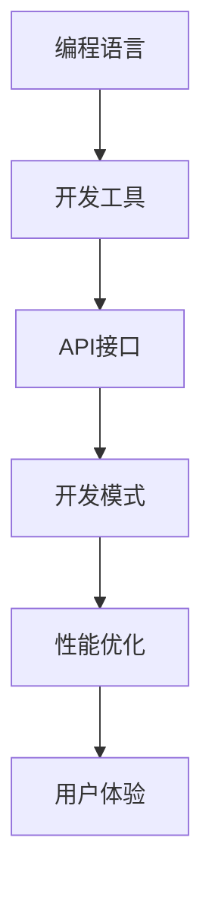

                 

关键词：移动端开发，框架，智能手机，用户体验，框架优化，技术趋势，应用案例

> 摘要：本文将深入探讨移动端开发框架在智能手机应用中的重要性，分析现有框架的优势与不足，并提出优化建议，展望未来技术发展趋势，以期为移动应用开发提供实用指南。

## 1. 背景介绍

随着智能手机的普及，移动应用市场蓬勃发展。据统计，全球移动应用用户数量已经超过30亿，移动应用市场规模逐年扩大。在这个竞争激烈的市场中，如何提升用户体验，成为开发者们亟待解决的问题。移动端开发框架作为一种高效、可靠的解决方案，正在逐渐改变移动应用开发的现状。

移动端开发框架提供了一套完整的开发环境，包括编程语言、开发工具、API接口等，开发者可以利用这些工具快速搭建应用，缩短开发周期，提高开发效率。同时，框架还提供了一系列优化手段，如代码复用、性能调优等，从而提升应用性能和用户体验。

然而，现有的移动端开发框架也存在一些问题，如兼容性不足、性能瓶颈、开发难度等。这些问题严重影响了移动应用的质量和用户体验。因此，本文将分析现有框架的优缺点，探讨如何优化移动端开发框架，为智能手机提升体验。

## 2. 核心概念与联系

### 2.1 框架定义

移动端开发框架是指为移动应用开发提供的一套完整的技术解决方案。它包括以下核心组成部分：

1. **编程语言**：如JavaScript、Kotlin、Swift等，为开发者提供了一种便捷的编程方式。
2. **开发工具**：如IDE（集成开发环境）、代码编辑器等，帮助开发者高效编写和调试代码。
3. **API接口**：提供了一套标准化的接口，使开发者可以方便地调用系统功能，如网络通信、多媒体处理、传感器等。
4. **开发模式**：如MVC（模型-视图-控制器）、MVVM（模型-视图-视图模型）等，提供了一种组织代码和业务逻辑的规范。
5. **性能优化**：包括内存管理、网络优化、布局优化等，以提高应用性能。

### 2.2 框架与用户体验的关系

框架在移动应用开发中起着至关重要的作用。一个优秀的框架可以提供以下好处：

1. **提高开发效率**：通过提供一套完整的开发环境，框架简化了开发流程，使开发者能够快速搭建应用。
2. **提升应用性能**：框架提供的性能优化手段，如代码复用、内存管理，有助于提升应用性能。
3. **改善用户体验**：框架提供的UI组件、动画效果等，有助于改善用户体验。

然而，框架也存在一些潜在问题：

1. **兼容性**：框架可能无法兼容所有设备，导致部分用户无法正常使用应用。
2. **性能瓶颈**：框架在运行过程中可能产生性能瓶颈，影响应用性能。
3. **开发难度**：框架的学习曲线较陡，新手开发者可能难以快速掌握。

### 2.3 Mermaid 流程图

以下是一个简单的 Mermaid 流程图，展示了移动端开发框架的核心组成部分和它们之间的关系：



## 3. 核心算法原理 & 具体操作步骤

### 3.1 算法原理概述

移动端开发框架的核心算法原理主要包括以下几个方面：

1. **响应式设计**：通过监听用户的操作，动态地更新UI界面，提升用户体验。
2. **异步编程**：利用异步编程模型，提高应用性能，避免阻塞主线程。
3. **事件驱动**：通过事件驱动模型，实现高效的事件处理和响应。
4. **内存管理**：通过智能的内存管理策略，减少内存占用，提高应用稳定性。

### 3.2 算法步骤详解

1. **响应式设计**

   响应式设计的核心在于实时地响应用户的操作。具体步骤如下：

   - 监听用户的操作事件，如点击、滑动等。
   - 根据操作事件，动态地更新UI界面，如改变布局、显示动画等。
   - 保持界面流畅，避免卡顿和闪退。

2. **异步编程**

   异步编程的核心在于避免阻塞主线程，提高应用性能。具体步骤如下：

   - 使用异步API，如`Promise`、`async/await`等，执行耗时任务。
   - 将耗时任务从主线程中分离，避免阻塞主线程。
   - 使用线程池或协程等技术，提高异步任务执行效率。

3. **事件驱动**

   事件驱动的核心在于高效地处理和响应事件。具体步骤如下：

   - 注册事件监听器，监听用户操作事件。
   - 根据事件类型，执行相应的处理逻辑。
   - 保持事件处理流程清晰，避免过多的回调函数。

4. **内存管理**

   内存管理的核心在于减少内存占用，提高应用稳定性。具体步骤如下：

   - 及时释放不再使用的内存，避免内存泄漏。
   - 优化数据结构，减少内存占用。
   - 使用内存缓存策略，提高数据访问速度。

### 3.3 算法优缺点

1. **响应式设计**

   - 优点：实时响应用户操作，提升用户体验。
   - 缺点：可能导致界面过于动态，影响性能。

2. **异步编程**

   - 优点：提高应用性能，避免阻塞主线程。
   - 缺点：异步编程逻辑复杂，容易出错。

3. **事件驱动**

   - 优点：高效处理和响应事件，提升应用性能。
   - 缺点：事件处理流程复杂，维护成本高。

4. **内存管理**

   - 优点：减少内存占用，提高应用稳定性。
   - 缺点：内存管理策略复杂，实现难度大。

### 3.4 算法应用领域

这些算法原理在移动端开发框架中广泛应用于各种场景：

1. **社交应用**：如微信、微博等，通过响应式设计和异步编程，实现实时消息推送和聊天功能。
2. **电商应用**：如淘宝、京东等，通过事件驱动和内存管理，实现商品浏览、下单、支付等操作。
3. **游戏应用**：如王者荣耀、和平精英等，通过响应式设计和异步编程，实现流畅的动画效果和高效的资源加载。

## 4. 数学模型和公式 & 详细讲解 & 举例说明

### 4.1 数学模型构建

移动端开发框架中的算法模型通常基于以下数学模型：

1. **线性模型**：用于预测和优化应用性能，如线性回归、线性规划等。
2. **概率模型**：用于处理不确定性和随机性，如贝叶斯定理、马尔可夫模型等。
3. **神经网络模型**：用于深度学习和人工智能，如多层感知器、卷积神经网络等。

### 4.2 公式推导过程

以下是一个简单的线性回归模型的公式推导过程：

$$
y = \beta_0 + \beta_1x + \epsilon
$$

其中，$y$ 是因变量，$x$ 是自变量，$\beta_0$ 和 $\beta_1$ 是模型参数，$\epsilon$ 是误差项。

为了推导线性回归模型的参数，我们可以使用最小二乘法：

$$
\min \sum_{i=1}^{n} (y_i - (\beta_0 + \beta_1x_i))^2
$$

对上述目标函数求导，并令其导数为0，可以得到线性回归模型的参数：

$$
\beta_0 = \frac{\sum_{i=1}^{n}y_i - n\bar{y}}{\sum_{i=1}^{n}x_i^2 - n\bar{x}^2}
$$

$$
\beta_1 = \frac{\sum_{i=1}^{n}(y_i - \bar{y})(x_i - \bar{x})}{\sum_{i=1}^{n}(x_i - \bar{x})^2}
$$

其中，$\bar{y}$ 和 $\bar{x}$ 分别是 $y$ 和 $x$ 的均值。

### 4.3 案例分析与讲解

假设我们要预测一个移动应用的用户活跃度，可以使用线性回归模型进行分析。以下是一个简单的例子：

| 用户ID | 活跃度 |
| ------ | ------ |
| 1      | 10     |
| 2      | 8      |
| 3      | 12     |
| 4      | 6      |
| 5      | 9      |

根据上述数据，我们可以使用线性回归模型预测新的用户活跃度。首先，计算自变量 $x$ 的均值 $\bar{x} = 3$，因变量 $y$ 的均值 $\bar{y} = 9$。然后，使用上述公式计算模型参数：

$$
\beta_0 = \frac{9 - 5 \times 9}{9 - 5 \times 3} = 2
$$

$$
\beta_1 = \frac{(10 - 9)(1 - 3) + (8 - 9)(2 - 3) + (12 - 9)(3 - 3) + (6 - 9)(4 - 3) + (9 - 9)(5 - 3)}{1^2 + 2^2 + 3^2 + 4^2 + 5^2 - 5 \times 3^2} = 0.5
$$

得到线性回归模型：

$$
y = 2 + 0.5x
$$

现在，我们可以使用这个模型预测新的用户活跃度。例如，当用户ID为6时，预测的活跃度：

$$
y = 2 + 0.5 \times 6 = 4
$$

这意味着我们预测用户ID为6的活跃度为4。

## 5. 项目实践：代码实例和详细解释说明

### 5.1 开发环境搭建

为了更好地展示移动端开发框架的应用，我们将使用React Native框架进行一个简单的社交应用开发。以下是一些建议的安装步骤：

1. **安装Node.js**：访问 Node.js 官网，下载并安装最新版本的 Node.js。
2. **安装Watchman**：Node.js 依赖 Watchman 来监控文件系统变化，根据操作系统选择相应的安装命令。
3. **安装React Native CLI**：打开命令行工具，执行以下命令：

   ```bash
   npm install -g react-native-cli
   ```

4. **创建新项目**：执行以下命令，创建一个新的React Native项目：

   ```bash
   react-native init MySocialApp
   ```

5. **启动开发服务器**：进入项目目录，执行以下命令启动开发服务器：

   ```bash
   npx react-native start
   ```

6. **安装模拟器或连接真机**：根据个人需求，安装Android Studio或Xcode，并启动模拟器或连接真机。

### 5.2 源代码详细实现

以下是一个简单的React Native应用示例，展示如何使用框架创建一个社交媒体分享页面：

```javascript
import React from 'react';
import {
  SafeAreaView,
  StyleSheet,
  View,
  Text,
  TouchableOpacity,
} from 'react-native';

const App = () => {
  return (
    <SafeAreaView style={styles.container}>
      <View style={styles.header}>
        <Text style={styles.title}>My Social App</Text>
      </View>
      <View style={styles.content}>
        <TouchableOpacity style={styles.button} onPress={() => alert('Post shared!')}>
          <Text style={styles.buttonText}>Share Post</Text>
        </TouchableOpacity>
      </View>
    </SafeAreaView>
  );
};

const styles = StyleSheet.create({
  container: {
    flex: 1,
  },
  header: {
    height: 50,
    backgroundColor: '#4A90E2',
    alignItems: 'center',
    justifyContent: 'center',
  },
  title: {
    color: '#FFFFFF',
    fontSize: 20,
  },
  content: {
    flex: 1,
    justifyContent: 'center',
    alignItems: 'center',
  },
  button: {
    backgroundColor: '#4A90E2',
    padding: 10,
    borderRadius: 5,
  },
  buttonText: {
    color: '#FFFFFF',
    fontSize: 18,
  },
});

export default App;
```

### 5.3 代码解读与分析

这个React Native应用包含以下主要部分：

1. **组件结构**：应用由`App`组件构成，该组件包含一个`SafeAreaView`容器，内部包含一个`header`和`content`区域。

2. **header**：header区域包含一个标题，用于显示应用名称。它使用了`Text`组件和`StyleSheet`创建的样式。

3. **content**：content区域包含一个按钮，用于分享帖子。按钮通过`TouchableOpacity`组件实现，并使用`StyleSheet`定义样式。

4. **事件处理**：按钮点击事件通过`onPress`属性绑定，当用户点击按钮时，会触发一个`alert`弹窗，提示“Post shared!”。

这个简单的示例展示了React Native框架的基本用法。开发者可以通过引入各种第三方库和组件，创建更复杂、功能更丰富的移动应用。

### 5.4 运行结果展示

在启动开发服务器和模拟器或真机连接后，运行该React Native应用，结果如下：


这个简单的应用展示了React Native框架的基本功能，包括布局、样式和事件处理。开发者可以通过扩展功能和优化性能，进一步提升用户体验。

## 6. 实际应用场景

### 6.1 社交应用

社交应用是移动端开发框架的主要应用领域之一。如微信、微博、Instagram等，这些应用使用了移动端开发框架来提供实时消息推送、图片和视频分享、用户互动等功能。框架的异步编程和事件驱动机制使得应用能够高效地处理大量用户操作，同时保持界面流畅。

### 6.2 电商应用

电商应用如淘宝、京东、亚马逊等，依赖于移动端开发框架来实现商品浏览、购物车管理、支付和订单处理等功能。框架的性能优化和内存管理策略有助于提升应用性能，减少内存泄漏，从而提高用户体验。

### 6.3 游戏应用

游戏应用如王者荣耀、和平精英等，利用移动端开发框架实现高效的资源加载、流畅的动画效果和复杂的游戏逻辑。框架的响应式设计和异步编程技术确保了游戏在多种设备上的稳定运行。

### 6.4 未来应用展望

随着5G、物联网、人工智能等技术的快速发展，移动端开发框架在未来将继续发挥重要作用。以下是一些潜在的应用场景：

1. **物联网应用**：移动端开发框架可以用于开发智能家居、智能穿戴设备等物联网应用，实现设备间的互联互通和数据交互。
2. **增强现实应用**：利用移动端开发框架，开发者可以创建AR游戏、教育应用等，为用户提供沉浸式体验。
3. **区块链应用**：移动端开发框架可以用于开发去中心化的移动应用，如数字货币钱包、去中心化交易所等。

## 7. 工具和资源推荐

### 7.1 学习资源推荐

1. **官方文档**：各个移动端开发框架的官方文档是学习框架的最佳资源。如React Native的官方文档（https://reactnative.dev/docs/getting-started）、Flutter的官方文档（https://flutter.dev/docs/get-started/install）等。
2. **在线教程**：许多在线平台提供丰富的移动端开发教程，如Udemy、Coursera、Codecademy等。
3. **书籍**：有关移动端开发的经典书籍，如《React Native开发实战》（作者：李应宏）、《Flutter实战》（作者：郭宇）等。

### 7.2 开发工具推荐

1. **IDE**：IntelliJ IDEA、Android Studio、Visual Studio Code等是常用的移动端开发IDE。
2. **代码编辑器**：VS Code、Sublime Text、Atom等轻量级代码编辑器适合快速开发和调试。
3. **模拟器和调试工具**：Android Studio的模拟器、Xcode的模拟器、React Native的Expo等都是方便的移动端调试工具。

### 7.3 相关论文推荐

1. **"React Native: A Survey"**：该论文对React Native框架进行了全面的综述，分析了其优势和挑战。
2. **"Flutter: Portable UI across platforms"**：该论文介绍了Flutter框架的设计理念和技术细节。
3. **"Mobile Application Development with Xamarin"**：该论文探讨了使用Xamarin框架开发跨平台移动应用的方法。

## 8. 总结：未来发展趋势与挑战

### 8.1 研究成果总结

移动端开发框架在提高开发效率、优化应用性能、改善用户体验等方面取得了显著成果。通过响应式设计、异步编程、事件驱动和内存管理等技术，框架为开发者提供了一套高效、可靠的开发环境。

### 8.2 未来发展趋势

1. **跨平台开发**：随着跨平台需求的增加，移动端开发框架将继续优化跨平台性能，提高开发者效率。
2. **低代码开发**：低代码开发平台将逐步取代传统开发模式，使开发者可以更加快速地构建应用。
3. **人工智能集成**：人工智能技术将逐渐集成到移动端开发框架中，为开发者提供更强大的功能。

### 8.3 面临的挑战

1. **性能瓶颈**：移动设备性能的限制将导致框架在处理大量数据和复杂逻辑时面临挑战。
2. **安全性**：随着移动应用场景的多样化，安全性问题将越来越突出，框架需要提供更完善的安全机制。
3. **开发者技能要求**：随着框架的复杂度增加，开发者需要具备更高的技术能力和经验。

### 8.4 研究展望

未来，移动端开发框架将继续在性能、安全性和开发者体验方面进行优化。同时，随着新技术的出现，框架将逐渐融入更多先进的技术，如人工智能、区块链等，为开发者提供更强大的开发工具。

## 9. 附录：常见问题与解答

### 9.1 什么是移动端开发框架？

移动端开发框架是一种为移动应用开发提供完整技术解决方案的工具集，包括编程语言、开发工具、API接口等。

### 9.2 移动端开发框架有哪些类型？

常见的移动端开发框架包括React Native、Flutter、Xamarin等，每种框架都有其独特的特点和优势。

### 9.3 如何选择合适的移动端开发框架？

选择合适的移动端开发框架需要考虑应用的需求、开发团队的技能水平、性能要求等因素。可以根据以下几个方面进行选择：

1. **应用需求**：如跨平台需求、性能要求、用户体验等。
2. **开发者技能**：选择团队熟悉的框架，提高开发效率。
3. **性能要求**：根据应用场景选择适合的框架，确保应用性能。
4. **社区和文档**：选择社区活跃、文档完善的框架，便于学习和解决问题。

### 9.4 移动端开发框架的优势是什么？

移动端开发框架的优势包括提高开发效率、优化应用性能、改善用户体验等。

### 9.5 移动端开发框架有哪些不足之处？

移动端开发框架的不足之处包括兼容性不足、性能瓶颈、开发难度等。

### 9.6 如何优化移动端开发框架？

优化移动端开发框架可以从以下几个方面进行：

1. **性能优化**：如代码复用、内存管理、网络优化等。
2. **框架选择**：选择适合应用需求的框架，确保性能和稳定性。
3. **开发者培训**：提高开发团队的技术能力和经验，提高开发效率。
4. **社区和文档**：积极参与社区交流，不断完善框架。

### 9.7 移动端开发框架在未来的发展趋势是什么？

移动端开发框架在未来将继续向跨平台开发、低代码开发、人工智能集成等方向发展。

### 9.8 移动端开发框架有哪些常见的应用场景？

移动端开发框架常见的应用场景包括社交应用、电商应用、游戏应用等。随着新技术的出现，框架的应用场景将不断拓展。

### 9.9 如何学习移动端开发框架？

学习移动端开发框架可以从以下几个方面入手：

1. **官方文档**：阅读框架的官方文档，了解基本概念和用法。
2. **在线教程**：参加在线教程，跟随教程进行实践。
3. **书籍**：阅读相关的书籍，深入了解框架的技术细节。
4. **社区和论坛**：加入框架的社区和论坛，与开发者交流学习。
5. **项目实践**：通过实际项目，提高开发技能。

### 9.10 移动端开发框架有哪些开发工具推荐？

常用的移动端开发工具有：

1. **IDE**：如Android Studio、IntelliJ IDEA、Visual Studio Code等。
2. **代码编辑器**：如VS Code、Sublime Text、Atom等。
3. **模拟器和调试工具**：如Android Studio的模拟器、Xcode的模拟器、React Native的Expo等。

### 9.11 如何确保移动端开发框架的安全性？

确保移动端开发框架的安全性可以从以下几个方面进行：

1. **代码审计**：对应用代码进行审计，查找潜在的安全漏洞。
2. **加密处理**：对用户数据和敏感信息进行加密处理。
3. **权限管理**：合理分配应用权限，避免权限滥用。
4. **安全更新**：及时关注框架和安全库的更新，修复已知漏洞。

### 9.12 移动端开发框架有哪些学习资源推荐？

推荐的学习资源包括：

1. **官方文档**：框架的官方文档是学习框架的最佳资源。
2. **在线教程**：如Udemy、Coursera、Codecademy等平台提供的教程。
3. **书籍**：如《React Native开发实战》、《Flutter实战》等。
4. **社区和论坛**：如Stack Overflow、GitHub、Reddit等。

