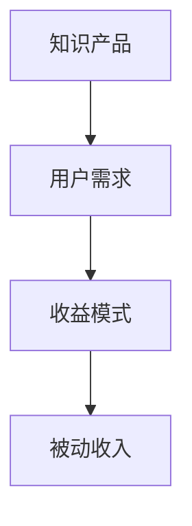

                 

在当今数字化时代，知识付费已经成为了程序员实现被动收入的一个重要途径。通过将自己的专业技能和经验转化为有价值的知识产品，程序员不仅可以为自己创造额外的收入，还可以提升个人品牌和市场影响力。本文将探讨程序员利用知识付费实现被动收入的几种方法，帮助您在技术领域中获得更多的收入来源。

## 关键词
- 程序员
- 被动收入
- 知识付费
- 个人品牌
- 技术分享

## 摘要
本文将介绍程序员如何利用知识付费实现被动收入的方法。我们将探讨知识付费的核心概念、不同类型的知识产品、实现知识付费的步骤，以及如何通过知识付费提升个人品牌和影响力。通过阅读本文，您将了解如何将自己的技能和经验转化为有价值的知识产品，并通过网络平台实现持续的收入增长。

## 1. 背景介绍
### 知识付费的概念
知识付费是指用户为获取特定知识或技能而支付的费用。在数字时代，随着互联网的普及和在线教育的兴起，知识付费逐渐成为一种主流的商业模式。程序员作为技术领域的重要角色，拥有丰富的专业知识和实践经验，可以通过知识付费实现被动收入。

### 被动收入的重要性
被动收入是指在不需持续投入时间和精力的情况下，通过某种方式获得的持续收入。对于程序员来说，被动收入不仅可以增加收入来源，还可以提高生活质量和职业自由度。通过知识付费实现被动收入，程序员可以在业余时间创作知识产品，而产品销售和收入将不受时间和地点的限制。

## 2. 核心概念与联系
### 知识付费的核心概念
知识付费的核心概念包括知识产品、用户需求、收益模式等。知识产品是指程序员创作的有价值的知识内容，如技术教程、编程书籍、在线课程等。用户需求是指市场对于特定知识产品的需求，收益模式是指通过何种方式将知识产品变现并获得收入。

### Mermaid 流程图


## 3. 核心算法原理 & 具体操作步骤
### 3.1 算法原理概述
知识付费的核心算法原理是将程序员的专业技能和经验转化为有价值的知识产品，并通过互联网平台实现销售和收益。这个过程包括以下几个关键步骤：

1. 确定知识产品类型：根据自身专业领域和市场需求，选择合适的知识产品类型。
2. 创作知识内容：编写教程、撰写书籍、制作课程等，确保内容质量和实用性。
3. 选择销售平台：选择合适的在线平台发布和销售知识产品。
4. 优化收益模式：通过多种方式提高知识产品的收益，如订阅、付费专栏、会员制等。

### 3.2 算法步骤详解
1. **确定知识产品类型**
   - 技术教程：针对编程语言、框架、数据库等编写详细教程。
   - 编程书籍：撰写系统化的编程知识书籍，分享编程经验和技巧。
   - 在线课程：制作视频教程，涵盖从入门到进阶的编程知识。

2. **创作知识内容**
   - 确保内容实用性：内容要贴近实际应用，提供解决问题的方案。
   - 保持内容更新：定期更新知识产品，保持内容的时效性和实用性。
   - 优化用户体验：提供清晰的教程结构、示例代码和练习题。

3. **选择销售平台**
   - 自建平台：搭建个人网站或博客，直接销售知识产品。
   - 在线教育平台：如网易云课堂、慕课网、极客时间等，这些平台有丰富的用户基础和完善的销售体系。
   - 社交媒体：利用社交媒体平台分享知识内容，吸引粉丝并转化为付费用户。

4. **优化收益模式**
   - 订阅制：用户支付一定费用后，可以无限次访问知识产品。
   - 付费专栏：定期发布高质量的文章或教程，用户付费阅读。
   - 会员制：提供专属的会员服务，如答疑解惑、在线讨论等。

### 3.3 算法优缺点
#### 优点
- **收益稳定**：知识产品一旦创作完成，可以持续带来被动收入。
- **自由度高**：程序员可以在业余时间创作知识产品，不受时间和地点限制。
- **价值提升**：通过知识付费，程序员可以提升个人品牌和市场价值。

#### 缺点
- **创作成本**：知识产品的创作需要时间和精力投入，成本较高。
- **市场竞争**：知识付费市场竞争激烈，需要高质量的内容才能脱颖而出。
- **收益周期**：知识产品的收益周期较长，需要一定时间积累用户和口碑。

### 3.4 算法应用领域
知识付费在程序员领域有广泛的应用，包括但不限于以下方面：

- **编程语言与框架**：针对特定编程语言或框架的知识产品，如Python教程、React教程等。
- **软件开发与项目管理**：分享软件开发流程、项目管理技巧的知识产品。
- **数据库与云计算**：介绍数据库技术、云计算架构和实践经验的知识产品。
- **人工智能与机器学习**：分享AI、ML领域的最新技术和发展趋势。

## 4. 数学模型和公式 & 详细讲解 & 举例说明
### 4.1 数学模型构建
知识付费的数学模型可以简化为以下公式：

\[ \text{收益} = \text{用户数量} \times \text{单价} \times \text{转化率} \]

其中，用户数量、单价和转化率是三个关键变量。

### 4.2 公式推导过程
\[ \text{收益} = \text{用户数量} \times \text{单价} \times \text{转化率} \]

1. 用户数量：取决于知识产品的受众范围和市场需求。
2. 单价：根据知识产品的内容和质量来确定。
3. 转化率：即用户从访客到购买者的转化比例，取决于营销策略和用户体验。

### 4.3 案例分析与讲解
以一位程序员撰写的《Python数据分析入门》书籍为例，该书籍定价为100元，每月销售1000本。假设转化率为10%，则该书籍的月收益为：

\[ \text{收益} = 1000 \times 100 \times 10\% = 10,000 \text{元} \]

如果通过优化营销策略，将转化率提升至20%，则月收益将增加一倍，达到20,000元。

## 5. 项目实践：代码实例和详细解释说明
### 5.1 开发环境搭建
对于编写编程教程的程序员来说，选择合适的开发环境至关重要。以下是一个简单的Python开发环境搭建步骤：

1. 安装Python：从官方网站下载Python安装包并安装。
2. 安装IDE：选择合适的IDE，如PyCharm、Visual Studio Code等。
3. 安装必要的库：使用pip命令安装所需库，如NumPy、Pandas等。

### 5.2 源代码详细实现
以下是一个简单的Python数据分析示例代码：

```python
import pandas as pd

# 读取数据
data = pd.read_csv('data.csv')

# 数据预处理
data = data.dropna()

# 数据分析
summary = data.describe()

# 数据可视化
data.plot(kind='line')
```

### 5.3 代码解读与分析
这段代码首先导入了pandas库，用于数据读取、预处理和分析。然后，从CSV文件中读取数据，进行数据预处理（如删除缺失值），接着使用描述性统计方法和可视化方法对数据进行分析。

### 5.4 运行结果展示
运行这段代码后，将生成一个包含描述性统计结果的DataFrame对象和一个线形图表，展示数据的变化趋势。

## 6. 实际应用场景
### 6.1 技术教程销售
程序员可以编写技术教程，如《深入理解Python》、《Vue.js从入门到精通》等，通过在线教育平台或个人网站销售，实现被动收入。

### 6.2 编程书籍出版
编写系统化的编程书籍，如《算法导论》、《设计模式》等，通过出版社或网络平台发行，获取版税收入。

### 6.3 在线课程制作
制作高质量的编程课程，如《Java从入门到实战》、《Python自动化测试》等，通过在线教育平台销售，实现持续收入。

### 6.4 未来应用展望
随着人工智能和大数据技术的发展，程序员可以利用这些技术，创作更具价值的技术知识产品，如《深度学习实战》、《大数据处理技术》等。

## 7. 工具和资源推荐
### 7.1 学习资源推荐
- 《流畅的Python》
- 《JavaScript高级程序设计》
- 《深度学习入门》

### 7.2 开发工具推荐
- PyCharm
- Visual Studio Code
- Git

### 7.3 相关论文推荐
- 《深度学习：本质与发展趋势》
- 《大数据技术导论》
- 《编程语言设计原则》

## 8. 总结：未来发展趋势与挑战
### 8.1 研究成果总结
本文介绍了程序员利用知识付费实现被动收入的几种方法，包括技术教程销售、编程书籍出版和在线课程制作等。通过知识付费，程序员可以提升个人品牌和市场价值，实现持续的收入增长。

### 8.2 未来发展趋势
未来，随着技术的不断进步和在线教育的发展，知识付费将呈现以下趋势：

- **内容多样化**：知识产品类型将更加丰富，包括视频、音频、直播等形式。
- **平台整合**：在线教育平台将提供更全面的工具和服务，助力程序员创作知识产品。
- **个性化推荐**：利用人工智能技术，平台将为用户提供个性化的知识推荐。

### 8.3 面临的挑战
知识付费在发展过程中也面临以下挑战：

- **市场竞争**：知识付费市场将越来越激烈，程序员需不断提高内容质量和创新能力。
- **版权保护**：保护知识产品的版权，防止盗版和侵权行为。
- **用户体验**：提高用户体验，提升用户满意度和忠诚度。

### 8.4 研究展望
未来，程序员可以结合人工智能、大数据等技术，创作更具价值的技术知识产品，满足市场需求。同时，研究者可以关注知识付费领域的商业模式、用户行为和收益模型等方面的研究，为知识付费的发展提供理论支持。

## 9. 附录：常见问题与解答
### 9.1 如何确定知识产品的类型？
首先，分析市场需求，了解用户需求；其次，结合自身专业优势和兴趣，选择合适的知识产品类型。

### 9.2 知识付费的收益模式有哪些？
常见的收益模式包括订阅制、付费专栏、会员制等。

### 9.3 如何提升知识产品的转化率？
通过提高内容质量、优化营销策略和提升用户体验来提升转化率。

### 9.4 知识付费市场有哪些平台？
常见的知识付费平台包括网易云课堂、慕课网、极客时间等。

---

本文由禅与计算机程序设计艺术 / Zen and the Art of Computer Programming 撰写，旨在为程序员提供利用知识付费实现被动收入的实用方法和建议。通过本文的介绍，希望您能够找到适合自己的知识付费之路，实现职业发展和收入增长的双重目标。

