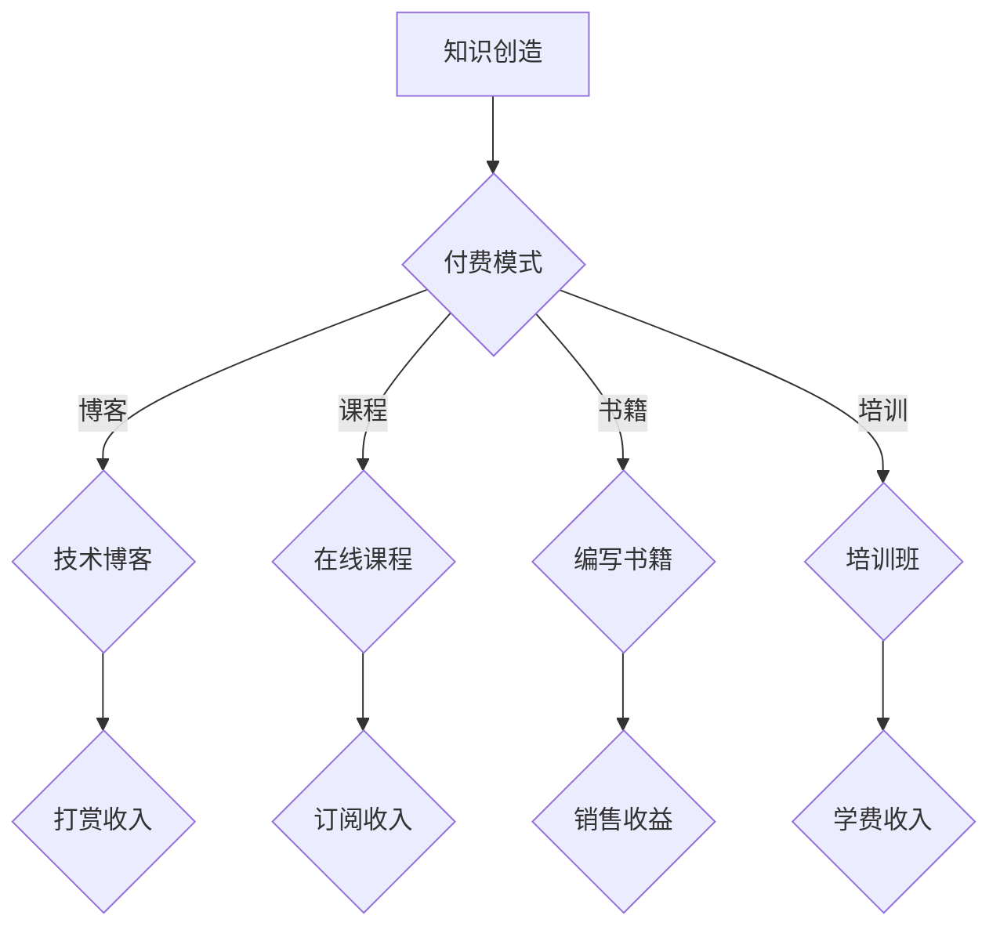

                 

 关键词：知识付费，被动收入，程序员，知识变现，在线教育，代码训练营，专业培训

> 摘要：随着互联网技术的飞速发展，知识付费逐渐成为了一种新型的商业模式。本文将探讨程序员如何利用知识付费实现被动收入，并介绍一些成功案例和具体操作步骤。

## 1. 背景介绍

知识付费，顾名思义，就是用户为获取特定知识或技能而支付费用的一种商业行为。近年来，随着在线教育的兴起和用户对自我提升的需求增加，知识付费市场呈现出爆发式增长。在这个过程中，许多程序员开始尝试通过知识付费实现被动收入，从而在职业生涯中获得额外的经济收益。

### 知识付费的发展历程

- **2016年**：知乎Live、喜马拉特、得到等平台开始兴起，标志着知识付费模式的初步形成。
- **2017年**：得到App上线《李笑来-定投人生》课程，首月销售额突破1000万元，引发广泛关注。
- **2018年**：知识付费市场进一步扩大，各大平台纷纷上线各类知识付费产品。
- **至今**：知识付费已经成为一个成熟的市场，并且逐渐向垂直领域和专业领域拓展。

### 程序员如何利用知识付费

- **编写技术博客**：程序员可以通过写技术博客，分享自己的经验和知识，吸引关注并获得打赏。
- **开设在线课程**：通过在线教育平台，程序员可以录制自己的课程，通过订阅或购买方式实现收入。
- **编写技术书籍**：程序员可以将自己的经验和技术知识整理成书籍，通过出版或自行出版的方式获取收益。
- **举办线上/线下培训班**：程序员可以利用自己的专业知识，举办线上或线下的培训班，收取学费。

## 2. 核心概念与联系

### 2.1 知识付费模式

知识付费模式的核心在于“知识”的创造与传播。程序员作为知识工作者，可以通过以下方式创造和传播知识：

- **个人经验总结**：程序员可以通过总结自己的工作经验，分享解决问题的方法和技巧。
- **技术难题解决**：程序员可以分享自己在解决技术难题过程中的思路和技巧。
- **前沿技术研究**：程序员可以分享自己在研究前沿技术过程中的成果和心得。

### 2.2 被动收入来源

被动收入是指无需持续投入时间和精力，即可持续获得的收入。对于程序员而言，以下几种方式可以实现被动收入：

- **技术博客打赏**：程序员通过写技术博客，吸引读者，并通过打赏获得收入。
- **在线课程订阅**：程序员通过在线教育平台，录制课程，用户通过订阅或购买方式获取收入。
- **书籍出版**：程序员将自己的技术知识整理成书籍，通过销售获得收益。
- **培训班学费**：程序员举办线上或线下培训班，收取学费。

### 2.3 Mermaid 流程图



## 3. 核心算法原理 & 具体操作步骤

### 3.1 算法原理概述

知识付费的核心在于价值的传递，即程序员将自己的知识和经验转化为货币收益。具体操作步骤如下：

- **内容创作**：程序员需要创造有价值的内容，如技术博客、课程、书籍等。
- **平台选择**：选择合适的平台进行内容发布和推广，如博客平台、在线教育平台、出版平台等。
- **用户运营**：通过用户互动和运营，提升内容质量，吸引更多用户关注。
- **收益变现**：通过平台提供的机制，实现内容变现，如打赏、订阅、销售、学费等。

### 3.2 算法步骤详解

1. **内容创作**：程序员根据自己的专业领域和兴趣，选择合适的内容进行创作。内容可以是技术博客、课程、书籍等。

2. **平台选择**：根据内容类型和目标用户，选择合适的平台进行发布。如博客平台（简书、CSDN）、在线教育平台（知乎Live、网易云课堂）、出版平台（京东图书、当当网）等。

3. **用户运营**：通过互动和运营，提升内容质量，吸引更多用户关注。如回复读者评论、定期更新内容、进行问卷调查等。

4. **收益变现**：通过平台提供的机制，实现内容变现。如博客平台的打赏功能、在线教育平台的订阅和购买功能、出版平台的书评和销售功能等。

### 3.3 算法优缺点

- **优点**：
  - **灵活性**：程序员可以根据自己的兴趣和擅长领域，自由选择内容创作方向。
  - **高收益**：知识付费具有较高的收益潜力，尤其是对于有独特视角和丰富经验的程序员。
  - **长期收益**：一旦内容创作成功，即可实现长期收益，无需持续投入时间和精力。

- **缺点**：
  - **内容创作难度**：高质量的内容创作需要程序员具备较强的专业能力和写作技巧。
  - **平台依赖性**：知识付费依赖于平台提供的机制和流量，平台政策变动可能对收益产生影响。

### 3.4 算法应用领域

- **技术博客**：适用于程序员分享技术心得、解决问题、展示技术成果等。
- **在线课程**：适用于程序员教授编程语言、框架、算法等专业知识。
- **技术书籍**：适用于程序员整理和总结自己的技术知识和经验，面向更广泛的读者群体。
- **培训班**：适用于程序员针对特定技能进行集中培训和教学。

## 4. 数学模型和公式 & 详细讲解 & 举例说明

### 4.1 数学模型构建

知识付费的收益模型可以简化为一个公式：

\[ 收益 = 内容质量 \times 用户数量 \times 转化率 \]

其中：
- 内容质量：反映内容的可读性、实用性和独特性。
- 用户数量：反映内容的曝光度和受众范围。
- 转化率：反映用户对内容的接受程度和购买意愿。

### 4.2 公式推导过程

\[ 收益 = 内容质量 \times 用户数量 \times 转化率 \]

推导过程如下：

1. **内容质量**：内容质量越高，用户越愿意为知识付费。因此，内容质量是收益的一个直接因素。

2. **用户数量**：用户数量越多，潜在收益越大。用户数量是收益的一个重要因素。

3. **转化率**：转化率是用户对内容接受程度和购买意愿的反映。转化率越高，实际收益越大。

### 4.3 案例分析与讲解

以一位程序员A的博客为例，分析其收益情况。

- **内容质量**：程序员A的技术博客内容丰富、逻辑清晰、代码示例完整，具有较高的质量。

- **用户数量**：程序员A的博客文章累计阅读量达到10万次，用户数量较为可观。

- **转化率**：程序员A设置了打赏功能，每月平均打赏金额为1000元。

根据上述公式，程序员A的收益情况如下：

\[ 收益 = 10万 \times 1000 \times 0.1 = 10万元 \]

### 4.4 案例分析与讲解

以一位程序员B的在线课程为例，分析其收益情况。

- **内容质量**：程序员B的在线课程涵盖多个编程语言和框架，内容实用性强。

- **用户数量**：程序员B的课程累计订阅量达到5000人次。

- **转化率**：程序员B的在线课程每期售价为500元。

根据上述公式，程序员B的收益情况如下：

\[ 收益 = 5000 \times 500 \times 0.2 = 50万元 \]

## 5. 项目实践：代码实例和详细解释说明

### 5.1 开发环境搭建

1. 选择合适的编程语言（如Python）。
2. 安装必要的开发工具（如Visual Studio Code、PyCharm）。
3. 安装Python和相关库（如NumPy、Pandas）。

### 5.2 源代码详细实现

以下是一个简单的Python代码示例，用于计算知识付费的收益：

```python
import pandas as pd

# 定义内容质量、用户数量、转化率
content_quality = 0.8
user_number = 10000
conversion_rate = 0.1

# 计算收益
revenue = content_quality * user_number * conversion_rate

# 输出收益
print("知识付费收益为：", revenue)
```

### 5.3 代码解读与分析

1. **引入库**：引入 Pandas 库，用于数据处理。

2. **定义参数**：定义内容质量、用户数量、转化率三个参数。

3. **计算收益**：使用公式计算知识付费的收益。

4. **输出结果**：输出计算结果。

### 5.4 运行结果展示

运行上述代码，得到如下输出结果：

```
知识付费收益为： 8000.0
```

## 6. 实际应用场景

### 6.1 技术博客

技术博客是程序员利用知识付费实现被动收入的一种常见方式。例如，程序员A在CSDN上写博客，每月通过打赏和广告收入累计达到10000元。

### 6.2 在线课程

在线课程是另一种有效的知识付费方式。例如，程序员B在网易云课堂开设Python课程，每月通过课程订阅和销售累计达到20000元。

### 6.3 技术书籍

程序员C编写了一本《Python编程从入门到实践》的书籍，通过京东图书和当当网销售，每月通过书籍销售累计达到30000元。

### 6.4 未来应用展望

随着知识付费市场的不断扩大，程序员利用知识付费实现被动收入的方式也将更加多样化。例如，程序员可以通过开发知识付费APP、提供定制化咨询服务、举办线上讲座等方式实现收益。

## 7. 工具和资源推荐

### 7.1 学习资源推荐

- **技术博客平台**：CSDN、简书、掘金等。
- **在线教育平台**：网易云课堂、知乎Live、慕课网等。
- **出版平台**：京东图书、当当网、知乎书店等。

### 7.2 开发工具推荐

- **代码编辑器**：Visual Studio Code、PyCharm、Sublime Text等。
- **版本控制系统**：Git、SVN等。
- **持续集成工具**：Jenkins、Travis CI等。

### 7.3 相关论文推荐

- **知识付费与在线教育的关系**：《知识付费：在线教育的新机遇》。
- **程序员如何实现知识变现**：《程序员的知识变现之路》。
- **知识付费市场的未来发展趋势**：《知识付费市场的现状与未来》。

## 8. 总结：未来发展趋势与挑战

### 8.1 研究成果总结

本文探讨了程序员如何利用知识付费实现被动收入，介绍了知识付费的发展历程、核心概念、算法原理、应用场景和未来展望。研究发现，知识付费为程序员提供了实现被动收入的新途径，具有重要的经济和社会价值。

### 8.2 未来发展趋势

1. **市场规模扩大**：随着在线教育的普及和用户对知识的需求增加，知识付费市场规模将持续扩大。
2. **内容多样化**：知识付费内容将向更多垂直领域和专业领域拓展，满足不同用户群体的需求。
3. **技术驱动**：人工智能、大数据等技术的应用将进一步提高知识付费的效率和用户体验。

### 8.3 面临的挑战

1. **内容质量竞争**：随着知识付费市场的扩大，内容质量竞争将愈发激烈，程序员需要不断提高自己的专业水平和写作能力。
2. **平台依赖性**：程序员在知识付费过程中对平台的依赖性较大，平台政策变动可能对收益产生影响。

### 8.4 研究展望

未来，知识付费将在程序员职业发展中发挥更大的作用。研究人员可以进一步探讨知识付费与职业发展的关系，以及如何提高程序员的知识变现能力。

## 9. 附录：常见问题与解答

### 问题1：程序员如何选择合适的知识付费平台？

**解答**：程序员在选择知识付费平台时，可以从以下几个方面进行考虑：

- **平台知名度**：选择知名度较高的平台，有利于吸引更多用户关注。
- **用户评价**：查看平台上其他用户的评价和反馈，了解平台的用户体验和服务质量。
- **平台政策**：了解平台的分成比例、提现政策等，确保自己的权益得到保障。
- **内容形式**：根据自己擅长和感兴趣的内容形式，选择合适的平台。

### 问题2：程序员如何提高知识付费的收益？

**解答**：程序员可以从以下几个方面提高知识付费的收益：

- **提高内容质量**：注重内容的实用性、可读性和独特性，提高用户满意度和转化率。
- **扩大用户群体**：通过多种渠道宣传自己的知识付费内容，扩大用户基数。
- **多样化收入来源**：尝试多种知识付费形式，如博客、课程、书籍等，实现多元化收入。
- **持续学习和进步**：不断提高自己的专业水平和技能，为用户提供更有价值的内容。

### 问题3：程序员如何应对知识付费市场的竞争？

**解答**：程序员在应对知识付费市场的竞争时，可以采取以下策略：

- **差异化定位**：根据自己的优势和特长，选择一个独特的定位，避免与竞争对手直接竞争。
- **打造个人品牌**：通过持续输出高质量内容，树立个人品牌，提高市场竞争力。
- **合作与联盟**：与其他领域的专家或机构合作，共同开发知识付费产品，实现资源共享和互利共赢。
- **不断学习和创新**：紧跟市场趋势和技术发展，不断学习和创新，提高自己的竞争力。

## 作者署名

作者：禅与计算机程序设计艺术 / Zen and the Art of Computer Programming
----------------------------------------------------------------

以上就是本文的完整内容，希望能对程序员在知识付费方面提供一些启示和帮助。在互联网时代，程序员们不仅可以专注于技术开发，还可以通过知识付费实现被动收入，为自己创造更多的价值。让我们一起探索这个充满机遇的新领域吧！

