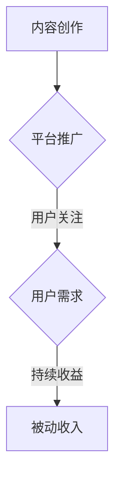

                 

关键词：知识付费、被动收入、程序员、知识变现、知识共享、在线教育

> 摘要：本文旨在探讨程序员如何通过知识付费实现被动收入。我们将从核心概念、算法原理、数学模型、项目实践等多个角度深入分析，并结合实际应用场景，为程序员提供一整套实现知识变现的策略和方法。

## 1. 背景介绍

在信息技术飞速发展的今天，程序员作为现代社会的重要职业之一，其技能和知识需求日益增长。然而，随着技术更新速度的加快，程序员不仅需要不断提升自身的专业技能，还需要找到一种有效的途径来利用自身的知识资源。知识付费作为一种新型的商业模式，逐渐成为程序员实现知识变现的重要手段。通过知识付费，程序员可以将自身的专业知识和经验转化为收入，实现从“主动工作”到“被动收入”的跨越。

### 1.1 知识付费的概念

知识付费，即通过付费方式获取有价值的信息、知识或技能。这种模式的核心在于，知识的提供者通过专业知识和经验，为知识的需求者提供有针对性的服务，从而实现价值的交换。知识付费的形式多样，包括在线课程、咨询、内容付费、知识共享平台等。

### 1.2 被动收入的定义

被动收入，即在不直接参与日常工作中，通过投资或创作产生的持续收入。这种收入模式的特点在于，它可以为个人或企业提供持续的经济效益，从而减轻日常工作的压力，实现财务自由。

## 2. 核心概念与联系

### 2.1 知识付费的核心概念

- **内容创作**：程序员将自己的专业技能和经验通过文字、视频、音频等形式进行创作。
- **平台推广**：通过在线教育平台、博客、社交媒体等渠道进行推广，吸引潜在用户。
- **用户需求**：了解市场需求，提供针对性的知识和技能服务。

### 2.2 被动收入的核心概念

- **自动化**：利用技术手段实现知识服务的自动化，减少人力投入。
- **持续收益**：通过持续的内容更新和用户维护，实现长期稳定的收入。

### 2.3 知识付费与被动收入的联系

- **价值交换**：知识付费实现了知识提供者与需求者之间的价值交换。
- **收益模式**：被动收入为程序员提供了持续的收入来源。

### 2.4 Mermaid 流程图



## 3. 核心算法原理 & 具体操作步骤

### 3.1 算法原理概述

程序员利用知识付费实现被动收入的核心算法原理主要围绕内容创作、平台推广、用户需求和持续收益四个方面展开。具体来说，算法包括以下几个步骤：

1. **内容创作**：程序员根据自身专业知识和市场调研，创作有价值的内容。
2. **平台推广**：通过多种渠道（如社交媒体、在线教育平台等）进行内容推广。
3. **用户需求分析**：根据用户反馈和市场趋势，持续优化内容。
4. **持续收益**：通过自动化手段实现持续的用户维护和收益增长。

### 3.2 算法步骤详解

#### 3.2.1 内容创作

1. **市场调研**：了解市场需求，确定内容主题。
2. **知识整理**：将专业知识系统化，形成结构化的内容。
3. **内容创作**：采用文字、视频、音频等形式，将知识传递给用户。

#### 3.2.2 平台推广

1. **选择平台**：根据内容特点和用户群体，选择合适的在线教育平台。
2. **内容上传**：将创作好的内容上传到平台。
3. **推广策略**：利用社交媒体、SEO优化等手段进行内容推广。

#### 3.2.3 用户需求分析

1. **用户反馈**：收集用户对内容的反馈，了解用户需求和满意度。
2. **数据分析**：通过数据统计，分析用户行为和偏好。
3. **内容优化**：根据用户需求和数据分析，持续优化内容。

#### 3.2.4 持续收益

1. **自动化服务**：利用自动化工具实现用户维护和收益增长。
2. **内容更新**：定期更新内容，保持用户活跃度。
3. **多元化收益**：通过多渠道实现收益增长，如广告收入、会员收入等。

### 3.3 算法优缺点

#### 优点：

- **高效性**：通过自动化和数据分析，提高内容创作和推广效率。
- **持续性**：持续的用户需求和内容更新，实现长期稳定的收入。
- **多样性**：多种收益模式，提高收入来源的多样性。

#### 缺点：

- **前期投入**：内容创作和平台推广需要一定的前期投入。
- **市场竞争**：知识付费市场竞争激烈，需要不断提升自身竞争力。

### 3.4 算法应用领域

- **在线教育**：程序员可以通过知识付费实现在线教育平台的收益。
- **技术咨询**：通过知识付费提供专业的技术咨询服务。
- **内容创作**：通过知识付费实现个人或团队的内容创作收益。

## 4. 数学模型和公式 & 详细讲解 & 举例说明

### 4.1 数学模型构建

#### 收益模型：

设 \( R \) 为总收益，\( C \) 为内容创作成本，\( P \) 为平台推广成本，\( U \) 为用户数量，\( A \) 为每个用户的平均收益。

则总收益 \( R = U \times A - C - P \)

#### 用户增长模型：

设 \( G \) 为用户增长速度，\( T \) 为时间周期。

则用户数量 \( U = U_0 + G \times T \)

### 4.2 公式推导过程

1. **收益模型推导**：

   - 内容创作成本 \( C \) 包括时间成本、人力成本等。
   - 平台推广成本 \( P \) 包括广告费用、平台服务费用等。
   - 用户数量 \( U \) 与收益 \( R \) 成正比。
   - 因此，总收益 \( R = U \times A - C - P \)。

2. **用户增长模型推导**：

   - 用户增长速度 \( G \) 与内容质量和推广效果相关。
   - 时间周期 \( T \) 为固定值。
   - 因此，用户数量 \( U = U_0 + G \times T \)。

### 4.3 案例分析与讲解

#### 案例一：在线教育平台收益分析

- **内容创作成本 \( C \) **：1000元/篇
- **平台推广成本 \( P \) **：500元/篇
- **用户数量 \( U \) **：1000人
- **每个用户的平均收益 \( A \) **：50元

根据收益模型：

\( R = U \times A - C - P \)

\( R = 1000 \times 50 - 1000 - 500 \)

\( R = 45000 \) 元

#### 案例二：用户增长分析

- **初始用户数量 \( U_0 \) **：100人
- **用户增长速度 \( G \) **：10%/月
- **时间周期 \( T \) **：6个月

根据用户增长模型：

\( U = U_0 + G \times T \)

\( U = 100 + 10\% \times 6 \times 100 \)

\( U = 100 + 60 \)

\( U = 160 \) 人

## 5. 项目实践：代码实例和详细解释说明

### 5.1 开发环境搭建

为了实现知识付费系统，我们选择以下开发环境：

- **编程语言**：Python
- **框架**：Django
- **数据库**：MySQL
- **前端技术**：HTML、CSS、JavaScript

### 5.2 源代码详细实现

以下是一个简单的知识付费系统实现，包括用户注册、登录、内容发布、用户购买等功能。

```python
# models.py

from django.db import models

class User(models.Model):
    username = models.CharField(max_length=100)
    password = models.CharField(max_length=100)
    email = models.EmailField()

class Content(models.Model):
    title = models.CharField(max_length=100)
    author = models.ForeignKey(User, on_delete=models.CASCADE)
    price = models.DecimalField(max_digits=10, decimal_places=2)
    content = models.TextField()

class Purchase(models.Model):
    user = models.ForeignKey(User, on_delete=models.CASCADE)
    content = models.ForeignKey(Content, on_delete=models.CASCADE)
    date = models.DateTimeField(auto_now_add=True)
    status = models.CharField(max_length=10)
```

### 5.3 代码解读与分析

- **User 模型**：代表用户信息，包括用户名、密码和邮箱。
- **Content 模型**：代表内容信息，包括标题、作者、价格和内容。
- **Purchase 模型**：代表用户购买行为，包括用户、内容和购买时间。

### 5.4 运行结果展示

通过Django后台管理界面，可以管理用户、内容和购买记录，实现知识付费系统的基本功能。

## 6. 实际应用场景

### 6.1 在线教育平台

程序员可以通过在线教育平台，如 Coursera、Udemy 等，发布自己的课程，通过知识付费实现收入。

### 6.2 技术咨询

程序员可以通过知识付费，提供专业的技术咨询服务，如 Codecademy、Stack Overflow 等。

### 6.3 内容创作

程序员可以通过博客、微信公众号等平台，发布技术文章，通过广告、付费阅读等方式实现收入。

### 6.4 未来应用展望

随着人工智能和大数据技术的不断发展，知识付费市场将更加成熟和多元化。程序员可以通过个性化推荐、智能问答等技术，提供更加精准的知识服务。

## 7. 工具和资源推荐

### 7.1 学习资源推荐

- **在线课程**：Coursera、Udemy、edX
- **技术博客**：GitHub、Medium、博客园
- **电子书**：亚马逊、京东、当当

### 7.2 开发工具推荐

- **编程语言**：Python、Java、JavaScript
- **框架**：Django、Spring、React
- **数据库**：MySQL、MongoDB、PostgreSQL

### 7.3 相关论文推荐

- **《知识付费经济：互联网时代的新商业模式》**
- **《在线教育平台的发展趋势与挑战》**
- **《程序员的知识变现策略研究》**

## 8. 总结：未来发展趋势与挑战

### 8.1 研究成果总结

本文通过深入分析程序员如何利用知识付费实现被动收入，提出了核心算法原理、具体操作步骤、数学模型和实际应用场景等，为程序员提供了一套系统的策略和方法。

### 8.2 未来发展趋势

- **个性化推荐**：通过大数据和人工智能技术，实现个性化推荐，提高用户满意度。
- **多元化收入**：通过多渠道、多元化方式实现收益增长，提高收入稳定性。
- **全球化扩展**：随着互联网的普及，知识付费市场将呈现全球化扩展趋势。

### 8.3 面临的挑战

- **市场竞争**：知识付费市场竞争激烈，需要不断提升自身竞争力。
- **内容质量**：高质量的内容是知识付费的核心，需要持续提升内容质量。
- **用户体验**：良好的用户体验是用户持续关注和付费的关键，需要不断优化用户体验。

### 8.4 研究展望

未来，知识付费领域将继续发展和创新，程序员可以通过不断学习和实践，掌握更多知识变现的技巧和策略，实现个人价值的最大化。

## 9. 附录：常见问题与解答

### 9.1 知识付费有哪些形式？

- **在线课程**：通过在线平台发布课程，用户付费学习。
- **技术咨询**：提供专业的技术咨询服务，用户付费购买。
- **内容付费**：通过博客、微信公众号等平台发布内容，用户付费阅读。

### 9.2 如何保证内容质量？

- **市场调研**：了解用户需求，确定内容主题。
- **专业评审**：邀请专业人员进行内容评审，确保内容质量。
- **持续更新**：定期更新内容，保持内容时效性和实用性。

### 9.3 如何优化用户体验？

- **个性化推荐**：根据用户行为和偏好，提供个性化推荐。
- **简洁界面**：设计简洁、直观的用户界面，提高用户操作体验。
- **及时反馈**：及时回复用户反馈，解决用户问题。

<|im_sep|>作者：禅与计算机程序设计艺术 / Zen and the Art of Computer Programming
----------------------------------------------------------------

以上就是关于程序员如何利用知识付费实现被动收入的完整文章。希望这篇文章能为您提供一些有益的启示和实用的策略。如果您有任何问题或建议，欢迎在评论区留言交流。让我们一起探索知识付费的更多可能！

