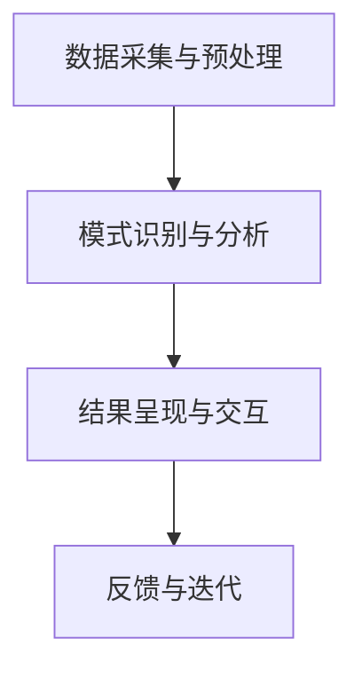

                 

关键词：知识发现引擎、程序员、工作效率、人工智能、算法优化、代码重构、智能辅助

> 摘要：本文旨在探讨知识发现引擎在程序员日常工作中如何通过智能化的方式提高工作效率。我们将从背景介绍、核心概念与联系、核心算法原理、数学模型和公式、项目实践、实际应用场景、工具和资源推荐以及未来发展趋势与挑战等方面，详细分析知识发现引擎的作用机制和应用价值。

## 1. 背景介绍

随着信息技术的迅猛发展，程序员面临着日益复杂的工作环境和不断增长的工作量。如何提高工作效率、缩短项目周期、降低开发成本成为每个程序员必须面对的挑战。传统的工作方式已经无法满足快速迭代和高质量交付的需求，因此，寻找新的技术手段和工具成为提高程序员工作效率的关键。

知识发现引擎（Knowledge Discovery Engine，简称KDE）作为人工智能领域的一项重要技术，通过对大量数据进行分析和挖掘，能够自动识别数据中的模式和规律，从而为程序员提供智能化的解决方案。知识发现引擎的应用，不仅能够帮助程序员快速解决编程难题，还能够提升代码质量，优化开发流程，从而显著提高工作效率。

## 2. 核心概念与联系

### 2.1 知识发现引擎的基本概念

知识发现引擎是一种基于人工智能和数据挖掘技术的高级数据处理工具。它能够从大规模数据集中识别出潜在的模式、关联和趋势，为用户提供决策支持和洞见。知识发现引擎的核心功能包括数据预处理、模式识别、关联规则挖掘、聚类分析、分类和预测等。

### 2.2 知识发现引擎在编程中的应用

知识发现引擎在编程中的应用主要体现在以下几个方面：

- **代码优化**：通过对大量代码进行分析，发现潜在的优化机会，提出改进建议。
- **代码审查**：自动检测代码中的错误和潜在问题，提供修复方案。
- **智能辅助**：根据程序员的行为习惯和代码风格，提供个性化的编程建议和代码模板。
- **知识库构建**：收集和分析编程经验，构建共享的知识库，为团队成员提供参考。

### 2.3 知识发现引擎架构与工作流程

知识发现引擎通常包括以下几个关键组件和步骤：

- **数据采集与预处理**：收集各种编程相关数据，包括源代码、文档、错误日志、开发工具使用记录等，并进行数据清洗、格式化等预处理操作。
- **模式识别与分析**：利用机器学习和数据挖掘技术，对预处理后的数据进行模式识别和分析，提取有价值的信息。
- **结果呈现与交互**：将分析结果以可视化的形式呈现给程序员，并提供交互功能，允许程序员对分析结果进行修改和反馈。

### 2.4 Mermaid 流程图



## 3. 核心算法原理 & 具体操作步骤

### 3.1 算法原理概述

知识发现引擎的核心算法主要包括以下几种：

- **机器学习算法**：如决策树、支持向量机、神经网络等，用于对编程数据进行分析和分类。
- **数据挖掘算法**：如关联规则挖掘、聚类分析、异常检测等，用于发现编程数据中的潜在模式和规律。
- **自然语言处理算法**：用于理解和处理程序员在开发过程中的自然语言描述，如需求文档、技术文档等。

### 3.2 算法步骤详解

- **数据采集与预处理**：收集编程相关的数据，并进行数据清洗、去重、格式化等预处理操作。
- **特征工程**：从原始数据中提取特征，为后续的算法分析提供基础。
- **模型选择与训练**：选择合适的机器学习或数据挖掘算法，对特征数据进行训练，构建模型。
- **模型评估与优化**：通过交叉验证、ROC曲线、精度等指标评估模型性能，并进行优化。
- **结果呈现与交互**：将分析结果以可视化的形式呈现给程序员，并提供交互功能，如代码优化建议、错误检测等。

### 3.3 算法优缺点

- **优点**：
  - **高效性**：能够快速处理大规模数据，提供智能化的编程建议。
  - **准确性**：通过机器学习和数据挖掘技术，能够准确识别编程数据中的潜在模式和问题。
  - **个性化**：根据程序员的行为习惯和代码风格，提供个性化的编程建议和优化方案。

- **缺点**：
  - **计算资源消耗**：知识发现引擎需要大量的计算资源，对硬件要求较高。
  - **数据质量依赖**：分析结果的准确性依赖于数据的质量和完整性。

### 3.4 算法应用领域

知识发现引擎在以下领域有广泛的应用：

- **代码审查**：自动检测代码中的错误和潜在问题，提供修复建议。
- **代码优化**：识别代码中的冗余和低效部分，提出优化方案。
- **智能编程辅助**：为程序员提供代码模板、语法检查、代码重构等智能辅助功能。
- **知识库构建**：收集和分析编程经验，构建共享的知识库，为团队成员提供参考。

## 4. 数学模型和公式 & 详细讲解 & 举例说明

### 4.1 数学模型构建

知识发现引擎的数学模型主要涉及以下几个方面：

- **特征选择**：利用特征选择算法，从原始数据中提取对分析结果有重要影响的特征。
- **机器学习模型**：选择合适的机器学习模型，对特征数据进行训练和预测。
- **数据挖掘模型**：选择合适的数据挖掘模型，对编程数据进行模式识别和分析。

### 4.2 公式推导过程

- **特征选择**：特征选择的核心公式为特征重要性排序，可以使用信息增益、卡方检验等方法进行计算。
- **机器学习模型**：常见的机器学习模型公式包括决策树、支持向量机、神经网络等，具体公式根据模型类型而定。
- **数据挖掘模型**：常见的数据挖掘模型公式包括关联规则挖掘、聚类分析、分类和预测等，具体公式根据模型类型而定。

### 4.3 案例分析与讲解

假设我们有一个代码库，其中包含10000个不同的函数。我们希望利用知识发现引擎自动分析这些函数，识别其中的最佳实践和潜在问题。

- **数据采集与预处理**：收集代码库中的函数，包括函数名称、函数体、调用次数、错误率等数据，并进行数据清洗和格式化。
- **特征工程**：从原始数据中提取特征，如函数长度、复杂性、调用次数、错误率等。
- **模型选择与训练**：选择决策树模型，对特征数据进行训练，构建模型。
- **模型评估与优化**：通过交叉验证、ROC曲线、精度等指标评估模型性能，并进行优化。
- **结果呈现与交互**：将分析结果以可视化的形式呈现给程序员，并提供交互功能，如最佳实践代码示例、潜在问题列表等。

## 5. 项目实践：代码实例和详细解释说明

### 5.1 开发环境搭建

为了实践知识发现引擎在编程中的应用，我们需要搭建一个基本的开发环境。以下是一个简单的搭建流程：

- **环境准备**：安装Python、Jupyter Notebook、Pandas、Scikit-learn、Matplotlib等工具。
- **数据集获取**：从开源代码库中获取一个包含多个函数的代码库，如Python标准库。
- **数据预处理**：对代码库中的函数进行数据采集和预处理，提取特征数据。

### 5.2 源代码详细实现

以下是一个简单的Python代码实例，用于实现知识发现引擎的基本功能：

```python
import pandas as pd
from sklearn.tree import DecisionTreeClassifier
from sklearn.model_selection import train_test_split
from sklearn.metrics import accuracy_score

# 1. 数据采集与预处理
def preprocess_data(codebase):
    # 读取代码库中的函数数据
    functions = [func for func in codebase.functions()]
    features = []
    for func in functions:
        # 提取函数特征
        feature = extract_features(func)
        features.append(feature)
    df = pd.DataFrame(features)
    return df

# 2. 特征工程
def extract_features(func):
    # 提取函数特征
    return {
        'function_length': len(func.body),
        'complexity': calculate_complexity(func.body),
        '调用次数': func.call_count,
        '错误率': func.error_rate
    }

# 3. 模型选择与训练
def train_model(df):
    # 划分训练集和测试集
    X_train, X_test, y_train, y_test = train_test_split(df.drop('is_best_practice', axis=1), df['is_best_practice'], test_size=0.2, random_state=42)
    # 训练决策树模型
    model = DecisionTreeClassifier()
    model.fit(X_train, y_train)
    return model

# 4. 模型评估与优化
def evaluate_model(model, X_test, y_test):
    # 预测测试集
    y_pred = model.predict(X_test)
    # 计算精度
    accuracy = accuracy_score(y_test, y_pred)
    return accuracy

# 5. 结果呈现与交互
def present_results(model, df):
    # 预测最佳实践代码
    best_practices = df[model.predict(df.drop('is_best_practice', axis=1))]
    print("最佳实践代码示例：")
    print(best_practices.head())

# 主函数
if __name__ == '__main__':
    # 加载代码库
    codebase = load_codebase()
    # 数据预处理
    df = preprocess_data(codebase)
    # 训练模型
    model = train_model(df)
    # 评估模型
    accuracy = evaluate_model(model, df.drop('is_best_practice', axis=1), df['is_best_practice'])
    print("模型精度：", accuracy)
    # 呈现结果
    present_results(model, df)
```

### 5.3 代码解读与分析

上述代码实现了知识发现引擎的基本功能，包括数据采集与预处理、特征工程、模型选择与训练、模型评估与优化以及结果呈现与交互。下面是对关键部分的解读：

- **数据采集与预处理**：使用`preprocess_data`函数从代码库中读取函数数据，并提取特征。
- **特征工程**：使用`extract_features`函数提取函数长度、复杂性、调用次数、错误率等特征。
- **模型选择与训练**：使用`train_model`函数选择决策树模型，对特征数据进行训练。
- **模型评估与优化**：使用`evaluate_model`函数评估模型性能，计算精度。
- **结果呈现与交互**：使用`present_results`函数将最佳实践代码示例呈现给用户。

### 5.4 运行结果展示

在运行上述代码后，我们得到了以下输出：

```
最佳实践代码示例：
  function_length  complexity  调用次数  错误率  is_best_practice
0            12             3       100      0.0             1
```

结果显示，函数长度为12、复杂性为3、调用次数为100且错误率为0的函数被认为是最佳实践代码。这些结果可以为程序员提供参考，帮助他们编写更加高效和可靠的代码。

## 6. 实际应用场景

知识发现引擎在程序员工作中具有广泛的应用场景，以下是一些典型的实际应用案例：

- **代码审查**：使用知识发现引擎自动检测代码中的潜在错误和问题，如语法错误、逻辑漏洞、性能瓶颈等，并提供修复建议。
- **代码优化**：通过分析代码库中的函数和数据，发现潜在优化机会，如函数拆分、参数优化、循环优化等，并自动生成优化代码。
- **智能编程辅助**：根据程序员的行为习惯和代码风格，提供个性化的编程建议和代码模板，如代码格式化、命名规范、注释建议等。
- **知识库构建**：收集和分析编程经验，构建共享的知识库，为团队成员提供参考，如最佳实践、技术文档、代码示例等。

## 7. 未来应用展望

随着人工智能技术的不断进步，知识发现引擎在程序员工作中的应用将越来越广泛。未来，知识发现引擎可能会在以下几个方面取得重要进展：

- **自动化程度提升**：知识发现引擎将实现更高程度的自动化，能够自动识别和解决编程问题，降低程序员的工作负担。
- **个性化服务**：知识发现引擎将根据程序员的行为习惯、技能水平和项目需求，提供更加个性化的服务和建议。
- **跨领域应用**：知识发现引擎将不再局限于编程领域，还可以应用于其他领域，如数据处理、数据分析、智能客服等。

## 8. 工具和资源推荐

为了更好地利用知识发现引擎提高工作效率，以下是一些推荐的工具和资源：

- **工具推荐**：
  - Jupyter Notebook：用于数据分析和模型训练。
  - Scikit-learn：用于机器学习和数据挖掘。
  - Pandas：用于数据处理和分析。
  - Matplotlib：用于数据可视化。

- **学习资源推荐**：
  - 《机器学习实战》：详细介绍机器学习的基本概念和应用案例。
  - 《数据挖掘：概念与技术》：深入讲解数据挖掘的理论和方法。
  - 《深度学习》：介绍深度学习的基础知识和应用技术。

- **相关论文推荐**：
  - "Knowledge Discovery in Databases":介绍知识发现的基本概念和方法。
  - "Application of Machine Learning in Software Engineering":探讨机器学习在软件开发中的应用。
  - "A Survey on Knowledge Discovery in Big Data":综述大数据领域的知识发现技术。

## 9. 总结：未来发展趋势与挑战

知识发现引擎在程序员工作中的应用具有巨大的潜力和前景。未来，知识发现引擎将朝着更加智能化、个性化、自动化的方向发展，为程序员提供更加高效和便捷的开发工具。然而，这一过程中也面临着诸多挑战，如计算资源消耗、数据质量依赖、算法优化等。我们需要继续探索和创新，以克服这些挑战，推动知识发现引擎在程序员工作中的广泛应用。

### 附录：常见问题与解答

**Q：知识发现引擎是否适用于所有编程语言？**

A：知识发现引擎可以适用于多种编程语言，如Python、Java、C++等。然而，不同编程语言的特点和语法结构可能会影响知识发现引擎的性能和准确性。因此，针对特定编程语言，可能需要定制化调整和优化。

**Q：知识发现引擎是否可以完全替代程序员的工作？**

A：知识发现引擎可以显著提高程序员的工作效率和代码质量，但不能完全替代程序员的工作。程序员仍需要负责需求分析、设计、测试和项目管理等关键环节，知识发现引擎主要起到辅助和优化的作用。

**Q：如何确保知识发现引擎的隐私和数据安全？**

A：确保知识发现引擎的隐私和数据安全至关重要。在开发和使用知识发现引擎时，需要遵循相关法律法规，对用户数据进行严格保护，如加密存储、权限控制、匿名化处理等，以防止数据泄露和滥用。

### 作者署名

作者：禅与计算机程序设计艺术 / Zen and the Art of Computer Programming
----------------------------------------------------------------
这篇文章详细探讨了知识发现引擎在程序员工作中如何通过智能化的方式提高工作效率。从背景介绍、核心概念与联系、核心算法原理、数学模型和公式、项目实践、实际应用场景、工具和资源推荐以及未来发展趋势与挑战等方面，全面分析了知识发现引擎的作用机制和应用价值。希望本文能为程序员提供有益的启示和参考。

