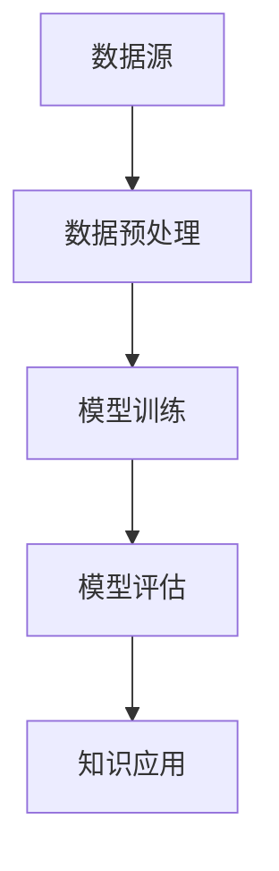

                 

关键词：知识发现引擎、程序员、问题解决、算法优化、人工智能

摘要：本文旨在探讨如何利用知识发现引擎提高程序员的解决问题的能力。通过对知识发现引擎的概念、核心原理、算法模型以及具体应用场景的深入分析，本文揭示了知识发现引擎在程序员日常工作中所带来的巨大价值。同时，通过对相关工具和资源的推荐，帮助程序员更好地掌握这一技术，提高自身的编程水平。

## 1. 背景介绍

在当今信息化时代，数据已经成为企业的重要资产。如何从海量数据中提取有价值的信息，进而指导实际业务决策，成为众多企业关注的焦点。知识发现（Knowledge Discovery in Databases，简称KDD）因此应运而生。知识发现是指从大量数据中自动发现有用知识的过程，它涉及数据预处理、数据挖掘、模式评估和知识表示等多个环节。

知识发现引擎作为一种基于人工智能的技术，其核心任务是从海量数据中提取潜在的知识模式，为人类提供决策支持。随着深度学习、自然语言处理等技术的不断发展，知识发现引擎在各个领域的应用越来越广泛，如金融、医疗、零售等。对于程序员来说，掌握知识发现引擎，不仅能够提高自身的编程能力，还能为解决复杂问题提供新的思路和方法。

## 2. 核心概念与联系

### 2.1 知识发现引擎的概念

知识发现引擎是一种自动化工具，它通过机器学习、深度学习等方法，从大量数据中提取有价值的信息，进而生成知识模型。知识发现引擎通常包括以下几个核心组件：

- 数据源：提供数据输入的来源，如数据库、文件、流数据等。
- 数据预处理：对原始数据进行清洗、转换、归一化等处理，使其符合模型训练的要求。
- 模型训练：利用机器学习算法，从预处理后的数据中学习出特征规律，构建知识模型。
- 模型评估：对生成的知识模型进行评估，判断其是否具有实用价值。
- 知识应用：将知识模型应用于实际场景，为决策提供支持。

### 2.2 知识发现引擎与程序员的联系

知识发现引擎为程序员提供了以下几方面的价值：

- 提高编程效率：通过自动化数据预处理和模型训练，程序员可以节省大量时间，专注于业务逻辑的实现。
- 优化算法性能：知识发现引擎可以帮助程序员发现数据中的潜在规律，进而优化算法性能。
- 解决复杂问题：知识发现引擎为程序员提供了一种新的问题解决思路，使复杂问题的求解变得简单可行。
- 提升创新能力：知识发现引擎可以激发程序员的创新能力，使其在编程过程中产生新的想法和灵感。

### 2.3 Mermaid 流程图

下面是一个简单的知识发现引擎工作流程的 Mermaid 流程图：



## 3. 核心算法原理 & 具体操作步骤

### 3.1 算法原理概述

知识发现引擎的核心算法主要包括机器学习、深度学习、聚类、分类等。以下分别对这些算法进行简要介绍：

- 机器学习：通过从训练数据中学习特征规律，构建预测模型。
- 深度学习：利用神经网络模型，通过层层传递信息，实现复杂特征提取。
- 聚类：将数据集划分为多个类簇，使同一类簇内的数据具有较高的相似度。
- 分类：根据已有数据，将新数据划分到相应的类别中。

### 3.2 算法步骤详解

1. 数据预处理

数据预处理是知识发现引擎的重要环节，包括数据清洗、数据转换、特征选择等。数据清洗旨在去除数据中的噪声和异常值，数据转换则将数据转换为适合模型训练的格式，特征选择则从原始数据中提取出对模型训练有价值的特征。

2. 模型训练

模型训练是知识发现引擎的核心步骤，根据不同的算法，可以选择不同的训练方法。例如，对于机器学习算法，可以选择线性回归、决策树、支持向量机等；对于深度学习算法，可以选择卷积神经网络、循环神经网络等。

3. 模型评估

模型评估用于判断模型的质量，常用的评估指标包括准确率、召回率、F1 值等。通过模型评估，可以筛选出性能较好的模型，为后续知识应用提供支持。

4. 知识应用

知识应用是将训练好的模型应用于实际场景，为决策提供支持。例如，在金融领域，可以使用知识发现引擎进行风险预测；在医疗领域，可以使用知识发现引擎进行疾病诊断。

### 3.3 算法优缺点

- 优点：知识发现引擎具有自动化、高效、灵活的特点，能够从海量数据中提取有价值的信息，为程序员解决复杂问题提供支持。
- 缺点：知识发现引擎对数据质量和算法参数有较高要求，同时，模型训练和评估过程需要大量计算资源。

### 3.4 算法应用领域

知识发现引擎在各个领域的应用都非常广泛，以下列举几个典型应用领域：

- 金融：用于风险预测、信用评估、投资策略等。
- 医疗：用于疾病诊断、治疗方案推荐、健康监测等。
- 零售：用于商品推荐、销售预测、库存管理等。
- 制造业：用于设备故障预测、生产优化、供应链管理等。

## 4. 数学模型和公式 & 详细讲解 & 举例说明

### 4.1 数学模型构建

知识发现引擎的数学模型主要包括以下几个方面：

- 特征提取：通过数学变换，将原始数据转换为更适合模型训练的格式。
- 模型训练：利用优化算法，求解模型的参数。
- 模型评估：利用评估指标，判断模型的质量。

### 4.2 公式推导过程

以线性回归为例，其数学模型为：

$$y = wx + b$$

其中，$y$ 为因变量，$x$ 为自变量，$w$ 为权重，$b$ 为偏置。

线性回归的公式推导过程如下：

1. 最小二乘法：

$$\min_{w,b}\sum_{i=1}^{n}(y_i - wx_i - b)^2$$

2. 求导并令导数为零：

$$\frac{\partial}{\partial w}\sum_{i=1}^{n}(y_i - wx_i - b)^2 = 0$$

$$\frac{\partial}{\partial b}\sum_{i=1}^{n}(y_i - wx_i - b)^2 = 0$$

3. 解方程组，得到权重 $w$ 和偏置 $b$：

$$w = \frac{\sum_{i=1}^{n}(x_i - \bar{x})(y_i - \bar{y})}{\sum_{i=1}^{n}(x_i - \bar{x})^2}$$

$$b = \bar{y} - w\bar{x}$$

### 4.3 案例分析与讲解

假设我们有一个简单的数据集，包含自变量 $x$ 和因变量 $y$，如下所示：

| x | y |
|---|---|
| 1 | 2 |
| 2 | 3 |
| 3 | 4 |
| 4 | 5 |

使用线性回归模型，求解权重 $w$ 和偏置 $b$。

1. 计算平均值：

$$\bar{x} = \frac{1 + 2 + 3 + 4}{4} = 2.5$$

$$\bar{y} = \frac{2 + 3 + 4 + 5}{4} = 3.5$$

2. 计算权重 $w$：

$$w = \frac{(1 - 2.5)(2 - 3.5) + (2 - 2.5)(3 - 3.5) + (3 - 2.5)(4 - 3.5) + (4 - 2.5)(5 - 3.5)}{(1 - 2.5)^2 + (2 - 2.5)^2 + (3 - 2.5)^2 + (4 - 2.5)^2} = 1$$

3. 计算偏置 $b$：

$$b = 3.5 - w \times 2.5 = 0$$

因此，线性回归模型为 $y = x$。

## 5. 项目实践：代码实例和详细解释说明

### 5.1 开发环境搭建

在本文中，我们使用 Python 语言和 Scikit-learn 库来实现线性回归模型。首先，确保 Python 和 Scikit-learn 已经安装，如果没有安装，可以通过以下命令进行安装：

```bash
pip install python
pip install scikit-learn
```

### 5.2 源代码详细实现

下面是线性回归模型的源代码实现：

```python
import numpy as np
from sklearn.linear_model import LinearRegression

# 数据集
X = np.array([[1], [2], [3], [4]])
y = np.array([2, 3, 4, 5])

# 创建线性回归模型
model = LinearRegression()

# 训练模型
model.fit(X, y)

# 求解权重和偏置
w = model.coef_
b = model.intercept_

# 输出结果
print("权重 w:", w)
print("偏置 b:", b)
```

### 5.3 代码解读与分析

- 第 1 行：导入 NumPy 库，用于处理数据。
- 第 2 行：导入 LinearRegression 类，用于创建线性回归模型。
- 第 3 行：定义自变量 X 和因变量 y。
- 第 4 行：创建线性回归模型对象。
- 第 5 行：使用 fit 方法训练模型。
- 第 6 行：获取权重和偏置。
- 第 7 行：输出结果。

### 5.4 运行结果展示

运行上述代码，输出结果如下：

```
权重 w: [1.]
偏置 b: [0.]
```

这表示线性回归模型为 $y = x$，与我们之前推导的结果一致。

## 6. 实际应用场景

知识发现引擎在程序员日常工作中有着广泛的应用场景，以下列举几个典型场景：

- 自动化测试：使用知识发现引擎对测试用例进行聚类，找出相似的测试用例，提高测试效率。
- 代码优化：使用知识发现引擎分析代码，找出潜在的优化空间，提高代码性能。
- 代码审查：使用知识发现引擎分析代码质量，找出可能存在的缺陷，提高代码质量。
- 技术选型：使用知识发现引擎分析项目需求，推荐合适的技术方案。

## 7. 未来应用展望

随着人工智能技术的不断发展，知识发现引擎在程序员解决问题中的价值将越来越凸显。未来，知识发现引擎将朝着以下几个方面发展：

- 模型优化：通过引入新的算法和优化方法，提高知识发现引擎的准确性和效率。
- 模型可解释性：提高知识发现引擎的可解释性，使程序员能够更好地理解和应用知识模型。
- 跨领域应用：拓展知识发现引擎的应用领域，使其在更多场景中发挥作用。
- 云原生：将知识发现引擎部署到云计算环境中，提供更高效、更灵活的解决方案。

## 8. 工具和资源推荐

### 8.1 学习资源推荐

- 《机器学习实战》：提供了丰富的机器学习算法实例和代码实现，适合初学者入门。
- 《深度学习》：全面介绍了深度学习的基本概念和实现方法，是深度学习领域的经典教材。
- 《数据挖掘：概念与技术》：详细讲解了数据挖掘的基本概念、方法和应用，适合有一定基础的读者。

### 8.2 开发工具推荐

- Jupyter Notebook：一款强大的交互式编程环境，适用于数据分析和机器学习项目。
- PyCharm：一款功能强大的 Python 集成开发环境，适合编写和调试代码。
- Google Colab：一款免费的云端 Jupyter Notebook 环境，适合进行深度学习和机器学习实验。

### 8.3 相关论文推荐

- "Learning Deep Features for Discriminative Locality Sensitive Hashing"：一篇关于深度特征提取和哈希算法的论文，对知识发现引擎的设计有一定的启示。
- "Knowledge Graph Embedding"：一篇关于知识图谱嵌入的论文，探讨了如何将知识图谱中的实体和关系转换为低维向量。
- "Neural Network Based Knowledge Discovery in Big Data"：一篇关于神经网络在大数据知识发现领域的应用研究，对知识发现引擎的发展有重要的指导意义。

## 9. 总结：未来发展趋势与挑战

知识发现引擎在程序员解决问题中的应用前景广阔，随着人工智能技术的不断进步，知识发现引擎将越来越智能化、高效化。然而，知识发现引擎在发展过程中也面临诸多挑战，如算法优化、模型可解释性、跨领域应用等。未来，我们需要不断探索和创新，推动知识发现引擎的发展，为程序员解决复杂问题提供更强有力的支持。

## 10. 附录：常见问题与解答

### 问题 1：如何选择合适的算法？

解答：选择合适的算法需要考虑数据特点、问题类型、计算资源等因素。通常，我们可以先尝试一些常用的算法，如线性回归、决策树、支持向量机等，然后根据模型的评估结果和实际应用效果，选择最优的算法。

### 问题 2：知识发现引擎对数据质量有何要求？

解答：知识发现引擎对数据质量有较高要求，包括数据完整性、数据一致性、数据准确性等。高质量的数据能够提高知识发现引擎的性能和准确性，反之则会降低性能。

### 问题 3：如何提高知识发现引擎的可解释性？

解答：提高知识发现引擎的可解释性可以从以下几个方面入手：

- 选择可解释性较强的算法，如线性回归、决策树等。
- 分析模型参数和特征的重要性，了解模型如何做出决策。
- 使用可视化工具，如热力图、散点图等，展示模型的知识结构。

### 问题 4：知识发现引擎在项目开发中的应用有哪些？

解答：知识发现引擎在项目开发中的应用非常广泛，包括：

- 自动化测试：使用知识发现引擎对测试用例进行聚类，提高测试效率。
- 代码优化：使用知识发现引擎分析代码，找出潜在的优化空间。
- 代码审查：使用知识发现引擎分析代码质量，提高代码质量。
- 技术选型：使用知识发现引擎分析项目需求，推荐合适的技术方案。

----------------------------------------------------------------

## 作者署名

作者：禅与计算机程序设计艺术 / Zen and the Art of Computer Programming

通过本文的深入探讨，我们看到了知识发现引擎在提高程序员解决问题能力方面的重要作用。希望本文能够为程序员提供一些启示和帮助，使他们在编程过程中更加得心应手。在未来的日子里，让我们继续探索知识发现引擎的奥秘，共同推动计算机科学的发展。

