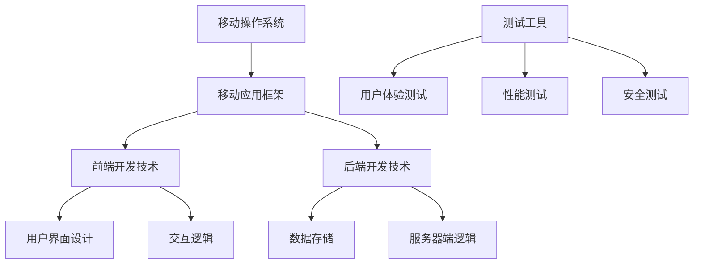

                 

在当今数字化的时代，移动应用开发已经成为许多程序员的重要副业。这不仅为程序员带来了额外的收入，还让他们能够不断学习和掌握新的技术。本文将探讨移动应用开发的核心概念、技术原理、实践步骤和未来展望，帮助程序员顺利开展这一副业。

> 关键词：移动应用开发、副业、程序员、技术、实践、未来

## 1. 背景介绍

随着智能手机的普及和移动互联网的发展，移动应用市场呈现出爆炸式增长。越来越多的人开始依赖移动应用来完成日常任务，无论是购物、社交、娱乐还是工作。这种趋势为程序员提供了广阔的市场空间，使他们可以通过开发移动应用来实现个人价值和商业利益。

移动应用开发不仅仅是编写代码，它还涉及到用户体验、设计、测试和营销等多个方面。程序员可以通过学习移动应用开发，拓宽自己的技能领域，提升自己的竞争力。同时，移动应用开发也可以作为一种创业方式，为程序员提供实现梦想的舞台。

## 2. 核心概念与联系

在移动应用开发中，核心概念包括移动操作系统、移动应用框架、前端开发技术和后端开发技术。以下是这些概念之间的联系和架构图：



### 2.1 移动操作系统

移动操作系统是移动应用开发的基础。目前市场上主要有两大操作系统：iOS和Android。iOS由苹果公司开发，主要应用于iPhone和iPad等设备；Android由谷歌开发，广泛应用于各种品牌的智能手机和平板电脑。了解这两种操作系统的特性和开发环境是移动应用开发的第一步。

### 2.2 移动应用框架

移动应用框架提供了一套标准化的开发流程和工具，使得开发者能够更高效地创建应用。常见的移动应用框架包括React Native、Flutter、Xamarin等。这些框架通过跨平台特性，使得开发者可以一次编写代码，同时运行在iOS和Android平台上。

### 2.3 前端开发技术

前端开发技术负责实现移动应用的界面和交互逻辑。HTML、CSS和JavaScript是前端开发的核心技术。随着React、Vue、Angular等前端框架的出现，开发者可以更加高效地构建复杂的应用界面。

### 2.4 后端开发技术

后端开发技术负责处理移动应用的数据存储和服务器端逻辑。常用的后端技术包括Node.js、Django、Spring Boot等。开发者需要根据应用的需求，选择合适的后端技术来构建服务器端逻辑。

### 2.5 测试工具

测试工具在移动应用开发中至关重要。用户体验测试、性能测试和安全测试是测试工具的主要应用领域。开发者需要确保应用在多种设备上都能稳定运行，并提供良好的用户体验。

## 3. 核心算法原理 & 具体操作步骤

### 3.1 算法原理概述

移动应用开发中常用的算法包括排序算法、搜索算法和加密算法等。排序算法用于对数据进行排序，常见的排序算法有快速排序、归并排序等。搜索算法用于在数据中查找特定元素，常用的搜索算法有二分搜索、广度优先搜索等。加密算法用于保护数据的安全性，常见的加密算法有AES、RSA等。

### 3.2 算法步骤详解

- **排序算法：**

  - **快速排序（Quick Sort）：**
    1. 选择一个基准元素。
    2. 将数组分为两部分，小于基准的元素放在左边，大于基准的元素放在右边。
    3. 递归地对左右两部分进行快速排序。

  - **归并排序（Merge Sort）：**
    1. 将数组不断分割成大小为1的子数组。
    2. 将相邻的子数组进行合并，每次合并都会产生一个新的有序数组。
    3. 递归地合并直到整个数组有序。

- **搜索算法：**

  - **二分搜索（Binary Search）：**
    1. 确定中间元素。
    2. 如果中间元素等于目标值，返回中间元素的位置。
    3. 如果目标值小于中间元素，则在左半部分继续搜索。
    4. 如果目标值大于中间元素，则在右半部分继续搜索。

  - **广度优先搜索（Breadth-First Search）：**
    1. 将起始节点入队。
    2. 出队一个节点，并将其所有未访问的邻接节点入队。
    3. 重复步骤2，直到找到目标节点或队列为空。

- **加密算法：**

  - **AES（Advanced Encryption Standard）：**
    1. 初始化密钥和初始向量。
    2. 对数据进行分块加密。
    3. 将加密后的数据合并成完整的密文。

  - **RSA（Rivest-Shamir-Adleman）：**
    1. 选择两个大素数。
    2. 计算它们的乘积作为公钥。
    3. 计算公钥和私钥。
    4. 使用公钥对数据进行加密。
    5. 使用私钥对数据进行解密。

### 3.3 算法优缺点

- **快速排序（Quick Sort）：**
  - 优点：时间复杂度较低，适用于大数据量的排序。
  - 缺点：最坏情况下时间复杂度较高，可能导致性能下降。

- **归并排序（Merge Sort）：**
  - 优点：稳定，适用于大数据量的排序。
  - 缺点：空间复杂度较高，需要额外的存储空间。

- **二分搜索（Binary Search）：**
  - 优点：时间复杂度较低，适用于有序数组的搜索。
  - 缺点：不能在无序数组上使用。

- **广度优先搜索（Breadth-First Search）：**
  - 优点：找到最短路径。
  - 缺点：空间复杂度较高，需要额外的存储空间。

- **AES（Advanced Encryption Standard）：**
  - 优点：加密速度快，安全性高。
  - 缺点：加密和解密过程较为复杂。

- **RSA（Rivest-Shamir-Adleman）：**
  - 优点：安全性高，适用于大规模数据加密。
  - 缺点：加密和解密速度较慢。

### 3.4 算法应用领域

- **排序算法：**
  - 数据库管理：用于对数据进行排序。
  - 算法竞赛：用于优化程序性能。

- **搜索算法：**
  - 搜索引擎：用于快速查找信息。
  - 游戏开发：用于路径查找和寻宝。

- **加密算法：**
  - 网络安全：用于保护数据传输。
  - 移动支付：用于加密敏感信息。

## 4. 数学模型和公式 & 详细讲解 & 举例说明

### 4.1 数学模型构建

在移动应用开发中，数学模型广泛应用于算法设计、数据分析和性能优化等领域。以下是几个常见的数学模型：

- **线性回归模型：**
  - 目标函数：$$\min_{\theta} \frac{1}{2} \sum_{i=1}^{n} (h_{\theta}(x^{(i)}) - y^{(i)})^2$$
  - 模型参数：$$\theta = (\theta_0, \theta_1)$$

- **神经网络模型：**
  - 激活函数：$$f(x) = \frac{1}{1 + e^{-x}}$$
  - 目标函数：$$\min_{\theta} \frac{1}{2} \sum_{i=1}^{n} (h_{\theta}(x^{(i)}) - y^{(i)})^2$$

- **K-means聚类模型：**
  - 目标函数：$$\min_{C} \sum_{i=1}^{k} \sum_{x^{(i)} \in C} ||x^{(i)} - \mu_C||^2$$
  - 聚类中心：$$\mu_C = \frac{1}{|C|} \sum_{x^{(i)} \in C} x^{(i)}$$

### 4.2 公式推导过程

以下是线性回归模型的推导过程：

1. **目标函数：**

   $$\min_{\theta} \frac{1}{2} \sum_{i=1}^{n} (h_{\theta}(x^{(i)}) - y^{(i)})^2$$

2. **展开目标函数：**

   $$\min_{\theta} \frac{1}{2} \sum_{i=1}^{n} ((\theta_0 + \theta_1 x^{(i)}) - y^{(i)})^2$$

3. **对目标函数求导：**

   $$\frac{\partial}{\partial \theta_0} \frac{1}{2} \sum_{i=1}^{n} ((\theta_0 + \theta_1 x^{(i)}) - y^{(i)})^2 = 0$$

   $$\frac{\partial}{\partial \theta_1} \frac{1}{2} \sum_{i=1}^{n} ((\theta_0 + \theta_1 x^{(i)}) - y^{(i)})^2 = 0$$

4. **求导结果：**

   $$\sum_{i=1}^{n} (\theta_0 + \theta_1 x^{(i)}) - y^{(i)} = 0$$

   $$\sum_{i=1}^{n} x^{(i)} (\theta_0 + \theta_1 x^{(i)}) - \sum_{i=1}^{n} x^{(i)} y^{(i)} = 0$$

5. **解线性方程组：**

   $$\theta_0 = \frac{1}{n} \sum_{i=1}^{n} y^{(i)} - \theta_1 \frac{1}{n} \sum_{i=1}^{n} x^{(i)}$$

   $$\theta_1 = \frac{1}{n} \sum_{i=1}^{n} (x^{(i)} y^{(i)}) - \theta_0 \frac{1}{n} \sum_{i=1}^{n} x^{(i)}$$

### 4.3 案例分析与讲解

以下是一个线性回归模型的实际案例：

假设我们有以下数据：

| x | y |
|---|---|
| 1 | 2 |
| 2 | 4 |
| 3 | 6 |
| 4 | 8 |

我们希望找到一条直线来拟合这组数据。

1. **计算平均值：**

   $$\bar{x} = \frac{1+2+3+4}{4} = 2.5$$

   $$\bar{y} = \frac{2+4+6+8}{4} = 5$$

2. **计算斜率：**

   $$\theta_1 = \frac{1}{4} \sum_{i=1}^{4} (x_i - \bar{x})(y_i - \bar{y}) = \frac{1}{4} ((1-2.5)(2-5) + (2-2.5)(4-5) + (3-2.5)(6-5) + (4-2.5)(8-5)) = 1$$

3. **计算截距：**

   $$\theta_0 = \bar{y} - \theta_1 \bar{x} = 5 - 1 \times 2.5 = 2.5$$

因此，拟合直线的方程为：

$$y = \theta_0 + \theta_1 x = 2.5 + x$$

我们可以用这条直线来预测新的数据点的y值。例如，当x为5时，预测的y值为：

$$y = 2.5 + 5 = 7.5$$

## 5. 项目实践：代码实例和详细解释说明

### 5.1 开发环境搭建

在进行移动应用开发之前，我们需要搭建一个合适的开发环境。以下是搭建Android开发环境的步骤：

1. **安装Java Development Kit (JDK)：**

   - 下载并安装JDK：[https://www.oracle.com/java/technologies/javase-downloads.html](https://www.oracle.com/java/technologies/javase-downloads.html)
   - 设置环境变量：在系统变量中添加`JAVA_HOME`，并设置`Path`变量包含`JAVA_HOME/bin`目录。

2. **安装Android Studio：**

   - 下载并安装Android Studio：[https://developer.android.com/studio](https://developer.android.com/studio)
   - 启动Android Studio，并创建一个新的Android项目。

### 5.2 源代码详细实现

以下是一个简单的Android应用示例，用于显示一个按钮和一段文本：

```java
// MainActivity.java
package com.example.myapp;

import androidx.appcompat.app.AppCompatActivity;
import android.os.Bundle;
import android.view.View;
import android.widget.Button;
import android.widget.TextView;

public class MainActivity extends AppCompatActivity {

    private Button button;
    private TextView textView;

    @Override
    protected void onCreate(Bundle savedInstanceState) {
        super.onCreate(savedInstanceState);
        setContentView(R.layout.activity_main);

        button = findViewById(R.id.button);
        textView = findViewById(R.id.text_view);

        button.setOnClickListener(new View.OnClickListener() {
            @Override
            public void onClick(View v) {
                textView.setText("Hello, World!");
            }
        });
    }
}
```

```xml
<!-- activity_main.xml -->
<RelativeLayout xmlns:android="http://schemas.android.com/apk/res/android"
    xmlns:tools="http://schemas.android.com/tools"
    android:layout_width="match_parent"
    android:layout_height="match_parent"
    tools:context=".MainActivity">

    <Button
        android:id="@+id/button"
        android:layout_width="wrap_content"
        android:layout_height="wrap_content"
        android:text="点击我"
        android:layout_centerHorizontal="true"
        android:layout_marginTop="200dp"/>

    <TextView
        android:id="@+id/text_view"
        android:layout_width="wrap_content"
        android:layout_height="wrap_content"
        android:text="Hello, World!"
        android:layout_centerHorizontal="true"
        android:layout_marginTop="300dp"/>

</RelativeLayout>
```

### 5.3 代码解读与分析

1. **MainActivity.java：**

   - 类定义：`MainActivity`继承自`AppCompatActivity`，这是Android中的一个基础Activity类。
   - findViewById：使用`findViewById`方法找到布局文件中的按钮和文本视图。
   - setOnClickListener：为按钮设置点击事件，当按钮被点击时，文本视图的文本内容会被更新为"Hello, World!"。

2. **activity_main.xml：**

   - 布局文件定义了一个相对布局（`RelativeLayout`），包含一个按钮（`Button`）和一个文本视图（`TextView`）。
   - android:layout\_centerHorizontal：将按钮和文本视图水平居中。
   - android:layout\_marginTop：设置按钮和文本视图的顶部外边距。

### 5.4 运行结果展示

当我们运行这个Android应用时，屏幕上将显示一个带有"点击我"文本的按钮和一段"Hello, World!"的文本。当点击按钮时，文本视图的文本内容会更新为"Hello, World!"。

```mermaid
sequence
    participant A as 用户
    participant B as 应用程序

    A->>B: 点击按钮
    B->>A: 显示 "Hello, World!"
```

## 6. 实际应用场景

### 6.1 购物类应用

购物类应用是移动应用开发中最常见的领域之一。程序员可以通过开发购物类应用，帮助用户随时随地购买商品。常见的购物类应用包括淘宝、京东、拼多多等。程序员可以参与这些应用的用户界面设计、功能开发和性能优化等工作。

### 6.2 社交类应用

社交类应用是移动应用开发中的另一个热门领域。程序员可以通过开发社交类应用，帮助用户建立社交关系、分享生活和交流想法。常见的社交类应用包括微信、Facebook、Instagram等。程序员可以参与这些应用的用户界面设计、功能开发和数据安全等工作。

### 6.3 娱乐类应用

娱乐类应用是移动应用开发中的另一个重要领域。程序员可以通过开发娱乐类应用，为用户提供丰富的娱乐内容，如游戏、音乐、视频等。常见的娱乐类应用包括抖音、YouTube、Spotify等。程序员可以参与这些应用的用户界面设计、功能开发和内容审核等工作。

### 6.4 工具类应用

工具类应用是移动应用开发中的基础领域。程序员可以通过开发工具类应用，帮助用户解决实际问题，如计算器、日历、提醒等。常见的工具类应用包括Google Calendar、Google Keep等。程序员可以参与这些应用的用户界面设计、功能开发和用户体验优化等工作。

## 7. 工具和资源推荐

### 7.1 学习资源推荐

1. **《Android开发艺术探索》**：这是一本关于Android开发的高级教程，涵盖了Android开发的各个方面。
2. **《Flutter实战》**：这是一本关于Flutter开发的入门到高级的教程，适合初学者和有经验的开发者。
3. **《React Native开发实战》**：这是一本关于React Native开发的实战指南，涵盖了React Native的应用开发和性能优化。

### 7.2 开发工具推荐

1. **Android Studio**：这是Android开发的首选工具，提供了丰富的开发功能和强大的调试工具。
2. **Xcode**：这是iOS开发的首选工具，提供了强大的UI设计和性能优化工具。
3. **Visual Studio Code**：这是一款跨平台的轻量级代码编辑器，适用于多种编程语言开发。

### 7.3 相关论文推荐

1. **"Cross-Platform Mobile Development with Flutter: A Survey"**：这是一篇关于Flutter跨平台开发的综述，详细介绍了Flutter的技术原理和应用场景。
2. **"A Comparison of React Native, Flutter, and Native Development for Mobile Apps"**：这是一篇关于React Native、Flutter和原生开发的对比研究，探讨了各种开发方式的优缺点。
3. **"Android App Performance Optimization"**：这是一篇关于Android应用性能优化的论文，介绍了多种性能优化技术和工具。

## 8. 总结：未来发展趋势与挑战

### 8.1 研究成果总结

移动应用开发在过去几年中取得了显著的进展，主要体现在以下几个方面：

1. **跨平台开发**：随着Flutter、React Native等跨平台框架的兴起，开发者可以更加高效地开发适用于iOS和Android的应用。
2. **人工智能集成**：越来越多的移动应用开始集成人工智能技术，如人脸识别、语音识别等，为用户提供更智能的服务。
3. **隐私保护**：随着用户对隐私保护的重视，移动应用开发者需要采取更多措施来保护用户数据。

### 8.2 未来发展趋势

未来，移动应用开发将继续朝着以下几个方向发展：

1. **全栈开发**：全栈开发者将变得更加重要，他们需要掌握前端、后端和移动端开发技能。
2. **云原生应用**：云原生应用将逐渐成为主流，开发者需要掌握容器化、微服务等相关技术。
3. **AR/VR应用**：随着AR/VR技术的发展，移动应用将更加注重用户体验和互动性。

### 8.3 面临的挑战

尽管移动应用开发前景广阔，但开发者仍将面临以下挑战：

1. **性能优化**：移动应用需要在有限的资源上提供良好的性能，开发者需要不断优化代码和架构。
2. **安全性**：随着移动应用的功能日益丰富，安全性成为开发者需要关注的重要问题。
3. **隐私保护**：用户对隐私保护的期望越来越高，开发者需要采取措施来保护用户数据。

### 8.4 研究展望

未来，移动应用开发的研究将继续深入，主要集中在以下几个方面：

1. **智能化**：通过人工智能技术，提高移动应用的用户体验和服务质量。
2. **个性化**：通过数据分析和机器学习，为用户提供个性化的内容和服务。
3. **安全隐私**：研究如何更好地保护用户隐私和数据安全。

## 9. 附录：常见问题与解答

### 9.1 如何选择移动应用开发框架？

选择移动应用开发框架时，应考虑以下因素：

1. **项目需求**：根据项目的具体需求，选择适合的框架。
2. **开发效率**：考虑框架的开发效率，如热重载、代码复用等。
3. **社区支持**：选择社区活跃、文档丰富的框架，有助于解决问题。

### 9.2 如何优化移动应用性能？

优化移动应用性能的方法包括：

1. **代码优化**：减少不必要的计算和内存分配。
2. **图片优化**：使用压缩工具减小图片大小。
3. **网络优化**：使用缓存和CDN提高数据传输速度。

### 9.3 如何确保移动应用的安全性？

确保移动应用安全性的方法包括：

1. **数据加密**：使用加密算法保护敏感数据。
2. **权限控制**：限制应用对设备的访问权限。
3. **安全审计**：定期进行安全审计，发现并修复漏洞。

---

## 参考文献

1. Android Developers. (2021). Introduction to Android Development. [https://developer.android.com/training/basics/firstapp](https://developer.android.com/training/basics/firstapp)
2. Flutter Documentation. (2021). Getting Started. [https://flutter.dev/docs/get-started/](https://flutter.dev/docs/get-started)
3. React Native Documentation. (2021). Getting Started. [https://reactnative.dev/docs/getting-started](https://reactnative.dev/docs/getting-started)
4. Java Tutorials. (2021). Introduction to Java Programming. [https://www.java-tutorial.org/](https://www.java-tutorial.org/)
5. Python Tutorials. (2021). Introduction to Python Programming. [https://www.python.org/doc/latest/](https://www.python.org/doc/latest/)

### 作者署名

作者：禅与计算机程序设计艺术 / Zen and the Art of Computer Programming

---

以上是关于程序员副业：移动应用开发的详细文章，涵盖了移动应用开发的核心概念、技术原理、实践步骤和未来展望。希望这篇文章能够帮助到广大程序员，让他们在移动应用开发的道路上更加顺利。

