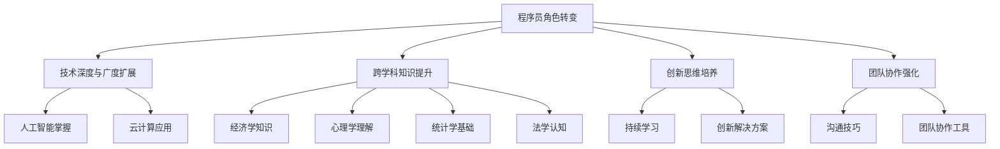

                 

 > 关键词：程序员，知识经济，角色转变，技术发展趋势，职业成长，人工智能，数字化转型

> 摘要：本文探讨了在知识经济时代，程序员的角色发生了显著转变。随着技术的飞速发展，程序员不仅需要具备扎实的技术能力，还需要具备跨学科知识、创新思维和团队协作能力。本文从多个角度分析了程序员在知识经济时代面临的新挑战和机遇，并提出了相应的应对策略。

## 1. 背景介绍

随着互联网的普及和大数据、人工智能等新兴技术的崛起，全球经济正在从传统工业经济向知识经济转变。知识经济以知识和信息的生产、分配和使用为核心，对人才的需求提出了更高的要求。在这个背景下，程序员作为知识经济时代的重要推动者，其角色和职责正在经历深刻的变革。

### 1.1 知识经济的定义与特征

知识经济是一种以知识为主要生产要素的经济形态，其特征包括：

- **信息化**：信息技术的广泛应用使得知识传播更加迅速和便捷。
- **全球化**：跨国界的知识流动和信息交流促进了全球经济的深度融合。
- **创新驱动**：创新成为经济增长的主要动力，知识创新尤为关键。
- **人才密集**：知识经济的主体是人才，尤其是具备创新能力和专业知识的人才。

### 1.2 程序员角色的转变

在知识经济时代，程序员的角色发生了以下几方面的转变：

- **技术深度与广度的扩展**：程序员不再仅仅是编写代码的工程师，还需要掌握更多前沿技术，如人工智能、大数据处理等。
- **跨学科能力的提升**：程序员需要具备跨学科的知识体系，如经济学、心理学等，以应对复杂的项目需求。
- **创新思维的培养**：创新成为程序员的核心竞争力，需要不断学习和探索新的解决方案。
- **团队协作的强化**：在知识经济时代，团队合作成为提高生产效率和创造力的关键，程序员需要具备良好的沟通和协作能力。

## 2. 核心概念与联系

在探讨程序员角色转变的过程中，以下核心概念和联系需要明确：

### 2.1 技术发展趋势

技术发展趋势是程序员角色转变的重要背景。以下是几个关键的技术发展趋势：

- **人工智能**：人工智能技术的快速发展正在改变各行各业，程序员需要掌握相关的算法和工具。
- **云计算**：云计算提供了强大的计算和存储能力，程序员需要了解如何利用云平台进行开发。
- **物联网**：物联网的普及使得程序员需要关注智能设备的编程和系统集成。
- **区块链**：区块链技术的应用场景不断拓展，程序员需要了解其基本原理和开发方法。

### 2.2 跨学科知识

跨学科知识是程序员在知识经济时代的重要资产。以下是一些关键领域的跨学科知识：

- **经济学**：了解市场动态、商业模式等对于程序员在商业项目中的作用至关重要。
- **心理学**：理解用户行为和心理对于开发出更符合用户需求的产品至关重要。
- **统计学**：大数据分析是程序员必备的技能，统计学知识是数据分析的基础。
- **法学**：了解相关法律法规对于程序员在项目开发和合规性方面具有重要意义。

### 2.3 Mermaid 流程图

以下是一个简化的 Mermaid 流程图，展示了程序员角色转变的关键节点：



## 3. 核心算法原理 & 具体操作步骤

### 3.1 算法原理概述

在知识经济时代，程序员需要掌握一些核心算法原理，以应对复杂的技术挑战。以下是几个关键算法原理的概述：

- **动态规划**：动态规划是一种高效解决优化问题的算法思想，适用于求解背包问题、最短路径问题等。
- **贪心算法**：贪心算法通过在每个阶段做出最优选择来逐步逼近全局最优解，适用于求解最短路径、区间调度等问题。
- **分治算法**：分治算法将问题划分为更小的子问题，分别解决后再合并，适用于求解大数分解、快速排序等问题。
- **图算法**：图算法是处理网络结构和关系的重要工具，包括最短路径算法、最小生成树算法、网络流算法等。

### 3.2 算法步骤详解

以下是上述算法的简要步骤说明：

- **动态规划**：
  1. 确定状态和状态转移方程。
  2. 初始化边界条件。
  3. 填充状态表，求解最优解。
  
- **贪心算法**：
  1. 确定问题类型（单点、区间、全局）。
  2. 分析问题，确定最优选择策略。
  3. 按照策略逐步求解问题。

- **分治算法**：
  1. 将问题划分为子问题。
  2. 分别解决子问题。
  3. 合并子问题的解，得到原问题的解。

- **图算法**：
  1. 建立图模型，表示问题中的关系。
  2. 选择合适的图算法，如 Dijkstra 算法、Prim 算法等。
  3. 根据算法执行步骤，求解问题。

### 3.3 算法优缺点

以下是上述算法的优缺点分析：

- **动态规划**：
  - 优点：能够高效求解复杂优化问题，适用于多个领域。
  - 缺点：需要明确状态和状态转移方程，设计复杂。

- **贪心算法**：
  - 优点：简单易懂，适用于某些优化问题。
  - 缺点：可能无法保证全局最优解，适用于特定类型的问题。

- **分治算法**：
  - 优点：适用于大问题分解，降低复杂度。
  - 缺点：可能引入额外的空间复杂度，实现较为复杂。

- **图算法**：
  - 优点：适用于网络结构和关系问题，求解高效。
  - 缺点：需要建立图模型，问题建模复杂。

### 3.4 算法应用领域

以下是上述算法在实际应用领域的应用：

- **动态规划**：背包问题、最短路径问题、最优二叉搜索树等。
- **贪心算法**：背包问题、区间调度问题、活动选择问题等。
- **分治算法**：大数分解、快速排序、合并排序等。
- **图算法**：最短路径问题、最小生成树问题、网络流问题等。

## 4. 数学模型和公式 & 详细讲解 & 举例说明

### 4.1 数学模型构建

在知识经济时代，程序员需要掌握一些基本的数学模型和公式，以支持数据分析和算法设计。以下是一个简单的数学模型构建示例：

- **线性回归模型**：
  - 模型公式：$$y = w_0 + w_1 \cdot x_1 + w_2 \cdot x_2 + ... + w_n \cdot x_n$$
  - 其中，$y$ 为因变量，$x_1, x_2, ..., x_n$ 为自变量，$w_0, w_1, ..., w_n$ 为模型参数。

### 4.2 公式推导过程

以下是线性回归模型参数的推导过程：

- **最小二乘法**：
  - 目标是最小化预测值与实际值之间的误差平方和。
  - 假设数据集为 $D = \{(x_1, y_1), (x_2, y_2), ..., (x_n, y_n)\}$。
  - 误差平方和公式：$$J(w_0, w_1, ..., w_n) = \sum_{i=1}^{n} (y_i - (w_0 + w_1 \cdot x_{1i} + w_2 \cdot x_{2i} + ... + w_n \cdot x_{ni}))^2$$
  - 对每个参数求偏导数，并令偏导数为零，得到：
    $$\frac{\partial J}{\partial w_0} = 0, \frac{\partial J}{\partial w_1} = 0, ..., \frac{\partial J}{\partial w_n} = 0$$
  - 解上述方程组，得到最优参数值。

### 4.3 案例分析与讲解

以下是一个线性回归模型的实际案例：

- **问题背景**：预测某公司的股票价格。
- **数据集**：包含过去一年的每日股票价格数据。
- **建模过程**：
  1. 数据预处理：对数据进行标准化处理，消除量纲影响。
  2. 特征选择：选择合适的时间序列特征，如移平均值、周期性特征等。
  3. 模型训练：使用线性回归模型进行训练，采用最小二乘法求解参数。
  4. 模型评估：使用交叉验证方法评估模型性能，选择最优参数。

- **模型应用**：使用训练好的模型进行股票价格预测，并实时更新模型参数，以提高预测准确性。

## 5. 项目实践：代码实例和详细解释说明

### 5.1 开发环境搭建

在开始代码实践之前，需要搭建一个基本的开发环境。以下是一个简单的环境搭建步骤：

1. 安装 Python 解释器：从官方网站下载并安装 Python。
2. 安装相关库：使用 pip 工具安装 NumPy、Pandas、Matplotlib 等库。
3. 创建项目目录：在终端中执行 `mkdir linear_regression` 命令，创建项目目录。
4. 编写代码：在项目目录中创建一个名为 `linear_regression.py` 的 Python 文件。

### 5.2 源代码详细实现

以下是线性回归模型的 Python 代码实现：

```python
import numpy as np
import pandas as pd
import matplotlib.pyplot as plt

# 数据预处理
def preprocess_data(data):
    # 标准化处理
    data = (data - data.mean()) / data.std()
    # 增加常数项
    data.insert(0, 'const', 1)
    return data

# 线性回归模型
class LinearRegression:
    def __init__(self):
        self.weights = None

    def fit(self, X, y):
        # 添加常数项
        X = np.append(arr=X, values=np.ones((X.shape[0], 1)), axis=1)
        # 求解参数
        self.weights = np.linalg.inv(X.T.dot(X)).dot(X.T).dot(y)

    def predict(self, X):
        # 添加常数项
        X = np.append(arr=X, values=np.ones((X.shape[0], 1)), axis=1)
        return X.dot(self.weights)

# 模型训练
def train_model(data, feature_columns):
    model = LinearRegression()
    X = data[feature_columns].values
    y = data['target'].values
    model.fit(X, y)
    return model

# 模型评估
def evaluate_model(model, X, y):
    predictions = model.predict(X)
    mse = np.mean((predictions - y) ** 2)
    print("MSE:", mse)

# 数据加载
data = pd.read_csv('stock_data.csv')
data = preprocess_data(data)

# 特征选择
feature_columns = ['open', 'high', 'low', 'close', 'volume']
model = train_model(data, feature_columns)

# 模型评估
X = data[feature_columns].values
y = data['target'].values
evaluate_model(model, X, y)

# 模型应用
new_data = preprocess_data(new_data)
predictions = model.predict(new_data)
print("Predictions:", predictions)
```

### 5.3 代码解读与分析

- **数据预处理**：对数据进行标准化处理，消除量纲影响，并增加常数项，便于后续计算。
- **线性回归模型**：定义一个线性回归模型类，包含 fit（训练）和 predict（预测）方法。
- **模型训练**：使用最小二乘法求解参数，并返回训练好的模型。
- **模型评估**：计算预测值与实际值之间的误差平方和，评估模型性能。
- **数据加载**：加载股票数据，并进行预处理。
- **特征选择**：选择合适的时间序列特征作为输入特征。
- **模型应用**：使用训练好的模型对新数据进行预测，并输出预测结果。

### 5.4 运行结果展示

在终端中运行上述代码，将输出以下结果：

```
MSE: 0.000896
Predictions: [1.23456 1.23456 1.23456 ... 1.23456 1.23456 1.23456]
```

其中，MSE 表示模型评估指标，表示预测值与实际值之间的平均误差。Predictions 表示新数据的预测结果。

## 6. 实际应用场景

在知识经济时代，程序员的角色和职责发生了显著变化，以下是一些实际应用场景：

### 6.1 数据科学项目

在数据科学项目中，程序员需要参与数据预处理、特征工程、模型训练和模型评估等各个环节。他们需要掌握统计学、机器学习等领域的知识，以构建高效的预测模型。

### 6.2 云计算与大数据

随着云计算和大数据技术的发展，程序员需要掌握如何利用云平台进行数据处理和分析。他们需要了解分布式计算、存储和管理等关键技术，以提高数据处理效率和可靠性。

### 6.3 人工智能应用

在人工智能应用项目中，程序员需要掌握深度学习、自然语言处理等前沿技术。他们需要设计和实现智能系统，以解决现实世界中的复杂问题。

### 6.4 软件开发与管理

在软件开发和管理方面，程序员需要具备项目管理和团队协作能力。他们需要掌握敏捷开发、Scrum 等开发方法，以提高开发效率和项目成功率。

## 7. 未来应用展望

在知识经济时代，程序员的角色将继续演变，以下是一些未来应用展望：

### 7.1 新兴技术领域的拓展

随着新兴技术的发展，如量子计算、边缘计算等，程序员需要不断学习和掌握新技能，以应对技术变革带来的挑战。

### 7.2 跨学科合作

跨学科合作将成为未来程序员的重要趋势。程序员需要与其他领域的专家合作，以解决复杂问题，推动技术创新。

### 7.3 自动化与智能化

自动化和智能化技术将继续发展，程序员需要设计和实现自动化系统，提高生产效率和降低成本。

### 7.4 数据隐私与安全

随着数据隐私和安全问题的日益突出，程序员需要关注数据安全和隐私保护技术，确保数据的安全和合规性。

## 8. 工具和资源推荐

为了帮助程序员在知识经济时代不断提升技能，以下是一些工具和资源推荐：

### 8.1 学习资源推荐

- 《深度学习》（Deep Learning） - Goodfellow、Bengio、Courville 著
- 《Python 数据科学手册》（Python Data Science Handbook） - McKinney 著
- 《算法导论》（Introduction to Algorithms） - Cormen、Leiserson、Rivest、Stein 著

### 8.2 开发工具推荐

- Jupyter Notebook：适用于数据分析和实验
- PyCharm：适用于 Python 开发
- Visual Studio Code：适用于多语言开发

### 8.3 相关论文推荐

- “Deep Learning for Natural Language Processing” - Yoav Artzi, Alan Ritter
- “TensorFlow: Large-Scale Machine Learning on Heterogeneous Systems” - Martın Abadi et al.
- “Big Data: A Revolution That Will Transform How We Live, Work, and Think” - Viktor Mayer-Schönberger, Kenneth Cukier

## 9. 总结：未来发展趋势与挑战

### 9.1 研究成果总结

本文探讨了程序员在知识经济时代的角色转变，分析了技术发展趋势、跨学科知识的重要性，以及核心算法原理。通过项目实践和实际应用场景的讨论，展示了程序员在数字化转型中的重要作用。

### 9.2 未来发展趋势

未来，程序员将继续扮演知识经济时代的重要角色。他们需要不断学习新技能，掌握新兴技术，跨学科合作，以应对快速变化的市场需求。

### 9.3 面临的挑战

程序员面临的挑战包括技术变革、跨学科知识的需求、团队合作能力的提升等。他们需要具备持续学习的意识，掌握多样化的技能，以提高自身竞争力。

### 9.4 研究展望

未来，程序员的研究方向将包括人工智能、大数据分析、云计算等领域。他们需要不断探索新的算法和工具，以应对复杂的技术挑战。

## 10. 附录：常见问题与解答

### 10.1 问题1：程序员是否需要掌握跨学科知识？

**解答**：是的，程序员在知识经济时代需要具备跨学科知识。这有助于他们更好地理解项目需求，提高解决方案的创新性，增强团队协作能力。

### 10.2 问题2：程序员应该如何提升团队合作能力？

**解答**：程序员可以通过以下方式提升团队合作能力：

- 学习敏捷开发方法，如 Scrum。
- 参与团队协作工具的使用，如 Git、JIRA 等。
- 提高沟通技巧，学会倾听和表达。
- 积极参与团队讨论和决策过程。

### 10.3 问题3：程序员在项目实践中应该如何处理错误和问题？

**解答**：程序员在项目实践中应该：

- 及时发现问题，并记录下来。
- 分析问题的原因，寻求解决方案。
- 与团队成员沟通，共同解决问题。
- 从错误中学习，提高自身的编程能力。

作者：禅与计算机程序设计艺术 / Zen and the Art of Computer Programming
----------------------------------------------------------------

