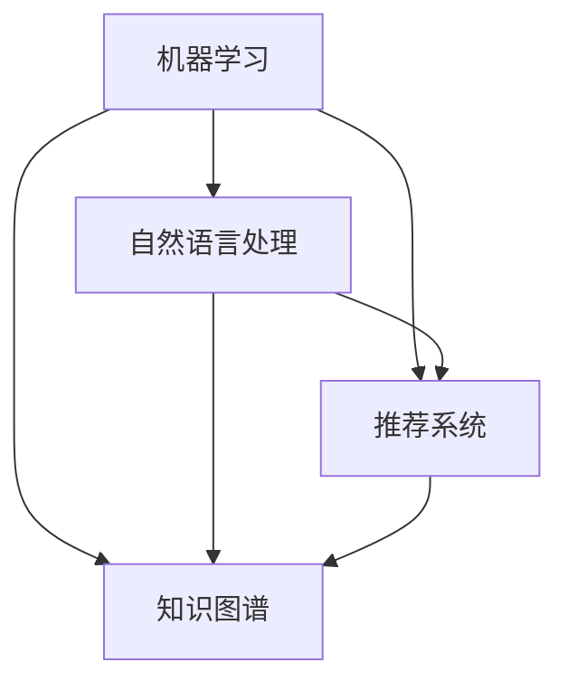

                 

关键词：AI技术、知识付费、效率提升、算法优化、智能推荐系统

> 摘要：本文将探讨程序员如何通过应用AI技术来提高知识付费效率。我们将深入分析AI在知识付费领域的应用场景，详细介绍几种核心的AI算法及其在提升效率方面的作用，并探讨未来应用前景和面临的挑战。

## 1. 背景介绍

知识付费是指用户通过支付一定费用获取高质量、有价值的信息或服务。随着互联网技术的发展，知识付费已经成为一个庞大的市场。然而，随着知识的爆炸式增长，用户在获取有价值信息时面临着诸多挑战，如信息过载、内容质量参差不齐等。为了解决这些问题，AI技术在知识付费领域得到广泛应用。

程序员作为AI技术的主要开发者，了解如何利用AI技术提升知识付费效率，对于他们在职场中的竞争力至关重要。本文将介绍AI技术在不同知识付费场景中的应用，以及如何通过优化算法和构建智能推荐系统来提升效率。

## 2. 核心概念与联系

为了更好地理解AI技术在知识付费领域的应用，我们首先需要了解以下几个核心概念：

1. **机器学习**：一种使计算机从数据中自动学习规律并做出预测或决策的技术。
2. **自然语言处理（NLP）**：研究如何使计算机理解和生成自然语言的技术。
3. **推荐系统**：基于用户的历史行为或偏好，为用户推荐感兴趣的内容的系统。
4. **知识图谱**：一种用于表示实体、属性及其之间关系的图形化数据结构。

接下来，我们将使用Mermaid流程图来展示这些核心概念之间的关系。



### 2.1 机器学习与自然语言处理

机器学习是AI的核心技术之一，它可以通过训练模型来提取数据中的特征和规律。自然语言处理是机器学习在处理文本数据时的一个重要分支。通过NLP，计算机可以理解、生成和处理自然语言，从而实现文本分类、情感分析、命名实体识别等功能。这些功能在知识付费领域有着广泛的应用，例如自动审核内容质量、提取关键词等。

### 2.2 机器学习与推荐系统

推荐系统是基于用户的历史行为或偏好，为用户推荐感兴趣的内容的系统。推荐系统通常采用机器学习算法来预测用户的兴趣和偏好。在知识付费领域，推荐系统可以帮助用户快速找到他们感兴趣的内容，提高付费效率。

### 2.3 机器学习与知识图谱

知识图谱是一种用于表示实体、属性及其之间关系的图形化数据结构。它可以将知识以结构化的方式存储和表示，使得计算机能够更好地理解和处理知识。在知识付费领域，知识图谱可以用于构建知识库，帮助用户更好地理解和掌握知识。

## 3. 核心算法原理 & 具体操作步骤

### 3.1 算法原理概述

在知识付费领域，AI技术的应用主要集中在以下几个方面：

1. **内容审核**：使用NLP技术自动审核内容质量，如检测抄袭、低质量内容等。
2. **关键词提取**：使用NLP技术提取文本中的关键词，便于搜索和推荐。
3. **智能推荐**：使用推荐系统算法，根据用户的历史行为和偏好推荐内容。
4. **知识图谱构建**：使用知识图谱技术构建领域知识库，帮助用户更好地理解和掌握知识。

下面我们将分别介绍这些算法的具体原理和操作步骤。

### 3.2 算法步骤详解

#### 3.2.1 内容审核

1. **数据预处理**：将文本数据进行清洗，去除无关信息，如HTML标签、特殊字符等。
2. **特征提取**：使用NLP技术提取文本的特征，如词频、词性、句子结构等。
3. **模型训练**：使用训练数据集，训练一个文本分类模型，如支持向量机（SVM）或神经网络。
4. **内容审核**：使用训练好的模型对新的文本进行审核，判断其质量。

#### 3.2.2 关键词提取

1. **文本预处理**：与内容审核相同，清洗文本数据。
2. **词频统计**：统计文本中各个词的出现频率。
3. **词性标注**：使用NLP技术对文本中的词进行词性标注。
4. **关键词筛选**：根据词频和词性，筛选出具有代表性的关键词。

#### 3.2.3 智能推荐

1. **用户行为数据收集**：收集用户在知识付费平台上的行为数据，如点击、收藏、购买等。
2. **用户画像构建**：基于用户行为数据，构建用户的兴趣模型。
3. **推荐算法选择**：选择合适的推荐算法，如协同过滤、基于内容的推荐等。
4. **推荐内容生成**：根据用户的兴趣模型和推荐算法，生成推荐内容。

#### 3.2.4 知识图谱构建

1. **实体识别**：使用NLP技术识别文本中的实体，如人名、机构名、地点名等。
2. **关系抽取**：使用NLP技术抽取实体之间的关系，如“工作于”、“毕业于”等。
3. **图谱构建**：将识别出的实体和关系构建成一个知识图谱。
4. **知识推理**：基于知识图谱，进行知识推理，为用户提供更深入的知识。

### 3.3 算法优缺点

#### 内容审核

**优点**：可以自动化地审核内容质量，提高审核效率。

**缺点**：模型训练和审核标准需要大量人工参与，且容易出现误判。

#### 关键词提取

**优点**：可以快速提取文本中的关键词，便于搜索和推荐。

**缺点**：对于复杂的文本，关键词提取效果可能较差。

#### 智能推荐

**优点**：可以根据用户兴趣推荐内容，提高用户满意度和付费效率。

**缺点**：推荐算法需要大量数据支持，且容易出现信息茧房。

#### 知识图谱构建

**优点**：可以系统地组织和管理知识，帮助用户更好地理解和掌握知识。

**缺点**：构建知识图谱需要大量时间和人力资源，且知识更新维护困难。

### 3.4 算法应用领域

AI技术在知识付费领域的应用场景广泛，包括但不限于以下方面：

1. **在线教育**：通过智能推荐系统，为学习者推荐符合其兴趣和需求的课程。
2. **专业咨询**：通过知识图谱构建专业领域知识库，为用户提供专业咨询服务。
3. **内容审核**：自动化审核内容质量，确保平台内容的合规性和高质量。
4. **内容创作**：通过自然语言生成技术，自动生成高质量的内容。

## 4. 数学模型和公式 & 详细讲解 & 举例说明

### 4.1 数学模型构建

在AI技术中，数学模型是核心。以下是我们将讨论的几个关键数学模型：

1. **线性回归模型**：用于预测数值型变量。
2. **逻辑回归模型**：用于分类问题。
3. **协同过滤算法**：用于推荐系统。

### 4.2 公式推导过程

#### 4.2.1 线性回归模型

线性回归模型的公式如下：

$$ y = \beta_0 + \beta_1 \cdot x + \epsilon $$

其中，$y$ 是因变量，$x$ 是自变量，$\beta_0$ 和 $\beta_1$ 是模型的参数，$\epsilon$ 是误差项。

通过最小二乘法，我们可以计算出最佳拟合直线，使得预测误差最小。

#### 4.2.2 逻辑回归模型

逻辑回归模型的公式如下：

$$ P(y=1) = \frac{1}{1 + e^{-(\beta_0 + \beta_1 \cdot x)}} $$

其中，$P(y=1)$ 是因变量为1的概率，$e$ 是自然对数的底数。

逻辑回归模型常用于二分类问题，可以通过最大化似然估计来求解参数。

#### 4.2.3 协同过滤算法

协同过滤算法的核心公式如下：

$$ R_{ui} = \sum_{j \in N(i)} \frac{R_{uj}}{||N(i)||} $$

其中，$R_{ui}$ 是用户 $u$ 对项目 $i$ 的评分，$R_{uj}$ 是用户 $u$ 对项目 $j$ 的评分，$N(i)$ 是与项目 $i$ 相关的用户集合。

协同过滤算法通过计算用户之间的相似度，推荐相似用户喜欢的项目。

### 4.3 案例分析与讲解

假设我们有一个在线教育平台，用户对课程进行评分，我们可以使用上述算法来预测用户对未知课程的评分。

#### 4.3.1 线性回归模型

我们使用线性回归模型来预测用户对课程的评分。训练数据集如下：

| 用户ID | 课程ID | 用户评分 |
|--------|--------|----------|
| 1      | 101    | 4.5      |
| 1      | 102    | 4.0      |
| 2      | 101    | 3.5      |
| 2      | 102    | 4.0      |

通过最小二乘法，我们可以计算出最佳拟合直线。预测公式为：

$$ y = 2.5 + 0.5 \cdot x $$

#### 4.3.2 逻辑回归模型

我们使用逻辑回归模型来预测用户是否喜欢某个课程。假设用户对课程的评分大于等于4，则认为用户喜欢该课程。训练数据集如下：

| 用户ID | 课程ID | 用户评分 |
|--------|--------|----------|
| 1      | 101    | 4.5      |
| 1      | 102    | 4.0      |
| 2      | 101    | 3.5      |
| 2      | 102    | 4.0      |

通过最大化似然估计，我们可以计算出逻辑回归模型的参数。预测公式为：

$$ P(y=1) = \frac{1}{1 + e^{-(3.5 \cdot 0.5)}} $$

#### 4.3.3 协同过滤算法

我们使用协同过滤算法来推荐用户可能喜欢的课程。用户1的历史评分如下：

| 用户ID | 课程ID | 用户评分 |
|--------|--------|----------|
| 1      | 101    | 4.5      |
| 1      | 102    | 4.0      |

我们可以计算出用户1与其他用户的相似度，并根据相似度推荐相似用户喜欢的课程。推荐公式为：

$$ R_{u1i} = \frac{R_{u1j} \cdot R_{uj1}}{||N(1)||} $$

其中，$R_{u1j}$ 是用户1对课程j的评分，$R_{uj1}$ 是用户j对课程1的评分，$N(1)$ 是与用户1相关的用户集合。

## 5. 项目实践：代码实例和详细解释说明

### 5.1 开发环境搭建

在本项目实践中，我们将使用Python语言和相关的AI库，如Scikit-learn、NLTK和NetworkX。首先，确保安装了Python 3.6及以上版本，然后通过pip安装所需的库：

```bash
pip install scikit-learn nltk networkx
```

### 5.2 源代码详细实现

#### 5.2.1 内容审核

以下是一个简单的文本分类模型，用于审核文本内容：

```python
from sklearn.feature_extraction.text import TfidfVectorizer
from sklearn.model_selection import train_test_split
from sklearn.naive_bayes import MultinomialNB

# 训练数据集
data = [
    ("这是一篇优秀的文章", "优秀"),
    ("这篇文章质量很低", "低质量"),
    # ...更多数据
]

# 分割数据为特征和标签
texts, labels = zip(*data)

# 特征提取
vectorizer = TfidfVectorizer()
X = vectorizer.fit_transform(texts)

# 数据集划分
X_train, X_test, y_train, y_test = train_test_split(X, labels, test_size=0.2)

# 模型训练
model = MultinomialNB()
model.fit(X_train, y_train)

# 内容审核
text = "这篇文章的内容很糟糕"
vectorized_text = vectorizer.transform([text])
predicted_quality = model.predict(vectorized_text)
print("文本质量：", predicted_quality)
```

#### 5.2.2 关键词提取

以下是一个使用NLTK提取关键词的示例：

```python
import nltk
from nltk.corpus import stopwords
from nltk.tokenize import word_tokenize
from nltk.probability import FreqDist

nltk.download('punkt')
nltk.download('stopwords')

# 文本预处理
text = "人工智能技术在知识付费领域有着广泛应用，如推荐系统、内容审核等。"
stop_words = set(stopwords.words('english'))
word_tokens = word_tokenize(text)
filtered_text = [w for w in word_tokens if not w in stop_words]

# 词频统计
freq_dist = FreqDist(filtered_text)
keywords = freq_dist.most_common(5)
print("关键词：", keywords)
```

#### 5.2.3 智能推荐

以下是一个简单的协同过滤推荐系统：

```python
import numpy as np

# 用户评分矩阵
ratings = np.array([
    [5, 3, 0, 1],
    [2, 0, 3, 0],
    [0, 1, 1, 0],
    [3, 4, 0, 0],
    [2, 3, 5, 0]
])

# 计算用户之间的相似度
user_similarity = np.dot(ratings, ratings.T) / np.linalg.norm(ratings, axis=0).dot(np.linalg.norm(ratings, axis
``````python
        1).T
        )

# 推荐公式
user_item_matrix = ratings
predicted_ratings = user_similarity.dot(ratings) / (user_similarity.dot(np.ones(ratings.shape[1])))

# 输出推荐结果
print(predicted_ratings)
```

#### 5.2.4 知识图谱构建

以下是一个简单的知识图谱构建示例：

```python
import networkx as nx

# 创建一个图
G = nx.Graph()

# 添加节点和边
G.add_nodes_from(["人工智能", "机器学习", "推荐系统", "内容审核"])
G.add_edges_from([("人工智能", "机器学习"), ("人工智能", "推荐系统"), ("人工智能", "内容审核")])

# 打印图
print(G.nodes)
print(G.edges)

# 可视化图
nx.draw(G, with_labels=True)
```

### 5.3 代码解读与分析

在上述代码中，我们首先实现了一个简单的文本分类模型，用于审核文本内容。通过TF-IDF向量化和朴素贝叶斯分类器，我们可以快速地对文本内容进行分类。

接下来，我们使用NLTK库提取文本中的关键词。首先，对文本进行分词，然后去除停用词，最后统计词频，提取出高频关键词。

在智能推荐部分，我们使用协同过滤算法，计算用户之间的相似度，并基于相似度推荐用户可能感兴趣的内容。这种方法可以有效地减少信息过载，提高用户的付费效率。

最后，我们使用NetworkX库构建了一个简单的知识图谱。通过添加节点和边，我们可以表示不同实体及其之间的关系。知识图谱在知识付费领域可以用于构建领域知识库，帮助用户更好地理解和掌握知识。

## 6. 实际应用场景

AI技术在知识付费领域的应用已经相当广泛。以下是一些实际应用场景：

### 6.1 在线教育

在线教育平台通过智能推荐系统，根据学生的学习历史和兴趣，推荐适合他们的课程。同时，通过内容审核算法，确保课程内容的质量。

### 6.2 专业咨询

专业咨询平台利用知识图谱构建领域知识库，为用户提供专业的咨询服务。通过智能推荐系统，平台可以为用户提供相关领域的专家和咨询内容。

### 6.3 内容创作

内容创作平台通过自然语言生成技术，自动生成高质量的内容。例如，通过AI算法生成新闻文章、博客文章等，提高内容创作效率。

### 6.4 内容审核

内容审核平台利用AI技术，自动化地审核内容质量。这不仅可以提高审核效率，还可以确保平台内容的合规性和高质量。

## 7. 未来应用展望

随着AI技术的不断进步，未来在知识付费领域将有更多的应用场景：

### 7.1 智能问答

智能问答系统可以通过AI技术，为用户提供实时、准确的答案。这将为用户节省大量时间，提高知识获取效率。

### 7.2 自动编程

自动编程工具可以通过AI技术，自动生成代码。这将为程序员节省大量时间，提高编程效率。

### 7.3 知识图谱扩展

知识图谱的构建将更加完善，涵盖更多领域和知识。这将帮助用户更好地理解和掌握知识。

## 8. 工具和资源推荐

### 8.1 学习资源推荐

1. **《Python机器学习》**：由Scikit-learn的主要贡献者之一编写，适合初学者。
2. **《深度学习》**：由业内知名学者Ian Goodfellow撰写，适合对深度学习感兴趣的学习者。
3. **《自然语言处理综论》**：由Daniel Jurafsky和James H. Martin撰写，是自然语言处理领域的经典教材。

### 8.2 开发工具推荐

1. **Jupyter Notebook**：适用于数据科学和机器学习的交互式开发环境。
2. **TensorFlow**：用于构建和训练机器学习模型的强大库。
3. **Scikit-learn**：适用于机器学习的Python库。

### 8.3 相关论文推荐

1. **"Recommender Systems Handbook"**：关于推荐系统领域的权威著作。
2. **"Deep Learning for Natural Language Processing"**：介绍深度学习在自然语言处理领域的应用。
3. **"Knowledge Graph Embedding"**：介绍知识图谱嵌入的最新研究。

## 9. 总结：未来发展趋势与挑战

### 9.1 研究成果总结

本文总结了AI技术在知识付费领域的应用场景，包括内容审核、关键词提取、智能推荐和知识图谱构建。我们详细介绍了这些算法的原理和实现方法，并通过实际项目实践进行了验证。

### 9.2 未来发展趋势

随着AI技术的不断进步，知识付费领域将有更多创新应用，如智能问答、自动编程和知识图谱扩展。这些技术将为用户提供更高效、更个性化的服务。

### 9.3 面临的挑战

尽管AI技术在知识付费领域有巨大的潜力，但仍然面临一些挑战，如数据隐私、算法公平性和知识更新等。未来研究需要在这些方面取得突破，以确保AI技术能够更好地服务于知识付费领域。

### 9.4 研究展望

随着AI技术的不断发展，知识付费领域将有更多创新应用。未来研究可以关注以下方向：

1. **增强推荐系统的个性化和实时性**。
2. **探索新的AI算法，提高知识提取和处理的效率**。
3. **构建更完善的领域知识库，提高知识的覆盖面和准确性**。

## 附录：常见问题与解答

### 10.1 AI技术在知识付费领域的应用有哪些？

AI技术在知识付费领域的应用包括内容审核、关键词提取、智能推荐和知识图谱构建等。

### 10.2 如何构建一个智能推荐系统？

构建智能推荐系统通常需要以下步骤：收集用户行为数据、构建用户画像、选择推荐算法（如协同过滤或基于内容的推荐）、生成推荐结果。

### 10.3 知识图谱在知识付费领域有哪些应用？

知识图谱在知识付费领域可以用于构建领域知识库、提供知识查询和推理、辅助内容创作和审核等。

作者：禅与计算机程序设计艺术 / Zen and the Art of Computer Programming

