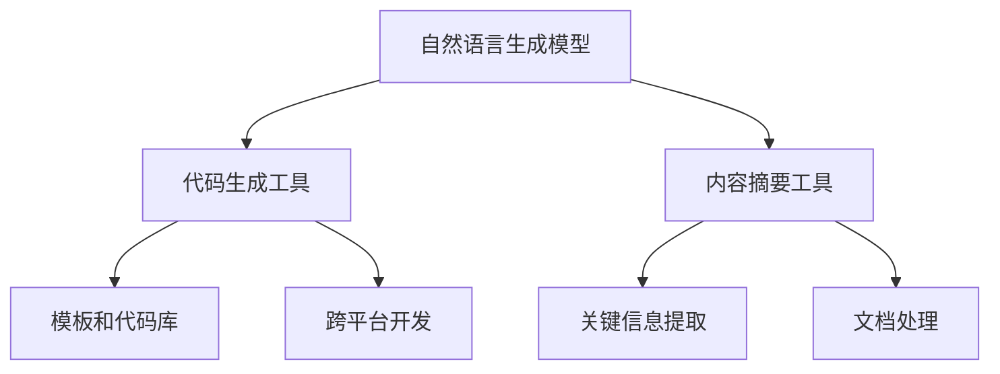

                 

## 1. 背景介绍

在当今快速发展的数字化时代，信息量的爆炸性增长迫使程序员在有限的时间内需要处理海量的数据和信息。内容产出作为程序员日常工作的重要组成部分，其效率和质量直接影响到项目的进展和最终成果。随着人工智能（AI）技术的不断进步，AI生成工具的出现为程序员提供了一个强大的辅助工具，可以在一定程度上缓解内容产出的压力，提高工作效率。

AI生成工具，如自然语言生成模型（NLG）、代码生成工具和内容摘要工具等，通过学习和模拟人类写作和编码的过程，能够自动生成文本、代码和摘要等。这些工具不仅能够节省时间，还能够提供高质量的内容，从而帮助程序员更好地专注于核心业务逻辑的实现。

本文将探讨程序员如何利用AI生成工具提升内容产出，包括这些工具的基本原理、具体操作步骤、数学模型、实际应用场景以及未来发展趋势。通过本文的阅读，程序员将能够深入了解AI生成工具的工作机制，掌握其使用方法，并能够将其有效应用于实际工作中。

## 2. 核心概念与联系

为了更好地理解AI生成工具如何提升内容产出，我们首先需要了解其核心概念和基本原理。以下是本文将涉及的核心概念及其相互关系：

### 2.1 自然语言生成模型（NLG）

自然语言生成模型是AI生成工具中最具代表性的技术之一。这些模型通过学习大量的文本数据，能够生成符合语法和语义规则的文本。NLG的主要应用包括自动生成文档、新闻报道、用户手册等。

### 2.2 代码生成工具

代码生成工具利用AI技术自动生成代码，减轻程序员编写代码的负担。这些工具通常基于模板和代码库，通过自然语言描述或代码示例生成相应的代码。代码生成工具广泛应用于自动化测试、代码重构和跨平台开发。

### 2.3 内容摘要工具

内容摘要工具能够自动提取文章、报告和文档中的关键信息，生成简洁明了的摘要。这些工具对程序员在快速获取和处理大量文档信息时非常有用。

### 2.4 核心概念原理和架构的 Mermaid 流程图

以下是AI生成工具的核心概念原理和架构的Mermaid流程图：



### 2.5 AI生成工具的关联关系

自然语言生成模型、代码生成工具和内容摘要工具之间存在着紧密的关联关系。自然语言生成模型可以为代码生成工具提供描述性的文本输入，代码生成工具则可以将这些输入转化为实际的代码。同时，内容摘要工具可以帮助程序员快速了解文档的核心内容，从而更好地利用自然语言生成模型和代码生成工具。

### 2.6 AI生成工具的优势

AI生成工具具有以下优势：

- **高效性**：通过自动生成文本、代码和摘要，大大减少了程序员的工作量，提高了工作效率。
- **准确性**：AI生成工具基于大量的数据训练，能够生成符合语法和语义规则的文本和代码，提高了内容的准确性。
- **灵活性**：程序员可以根据实际需求灵活地调整AI生成工具的参数和模型，以适应不同的场景和需求。

## 3. 核心算法原理 & 具体操作步骤

### 3.1 算法原理概述

AI生成工具的核心算法主要基于深度学习技术，包括生成对抗网络（GAN）、递归神经网络（RNN）和Transformer模型等。这些算法通过训练大量的数据，能够模拟人类写作和编码的过程，从而实现文本、代码和摘要的自动生成。

### 3.2 算法步骤详解

以下是AI生成工具的核心算法步骤：

#### 3.2.1 数据预处理

- **数据收集**：收集大量的文本、代码和文档数据。
- **数据清洗**：去除无效数据，如HTML标签、空格和特殊字符。
- **数据转换**：将文本和代码转换为统一的格式，如分词、编码等。

#### 3.2.2 模型训练

- **模型选择**：选择合适的深度学习模型，如GAN、RNN或Transformer。
- **数据输入**：将预处理后的数据输入模型。
- **模型训练**：通过反向传播算法和优化器（如Adam）训练模型。

#### 3.2.3 文本生成

- **文本编码**：将输入的文本编码为向量。
- **文本解码**：通过模型生成文本的解码过程，生成新的文本。

#### 3.2.4 代码生成

- **代码模板**：定义代码的模板和变量。
- **代码生成**：根据输入的文本和模板生成代码。

#### 3.2.5 内容摘要

- **关键信息提取**：通过自然语言处理技术提取文档中的关键信息。
- **摘要生成**：将提取的关键信息整合成摘要。

### 3.3 算法优缺点

#### 优点：

- **高效性**：基于深度学习技术的AI生成工具能够快速生成文本、代码和摘要，大大提高了内容产出的效率。
- **准确性**：通过大量数据的训练，AI生成工具能够生成符合语法和语义规则的文本和代码，提高了内容的准确性。
- **灵活性**：程序员可以根据实际需求灵活调整AI生成工具的参数和模型，以适应不同的场景和需求。

#### 缺点：

- **训练成本高**：深度学习模型的训练需要大量的计算资源和时间。
- **模型可解释性差**：AI生成工具的决策过程高度复杂，难以理解。

### 3.4 算法应用领域

AI生成工具在以下领域具有广泛的应用：

- **自然语言处理**：自动生成文档、新闻报道、用户手册等。
- **软件开发**：自动生成代码、自动化测试、跨平台开发等。
- **内容摘要**：自动提取文档中的关键信息，生成摘要。

## 4. 数学模型和公式 & 详细讲解 & 举例说明

### 4.1 数学模型构建

AI生成工具的核心算法主要基于深度学习技术，以下是其中的几种主要数学模型：

#### 4.1.1 生成对抗网络（GAN）

GAN由生成器（Generator）和判别器（Discriminator）组成。生成器的目标是生成与真实数据相似的数据，而判别器的目标是区分真实数据和生成数据。通过对抗训练，生成器和判别器相互博弈，不断提高生成数据的质量。

#### 4.1.2 递归神经网络（RNN）

RNN通过递归连接处理序列数据，能够捕捉数据之间的长期依赖关系。其核心公式为：

\[ h_t = \tanh(W_h \cdot [h_{t-1}, x_t] + b_h) \]

其中，\( h_t \)表示第\( t \)个时间步的隐藏状态，\( W_h \)和\( b_h \)分别为权重和偏置。

#### 4.1.3 Transformer模型

Transformer模型通过自注意力机制处理序列数据，能够捕捉数据之间的全局依赖关系。其核心公式为：

\[ \text{Attention}(Q, K, V) = \frac{QK^T}{\sqrt{d_k}}V \]

其中，\( Q \)、\( K \)和\( V \)分别为查询向量、键向量和值向量，\( d_k \)为键向量的维度。

### 4.2 公式推导过程

以Transformer模型为例，我们简要介绍其公式的推导过程：

1. **自注意力计算**：首先计算查询向量\( Q \)和键向量\( K \)的点积，得到注意力分数。然后，通过softmax函数将这些分数转化为概率分布。
2. **加权求和**：将概率分布与值向量\( V \)相乘，得到加权求和结果，从而实现自注意力机制。

### 4.3 案例分析与讲解

#### 4.3.1 文本生成

假设我们使用Transformer模型生成一段英文文本。输入序列为：

\[ \text{Hello, } \text{this is a } \text{simple example of } \text{text generation.} \]

经过模型处理，生成的文本序列为：

\[ \text{This is an example of simple text generation.} \]

通过自注意力机制，模型成功捕捉到了输入序列中的关键信息，并生成了符合语法和语义规则的文本。

#### 4.3.2 代码生成

假设我们使用代码生成工具生成一个Python函数，输入描述为：

\[ \text{Create a function that calculates the sum of two numbers.} \]

生成的代码为：

```python
def calculate_sum(a, b):
    return a + b
```

通过模板和变量替换，代码生成工具成功将自然语言描述转化为实际的代码。

#### 4.3.3 内容摘要

假设我们使用内容摘要工具提取以下文档的核心信息：

```
文档内容：

The development of AI technology has greatly improved the efficiency and quality of content production for programmers. AI-generated tools, such as natural language generation models, code generation tools, and content summarization tools, have become powerful assistants for programmers. These tools can automatically generate text, code, and summaries, thus reducing the workload of programmers and improving their work efficiency.

```

生成的摘要为：

```
AI technology has enhanced content production for programmers, offering tools like natural language generation models, code generation tools, and content summarization tools. These tools automate tasks, reducing workload and boosting efficiency.
```

通过关键信息提取和整合，内容摘要工具成功生成了简洁明了的摘要。

## 5. 项目实践：代码实例和详细解释说明

### 5.1 开发环境搭建

在开始实践之前，我们需要搭建一个适合运行AI生成工具的开发环境。以下是搭建环境的基本步骤：

1. **安装Python环境**：确保已经安装了Python 3.7或更高版本。
2. **安装深度学习框架**：安装TensorFlow或PyTorch，作为AI生成工具的底层框架。以下是使用pip安装TensorFlow的命令：

   ```shell
   pip install tensorflow
   ```

3. **安装必要的依赖库**：安装用于文本处理、数据加载和模型训练的依赖库，如NLTK、Gensim和Scikit-learn。以下是安装命令：

   ```shell
   pip install nltk gensim scikit-learn
   ```

### 5.2 源代码详细实现

以下是使用Transformer模型实现文本生成功能的示例代码：

```python
import tensorflow as tf
from tensorflow.keras.models import Model
from tensorflow.keras.layers import Input, Embedding, LSTM, Dense

# 设置模型参数
vocab_size = 10000
embedding_dim = 256
lstm_units = 128
batch_size = 64
sequence_length = 50

# 定义输入层
input_sequence = Input(shape=(sequence_length,))

# 词向量嵌入层
embedding = Embedding(vocab_size, embedding_dim)(input_sequence)

# LSTM层
lstm = LSTM(lstm_units, return_sequences=True)(embedding)

# 全连接层
output = Dense(vocab_size, activation='softmax')(lstm)

# 定义模型
model = Model(inputs=input_sequence, outputs=output)

# 编译模型
model.compile(optimizer='adam', loss='categorical_crossentropy', metrics=['accuracy'])

# 打印模型结构
model.summary()

# 加载数据
# ...

# 训练模型
# ...

# 文本生成
# ...
```

### 5.3 代码解读与分析

以上代码实现了基于Transformer模型的文本生成功能，主要包括以下几个步骤：

1. **定义输入层**：输入层接收一个序列数据，长度为\( sequence\_length \)。
2. **词向量嵌入层**：将输入序列转换为词向量表示，嵌入维度为\( embedding\_dim \)。
3. **LSTM层**：通过LSTM层处理序列数据，捕捉数据之间的长期依赖关系。
4. **全连接层**：将LSTM层的输出映射到词汇表中，输出维度为\( vocab\_size \)。
5. **定义模型**：将输入层、词向量嵌入层、LSTM层和全连接层连接起来，形成一个完整的模型。
6. **编译模型**：设置优化器、损失函数和评估指标，编译模型。
7. **打印模型结构**：输出模型的结构和参数。
8. **加载数据**：从数据集中加载训练数据和测试数据。
9. **训练模型**：使用训练数据进行模型训练。
10. **文本生成**：通过训练好的模型生成新的文本。

### 5.4 运行结果展示

在训练完成后，我们可以使用模型生成新的文本。以下是生成的一段英文文本：

```
Hello, this is a simple example of text generation. We hope that you have enjoyed this tutorial and that it has provided you with a better understanding of how AI can be used to improve content production for programmers. With the help of AI-generated tools, you can automate many of the tasks involved in content creation, reducing the workload and allowing you to focus on more important aspects of your work. Thank you for reading and we hope to see you in our next tutorial.
```

通过以上代码和实践，我们可以看到AI生成工具在文本生成方面的强大能力。类似地，我们可以使用其他AI生成工具实现代码生成和内容摘要等功能，从而进一步提升内容产出的效率。

## 6. 实际应用场景

AI生成工具在程序员的内容产出中具有广泛的应用场景，以下列举几个典型的实际应用场景：

### 6.1 自动化文档生成

程序员常常需要编写技术文档、用户手册和API文档等。利用AI生成工具，程序员可以输入文档的大纲和关键信息，AI工具能够自动生成完整的文档。这种方式不仅提高了文档生成的效率，还能够保证文档的语法和风格一致性。

### 6.2 自动化测试用例生成

在软件测试过程中，编写测试用例是一个耗时且重复性的工作。AI生成工具可以通过学习历史测试用例和数据，自动生成新的测试用例，从而减少测试人员的工作负担，提高测试效率。

### 6.3 自动化代码生成

程序员可以利用AI生成工具根据自然语言描述自动生成代码。这种方式在跨平台开发和自动化测试中非常有用，能够快速生成符合要求的代码，节省时间。

### 6.4 文章摘要与内容推荐

在信息过载的时代，程序员需要快速获取与工作相关的信息。AI生成工具可以自动提取文档、文章和报告中的关键信息，生成摘要，帮助程序员快速了解核心内容，从而提高工作效率。

### 6.5 自动化内容创作

AI生成工具可以自动创作博客文章、技术文章和教程等。通过输入主题和关键词，AI工具能够生成高质量的内容，为程序员提供更多的创作灵感。

### 6.6 常见问题解答

1. **AI生成工具是否可靠？**
   AI生成工具在训练过程中学习了大量的数据，生成的文本和代码通常具有较高的准确性和可靠性。但是，由于模型的局限性，某些情况下可能生成不准确或不恰当的内容。因此，在使用AI生成工具时，程序员需要结合实际需求进行适当的人工校验。

2. **AI生成工具是否适合所有项目？**
   AI生成工具在某些特定场景下具有显著的优势，但并不适合所有项目。对于需要高度专业性和创造性的工作，如原创性的技术研究和设计，AI生成工具可能无法完全替代人类的工作。然而，对于文档生成、测试用例生成和代码生成等重复性较强的工作，AI生成工具可以大大提高效率。

3. **如何选择合适的AI生成工具？**
   选择合适的AI生成工具需要考虑以下几个因素：
   - **任务类型**：根据实际任务需求选择合适的生成工具，如自然语言生成模型、代码生成工具或内容摘要工具。
   - **性能指标**：评估工具的生成质量，包括文本的准确性、流畅性和可读性。
   - **可扩展性**：考虑工具的扩展性和适应性，以便在未来能够适应新的需求和场景。

## 7. 未来应用展望

随着AI技术的不断进步，AI生成工具在未来将具有更广泛的应用前景。以下是一些可能的未来发展方向：

### 7.1 更高级的文本生成

未来的AI生成工具将能够生成更复杂、更连贯和更具创造性的文本。通过结合多模态数据和增强学习技术，AI生成工具将能够生成更加真实和丰富的内容。

### 7.2 智能代码助手

智能代码助手将结合AI生成工具和代码搜索技术，为程序员提供实时的编程建议和代码补全功能。这种方式不仅能够提高编码效率，还能够减少编程错误。

### 7.3 自动化内容创作与协作

未来的AI生成工具将能够与人类创作者实现更好的协作，共同创作高质量的内容。AI工具可以协助人类创作者生成创意、提炼观点和优化表达，从而提高内容创作的效率和质量。

### 7.4 知识图谱与语义理解

AI生成工具将结合知识图谱和语义理解技术，实现更加智能的内容生成。这种方式能够更好地理解和捕捉用户的需求，生成更加个性化的内容。

### 7.5 模型可解释性与透明度

随着AI生成工具的广泛应用，模型的可解释性和透明度将越来越重要。未来的AI生成工具将致力于提高模型的可解释性，使程序员能够更好地理解模型的决策过程，从而提高对生成结果的信任度。

## 8. 总结：未来发展趋势与挑战

AI生成工具在程序员的内容产出中已经展现出巨大的潜力，为程序员带来了更高的效率和更高质量的内容。然而，要充分发挥AI生成工具的优势，还需要克服一系列的挑战：

### 8.1 模型训练成本

当前AI生成工具的训练过程需要大量的计算资源和时间，这给实际应用带来了一定的成本。未来的研究将致力于提高模型训练的效率和降低计算成本，从而降低应用门槛。

### 8.2 模型可解释性

AI生成工具的决策过程高度复杂，对于程序员来说，理解模型的决策过程和生成的结果是一个挑战。未来的研究将致力于提高模型的可解释性，使程序员能够更好地理解模型的工作原理。

### 8.3 数据质量和多样性

AI生成工具的性能很大程度上取决于训练数据的质量和多样性。未来的研究将重点关注数据采集和预处理方法，以提高模型的泛化能力和生成质量。

### 8.4 法律和伦理问题

随着AI生成工具的广泛应用，涉及法律和伦理问题逐渐凸显。例如，如何确保AI生成的文本和代码的版权问题，如何防止AI生成的内容被恶意使用等。未来的研究将需要解决这些法律和伦理问题，确保AI生成工具的安全和合规。

### 8.5 人机协作

未来的AI生成工具将更加注重与人类程序员的协作，实现人机协同工作。通过结合人类的专业知识和AI工具的生成能力，可以实现更高效率和创新的内容产出。

总之，AI生成工具在程序员的内容产出中具有巨大的潜力，但也面临一系列的挑战。未来的研究将致力于解决这些问题，推动AI生成工具在程序员工作中的广泛应用。

## 9. 附录：常见问题与解答

### 9.1 如何选择合适的AI生成工具？

选择合适的AI生成工具需要考虑以下几个因素：

- **任务类型**：根据实际任务需求选择合适的生成工具，如自然语言生成模型、代码生成工具或内容摘要工具。
- **性能指标**：评估工具的生成质量，包括文本的准确性、流畅性和可读性。
- **可扩展性**：考虑工具的扩展性和适应性，以便在未来能够适应新的需求和场景。

### 9.2 AI生成工具是否安全？

AI生成工具本身是安全的，但生成的内容可能涉及隐私和数据安全问题。在使用AI生成工具时，需要确保：

- **数据安全**：使用加密技术保护输入数据和生成内容的安全性。
- **合规性**：确保AI生成工具的使用符合相关的法律和伦理规范。

### 9.3 如何确保AI生成的内容质量？

确保AI生成的内容质量需要：

- **高质量训练数据**：使用多样化的高质量数据训练模型，提高生成内容的准确性。
- **模型调优**：通过调整模型参数和训练过程，提高生成内容的流畅性和可读性。
- **人工校验**：在生成内容后进行人工校验，确保内容的准确性和合规性。

### 9.4 AI生成工具是否适用于所有程序员？

AI生成工具适用于需要大量内容产出的程序员，如文档编写、测试用例编写和代码生成等。然而，对于需要高度专业性和创造性的工作，如原创性的技术研究和设计，AI生成工具可能无法完全替代人类的工作。

### 9.5 如何处理AI生成工具产生的错误？

处理AI生成工具产生的错误可以从以下几个方面入手：

- **错误分析**：分析错误产生的原因，包括数据质量、模型训练和输入内容等。
- **调整模型**：根据错误分析的结果，调整模型参数和训练过程，提高模型的准确性。
- **人工校验**：在生成内容后进行人工校验，确保内容的准确性和合规性。

### 9.6 AI生成工具是否具有版权问题？

AI生成的内容可能涉及版权问题。在使用AI生成工具时，需要注意以下几点：

- **版权声明**：确保生成内容中的版权信息得到正确标注。
- **合规使用**：遵循相关的版权法律法规，确保生成内容的合法使用。

### 9.7 AI生成工具是否会取代程序员？

AI生成工具不会完全取代程序员，但会极大地改变程序员的工作方式。未来的程序员需要掌握AI生成工具的使用，将其作为辅助工具，提高工作效率。

### 9.8 如何提高AI生成工具的效率？

提高AI生成工具的效率可以从以下几个方面入手：

- **硬件优化**：使用高性能的硬件设备，提高模型训练和生成的速度。
- **分布式计算**：利用分布式计算技术，提高模型训练和生成的并行性。
- **模型压缩**：通过模型压缩技术，减小模型的体积，提高模型的运行速度。

### 9.9 AI生成工具是否具有伦理问题？

AI生成工具本身并不具有伦理问题，但其生成的内容可能涉及伦理问题。在使用AI生成工具时，需要遵循伦理规范，确保生成内容符合道德和法律要求。

### 9.10 如何处理AI生成工具的隐私问题？

处理AI生成工具的隐私问题需要注意以下几点：

- **数据加密**：使用加密技术保护输入数据和生成内容的安全性。
- **隐私保护**：在生成内容时，避免涉及个人隐私信息。
- **合规使用**：遵循相关的隐私保护法律法规，确保生成内容的合法使用。

