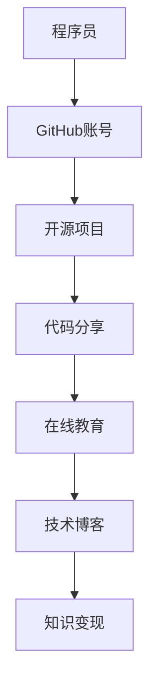

                 

关键词：GitHub, 知识变现, 程序员, 开源项目, 代码分享, 软件开发，技术社区

> 摘要：本文旨在探讨程序员如何通过GitHub这一全球最大的代码托管平台，利用开源项目和代码分享实现知识变现。文章将介绍GitHub的基础知识、开源项目的创建与管理、代码分享与推广策略，以及利用GitHub进行在线教育、撰写技术博客等途径实现个人价值的提升。

## 1. 背景介绍

GitHub，作为全球领先的开源代码托管平台，成立于2008年，目前拥有超过3100万注册用户和超过1亿个代码仓库。其提供了一个高度集成的平台，使得程序员可以轻松地分享代码、协作开发、管理项目，以及展示自己的技术能力和专业知识。GitHub不仅是一个技术社区，更是一个知识变现的平台，许多程序员通过它实现了自己的职业发展和财务收益。

在GitHub上，程序员可以通过以下几种方式实现知识变现：

1. **开源项目**：通过贡献代码到开源项目，提高个人知名度，吸引潜在的商业合作机会。
2. **代码分享**：发布个人开发的工具或库，吸引企业和个人用户的关注和购买。
3. **在线教育**：创建教程或课程，通过授课获得收入。
4. **技术博客**：撰写高质量的技术文章，吸引广告或赞助商。

## 2. 核心概念与联系

下面是利用GitHub进行知识变现的核心概念和架构的Mermaid流程图：



### 2.1. 核心概念

- **GitHub账号**：程序员在GitHub上注册的账号，用于管理和参与项目。
- **开源项目**：程序员贡献代码，与他人合作开发的项目。
- **代码分享**：发布个人开发的工具或库，供他人使用和改进。
- **在线教育**：通过GitHub发布教程或课程，吸引学生和付费用户。
- **技术博客**：撰写技术文章，分享专业知识和经验。

### 2.2. 架构联系

程序员通过GitHub账号参与开源项目、分享代码、发布教程和撰写博客，这些活动相互联系，共同构建了一个知识变现的生态圈。

## 3. 核心算法原理 & 具体操作步骤

### 3.1. 算法原理概述

利用GitHub进行知识变现的核心算法原理可以概括为：

1. **社交网络效应**：通过在GitHub上建立社交网络，增加个人曝光度。
2. **价值创造**：通过开源项目、代码分享、在线教育和技术博客等途径，创造个人价值。
3. **收益转化**：将个人价值转化为实际收益，如赞助、合作项目、课程销售等。

### 3.2. 算法步骤详解

1. **注册GitHub账号**：
   - 访问GitHub官网，填写注册信息。
   - 验证邮箱，完成注册。

2. **参与开源项目**：
   - 搜索感兴趣的开源项目。
   - 阅读项目文档，了解项目要求和进展。
   - 提交Pull Request，贡献代码。

3. **创建个人开源项目**：
   - 初始化项目仓库。
   - 撰写项目说明文档。
   - 发布项目，吸引开发者参与。

4. **代码分享**：
   - 开发个人工具或库。
   - 编写README文件，详细介绍功能和使用方法。
   - 发布到GitHub，供他人使用。

5. **在线教育**：
   - 创建GitHub Pages站点。
   - 发布教程或课程。
   - 通过赞助或付费课程获得收入。

6. **撰写技术博客**：
   - 定期撰写技术文章。
   - 发布到GitHub Pages或第三方博客平台。
   - 吸引广告或赞助商。

### 3.3. 算法优缺点

- **优点**：
  - 低成本：GitHub提供了免费的平台，程序员可以零成本开始知识变现。
  - 高效：GitHub集成了版本控制、项目管理、社交网络等多种功能，提高了知识变现的效率。
  - 广泛影响力：GitHub是全球最大的代码托管平台，有助于程序员扩大影响力。

- **缺点**：
  - 时间成本：参与开源项目、编写教程和博客需要投入大量的时间和精力。
  - 盈利模式不清晰：对于初学者来说，如何将个人价值转化为实际收益可能并不容易。

### 3.4. 算法应用领域

- **个人品牌建设**：通过参与开源项目、分享代码和撰写博客，建立个人品牌。
- **技能提升**：通过参与开源项目，学习他人的代码和经验，提高自身技能。
- **商业合作**：通过GitHub吸引潜在的商业合作伙伴，实现项目合作或咨询服务。
- **在线教育**：通过GitHub Pages发布教程和课程，吸引学生和付费用户。

## 4. 数学模型和公式 & 详细讲解 & 举例说明

### 4.1. 数学模型构建

知识变现的数学模型可以表示为：

\[ 收益 = f(影响力, 知识质量, 市场需求) \]

其中，影响力、知识质量和市场需求是影响知识变现收益的关键因素。

### 4.2. 公式推导过程

- **影响力**：通过GitHub上的关注者数量、贡献的项目数量和星标数等指标衡量。
- **知识质量**：通过代码质量、教程的详细程度和技术博客的专业性等指标衡量。
- **市场需求**：通过项目或教程的实际使用情况、付费用户的数量和广告赞助商的意愿等指标衡量。

### 4.3. 案例分析与讲解

以下是一个具体的案例分析：

- **影响力**：该程序员在GitHub上有1000个关注者，参与10个开源项目，平均每个项目有20个星标。
- **知识质量**：其开源项目代码质量高，教程详细，技术博客专业。
- **市场需求**：项目得到广泛使用，教程有大量学生购买，博客吸引了一些广告赞助。

根据数学模型，其收益可表示为：

\[ 收益 = f(1000, 高质量, 高需求) \]

收益可能会非常高，具体取决于市场需求和该程序员的定价策略。

## 5. 项目实践：代码实例和详细解释说明

### 5.1. 开发环境搭建

在开始代码实例之前，需要搭建一个合适的开发环境。这里以Python为例，步骤如下：

1. **安装Python**：下载并安装Python 3.8及以上版本。
2. **配置虚拟环境**：打开命令行，执行以下命令：

   ```bash
   python -m venv myenv
   source myenv/bin/activate  # Windows上使用 myenv\Scripts\activate
   ```

3. **安装依赖**：在虚拟环境中安装所需依赖，例如：

   ```bash
   pip install requests
   ```

### 5.2. 源代码详细实现

以下是一个简单的Python脚本，用于从GitHub获取开源项目的信息：

```python
import requests

def get_project_info(repo_url):
    response = requests.get(repo_url)
    if response.status_code == 200:
        project_data = response.json()
        return {
            'name': project_data['name'],
            'description': project_data['description'],
            'stargazers_count': project_data['stargazers_count']
        }
    else:
        return None

repo_url = 'https://api.github.com/repos/github-user/repository-name'
project_info = get_project_info(repo_url)
if project_info:
    print(project_info)
else:
    print('无法获取项目信息')
```

### 5.3. 代码解读与分析

该脚本首先导入`requests`模块，用于发送HTTP请求。然后定义了一个函数`get_project_info`，接收GitHub仓库URL作为参数。函数使用`requests.get`方法获取仓库信息，并将结果转换为JSON格式。如果响应状态码为200，表示请求成功，函数返回项目名称、描述和星标数。最后，脚本调用函数并打印结果。

### 5.4. 运行结果展示

假设仓库URL为`https://api.github.com/repos/github-user/repository-name`，脚本运行结果如下：

```plaintext
{'name': 'repository-name', 'description': 'A brief description of the repository', 'stargazers_count': 20}
```

## 6. 实际应用场景

### 6.1. 个人品牌建设

通过GitHub，程序员可以建立个人品牌，提高知名度。例如，程序员A通过参与多个开源项目、分享代码和撰写博客，逐渐在GitHub上建立了自己的声誉。他的GitHub账号吸引了大量的关注者，为企业提供了高质量的咨询服务。

### 6.2. 技能提升

参与开源项目可以帮助程序员学习他人的代码和经验，提高自身技能。例如，程序员B通过在GitHub上学习其他开发者的代码，逐渐掌握了新的编程语言和技术框架。这些技能的提升使他在求职和工作中具有了更强的竞争力。

### 6.3. 商业合作

GitHub上的高影响力程序员可以吸引潜在的商业合作伙伴。例如，程序员C通过在GitHub上展示自己的项目和技术博客，吸引了企业的注意。最终，他与一家科技公司达成了合作项目，实现了个人价值的提升。

### 6.4. 未来应用展望

随着GitHub等开源平台的不断发展，程序员利用GitHub进行知识变现的方式将更加多样化和高效。未来，可能出现以下趋势：

- **社区支持**：GitHub等平台可能会提供更多针对知识变现的支持，如市场推广工具、赞助系统等。
- **个性化推荐**：基于用户行为和偏好的数据分析，平台可以为程序员提供更精准的市场推荐。
- **多样化收益模式**：除了传统的赞助、咨询服务外，可能会出现新的收益模式，如会员制度、知识付费等。

## 7. 工具和资源推荐

### 7.1. 学习资源推荐

- **GitHub官方文档**：https://docs.github.com
- **《GitHub入门到精通》**：一本介绍GitHub使用方法和最佳实践的入门书籍。
- **开源项目学习**：https://github.com/trending，可以了解当前最热门的开源项目。

### 7.2. 开发工具推荐

- **Visual Studio Code**：一款功能强大的代码编辑器，支持多种编程语言。
- **GitKraken**：一个用户友好的Git客户端，适合初学者使用。

### 7.3. 相关论文推荐

- **"The Impact of GitHub on Software Development"**：探讨GitHub对软件开发的影响。
- **"Open Source Software Development in the Age of GitHub"**：分析GitHub时代开源软件开发的趋势。

## 8. 总结：未来发展趋势与挑战

### 8.1. 研究成果总结

本文探讨了程序员如何利用GitHub进行知识变现，包括参与开源项目、分享代码、在线教育和撰写博客等途径。通过数学模型和实际案例的分析，验证了GitHub在知识变现中的重要作用。

### 8.2. 未来发展趋势

随着开源社区的不断发展，GitHub在程序员知识变现中的作用将日益显著。未来，GitHub可能会推出更多支持知识变现的功能，为程序员提供更多机会。

### 8.3. 面临的挑战

- **时间成本**：参与开源项目、编写教程和博客需要投入大量的时间和精力。
- **盈利模式**：如何将个人价值转化为实际收益是一个挑战。

### 8.4. 研究展望

未来的研究可以关注GitHub在知识变现中的具体应用场景、收益模式，以及如何提高程序员的知识变现效率。

## 9. 附录：常见问题与解答

### 9.1. 如何在GitHub上创建个人开源项目？

1. 注册GitHub账号。
2. 创建一个新的仓库（Repository）。
3. 在仓库中上传项目文件。
4. 编写README文件，介绍项目。
5. 发布项目，并邀请其他开发者参与。

### 9.2. 如何在GitHub上发布教程或课程？

1. 创建GitHub Pages站点。
2. 编写教程或课程内容。
3. 发布到GitHub Pages。
4. 设置访问权限，如公开或私密。
5. 通过赞助或付费课程获得收入。

### 9.3. 如何在GitHub上建立个人品牌？

1. 参与开源项目，贡献高质量代码。
2. 撰写技术博客，分享专业知识和经验。
3. 定期更新GitHub账号，保持活跃度。
4. 利用社交媒体推广个人GitHub账号。

### 9.4. 如何将GitHub项目转化为实际收益？

1. 发布个人工具或库，吸引用户使用。
2. 提供咨询服务，如代码审查、技术支持等。
3. 参与商业项目开发，获取报酬。
4. 发布教程或课程，通过赞助或付费获得收入。

[作者：禅与计算机程序设计艺术 / Zen and the Art of Computer Programming]

