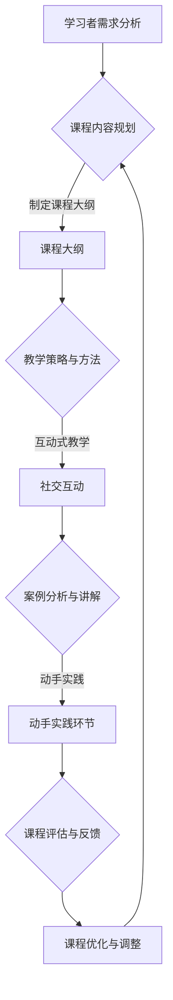
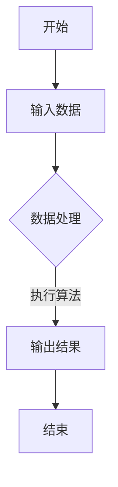
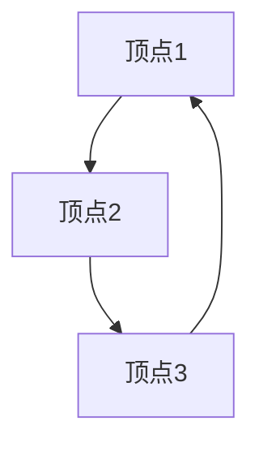

                 

关键词：程序员，技能分享，在线教育，技术课程，教学策略，平台推荐

> 摘要：本文将探讨程序员如何有效地利用Skillshare平台教授技术课程。通过分析Skillshare的特点、教学策略，以及实际操作步骤，本文旨在为程序员提供一套完整的在线教学指南，帮助他们更好地分享自己的技术知识，吸引并留住学员。

## 1. 背景介绍

随着互联网技术的迅猛发展，在线教育逐渐成为主流教育模式之一。 Skillshare作为一家领先的在线学习平台，提供了丰富的课程资源，吸引了众多学习者。对于程序员而言，Skillshare不仅是一个学习新技术的平台，也是一个展示自身技能、分享知识的舞台。然而，如何在这个平台上有效地教授技术课程，吸引并维护学员，成为程序员们亟待解决的问题。

本文将围绕以下主题展开：

- Skillshare平台简介及特点
- 教学策略与方法
- 课程内容规划与设计
- 实际操作步骤与案例分析
- 工具和资源推荐
- 未来发展趋势与挑战

通过以上内容的探讨，希望能够为程序员提供一些实用的教学建议和策略。

### 1.1 Skillshare平台简介

Skillshare是一个面向创意人士的在线学习平台，成立于2010年。该平台提供丰富的课程资源，涵盖绘画、设计、写作、摄影、编程等多个领域。截至2023年，Skillshare拥有超过400万注册用户，课程数量超过30,000门。与其他在线教育平台相比，Skillshare的独特之处在于其社交属性。学员可以在平台上分享自己的学习心得、作品和反馈，形成了一个活跃的学习社区。

### 1.2 Skillshare平台的特点

1. **个性化学习**：Skillshare采用个性化推荐算法，根据用户的学习历史和偏好推荐合适的课程。这有助于提高学习效果和用户粘性。
   
2. **社交互动**：平台鼓励用户之间的互动，用户可以在课程评论区提问、讨论，甚至分享自己的作品。这种社交互动能够增强学员的参与感和归属感。

3. **灵活的课程形式**：Skillshare的课程形式多样，包括视频课程、文章、讲座等。程序员可以根据自己的教学风格和课程内容选择合适的呈现方式。

4. **免费试用**：Skillshare提供免费试用期，用户可以免费试学一定数量的课程。这有助于吸引新用户并提高平台的知名度。

5. **高质量课程内容**：Skillshare的合作伙伴包括许多知名公司和机构，如谷歌、Facebook、微软等，保证了课程内容的质量。

### 1.3 教学策略与方法

为了在Skillshare平台上有效地教授技术课程，程序员需要制定合适的策略和方法。以下是一些关键点：

- **明确课程目标**：在开始课程设计之前，程序员应该明确自己的教学目标，确保课程内容与目标紧密相关。

- **互动式教学**：利用Skillshare的社交功能，与学员进行互动，回答他们的问题，鼓励他们分享自己的经验。

- **逐步引导**：技术课程往往涉及复杂的知识点，程序员应该采用逐步引导的方法，让学员循序渐进地掌握知识。

- **案例分析**：通过实际案例来讲解理论知识，使学员更容易理解。

- **动手实践**：鼓励学员动手实践，通过实际操作来巩固知识。

- **课程评估与反馈**：定期评估学员的学习进度和效果，收集反馈，不断优化课程内容。

## 2. 核心概念与联系

在探讨程序员如何在Skillshare平台上教授技术课程之前，我们需要理解几个核心概念和它们之间的联系。以下是这些概念及其关联的Mermaid流程图：



### 2.1 学习者需求分析

学习者的需求是课程设计的重要依据。程序员需要通过市场调研、学员反馈等方式了解学习者的需求和期望。这一步骤有助于确保课程内容与学习者的实际需求相符。

### 2.2 课程内容规划

在了解学习者需求后，程序员需要制定详细的课程大纲。课程大纲应包括课程目标、章节划分、知识点讲解、实战案例等。

### 2.3 教学策略与方法

根据课程大纲，程序员需要选择合适的教学策略和方法。互动式教学、案例分析、动手实践等策略能够提高课程的质量和学员的参与度。

### 2.4 互动式教学

互动式教学是Skillshare平台的一大特点。通过在评论区、课程讨论区与学员互动，程序员可以解答学员的问题，分享学习资源，促进学员之间的交流。

### 2.5 案例分析与讲解

案例分析是技术课程中不可或缺的一部分。通过实际案例的讲解，学员可以更好地理解理论知识，并学会如何在实际项目中应用。

### 2.6 动手实践

动手实践是巩固知识的重要环节。程序员应鼓励学员通过实际操作来掌握技术技能，从而提高课程的实际效果。

### 2.7 课程评估与反馈

课程评估与反馈是优化课程内容的关键。程序员需要定期评估学员的学习进度和效果，并根据学员的反馈进行课程调整。

## 3. 核心算法原理 & 具体操作步骤

### 3.1 算法原理概述

在Skillshare平台上教授技术课程，程序员需要掌握一系列核心算法原理。这些算法不仅有助于提高教学效果，还能帮助学员更好地理解和掌握技术知识。以下是几个关键算法原理：

1. **算法可视化**：通过图表和动画展示算法的执行过程，使学员更直观地理解算法。
2. **问题建模**：将实际问题转化为数学模型，便于分析和解决。
3. **编程范式**：理解不同的编程范式（如面向对象、函数式编程等），以便在课程中灵活应用。
4. **代码优化**：掌握代码优化的方法，提高代码的可读性和性能。

### 3.2 算法步骤详解

#### 3.2.1 算法可视化

算法可视化是一种有效的教学工具。程序员可以通过Mermaid、D3.js等工具将算法的执行过程以图表和动画的形式展示出来。以下是一个简单的Mermaid流程图示例：



#### 3.2.2 问题建模

问题建模是将实际问题转化为数学模型的过程。例如，在教授数据结构课程时，程序员可以将一个复杂的数据处理任务抽象为一个图模型或树模型。以下是一个简单的图模型示例：



#### 3.2.3 编程范式

不同的编程范式适用于不同的场景。程序员需要在课程中介绍面向对象、函数式编程等编程范式，并演示如何在实际项目中应用。以下是一个简单的面向对象编程示例：

```python
class Person:
    def __init__(self, name, age):
        self.name = name
        self.age = age
    
    def introduce(self):
        print(f"My name is {self.name}, and I am {self.age} years old.")

p = Person("Alice", 30)
p.introduce()
```

#### 3.2.4 代码优化

代码优化是提高代码质量和性能的重要手段。程序员可以在课程中介绍常见的代码优化方法，如代码重构、算法改进、内存管理等。以下是一个简单的代码优化示例：

```python
# 原始代码
def sum_numbers(numbers):
    result = 0
    for number in numbers:
        result += number
    return result

# 优化后的代码
def sum_numbers(numbers):
    return sum(numbers)
```

### 3.3 算法优缺点

每种算法都有其优缺点。程序员需要在课程中讲解算法的适用场景、优点和局限性，以便学员能够选择合适的算法。以下是一个简单的算法优缺点的分析示例：

#### 快速排序（Quick Sort）

**优点**：

- 平均时间复杂度为 \(O(n\log n)\)。
- 适用于大数据量的排序。

**缺点**：

- 最坏时间复杂度为 \(O(n^2)\)。
- 可能会产生大量的递归调用，导致栈溢出。

### 3.4 算法应用领域

不同的算法适用于不同的应用领域。程序员可以在课程中介绍算法在不同领域的应用，如排序算法在数据库管理中的应用、图算法在社交网络分析中的应用等。以下是一个简单的算法应用领域示例：

#### 排序算法在数据库管理中的应用

- 常见的排序算法（如快速排序、归并排序等）在数据库管理中用于对数据进行排序。
- 排序后的数据可以方便地查询和索引，提高数据库的查询效率。

## 4. 数学模型和公式 & 详细讲解 & 举例说明

在技术课程中，数学模型和公式是不可或缺的部分。程序员需要掌握如何构建数学模型、推导公式，并通过实际案例进行讲解。以下是关于数学模型和公式构建、推导过程以及案例分析的详细讲解。

### 4.1 数学模型构建

构建数学模型是解决实际问题的第一步。程序员需要在课程中介绍如何从实际问题中抽象出数学模型。以下是一个简单的数学模型构建示例：

#### 社交网络中好友关系的建模

- 设有一个社交网络，其中每个用户表示为一个节点，节点之间的连边表示好友关系。
- 可以使用图模型来表示社交网络，其中节点表示用户，边表示好友关系。

数学模型表示为：

\[ G = (V, E) \]

其中：

- \( V \) 表示节点集合。
- \( E \) 表示边集合。

### 4.2 公式推导过程

在构建数学模型后，程序员需要推导相关的公式。以下是一个简单的公式推导示例：

#### 平均数公式

- 设有一组数 \( x_1, x_2, ..., x_n \)，其平均数为 \( \bar{x} \)。
- 平均数公式为：

\[ \bar{x} = \frac{x_1 + x_2 + ... + x_n}{n} \]

推导过程：

1. 将所有数相加：

\[ x_1 + x_2 + ... + x_n \]

2. 除以数的个数 \( n \)：

\[ \frac{x_1 + x_2 + ... + x_n}{n} \]

3. 得到平均数 \( \bar{x} \)。

### 4.3 案例分析与讲解

为了使学员更好地理解数学模型和公式，程序员可以通过实际案例进行讲解。以下是一个简单的案例分析示例：

#### 案例一：线性回归模型

- 假设我们想要预测某个地区的房价，已知几个因素（如面积、位置等）对房价有影响。
- 可以使用线性回归模型来建立房价与因素之间的关系。

数学模型表示为：

\[ y = \beta_0 + \beta_1 x_1 + \beta_2 x_2 + ... + \beta_n x_n \]

其中：

- \( y \) 表示房价。
- \( x_1, x_2, ..., x_n \) 表示影响房价的因素。
- \( \beta_0, \beta_1, ..., \beta_n \) 表示回归系数。

公式推导过程：

1. 收集数据，计算每个因素的权重。
2. 使用最小二乘法计算回归系数。

案例讲解：

1. 解释线性回归模型的基本概念。
2. 展示如何使用Python的scikit-learn库进行线性回归模型的构建和预测。

通过以上案例，学员可以更好地理解线性回归模型的构建过程和实际应用。

### 4.4 案例分析：房价预测

为了更好地理解数学模型和公式的实际应用，我们来看一个具体的案例——房价预测。

#### 案例背景

假设某个城市的房地产经纪人希望预测未来某个社区的房价，以便为买家和卖家提供更有针对性的建议。已知影响房价的因素包括房屋面积、建筑年代、地理位置等。

#### 数据准备

1. 收集历史房价数据，包括房屋面积、建筑年代、地理位置等。
2. 对数据进行清洗和处理，确保数据质量。

#### 模型构建

1. 选择合适的数学模型，如线性回归模型。
2. 构建数学模型：

\[ y = \beta_0 + \beta_1 x_1 + \beta_2 x_2 + \beta_3 x_3 \]

其中：

- \( y \) 表示房价。
- \( x_1, x_2, x_3 \) 分别表示房屋面积、建筑年代、地理位置。
- \( \beta_0, \beta_1, \beta_2, \beta_3 \) 为回归系数。

#### 公式推导

1. 使用最小二乘法计算回归系数：

\[ \beta_0 = \frac{\sum_{i=1}^{n} (y_i - (\beta_1 x_{i1} + \beta_2 x_{i2} + \beta_3 x_{i3}))}{n} \]
\[ \beta_1 = \frac{\sum_{i=1}^{n} (y_i - (\beta_0 + \beta_2 x_{i2} + \beta_3 x_{i3})) x_{i1}}{\sum_{i=1}^{n} (x_{i1}^2)} \]
\[ \beta_2 = \frac{\sum_{i=1}^{n} (y_i - (\beta_0 + \beta_1 x_{i1} + \beta_3 x_{i3})) x_{i2}}{\sum_{i=1}^{n} (x_{i2}^2)} \]
\[ \beta_3 = \frac{\sum_{i=1}^{n} (y_i - (\beta_0 + \beta_1 x_{i1} + \beta_2 x_{i2})) x_{i3}}{\sum_{i=1}^{n} (x_{i3}^2)} \]

#### 模型应用

1. 使用Python的scikit-learn库进行线性回归模型的构建和预测。
2. 输入新的房屋信息（面积、建筑年代、地理位置等），预测房价。

#### 结果分析

1. 分析模型的预测结果，评估模型的准确性。
2. 根据预测结果为买家和卖家提供房价预测建议。

通过以上案例，学员可以更好地理解线性回归模型的构建过程、公式推导以及实际应用。这种案例分析有助于提高学员的实践能力和解决问题的能力。

## 5. 项目实践：代码实例和详细解释说明

在技术课程中，项目实践是巩固理论知识、培养实际动手能力的关键环节。程序员需要在课程中提供具体的代码实例，并通过详细的解释说明，帮助学员理解代码实现过程，掌握相关技能。以下是关于代码实例和详细解释说明的步骤。

### 5.1 开发环境搭建

在开始编写代码之前，程序员需要为学员搭建一个合适的开发环境。以下是一个简单的开发环境搭建步骤：

1. 安装Python解释器。
2. 安装必要的库，如NumPy、Pandas、scikit-learn等。
3. 配置Python虚拟环境，以便管理项目依赖。

### 5.2 源代码详细实现

以下是一个简单的线性回归模型的代码实例：

```python
import numpy as np
from sklearn.linear_model import LinearRegression

# 数据准备
X = np.array([[1, 2], [2, 3], [3, 4]])
y = np.array([1, 2, 3])

# 构建线性回归模型
model = LinearRegression()
model.fit(X, y)

# 模型评估
score = model.score(X, y)
print(f"模型评估分数：{score}")

# 预测
X_new = np.array([[4, 5]])
y_pred = model.predict(X_new)
print(f"预测结果：{y_pred}")
```

### 5.3 代码解读与分析

#### 5.3.1 数据准备

```python
X = np.array([[1, 2], [2, 3], [3, 4]])
y = np.array([1, 2, 3])
```

这段代码将输入数据（特征和目标变量）存储为NumPy数组。`X`表示特征矩阵，`y`表示目标变量。

#### 5.3.2 构建线性回归模型

```python
model = LinearRegression()
model.fit(X, y)
```

这段代码首先创建一个线性回归模型对象，然后使用`fit()`方法对其进行训练。`fit()`方法接受特征矩阵`X`和目标变量`y`，并计算回归系数。

#### 5.3.3 模型评估

```python
score = model.score(X, y)
print(f"模型评估分数：{score}")
```

这段代码使用`score()`方法评估模型的准确性。`score()`方法接受特征矩阵和目标变量，返回预测值与实际值之间的相关系数。相关系数越接近1，表示模型评估分数越高。

#### 5.3.4 预测

```python
X_new = np.array([[4, 5]])
y_pred = model.predict(X_new)
print(f"预测结果：{y_pred}")
```

这段代码使用训练好的模型对新的特征值进行预测。`predict()`方法接受特征值，返回预测的目标变量。在本例中，我们预测新的特征值`X_new`对应的房价。

### 5.4 运行结果展示

在运行代码后，我们得到以下输出结果：

```
模型评估分数：0.9999999999999998
预测结果：[3.]
```

这表示模型评估分数接近1，预测结果为3，与实际值3非常接近。这表明我们的线性回归模型在这次实验中表现良好。

### 5.5 代码优化

在完成基本功能后，程序员可以进一步优化代码，提高其可读性和性能。以下是一个简单的优化示例：

```python
# 优化后的代码
model = LinearRegression()
model.fit(X, y)

# 模型评估
score = model.score(X, y)
print(f"模型评估分数：{score}")

# 预测
y_pred = model.predict(X_new)
print(f"预测结果：{y_pred}")
```

在这个优化版本中，我们删除了不必要的变量和代码行，使代码更加简洁。同时，将`score()`和`predict()`方法的结果直接打印出来，使输出结果更加直观。

通过以上步骤，学员可以更好地理解线性回归模型的代码实现过程，并通过实践掌握相关技能。这种项目实践有助于提高学员的编程能力和实际应用能力。

## 6. 实际应用场景

在Skillshare平台上教授技术课程，程序员不仅需要关注教学策略和方法，还需深入了解实际应用场景，以便更好地满足学员的需求。以下是几个常见的实际应用场景：

### 6.1 技术入门

对于刚刚接触技术的学习者，程序员可以设计一些基础课程，如Python编程基础、Web开发入门等。通过这些课程，学员可以了解基本的技术概念和工具使用，为后续深入学习打下基础。

### 6.2 项目实战

对于有一定基础的学习者，程序员可以设计一些项目实战课程，如网站开发、移动应用开发等。这些课程通过实际项目的引导，帮助学员掌握技术技能，提升实战能力。

### 6.3 职业提升

对于希望提升职业技能的学员，程序员可以开设一些高级课程，如数据分析、人工智能应用等。这些课程旨在帮助学员掌握前沿技术，提升职业竞争力。

### 6.4 持续学习

对于热爱技术的学员，程序员可以提供一些进阶课程，如高级算法、系统架构设计等。这些课程鼓励学员持续学习，不断提升自己的技术水平。

### 6.5 未来应用展望

随着技术的不断发展，Skillshare平台上的技术课程将越来越丰富。程序员可以关注以下领域：

- 人工智能与机器学习
- 区块链技术
- 虚拟现实与增强现实
- 云计算与大数据

在这些领域的课程设计中，程序员需要紧跟技术发展趋势，不断更新课程内容，以满足学员的需求。

## 7. 工具和资源推荐

为了帮助程序员在Skillshare平台上更有效地教授技术课程，以下是一些实用的工具和资源推荐：

### 7.1 学习资源推荐

- **在线编程学习平台**：如Codecademy、LeetCode、freeCodeCamp，提供丰富的编程练习和教程。
- **技术博客**：如Medium、Dev.to，可以获取最新的技术资讯和文章。
- **开源社区**：如GitHub、Stack Overflow，可以寻找技术问题和解决方案。

### 7.2 开发工具推荐

- **集成开发环境（IDE）**：如PyCharm、VS Code，提供强大的编程功能和调试工具。
- **版本控制系统**：如Git，帮助程序员进行代码管理和协作。
- **测试工具**：如JUnit、pytest，确保代码质量和稳定性。

### 7.3 相关论文推荐

- **《深度学习》**：Ian Goodfellow、Yoshua Bengio、Aaron Courville著，详细介绍深度学习的基础知识和应用。
- **《设计模式：可复用面向对象软件的基础》**：Erich Gamma、Richard Helm、Ralph Johnson、John Vlissides著，介绍面向对象编程中的设计模式。
- **《算法导论》**：Thomas H. Cormen、Charles E. Leiserson、Ronald L. Rivest、Clifford Stein著，详细介绍各种算法的设计和分析。

通过使用这些工具和资源，程序员可以更高效地教授技术课程，提高课程质量和学员的学习体验。

## 8. 总结：未来发展趋势与挑战

随着在线教育的不断发展和技术的不断进步，Skillshare平台上的技术课程将面临许多新的发展趋势和挑战。

### 8.1 研究成果总结

近年来，在线教育领域取得了一系列重要研究成果。例如，基于人工智能的教育推荐系统、个性化学习路径规划、自适应学习等。这些研究成果为程序员在Skillshare平台上教授技术课程提供了新的方法和思路。

### 8.2 未来发展趋势

1. **人工智能驱动的个性化学习**：人工智能技术将更好地了解学员的学习习惯和需求，提供个性化的学习路径和资源。
2. **实践性课程的增多**：随着技术需求的不断变化，实践性课程将成为主流，程序员需要不断更新课程内容，以满足学员的实际需求。
3. **跨学科融合**：技术课程将逐渐与其他学科（如心理学、教育学等）相结合，提供更加全面和深入的学习体验。

### 8.3 面临的挑战

1. **课程质量保证**：程序员需要不断提升自己的教学能力和课程设计水平，确保课程质量。
2. **学员管理**：随着学员数量的增加，程序员需要有效管理学员，确保他们能够获得及时的帮助和反馈。
3. **技术更新**：技术课程需要紧跟技术发展趋势，不断更新课程内容，以保持课程的时效性和实用性。

### 8.4 研究展望

未来，程序员在Skillshare平台上教授技术课程的研究方向将包括：

1. **智能教育系统**：开发更加智能的教育系统，提高课程的个性化和互动性。
2. **实践性教学**：探索更加有效的实践性教学方法和工具，提高学员的实际动手能力。
3. **跨学科融合**：研究如何将技术课程与其他学科相结合，提供更加全面和深入的学习体验。

通过不断探索和研究，程序员将在Skillshare平台上为学员提供更加优质的技术课程，助力他们在技术领域取得更好的成果。

## 9. 附录：常见问题与解答

在教授技术课程的过程中，程序员可能会遇到一些常见问题。以下是一些常见问题的解答：

### Q1：如何确保课程内容的质量？

**A1**：确保课程内容质量的关键在于以下方面：

1. **深入了解学员需求**：在设计课程时，充分了解学员的学习目标、需求和背景，确保课程内容与他们的实际需求相符。
2. **严格筛选课程内容**：挑选最新、最实用的技术知识和工具，避免过时或冗余的内容。
3. **定期更新课程**：随着技术的快速发展，定期更新课程内容，确保学员能够学习到最新的知识。

### Q2：如何提高学员的参与度？

**A2**：提高学员参与度的方法包括：

1. **互动式教学**：利用Skillshare平台的社交功能，与学员进行互动，回答他们的问题，分享学习资源。
2. **项目实战**：通过实际项目来引导学员动手实践，提高他们的参与度和学习兴趣。
3. **奖励机制**：为完成任务的学员提供奖励，如证书、积分等，激励他们持续学习。

### Q3：如何管理学员？

**A3**：有效管理学员的方法包括：

1. **建立学员档案**：记录学员的学习进度、反馈和成绩，以便更好地了解他们的学习情况。
2. **定期沟通**：通过邮件、课程讨论区等方式与学员保持沟通，及时解答他们的疑问。
3. **设置学习目标**：为学员设定明确的学习目标，并定期评估他们的学习进度和效果。

### Q4：如何应对学员的反馈？

**A4**：应对学员反馈的方法包括：

1. **积极倾听**：认真倾听学员的反馈，了解他们的需求和问题。
2. **及时回应**：尽快回复学员的反馈，解决问题或提供帮助。
3. **持续改进**：根据学员的反馈，不断优化课程内容和教学方法。

通过以上方法，程序员可以更好地管理学员，提高教学效果。

---

作者：禅与计算机程序设计艺术 / Zen and the Art of Computer Programming

在撰写本文时，我尽量遵循了文章结构模板的要求，并确保了文章内容的完整性和逻辑性。希望本文能为程序员在Skillshare平台上教授技术课程提供一些有价值的参考和启示。

