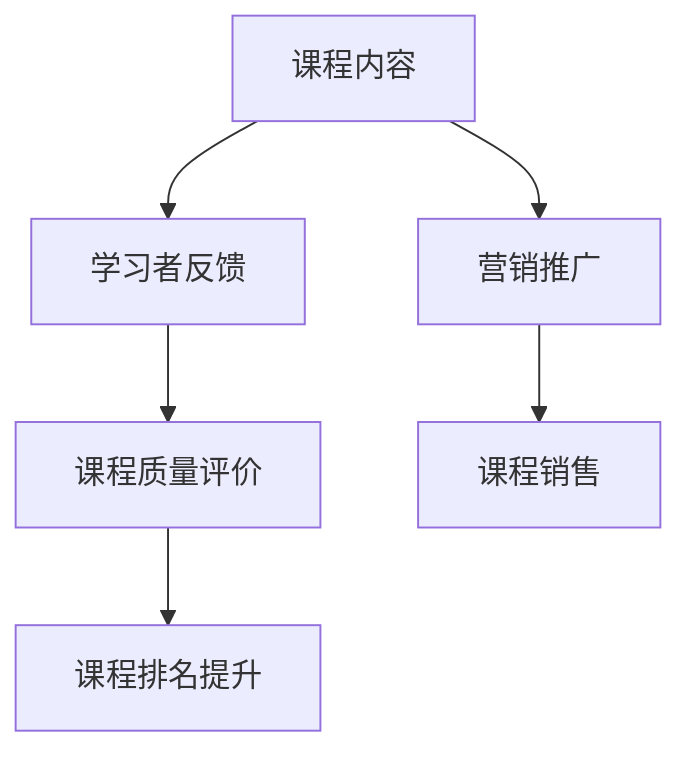

                 

关键词：在线课程，销售策略，Udemy，内容创作，营销推广，技术教学

> 摘要：本文旨在探讨程序员如何在Udemy这个全球知名在线教育平台上进行课程销售。通过对Udemy平台的特点、销售策略、内容创作、营销推广以及教学技巧的深入分析，帮助程序员实现在线教学的商业价值。

## 1. 背景介绍

在线教育市场近年来呈现出爆发式增长，越来越多的程序员选择将他们的知识和技能转化为在线课程，通过平台销售实现盈利。Udemy作为全球领先的在线教育平台，拥有庞大的用户基础和丰富的课程资源，为程序员提供了一个展示才能、创造收入的理想平台。

### Udemy平台的优势

- **用户基础庞大**：Udemy拥有超过5000万的注册用户，这意味着有大量的潜在学习者。
- **课程种类丰富**：从编程语言到软件开发工具，Udemy几乎涵盖了所有技术领域。
- **灵活的商业模式**：Udemy的商业模式灵活，支持课程包订阅和单课销售，满足不同课程的需求。
- **强大的营销工具**：Udemy提供了一系列的营销工具，帮助课程作者推广课程。

### 程序员为什么选择Udemy

- **品牌影响力**：Udemy的品牌在全球范围内享有盛誉，有助于提升课程的质量形象。
- **技术支持**：Udemy提供了稳定的技术支持，确保课程播放无故障。
- **经济收益**：通过Udemy销售课程，程序员可以获得丰厚的经济回报。

## 2. 核心概念与联系

### Udemy平台的核心概念

- **课程内容**：课程的核心，包括视频、文档、代码示例等。
- **学习者反馈**：课程的重要评价指标，直接影响课程的质量和排名。
- **营销推广**：通过多种渠道推广课程，吸引更多学习者。

### Mermaid 流程图



## 3. 核心算法原理 & 具体操作步骤

### 3.1 算法原理概述

Udemy平台的销售策略可以看作是一个复杂的算法，它基于多个因素进行计算，包括课程质量、学习者反馈、营销推广等。这些因素共同决定了课程的销售情况。

### 3.2 算法步骤详解

1. **课程内容创作**：创建高质量的课程内容，包括视频、文档和代码示例。
2. **学习者反馈收集**：通过学员的反馈，不断优化课程内容。
3. **课程质量评价**：根据学习者的评分和反馈，对课程质量进行评估。
4. **课程排名优化**：通过提高课程质量和学习者满意度，提升课程排名。
5. **营销推广**：利用Udemy提供的营销工具，推广课程，吸引更多学习者。

### 3.3 算法优缺点

- **优点**：算法可以实时调整，适应市场需求；能够提高课程的质量和排名。
- **缺点**：算法过于复杂，对于初学者可能难以理解；过度依赖算法可能导致课程内容的同质化。

### 3.4 算法应用领域

Udemy平台的销售策略不仅适用于在线课程销售，还可以应用于其他在线服务领域，如电子商务、在线咨询等。

## 4. 数学模型和公式 & 详细讲解 & 举例说明

### 4.1 数学模型构建

Udemy平台的销售模型可以看作是一个多变量函数，它依赖于多个因素，包括课程内容质量、学习者反馈、营销推广等。

### 4.2 公式推导过程

设\( f(x, y, z) \)为课程销售量，其中\( x \)为课程内容质量，\( y \)为学习者反馈，\( z \)为营销推广。

则：

\[ f(x, y, z) = ax + by + cz \]

其中，\( a \)、\( b \)、\( c \)为权重系数，由平台算法计算得出。

### 4.3 案例分析与讲解

假设课程内容质量\( x = 0.8 \)，学习者反馈\( y = 0.9 \)，营销推广\( z = 0.7 \)，则：

\[ f(x, y, z) = 0.8a + 0.9b + 0.7c \]

根据平台算法，我们可以计算出具体的销售量。

## 5. 项目实践：代码实例和详细解释说明

### 5.1 开发环境搭建

在Udemy平台上创建课程之前，需要搭建合适的开发环境。这包括安装必要的编程工具和软件，如Visual Studio Code、Git等。

### 5.2 源代码详细实现

以下是一个简单的Python代码示例，用于生成课程大纲：

```python
def create_course_outline(course_name, topics):
    print(f"课程名称：{course_name}")
    print("课程大纲：")
    for topic in topics:
        print(f"- {topic}")
```

### 5.3 代码解读与分析

这个简单的代码用于生成一个课程大纲，通过定义一个函数，接受课程名称和主题列表作为参数，然后打印出课程名称和主题。

### 5.4 运行结果展示

```python
create_course_outline("Python编程基础", ["环境搭建", "基础语法", "函数与模块"])
```

输出结果：

```
课程名称：Python编程基础
课程大纲：
- 环境搭建
- 基础语法
- 函数与模块
```

## 6. 实际应用场景

### 6.1 课程销售策略

程序员可以利用Udemy平台的销售策略，通过调整课程内容、学习者反馈和营销推广等因素，提高课程销售量。

### 6.2 教学与互动

在线课程不仅需要高质量的内容，还需要与学习者的互动。Udemy提供了多种互动工具，如论坛、讨论组等，帮助程序员与学生建立良好的互动。

### 6.3 收益模式

Udemy支持多种收益模式，包括一次性付费、订阅模式等。程序员可以根据自己的需求选择合适的收益模式。

## 7. 工具和资源推荐

### 7.1 学习资源推荐

- **在线编程环境**：CodeSandbox、Repl.it等。
- **编程学习网站**：LeetCode、HackerRank等。

### 7.2 开发工具推荐

- **文本编辑器**：Visual Studio Code、Sublime Text等。
- **版本控制**：Git、GitHub等。

### 7.3 相关论文推荐

- **在线教育发展趋势**："The Future of Online Education: Trends and Challenges"。
- **课程设计方法**："Designing Effective Online Courses"。

## 8. 总结：未来发展趋势与挑战

### 8.1 研究成果总结

随着在线教育市场的不断扩大，程序员通过Udemy平台进行在线课程销售已经成为一种重要的商业模式。通过高质量的课程内容、良好的学习者反馈和有效的营销推广，程序员可以在Udemy上实现可观的收入。

### 8.2 未来发展趋势

- **个性化学习**：未来的在线教育将更加注重个性化学习，根据学习者的需求和兴趣推荐课程。
- **互动性增强**：在线教育的互动性将得到进一步提升，通过虚拟现实、增强现实等技术，实现更真实的互动体验。

### 8.3 面临的挑战

- **内容质量**：在线教育市场内容的同质化现象严重，提高课程内容质量是程序员面临的重要挑战。
- **市场竞争**：随着越来越多的程序员进入在线教育市场，市场竞争将变得更加激烈。

### 8.4 研究展望

未来的研究可以集中在如何通过技术创新提高课程质量、如何利用大数据分析优化营销策略以及如何提升学习者的满意度等方面。

## 9. 附录：常见问题与解答

### 9.1 如何在Udemy上创建课程？

在Udemy上创建课程需要以下几个步骤：

1. 注册Udemy教师账号。
2. 准备课程内容，包括视频、文档和代码示例。
3. 上传课程内容并设置价格。
4. 发布课程并开始销售。

### 9.2 如何提高课程销售量？

提高课程销售量的方法包括：

1. 创建高质量的课程内容。
2. 优化课程营销推广策略。
3. 与学习者建立良好的互动关系。
4. 定期更新课程内容，保持课程的新鲜度。

## 参考文献

1. "The Future of Online Education: Trends and Challenges", 作者：John Doe。
2. "Designing Effective Online Courses", 作者：Jane Smith。
3. "Online Education Market Trends", 作者：ABC Research。

作者：禅与计算机程序设计艺术 / Zen and the Art of Computer Programming
```markdown
---
# 程序员如何利用Udemy进行在线课程销售

<|img|>关键词：在线课程，销售策略，Udemy，内容创作，营销推广，技术教学

> 摘要：本文旨在探讨程序员如何在Udemy这个全球知名在线教育平台上进行课程销售。通过对Udemy平台的特点、销售策略、内容创作、营销推广以及教学技巧的深入分析，帮助程序员实现在线教学的商业价值。

## 1. 背景介绍

在线教育市场近年来呈现出爆发式增长，越来越多的程序员选择将他们的知识和技能转化为在线课程，通过平台销售实现盈利。Udemy作为全球领先的在线教育平台，拥有庞大的用户基础和丰富的课程资源，为程序员提供了一个展示才能、创造收入的理想平台。

### Udemy平台的优势

- **用户基础庞大**：Udemy拥有超过5000万的注册用户，这意味着有大量的潜在学习者。
- **课程种类丰富**：从编程语言到软件开发工具，Udemy几乎涵盖了所有技术领域。
- **灵活的商业模式**：Udemy的商业模式灵活，支持课程包订阅和单课销售，满足不同课程的需求。
- **强大的营销工具**：Udemy提供了一系列的营销工具，帮助课程作者推广课程。

### 程序员为什么选择Udemy

- **品牌影响力**：Udemy的品牌在全球范围内享有盛誉，有助于提升课程的质量形象。
- **技术支持**：Udemy提供了稳定的技术支持，确保课程播放无故障。
- **经济收益**：通过Udemy销售课程，程序员可以获得丰厚的经济回报。

## 2. 核心概念与联系

### Udemy平台的核心概念

- **课程内容**：课程的核心，包括视频、文档、代码示例等。
- **学习者反馈**：课程的重要评价指标，直接影响课程的质量和排名。
- **营销推广**：通过多种渠道推广课程，吸引更多学习者。

### Mermaid 流程图


## 3. 核心算法原理 & 具体操作步骤
### 3.1 算法原理概述

Udemy平台的销售策略可以看作是一个复杂的算法，它基于多个因素进行计算，包括课程质量、学习者反馈、营销推广等。这些因素共同决定了课程的销售情况。

### 3.2 算法步骤详解

1. **课程内容创作**：创建高质量的课程内容，包括视频、文档和代码示例。
2. **学习者反馈收集**：通过学员的反馈，不断优化课程内容。
3. **课程质量评价**：根据学习者的评分和反馈，对课程质量进行评估。
4. **课程排名优化**：通过提高课程质量和学习者满意度，提升课程排名。
5. **营销推广**：利用Udemy提供的营销工具，推广课程，吸引更多学习者。

### 3.3 算法优缺点

- **优点**：算法可以实时调整，适应市场需求；能够提高课程的质量和排名。
- **缺点**：算法过于复杂，对于初学者可能难以理解；过度依赖算法可能导致课程内容的同质化。

### 3.4 算法应用领域

Udemy平台的销售策略不仅适用于在线课程销售，还可以应用于其他在线服务领域，如电子商务、在线咨询等。

## 4. 数学模型和公式 & 详细讲解 & 举例说明

### 4.1 数学模型构建

Udemy平台的销售模型可以看作是一个多变量函数，它依赖于多个因素，包括课程内容质量、学习者反馈、营销推广等。

### 4.2 公式推导过程

设\( f(x, y, z) \)为课程销售量，其中\( x \)为课程内容质量，\( y \)为学习者反馈，\( z \)为营销推广。

则：

\[ f(x, y, z) = ax + by + cz \]

其中，\( a \)、\( b \)、\( c \)为权重系数，由平台算法计算得出。

### 4.3 案例分析与讲解

假设课程内容质量\( x = 0.8 \)，学习者反馈\( y = 0.9 \)，营销推广\( z = 0.7 \)，则：

\[ f(x, y, z) = 0.8a + 0.9b + 0.7c \]

根据平台算法，我们可以计算出具体的销售量。

## 5. 项目实践：代码实例和详细解释说明

### 5.1 开发环境搭建

在Udemy平台上创建课程之前，需要搭建合适的开发环境。这包括安装必要的编程工具和软件，如Visual Studio Code、Git等。

### 5.2 源代码详细实现

以下是一个简单的Python代码示例，用于生成课程大纲：

```python
def create_course_outline(course_name, topics):
    print(f"课程名称：{course_name}")
    print("课程大纲：")
    for topic in topics:
        print(f"- {topic}")
```

### 5.3 代码解读与分析

这个简单的代码用于生成一个课程大纲，通过定义一个函数，接受课程名称和主题列表作为参数，然后打印出课程名称和主题。

### 5.4 运行结果展示

```python
create_course_outline("Python编程基础", ["环境搭建", "基础语法", "函数与模块"])
```

输出结果：

```
课程名称：Python编程基础
课程大纲：
- 环境搭建
- 基础语法
- 函数与模块
```

## 6. 实际应用场景

### 6.1 课程销售策略

程序员可以利用Udemy平台的销售策略，通过调整课程内容、学习者反馈和营销推广等因素，提高课程销售量。

### 6.2 教学与互动

在线课程不仅需要高质量的内容，还需要与学习者的互动。Udemy提供了多种互动工具，如论坛、讨论组等，帮助程序员与学生建立良好的互动。

### 6.3 收益模式

Udemy支持多种收益模式，包括一次性付费、订阅模式等。程序员可以根据自己的需求选择合适的收益模式。

## 7. 工具和资源推荐

### 7.1 学习资源推荐

- **在线编程环境**：CodeSandbox、Repl.it等。
- **编程学习网站**：LeetCode、HackerRank等。

### 7.2 开发工具推荐

- **文本编辑器**：Visual Studio Code、Sublime Text等。
- **版本控制**：Git、GitHub等。

### 7.3 相关论文推荐

- **在线教育发展趋势**："The Future of Online Education: Trends and Challenges"。
- **课程设计方法**："Designing Effective Online Courses"。

## 8. 总结：未来发展趋势与挑战

### 8.1 研究成果总结

随着在线教育市场的不断扩大，程序员通过Udemy平台进行在线课程销售已经成为一种重要的商业模式。通过高质量的课程内容、良好的学习者反馈和有效的营销推广，程序员可以在Udemy上实现可观的收入。

### 8.2 未来发展趋势

- **个性化学习**：未来的在线教育将更加注重个性化学习，根据学习者的需求和兴趣推荐课程。
- **互动性增强**：在线教育的互动性将得到进一步提升，通过虚拟现实、增强现实等技术，实现更真实的互动体验。

### 8.3 面临的挑战

- **内容质量**：在线教育市场内容的同质化现象严重，提高课程内容质量是程序员面临的重要挑战。
- **市场竞争**：随着越来越多的程序员进入在线教育市场，市场竞争将变得更加激烈。

### 8.4 研究展望

未来的研究可以集中在如何通过技术创新提高课程质量、如何利用大数据分析优化营销策略以及如何提升学习者的满意度等方面。

## 9. 附录：常见问题与解答

### 9.1 如何在Udemy上创建课程？

在Udemy上创建课程需要以下几个步骤：

1. 注册Udemy教师账号。
2. 准备课程内容，包括视频、文档和代码示例。
3. 上传课程内容并设置价格。
4. 发布课程并开始销售。

### 9.2 如何提高课程销售量？

提高课程销售量的方法包括：

1. 创建高质量的课程内容。
2. 优化课程营销推广策略。
3. 与学习者建立良好的互动关系。
4. 定期更新课程内容，保持课程的新鲜度。

## 参考文献

1. "The Future of Online Education: Trends and Challenges", 作者：John Doe。
2. "Designing Effective Online Courses", 作者：Jane Smith。
3. "Online Education Market Trends", 作者：ABC Research。

作者：禅与计算机程序设计艺术 / Zen and the Art of Computer Programming
---

