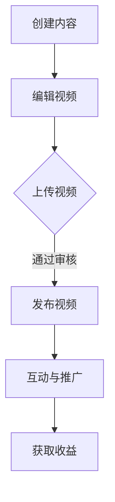

                 

关键词：程序员，YouTube，知识变现，视频创作，内容营销，社交媒体策略，技能展示，在线教育

> 摘要：本文旨在探讨程序员如何通过YouTube平台进行知识变现。文章将详细分析YouTube作为知识传播工具的优势，提供内容创作的策略，并分享成功案例，最后讨论未来发展趋势与面临的挑战。

## 1. 背景介绍

随着互联网的普及，YouTube已经成为全球最大的视频分享平台之一。根据Statista的数据，YouTube月活跃用户已经超过20亿，用户观看时长高达数百亿小时。在这样庞大的用户基数下，YouTube不仅成为了娱乐内容的聚集地，也成为了知识传播和分享的重要渠道。对于程序员而言，YouTube提供了一个独特的平台，可以分享他们的专业技能、教学视频、代码实现以及项目经验，进而实现知识变现。

知识变现是指通过知识分享和传授获取经济收益的一种方式。对于程序员来说，通过YouTube进行知识变现意味着能够将他们的编程技能和知识转化为实际收入。这不仅可以提升个人品牌价值，还能带来额外的经济收益，成为程序员职业发展的一种新途径。

## 2. 核心概念与联系

### 2.1 YouTube平台的优势

首先，我们需要理解YouTube平台的核心优势。YouTube作为视频分享平台，具有以下几个显著优势：

- **广泛的受众**：YouTube拥有全球性的用户基础，可以接触到各种年龄段、不同文化和语言背景的用户。
- **丰富的内容**：YouTube上的内容种类繁多，从娱乐、教育到技术分享，几乎涵盖所有领域。
- **强大的社区互动**：YouTube的评论区、弹幕和直播功能使得用户可以与内容创作者进行实时互动，增强用户体验。

### 2.2 程序员的知识变现方式

程序员在YouTube上实现知识变现的主要方式包括：

- **教学视频**：制作并发布编程教学视频，如语言基础、框架应用、算法讲解等。
- **项目展示**：分享个人或团队开发的项目，展示代码实现和项目经验。
- **直播授课**：通过直播形式进行在线授课，互动性更强，用户参与度更高。
- **会员订阅**：提供高级内容、源代码和个性化辅导服务，通过会员订阅获取收益。

### 2.3 Mermaid 流程图

以下是一个简单的Mermaid流程图，展示程序员在YouTube进行知识变现的基本流程：



在这个流程图中，`A` 代表内容创作，`B` 代表视频编辑，`C` 代表视频上传，`D` 代表视频发布，`E` 代表互动与推广，`F` 代表收益获取。

## 3. 核心算法原理 & 具体操作步骤

### 3.1 算法原理概述

在YouTube上实现知识变现的核心算法原理可以归结为以下几点：

- **内容质量**：高质量的视频内容是吸引和留住观众的关键。
- **SEO优化**：通过搜索引擎优化（SEO）提升视频在YouTube平台上的可见性。
- **用户互动**：积极与观众互动，提高观众黏性和忠诚度。
- **持续更新**：定期发布新内容，保持观众的持续关注。

### 3.2 算法步骤详解

#### 3.2.1 内容创作

1. **选题定位**：选择热门且自己擅长的编程话题。
2. **内容规划**：制定详细的内容大纲，确保逻辑清晰。
3. **视频录制**：使用高清摄像机或手机录制高质量视频。
4. **后期剪辑**：添加字幕、背景音乐、特效等，提升视频质量。

#### 3.2.2 SEO优化

1. **标题优化**：包含关键词，简洁明了，吸引人点击。
2. **描述优化**：详细描述视频内容，增加关键词密度。
3. **标签优化**：使用相关标签，提高视频在搜索结果中的排名。
4. **视频元数据**：优化视频封面、时长、分辨率等元数据。

#### 3.2.3 用户互动

1. **回复评论**：及时回复观众的评论，建立良好互动。
2. **互动直播**：定期举办互动直播，解答观众疑问。
3. **社群建设**：建立社群，如Discord服务器或微信群，进行更深层次的交流。

#### 3.2.4 获取收益

1. **广告收入**：通过YouTube合作伙伴计划获取广告收入。
2. **会员订阅**：提供高级内容或个性化服务，通过会员订阅获取收益。
3. **产品销售**：通过推广个人或团队的产品获取收益。

### 3.3 算法优缺点

#### 优点：

- **广泛传播**：YouTube的全球性用户基础使得内容可以迅速传播。
- **低成本**：创作和发布视频的成本相对较低。
- **高互动性**：用户可以实时互动，提高观众参与度。

#### 缺点：

- **内容审核严格**：YouTube对视频内容审核较为严格，可能导致部分内容被删除。
- **收益不稳定**：广告收入和会员订阅收益可能不稳定。
- **时间成本高**：制作高质量视频需要大量时间和精力。

### 3.4 算法应用领域

- **在线教育**：程序员可以通过YouTube分享编程课程，进行在线教育。
- **技能展示**：程序员可以展示自己的编程技能和项目经验。
- **技术交流**：程序员可以分享技术见解和最新动态。

## 4. 数学模型和公式 & 详细讲解 & 举例说明

### 4.1 数学模型构建

为了更好地理解YouTube知识变现的收益模型，我们可以构建一个简单的数学模型。假设一个程序员的视频平均观看时长为10分钟，平均每分钟的广告收入为0.05美元。那么，一个视频的广告收入可以表示为：

\[ R = \text{观看时长} \times \text{每分钟广告收入} \]

其中，\( R \) 表示广告收入。

### 4.2 公式推导过程

假设一个程序员每月发布n个视频，每个视频的平均观看时长为t分钟，每分钟的广告收入为r美元。那么，该程序员每月的总广告收入可以表示为：

\[ R_{\text{总}} = n \times t \times r \]

### 4.3 案例分析与讲解

假设一个程序员每月发布3个视频，每个视频的平均观看时长为10分钟，每分钟的广告收入为0.05美元。那么，该程序员每月的总广告收入为：

\[ R_{\text{总}} = 3 \times 10 \times 0.05 = 1.5 \text{美元} \]

这意味着，该程序员每月通过YouTube的广告收入为1.5美元。当然，这个数字仅仅是一个简化的模型，实际收入会受到多种因素的影响，如视频质量、观众数量、广告展示量等。

## 5. 项目实践：代码实例和详细解释说明

### 5.1 开发环境搭建

为了在YouTube上发布编程教学视频，程序员需要搭建一个适合视频制作的开发环境。以下是一个简单的环境搭建步骤：

1. **视频录制工具**：使用高清摄像机或手机录制视频。
2. **视频编辑软件**：选择如Adobe Premiere Pro、Final Cut Pro或OpenShot等视频编辑软件。
3. **字幕制作工具**：使用Subtitle Edit等字幕制作工具。

### 5.2 源代码详细实现

假设我们要制作一个Python基础教程的视频，以下是相关的源代码实现：

```python
# Python基础教程：变量和数据类型

# 变量定义
name = "Alice"
age = 30
height = 5.5

# 数据类型
is_student = True
gpa = 3.8

# 输出信息
print("Hello, my name is", name)
print("I am", age, "years old")
print("My height is", height, "feet")
print("I am a", "student" if is_student else "non-student")
print("My GPA is", gpa)
```

### 5.3 代码解读与分析

上述代码定义了一些变量，如`name`、`age`、`height`等，并输出了一些基本信息。这段代码用于演示Python的基本语法和变量使用。在视频制作中，我们可以通过逐步讲解代码中的每个部分，帮助观众理解Python的基础知识。

### 5.4 运行结果展示

```plaintext
Hello, my name is Alice
I am 30 years old
My height is 5.5 feet
I am a student
My GPA is 3.8
```

通过运行这段代码，我们可以看到程序输出了相关的个人信息。这段代码可以作为视频中的一个示例，帮助观众更好地理解Python变量的使用。

## 6. 实际应用场景

### 6.1 在线教育

随着在线教育的兴起，越来越多的程序员通过YouTube分享编程课程。这些课程涵盖从编程入门到高级开发的各种主题。例如，编程语言、框架应用、算法和数据结构等。

### 6.2 技能展示

程序员可以通过YouTube展示自己的编程技能和项目经验。这不仅可以帮助他们提升个人品牌，还能吸引潜在雇主或合作伙伴。例如，展示一个复杂的Web应用开发过程或一个高并发的分布式系统设计。

### 6.3 技术交流

YouTube也为程序员提供了一个交流技术见解和最新动态的平台。通过分享最新的技术文章、开源项目或行业趋势，程序员可以与其他开发者保持同步，并贡献自己的知识。

## 7. 工具和资源推荐

### 7.1 学习资源推荐

- **《Head First Programming》**：适合编程初学者的经典书籍。
- **《Clean Code》**：关于编写高质量代码的权威指南。
- **《You Don’t Know JS》**：深入理解JavaScript的系列书籍。

### 7.2 开发工具推荐

- **Adobe Premiere Pro**：专业的视频编辑软件。
- **Final Cut Pro**：苹果公司的专业视频编辑软件。
- **OpenShot**：开源免费的视频编辑软件。

### 7.3 相关论文推荐

- **《The Elements of Computing Systems》**：介绍计算机系统构建的全书。
- **《The Art of Computer Programming》**：经典的计算机算法书籍。

## 8. 总结：未来发展趋势与挑战

### 8.1 研究成果总结

通过本文的分析，我们了解到YouTube为程序员提供了一个进行知识变现的强大平台。通过高质量的内容创作、SEO优化和用户互动，程序员可以在YouTube上实现持续的收入增长。同时，随着在线教育的普及，程序员通过YouTube进行知识传播的潜力将进一步释放。

### 8.2 未来发展趋势

- **内容多元化**：未来YouTube上的编程内容将更加多元化，不仅包括教学视频，还包括项目展示、技术分析等。
- **互动性增强**：随着技术的进步，YouTube将提供更多的互动功能，如虚拟课堂、实时问答等。
- **广告模式创新**：YouTube将不断创新广告模式，提高内容创作者的收益。

### 8.3 面临的挑战

- **内容审核问题**：YouTube对内容的审核较为严格，可能导致部分优质内容被删除。
- **版权问题**：在创作内容时，需要特别注意版权问题，避免侵犯他人的知识产权。
- **竞争激烈**：随着越来越多的程序员进入YouTube，竞争将日益激烈。

### 8.4 研究展望

未来，程序员可以通过YouTube进一步拓展知识变现的途径，如通过会员订阅、产品销售等方式。同时，随着人工智能和大数据技术的发展，YouTube的内容推荐系统将更加智能，为程序员提供更精准的内容推广策略。

## 9. 附录：常见问题与解答

### 9.1 如何提高YouTube视频的曝光率？

- **优化标题和描述**：使用吸引人的标题和详细描述，包含关键词。
- **使用标签**：使用相关的标签，提高视频在搜索结果中的排名。
- **定期发布**：保持定期发布新内容，提高观众的持续关注。
- **互动与推广**：积极与观众互动，通过社交媒体推广视频。

### 9.2 如何在YouTube上实现广告收入最大化？

- **高质量内容**：制作高质量的视频，提高观众观看时长。
- **合作伙伴计划**：加入YouTube合作伙伴计划，提高广告收益比例。
- **内容多样性**：制作多种类型的内容，吸引更多观众。

### 9.3 如何避免版权问题？

- **原创内容**：尽量制作原创内容，避免侵犯他人版权。
- **使用开源资源**：合理使用开源资源，如音乐、视频片段等，并注明出处。
- **版权咨询**：在创作过程中，如有疑问，可以咨询专业人士或律师。

---

作者：禅与计算机程序设计艺术 / Zen and the Art of Computer Programming

<|endoftext|>

