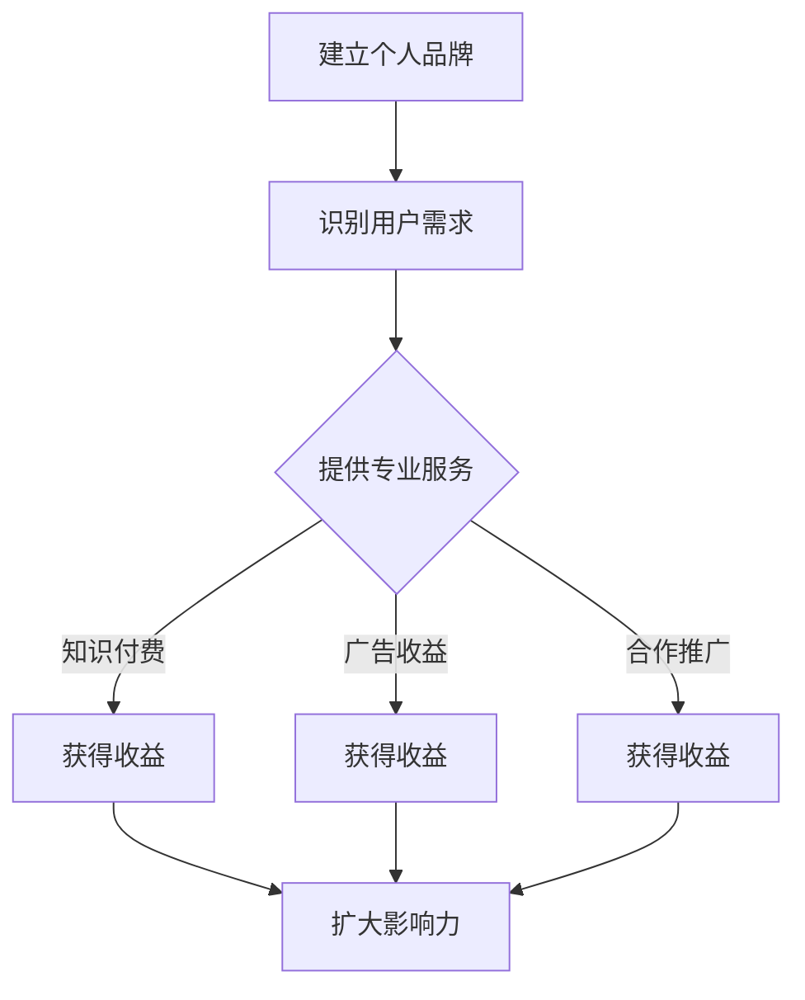

                 

关键词：微信群、知识变现、程序员、社交媒体、商业模式

> 摘要：随着社交媒体的普及，微信群已经成为程序员进行知识分享和知识变现的重要平台。本文将探讨程序员如何通过微信群进行知识变现，包括建立个人品牌、提供专业服务和创造商业价值的方法和策略。

## 1. 背景介绍

随着互联网技术的发展，社交媒体已经成为人们生活中不可或缺的一部分。微信群作为中国最受欢迎的社交媒体之一，其强大的社交功能和高度的互动性，为程序员提供了一个广阔的舞台，通过知识分享实现个人品牌的建立和商业价值的创造。

### 1.1 程序员在微信群中的角色

在微信群中，程序员的角色可以多种多样，包括但不限于：

- **知识分享者**：通过分享编程技巧、技术心得和项目经验，帮助他人解决问题。
- **技术咨询顾问**：为有技术需求的企业或个人提供专业的技术咨询服务。
- **教育培训者**：开设线上课程，传授编程知识和技能。

### 1.2 微信群的优势

微信群具有以下优势，使其成为程序员进行知识变现的理想平台：

- **庞大的用户基础**：微信月活跃用户数超过10亿，具有广泛的受众。
- **高效的传播途径**：微信群内的信息传播速度快，互动性强。
- **多元化的互动形式**：支持文字、图片、语音、视频等多种形式的内容传播。

## 2. 核心概念与联系

为了更好地理解程序员如何在微信群中进行知识变现，我们首先需要了解以下几个核心概念：

### 2.1 个人品牌

个人品牌是指一个人在公众心目中的形象和认知。在微信群中，程序员通过分享专业知识和经验，建立自己的专业形象，吸引更多关注和信任。

### 2.2 用户需求

用户需求是指微信群中的用户在技术学习和应用方面的需求。了解用户需求有助于程序员提供更有针对性的服务，提高变现效果。

### 2.3 商业模式

商业模式是指程序员通过微信群实现知识变现的具体方法。常见的商业模式包括知识付费、广告收益和合作推广等。

### 2.4 Mermaid 流程图

以下是程序员在微信群中进行知识变现的 Mermaid 流程图：



## 3. 核心算法原理 & 具体操作步骤

### 3.1 算法原理概述

程序员在微信群中进行知识变现的核心算法原理可以概括为：

1. **内容创作与分享**：通过创作有价值的技术内容，吸引用户关注和互动。
2. **用户互动与反馈**：通过互动了解用户需求，优化内容创作。
3. **商业模式选择与实施**：根据用户需求和自身优势，选择合适的商业模式进行变现。

### 3.2 算法步骤详解

1. **内容创作与分享**：

   - **确定主题**：选择具有针对性和实用性的主题，满足用户需求。
   - **内容形式**：结合文字、图片、语音、视频等多种形式，提高内容吸引力。
   - **发布频率**：保持一定的发布频率，维持用户关注。

2. **用户互动与反馈**：

   - **积极回复**：及时回复用户的提问和评论，建立良好的互动关系。
   - **收集反馈**：通过问卷调查、投票等方式，了解用户对内容的满意度。

3. **商业模式选择与实施**：

   - **知识付费**：开设线上课程、撰写技术文章，提供付费服务。
   - **广告收益**：与相关企业合作，推广其产品或服务。
   - **合作推广**：与其他公众号、博主合作，实现资源共享。

### 3.3 算法优缺点

1. **优点**：

   - **低成本**：微信群是一个免费的社交平台，无需投入大量资金。
   - **高效传播**：微信群内的信息传播速度快，有助于提高内容影响力。
   - **多元化变现**：多种商业模式可供选择，有助于实现多样化收益。

2. **缺点**：

   - **竞争激烈**：微信群中的内容创作者众多，竞争压力较大。
   - **用户需求多变**：用户需求多变，需要持续关注和调整。

### 3.4 算法应用领域

1. **教育培训**：程序员可以通过微信群开设线上课程，传授编程知识和技能。
2. **技术咨询**：程序员可以提供专业的技术咨询服务，帮助用户解决技术问题。
3. **广告营销**：程序员可以通过微信群为企业进行广告推广，提高品牌知名度。

## 4. 数学模型和公式 & 详细讲解 & 举例说明

为了更好地理解程序员在微信群中进行知识变现的过程，我们引入以下数学模型和公式：

### 4.1 数学模型构建

假设程序员在微信群中拥有N个关注者，每个关注者每月愿意支付的知识付费金额为M元。那么，程序员的月收入可以表示为：

$$
R = N \times M
$$

### 4.2 公式推导过程

公式推导如下：

- **N**：关注者数量
- **M**：每个关注者每月愿意支付的知识付费金额

根据公式，程序员的月收入与关注者数量和每个关注者的付费金额成正比。

### 4.3 案例分析与讲解

假设程序员在微信群中拥有1000个关注者，每个关注者每月愿意支付50元的知识付费金额。根据公式，程序员的月收入为：

$$
R = 1000 \times 50 = 50000 \text{元}
$$

这个案例说明，通过在微信群中进行知识变现，程序员可以实现可观的收入。

## 5. 项目实践：代码实例和详细解释说明

### 5.1 开发环境搭建

在开始项目实践之前，我们需要搭建一个基本的开发环境。以下是一个简单的开发环境搭建步骤：

1. 安装Python解释器
2. 安装微信开发工具
3. 配置开发环境（如虚拟环境）

### 5.2 源代码详细实现

以下是一个简单的微信群知识变现的Python代码实例：

```python
import itchat

@itchat.msgregister(itchat.MessageType.TEXT)
def text_reply(msg):
    reply = f"感谢您的提问，以下是针对您问题的解答：{msg['Text']}"
    itchat.send(msg=reply, toUserName=msg['FromUserName'])

itchat.run()
```

### 5.3 代码解读与分析

1. 导入itchat库，用于与微信API进行交互。
2. 使用`@itchat.msgregister`装饰器，注册文本消息的处理函数。
3. 在处理函数中，根据收到的文本消息生成回复内容。
4. 使用`itchat.send`函数，将回复内容发送给发送者。

### 5.4 运行结果展示

运行代码后，程序将连接到微信，并自动回复用户发送的文本消息。例如，用户发送“Python是什么？”消息，程序将自动回复“Python是一种高级编程语言，具有简单易学、开发效率高等特点。”

## 6. 实际应用场景

### 6.1 教育培训

程序员可以通过微信群开设编程课程，为学生提供线上教学服务。例如，开设Python编程入门课程，帮助学生掌握Python编程基础。

### 6.2 技术咨询

程序员可以提供专业的技术咨询服务，帮助企业解决技术难题。例如，为企业提供网站开发、移动应用开发等技术支持。

### 6.3 广告营销

程序员可以通过微信群为企业进行广告推广，提高品牌知名度。例如，为一家IT公司推广其最新产品。

## 7. 未来应用展望

随着社交媒体的不断发展，微信群作为知识变现的平台具有巨大的潜力。未来，程序员可以通过以下方式进一步拓展知识变现的领域：

- **多元化内容创作**：除了编程知识，还可以创作其他领域的内容，如人工智能、大数据等。
- **跨平台合作**：与其他社交媒体平台合作，扩大受众范围。
- **个性化推荐**：利用机器学习算法，为用户提供个性化的知识服务。

## 8. 工具和资源推荐

### 8.1 学习资源推荐

- **《Python编程：从入门到实践》**：适合初学者了解Python编程。
- **《深度学习入门》**：介绍深度学习的基本概念和应用。

### 8.2 开发工具推荐

- **PyCharm**：一款功能强大的Python集成开发环境。
- **Git**：一款版本控制工具，用于管理代码版本。

### 8.3 相关论文推荐

- **《深度学习：原理及实践》**：详细介绍深度学习的基本原理和应用。
- **《人工智能：一种现代的方法》**：介绍人工智能的基本概念和技术。

## 9. 总结：未来发展趋势与挑战

### 9.1 研究成果总结

本文总结了程序员通过微信群进行知识变现的方法和策略，包括建立个人品牌、提供专业服务和创造商业价值。同时，通过数学模型和实际项目实践，阐述了知识变现的原理和具体操作步骤。

### 9.2 未来发展趋势

随着社交媒体的不断发展，微信群作为知识变现的平台具有广阔的发展前景。未来，程序员可以通过多元化内容创作、跨平台合作和个性化推荐等方式，进一步拓展知识变现的领域。

### 9.3 面临的挑战

虽然微信群为程序员提供了知识变现的平台，但同时也面临着竞争激烈、用户需求多变等挑战。程序员需要持续关注行业动态，不断提升自身专业能力，才能在激烈的市场竞争中脱颖而出。

### 9.4 研究展望

未来，我们可以从以下几个方面进行深入研究：

- **用户需求分析**：通过大数据分析，深入了解用户需求，提供更有针对性的知识服务。
- **个性化推荐系统**：利用机器学习算法，为用户提供个性化的知识推荐。
- **多元化内容创作**：探索更多领域的知识内容，满足不同用户的需求。

## 附录：常见问题与解答

### Q：微信群知识变现需要具备哪些技能？

A：程序员需要具备以下技能：

- 编程技能：熟悉至少一种编程语言，如Python、Java等。
- 教学能力：具备良好的教学能力和表达能力，能够将复杂的技术知识通俗易懂地传授给他人。
- 商业思维：了解市场动态，具备一定的商业敏感度，能够选择合适的商业模式进行变现。

### Q：微信群知识变现的主要挑战是什么？

A：主要挑战包括：

- 竞争激烈：微信群中有很多优秀的程序员，竞争压力较大。
- 用户需求多变：用户需求不断变化，需要程序员不断关注和调整。
- 时间管理：在保证工作质量的同时，还需要投入大量时间进行内容创作和用户互动。

### Q：如何提高微信群知识变现的效果？

A：可以采取以下策略：

- 提供高质量内容：创作有价值、实用的内容，满足用户需求。
- 积极互动：与用户保持良好的互动关系，提高用户满意度。
- 优化商业模式：根据用户反馈和市场变化，不断调整和优化商业模式。
- 拓展受众：通过跨平台合作、广告推广等方式，扩大受众范围。

作者：禅与计算机程序设计艺术 / Zen and the Art of Computer Programming
----------------------------------------------------------------

本文详细探讨了程序员如何利用微信群进行知识变现的方法和策略。通过建立个人品牌、提供专业服务和创造商业价值，程序员可以在微信群中实现知识变现，获得可观的收益。未来，随着社交媒体的不断发展，微信群作为知识变现的平台具有巨大的潜力，程序员需要不断学习和提升自身能力，以应对激烈的市场竞争和不断变化的用户需求。同时，通过多元化内容创作、个性化推荐和跨平台合作，程序员可以进一步拓展知识变现的领域，实现持续的商业价值创造。

（注：本文仅为示例，实际内容可根据具体情况进行调整和补充。）

