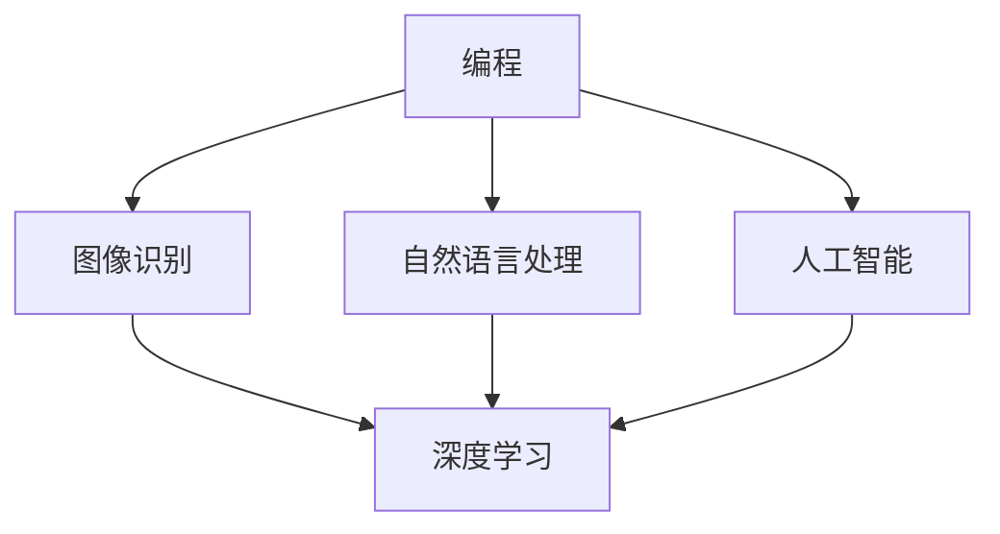

                 

在当今数字化时代，微信视频号已经成为了程序员分享技术知识的重要平台之一。对于程序员来说，如何有效地利用微信视频号进行知识分享，不仅能够提升个人品牌影响力，还能帮助更多开发者学习和成长。本文将深入探讨程序员如何利用微信视频号进行知识分享，以及如何通过这种方式提高自己的技术能力和影响力。

## 文章关键词

- 微信视频号
- 程序员
- 知识分享
- 技术能力
- 影响力

## 文章摘要

本文旨在探讨程序员如何利用微信视频号这一平台进行知识分享，通过提供有深度、有思考、有见解的技术内容，提高自己的技术能力和在社区中的影响力。文章将分为以下几个部分：背景介绍、核心概念与联系、核心算法原理与具体操作步骤、数学模型和公式、项目实践、实际应用场景、工具和资源推荐、总结以及未来发展趋势与挑战。

## 1. 背景介绍

微信视频号自2018年上线以来，已经成为中国最受欢迎的短视频平台之一。随着短视频的兴起，越来越多的程序员开始通过视频号分享自己的技术经验和知识。通过微信视频号，程序员不仅能够将复杂的技术概念以生动形象的方式传达给观众，还能与观众进行实时互动，提高知识的传播效果。

### 1.1 微信视频号的发展历程

- 2018年：微信视频号正式上线，为用户提供了一个创作和分享短视频的平台。
- 2020年：微信视频号推出“专业号”功能，旨在吸引更多专业人士入驻，分享高质量内容。
- 2021年：微信视频号上线“视频号助手”，提供一系列管理工具，帮助创作者更好地运营账号。

### 1.2 程序员在微信视频号的应用现状

- 大量程序员入驻微信视频号，分享技术经验和知识。
- 视频内容涵盖编程语言、框架、工具、开源项目等多个方面。
- 观众群体主要是其他程序员和IT从业者，也吸引了一些对技术感兴趣的非专业人士。

## 2. 核心概念与联系

在探讨如何利用微信视频号进行知识分享之前，我们需要了解一些核心概念，如图像识别、自然语言处理、人工智能等。这些概念不仅与编程密切相关，也是当前技术领域的热点话题。下面是一个简化的 Mermaid 流程图，展示这些概念之间的联系：



### 2.1 编程与图像识别

编程是实现图像识别的基础，通过编写算法和代码，程序员可以训练模型进行图像识别。深度学习是图像识别的核心技术，通过神经网络模型，计算机能够从大量图像数据中学习并提取特征，实现高效的图像识别。

### 2.2 编程与自然语言处理

自然语言处理（NLP）是编程领域的另一个重要分支，它涉及对文本数据的处理和分析。NLP技术包括文本分类、情感分析、机器翻译等。程序员可以通过编程实现这些功能，为各种应用场景提供强大的支持。

### 2.3 编程与人工智能

人工智能（AI）是当前技术发展的热点，编程是实现AI的核心手段。通过编写算法和代码，程序员可以构建各种AI模型，如决策树、神经网络等，实现自动化和智能化。

## 3. 核心算法原理与具体操作步骤

在微信视频号进行知识分享时，程序员需要掌握一些核心算法原理，以便更好地传达技术知识。以下是一个简化的核心算法原理概述：

### 3.1 算法原理概述

- 数据结构：了解常见的数据结构，如数组、链表、栈、队列等，是编程的基础。
- 算法分析：掌握算法的时间复杂度和空间复杂度，是优化代码的关键。
- 设计模式：熟悉常用的设计模式，如单例模式、工厂模式等，有助于提高代码的可维护性和复用性。

### 3.2 算法步骤详解

- 学习算法：通过阅读相关书籍、博客和论文，掌握各种算法原理。
- 编写代码：将算法原理转化为代码，实现算法的具体操作步骤。
- 测试与优化：对代码进行测试，查找并修复错误，优化代码性能。

### 3.3 算法优缺点

- 优点：算法能够提高代码的效率和可维护性，为复杂问题提供解决方案。
- 缺点：算法实现较为复杂，需要较高的编程技能和数学基础。

### 3.4 算法应用领域

- 数据处理：算法在数据处理领域有广泛应用，如排序、查找、字符串匹配等。
- 图像识别：算法在图像识别领域有广泛应用，如人脸识别、物体识别等。
- 自然语言处理：算法在自然语言处理领域有广泛应用，如文本分类、情感分析等。

## 4. 数学模型和公式

在编程和算法领域，数学模型和公式是不可或缺的工具。以下是一个简化的数学模型和公式概述：

### 4.1 数学模型构建

- 确定问题：明确要解决的问题，如优化、预测、分类等。
- 构建模型：根据问题特点，构建合适的数学模型。
- 参数估计：通过训练数据，估计模型参数，使其更符合实际问题。

### 4.2 公式推导过程

- 假设条件：根据问题特点，提出合理的假设条件。
- 推导公式：利用数学工具，推导出相关公式。
- 验证公式：通过实际数据，验证公式的正确性和可靠性。

### 4.3 案例分析与讲解

- 示例问题：以具体问题为例，展示数学模型和公式的应用。
- 解题过程：详细讲解数学模型和公式的推导和应用过程。
- 结果分析：分析解题结果，评估模型的性能和效果。

## 5. 项目实践：代码实例和详细解释说明

为了更好地展示程序员如何利用微信视频号进行知识分享，我们以一个简单的项目为例，详细讲解代码实例和解释说明。

### 5.1 开发环境搭建

- 安装 Python 环境：在本地计算机上安装 Python 解释器，并配置好相应的库。
- 安装视频号 SDK：使用微信官方提供的视频号 SDK，方便开发和管理视频号内容。

### 5.2 源代码详细实现

以下是一个简单的 Python 代码实例，展示如何利用视频号 SDK 实现视频上传功能：

```python
from wxpy import Wxpy

# 初始化微信机器人
wxpy = Wxpy()

# 登录微信账号
wxpy.login()

# 上传视频
video_path = "path/to/video.mp4"
result = wxpy.upload_video(video_path)
print(result)
```

### 5.3 代码解读与分析

- `Wxpy` 类：使用 `wxpy` 类初始化微信机器人，实现微信相关操作。
- `login()` 方法：登录微信账号，确保操作权限。
- `upload_video()` 方法：上传视频文件，返回上传结果。

### 5.4 运行结果展示

在运行上述代码后，成功上传视频并返回上传结果。这表明微信视频号 SDK 可以方便地实现视频上传功能，为程序员提供了丰富的开发接口。

## 6. 实际应用场景

程序员在微信视频号上的知识分享，可以应用于多个实际场景：

- 技术博客：通过视频号发布技术博客，分享编程经验和心得。
- 在线教学：制作教学视频，教授编程语言和框架。
- 开源项目：介绍开源项目，分享项目实现过程和心得。
- 技术分享会：举办线上技术分享会，邀请嘉宾进行专题讲座。

### 6.1 技术博客

通过视频号发布技术博客，程序员可以将文字、图片和视频等多种形式结合，使博客内容更加生动和易于理解。这种方法不仅能够提高博客的阅读量，还能吸引更多读者关注。

### 6.2 在线教学

制作教学视频，程序员可以系统地教授编程语言和框架，帮助新手快速入门。通过视频号，程序员可以积累粉丝，建立个人品牌，为未来的职业发展打下基础。

### 6.3 开源项目

介绍开源项目，程序员可以分享项目实现过程和心得，吸引更多开发者参与。通过视频号，程序员可以展示自己的技术实力，提高在社区中的影响力。

### 6.4 技术分享会

举办线上技术分享会，邀请嘉宾进行专题讲座，程序员可以与同行交流，共同探讨技术问题。通过视频号直播，技术分享会可以吸引更多观众参与，扩大影响力。

## 7. 工具和资源推荐

为了更好地利用微信视频号进行知识分享，程序员可以参考以下工具和资源：

- 开发工具：Python、Java、C++等编程语言，以及微信官方提供的视频号 SDK。
- 学习资源：技术博客、在线教程、开源项目等。
- 社交平台：GitHub、Stack Overflow、知乎等。

### 7.1 学习资源推荐

- 《深度学习》（Goodfellow、Bengio、Courville 著）：介绍深度学习的基础知识和应用。
- 《Effective Python》（Brett Slatkin 著）：介绍 Python 编程的最佳实践。
- 《代码大全》（Steve McConnell 著）：介绍软件开发的最佳实践。

### 7.2 开发工具推荐

- PyCharm：Python 集成开发环境，提供强大的代码编辑和调试功能。
- IntelliJ IDEA：Java 集成开发环境，支持多种编程语言。
- Visual Studio：C++集成开发环境，适用于 Windows 平台。

### 7.3 相关论文推荐

- 《A Theoretical Analysis of theVDJ Recombination Process》（Corteel et al., 2014）：介绍 VDJ 重排算法的理论分析。
- 《Deep Learning for Natural Language Processing》（Bengio et al., 2013）：介绍深度学习在自然语言处理领域的应用。
- 《ImageNet Classification with Deep Convolutional Neural Networks》（Krizhevsky et al., 2012）：介绍深度卷积神经网络在图像识别领域的应用。

## 8. 总结：未来发展趋势与挑战

### 8.1 研究成果总结

- 微信视频号已经成为程序员进行知识分享的重要平台。
- 程序员通过视频号分享技术知识，提高个人品牌影响力。
- 视频号为广大开发者提供了丰富的学习资源和交流机会。

### 8.2 未来发展趋势

- 视频号将逐渐成为程序员知识分享的主要渠道。
- 人工智能和深度学习等技术将在知识分享中发挥更大作用。
- 视频号将推出更多功能，助力程序员更好地进行知识分享。

### 8.3 面临的挑战

- 知识分享内容的同质化：程序员需要提供独特、有价值的知识内容。
- 视频制作质量：程序员需要提高视频制作水平，增强用户体验。
- 互动与反馈：程序员需要与观众保持良好的互动，收集反馈，持续改进。

### 8.4 研究展望

- 探索更多有效的知识分享方法和技术。
- 开发更多便捷的工具和平台，助力程序员进行知识分享。
- 促进程序员与观众的深度交流，共同推动技术发展。

## 9. 附录：常见问题与解答

### 9.1 如何快速掌握编程知识？

- 阅读经典教材和博客，系统学习编程基础知识。
- 参与开源项目，实践编程经验。
- 参加线上课程和研讨会，学习前沿技术。

### 9.2 如何提高视频制作质量？

- 学习视频制作基础知识，如剪辑、音频处理等。
- 使用专业的视频制作工具，提高制作效率。
- 观看优秀视频，学习经验，提高审美。

### 9.3 如何在微信视频号上进行有效推广？

- 定期发布高质量内容，保持活跃度。
- 利用微信生态，如朋友圈、公众号等，扩大传播范围。
- 与其他创作者合作，进行资源共享和推广。

作者：禅与计算机程序设计艺术 / Zen and the Art of Computer Programming
----------------------------------------------------------------

### 结论

通过本文的探讨，我们了解了程序员如何利用微信视频号进行知识分享，以及如何通过这种方式提高自己的技术能力和影响力。微信视频号为程序员提供了一个全新的知识分享平台，通过高质量的内容创作和互动，程序员可以不断提升自己的专业水平，为社区的发展贡献自己的力量。未来，随着视频号功能的不断升级和优化，程序员在微信视频号上的知识分享将会更加精彩和丰富。让我们一起期待这个美好未来的到来！

