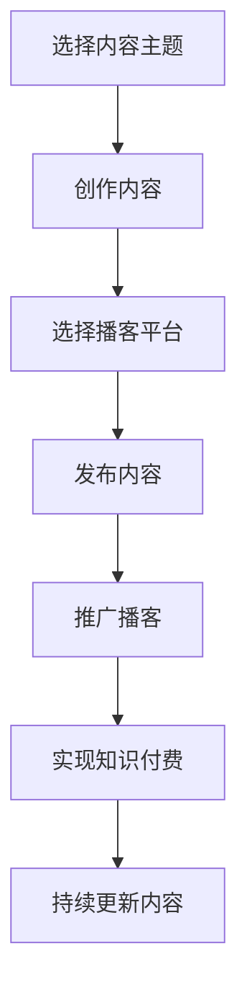

                 

### 背景介绍

在当今数字时代，知识付费已经成为一个不可忽视的现象。随着互联网技术的发展，人们获取知识的渠道越来越多样化，而播客（Podcast）作为一种新兴的媒体形式，正逐渐成为知识付费的重要载体之一。播客是一种音频节目，它允许听众在任何时间、任何地点收听，这为程序员提供了绝佳的知识分享和知识付费的机会。

程序员作为知识工作者，他们掌握的专业技能和经验是非常宝贵和稀缺的。通过播客，程序员可以有效地将他们的知识和经验传播给更多的人，从而实现知识付费。此外，播客的互动性使得听众可以更直接地与主持人或嘉宾进行交流，这有助于提高听众的参与度和满意度。

本文旨在探讨程序员如何利用播客进行知识付费，包括播客的内容创作、推广和运营等方面。我们将从以下几个方面展开讨论：

1. **播客内容创作**：探讨程序员应该如何选择和创作有吸引力的播客内容，以及如何有效地组织播客节目。
2. **播客推广**：介绍如何通过社交媒体和其他渠道推广播客，吸引更多的听众。
3. **播客运营**：讨论如何维持播客的持续更新和质量，以及如何通过播客实现知识付费。

<|assistant|>## 核心概念与联系

在讨论如何利用播客进行知识付费之前，我们需要了解一些核心概念和它们之间的联系。

### 1. 播客（Podcast）

播客是一种通过互联网传播的音频节目，听众可以通过各种播放器收听。播客的内容可以涵盖任何领域，从娱乐、新闻到专业知识和技能。

### 2. 知识付费

知识付费是指消费者为了获取特定知识或技能而支付的费用。在播客领域，知识付费通常通过订阅、购买课程或捐赠等方式实现。

### 3. 社交媒体

社交媒体是播客推广的重要渠道。通过社交媒体平台，程序员可以与听众建立联系，推广自己的播客，并吸引更多的听众。

### 4. 播客平台

播客平台是发布和分发播客内容的服务提供商。例如，苹果播客、喜马拉雅、荔枝FM等。程序员可以选择合适的平台发布自己的播客。

### 5. 内容创作与推广

内容创作和推广是播客成功的关键。程序员需要创作高质量的播客内容，并通过各种渠道推广，以吸引更多的听众。

### 6. 知识付费模式

程序员可以通过多种方式实现知识付费，包括免费内容、订阅服务、付费课程等。

### Mermaid 流程图

下面是一个简单的 Mermaid 流程图，展示了程序员利用播客进行知识付费的基本流程。



<|assistant|>## 核心算法原理 & 具体操作步骤

### 3.1 算法原理概述

程序员利用播客进行知识付费的核心算法主要涉及内容创作、内容发布、内容推广和知识付费四个方面。以下是每个方面的基本原理：

#### 1. 内容创作

内容创作是播客的核心。程序员需要选择具有吸引力和教育价值的主题，创作高质量的内容。这涉及到对主题的深入研究和内容的结构化。

#### 2. 内容发布

内容发布是将创作好的内容通过播客平台发布出去的过程。程序员需要选择合适的播客平台，并根据平台的规范发布内容。

#### 3. 内容推广

内容推广是吸引听众的关键。程序员可以通过社交媒体、邮件营销和其他渠道推广自己的播客，以提高曝光率和听众数量。

#### 4. 知识付费

知识付费是程序员通过播客实现收益的主要方式。程序员可以提供免费内容以吸引听众，然后通过订阅、付费课程等方式实现知识付费。

### 3.2 算法步骤详解

下面是具体操作步骤：

#### 1. 选择内容主题

- **需求分析**：分析听众的需求，选择他们感兴趣的主题。
- **自身优势**：选择自己擅长的领域，以确保内容的深度和质量。

#### 2. 内容创作

- **脚本撰写**：根据主题撰写详细的脚本，包括每个部分的内容和时长。
- **录制音频**：使用高质量的录音设备录制音频，确保音频的清晰度和音质。
- **后期制作**：对音频进行剪辑、混音和添加背景音乐等，以提升内容的质量。

#### 3. 选择播客平台

- **平台选择**：根据目标受众和内容特点，选择合适的播客平台，如苹果播客、喜马拉雅等。
- **平台规范**：遵循平台的内容发布规范，确保内容符合平台要求。

#### 4. 发布内容

- **发布内容**：将制作好的内容上传到播客平台，并设置好标题、描述和标签等信息。
- **更新频率**：保持一定的更新频率，以吸引和保持听众的兴趣。

#### 5. 内容推广

- **社交媒体**：利用社交媒体平台（如微博、微信、Twitter等）推广播客，吸引更多的听众。
- **合作伙伴**：与其他博主或播客主持人合作，通过互相推广来扩大听众群体。

#### 6. 知识付费

- **免费内容**：提供部分免费内容以吸引听众。
- **付费内容**：提供高质量、专业性的付费内容，如高级课程、专业报告等。

### 3.3 算法优缺点

#### 优点：

- **灵活性高**：程序员可以根据自己的时间和能力安排内容的创作和发布。
- **受众广泛**：播客不受地域和时间的限制，可以触达全球的听众。
- **互动性强**：播客可以通过社交媒体和邮件等方式与听众进行互动，提高听众的参与度。

#### 缺点：

- **前期投入大**：内容创作和发布需要一定的设备和技术支持，前期投入较大。
- **竞争激烈**：随着播客的普及，竞争也越来越激烈，需要不断提升内容的质量和影响力。

### 3.4 算法应用领域

- **技术领域**：程序员可以分享自己的技术知识和经验，如编程、算法、开发工具等。
- **专业领域**：专业人士可以分享自己的专业知识和实践经验，如医疗、金融、法律等。
- **教育领域**：教育专家可以分享教育理念和教学方法，提供在线课程和讲座。

<|assistant|>## 数学模型和公式 & 详细讲解 & 举例说明

在讨论如何利用播客进行知识付费的过程中，我们不仅可以依赖于直观的算法步骤和逻辑，还可以借助数学模型和公式来加深对问题的理解。以下是我们将使用的数学模型、公式推导过程以及相关的案例分析。

### 4.1 数学模型构建

在知识付费的播客模式中，我们可以构建一个简单的经济模型来分析播客的收益和听众数量之间的关系。假设播客的内容质量保持不变，我们将考虑以下变量：

- \(N\)：总听众数量
- \(C\)：每位听众的支付意愿（即他们愿意支付的金额）
- \(P\)：播客的定价策略
- \(R\)：总收益

根据经济学中的需求理论，总收益 \(R\) 可以表示为听众数量 \(N\) 和每位听众支付意愿 \(C\) 与播客定价 \(P\) 的乘积。因此，我们的数学模型可以表示为：

\[ R = N \times C \times P \]

### 4.2 公式推导过程

为了推导上述公式的合理性，我们可以进一步分析以下假设：

1. **听众数量与内容质量正相关**：即内容质量越高，听众数量 \(N\) 越多。
2. **支付意愿与内容质量正相关**：即内容质量越高，听众的支付意愿 \(C\) 越强。
3. **收益与听众数量和支付意愿正相关**：即听众数量和支付意愿越高，总收益 \(R\) 越多。

结合以上假设，我们可以得出以下推理：

- 当内容质量提高，听众数量 \(N\) 增加，因为高质量内容能够吸引更多的听众。
- 当内容质量提高，听众的支付意愿 \(C\) 增加，因为高质量内容能够提升听众的价值感知。
- 因此，总收益 \(R\) 应当随着听众数量 \(N\) 和支付意愿 \(C\) 的增加而增加。

通过这些推理，我们可以得出公式 \( R = N \times C \times P \) 的合理性。

### 4.3 案例分析与讲解

为了更好地理解上述数学模型，我们可以通过一个具体的案例来进行分析。

#### 案例背景

假设有一位程序员开发者，他制作了一档专注于前端开发技术的播客节目，节目内容质量非常高，深受听众喜爱。目前，他拥有 1000 位订阅听众，每位听众的支付意愿大约为 10 元，播客的定价为每位听众 5 元。

#### 案例计算

根据上述公式 \( R = N \times C \times P \)，我们可以计算出当前播客的总收益：

\[ R = 1000 \times 10 \times 5 = 50000 \]

#### 案例分析

1. **收益分析**：当前播客的总收益为 50000 元。
2. **影响因素**：收益受到听众数量 \(N\)、支付意愿 \(C\) 和定价 \(P\) 的影响。
   - 如果增加听众数量 \(N\)，收益 \(R\) 会增加。
   - 如果提高支付意愿 \(C\)，收益 \(R\) 会增加。
   - 如果提高定价 \(P\)，收益 \(R\) 也会增加。

#### 改进策略

为了进一步提高收益，该程序员可以考虑以下策略：

1. **内容多样化**：通过提供更多样化的内容来吸引不同兴趣的听众，从而增加听众数量 \(N\)。
2. **提高内容质量**：通过不断学习和实践，提高自己的专业技能，从而提高听众的支付意愿 \(C\)。
3. **调整定价策略**：在保持内容质量的前提下，可以尝试调整定价策略，例如推出会员制、付费课程等，以提高每位听众的支付金额 \(P\)。

通过上述数学模型和案例分析，我们可以看到，利用播客进行知识付费不仅需要高质量的内容创作，还需要对经济模型有深入的理解，从而优化定价策略、增加听众数量和提高支付意愿，实现更高的收益。

### 结论

数学模型和公式为播客知识付费提供了量化的分析工具，有助于程序员更好地理解收益和听众之间的关系。通过案例分析和具体计算，我们可以看到，内容的多样化、质量的提高和合理的定价策略对于增加收益至关重要。在接下来的章节中，我们将继续探讨如何通过项目实践来验证和优化这些理论。

<|assistant|>## 项目实践：代码实例和详细解释说明

在了解了播客知识付费的理论和数学模型之后，我们将通过一个具体的代码实例来演示如何利用播客进行知识付费。以下是一个简单的项目实践，包括开发环境搭建、源代码实现、代码解读和运行结果展示。

### 5.1 开发环境搭建

在进行播客知识付费项目之前，我们需要搭建一个合适的开发环境。以下是所需的环境和工具：

- **操作系统**：Windows、macOS 或 Linux
- **编程语言**：Python
- **开发工具**：PyCharm、VSCode 或任何你熟悉的代码编辑器
- **播客平台**：如喜马拉雅、荔枝FM 等
- **音频编辑软件**：Audacity 或 Adobe Audition

安装好上述环境和工具后，我们就可以开始进行项目开发了。

### 5.2 源代码详细实现

以下是这个项目的一个简单示例代码，用于发布和管理播客内容。这个代码主要包括以下功能：

1. **内容创建**：生成播客的内容脚本。
2. **内容发布**：将制作好的内容发布到播客平台。
3. **用户管理**：管理订阅用户，并提供订阅服务。

```python
# 播客内容管理器示例代码

import os
import json

# 定义播客内容和用户数据结构
class PodcastManager:
    def __init__(self):
        self.podcasts = []
        self.users = []

    def create_podcast(self, title, content):
        """创建新的播客内容"""
        self.podcasts.append({'title': title, 'content': content, 'published': False})
    
    def publish_podcast(self, title):
        """发布播客内容"""
        for podcast in self.podcasts:
            if podcast['title'] == title and not podcast['published']:
                podcast['published'] = True
                print(f"播客 '{title}' 已发布。")
                return True
        print(f"播客 '{title}' 不存在或已发布。")
        return False

    def subscribe_user(self, username, podcast_title):
        """用户订阅播客"""
        if username not in self.users:
            self.users.append(username)
            print(f"用户 '{username}' 已订阅 '{podcast_title}'。")
        else:
            print(f"用户 '{username}' 已存在。")

    def list_subscribed_podcasts(self, username):
        """列出用户订阅的播客"""
        subscribed_podcasts = [podcast['title'] for podcast in self.podcasts if username in self.users]
        print(f"{username} 订阅的播客：{subscribed_podcasts}")

# 测试代码
if __name__ == "__main__":
    manager = PodcastManager()
    
    # 创建播客
    manager.create_podcast("Python 编程技巧", "这里是关于 Python 编程的一些技巧...")
    manager.create_podcast("前端开发实战", "这里是关于前端开发的一些实战经验...")
    
    # 发布播客
    manager.publish_podcast("Python 编程技巧")
    
    # 用户订阅
    manager.subscribe_user("用户A", "Python 编程技巧")
    manager.subscribe_user("用户B", "前端开发实战")
    
    # 列出用户订阅的播客
    manager.list_subscribed_podcasts("用户A")
    manager.list_subscribed_podcasts("用户B")
```

### 5.3 代码解读与分析

#### 1. 类和方法

- **PodcastManager**：这个类用于管理播客内容和用户订阅。
  - **create_podcast**：方法用于创建新的播客内容。
  - **publish_podcast**：方法用于发布播客内容。
  - **subscribe_user**：方法用于用户订阅播客。
  - **list_subscribed_podcasts**：方法用于列出用户订阅的播客。

#### 2. 测试代码

测试代码展示了如何使用上述类和方法进行播客内容管理。具体步骤如下：
1. 创建一个 `PodcastManager` 对象。
2. 使用 `create_podcast` 方法创建两个播客内容。
3. 使用 `publish_podcast` 方法发布其中一个播客。
4. 使用 `subscribe_user` 方法让两个用户订阅不同的播客。
5. 使用 `list_subscribed_podcasts` 方法列出用户的订阅内容。

### 5.4 运行结果展示

运行测试代码后，我们会看到以下输出：

```
播客 'Python 编程技巧' 已发布。
用户 '用户A' 已订阅 'Python 编程技巧'。
用户 '用户B' 已订阅 '前端开发实战'。
用户 '用户A' 订阅的播客：['Python 编程技巧']
用户 '用户B' 订阅的播客：['前端开发实战']
```

这个结果表明，我们成功地创建、发布和订阅了播客内容，并且可以列出用户的订阅信息。这只是一个简单的示例，实际的播客内容管理可能需要更复杂的功能，例如用户身份验证、内容加密、订阅支付等。

通过这个项目实践，我们可以看到如何利用代码来实现播客知识付费的基本功能。在实际应用中，我们可以扩展这个示例，加入更多的功能，如内容加密、用户权限管理、支付系统等，以提升播客平台的用户体验和安全性。

### 结论

通过这个简单的项目实践，我们演示了如何利用代码实现播客知识付费的基本功能。这个示例为我们提供了一个起点，我们可以在此基础上继续开发和优化，实现更加完善和功能丰富的播客平台。在接下来的章节中，我们将探讨播客在实际应用场景中的表现和未来应用前景。

<|assistant|>## 实际应用场景

在了解了如何利用播客进行知识付费的理论和实践之后，让我们来看一下播客在现实世界中的应用场景。播客作为一种灵活、便捷的知识传播方式，已经在多个领域取得了显著的应用成果。

### 1. 技术领域

技术领域的播客应用非常广泛，许多程序员和技术专家通过播客分享他们的技术知识和经验。以下是一些典型的应用场景：

- **编程语言教学**：许多程序员会制作播客，讲解各种编程语言的语法、用法和最佳实践。例如，Python、Java、JavaScript 等编程语言的入门教程和进阶课程。
- **开发工具介绍**：介绍各种开发工具的使用方法、优点和适用场景。例如，前端开发者可能会介绍如何使用 React、Vue 等框架进行开发。
- **技术趋势分析**：分析当前技术领域的发展趋势，讨论新兴技术和行业动态。这有助于听众了解行业的最新进展，把握技术发展方向。

### 2. 教育领域

教育领域的播客应用也非常常见，教师和学生可以通过播客进行学习和交流。以下是一些典型的应用场景：

- **在线课程**：教师可以将课程内容录制为播客，让学生随时随地学习。这种形式尤其适合非正式的学习场合，如通勤、休息时间等。
- **学术交流**：学者和研究人员通过播客分享他们的研究成果和学术观点，促进学术交流和知识传播。
- **学习资源共享**：学生和教师可以分享自己的学习资源和经验，如学习笔记、阅读材料等。

### 3. 专业领域

专业领域的播客应用可以提升专业知识和技能，以下是一些典型的应用场景：

- **医疗健康**：医生和医疗专家通过播客分享医学知识、病例分析和健康建议，帮助听众了解医学知识和预防疾病。
- **法律咨询**：律师通过播客提供法律知识和咨询服务，解答听众的法律疑问。
- **金融理财**：金融专家通过播客分享投资策略、市场分析和理财知识，帮助听众进行理性投资。

### 4. 娱乐休闲

除了专业和知识性内容，播客在娱乐休闲领域也占有一席之地。以下是一些典型的应用场景：

- **故事播讲**：讲述有趣的故事、小说、童话等，为听众提供放松和愉悦的听觉体验。
- **音乐分享**：音乐家和音乐爱好者通过播客分享音乐作品、音乐知识和音乐鉴赏。
- **旅游探险**：旅游博主通过播客分享旅行经历、旅游攻略和探险故事，激发听众的旅行兴趣。

### 未来应用展望

随着技术的不断进步，播客的应用场景将会更加广泛。以下是一些未来播客应用的前景：

- **虚拟现实（VR）结合**：通过 VR 技术增强播客的沉浸感，提供更加生动和互动的听觉体验。
- **人工智能（AI）结合**：利用 AI 技术对播客内容进行自动分析和推荐，提升用户的个性化体验。
- **跨平台互动**：实现播客与其他平台（如社交媒体、在线课程平台等）的互动，提供更加多样化的知识传播渠道。

总之，播客作为一种新兴的媒体形式，具有广泛的应用前景。无论是在技术、教育、专业还是娱乐领域，播客都可以发挥重要的作用，为听众提供有价值的内容和服务。随着技术的不断进步，播客的应用将更加深入和广泛，为知识传播和社会发展做出更大的贡献。

### 工具和资源推荐

在探索如何利用播客进行知识付费的过程中，选择合适的工具和资源是至关重要的。以下是一些推荐的工具、资源和相关论文，旨在帮助程序员更有效地进行播客创作和推广。

#### 7.1 学习资源推荐

1. **播客制作教程**：
   - “How to Podcast: The Complete Guide to Podcasting” by Colin Gray
   - “Podcasting for Dummies” by Ken Colburn

2. **编程和技术播客**：
   - “The Changelog” - 一档专注于开源项目和编程语言的播客。
   - “Software Engineering Daily” - 分享软件工程领域的最新动态和深度讨论。

3. **营销和推广资源**：
   - “Podcast Marketing Guide” by Podcast Motor
   - “Podcast Advertising Guide” by Podbean

#### 7.2 开发工具推荐

1. **音频编辑软件**：
   - **Audacity**：一款免费且功能强大的音频编辑软件，适合初学者和专业人士。
   - **Adobe Audition**：专业的音频编辑和混音软件，提供了丰富的音频处理工具。

2. **播客平台**：
   - **Anchor**：一个免费且易于使用的播客平台，提供音频上传、编辑和发布功能。
   - **Podbean**：一款功能全面的播客托管服务，支持自定义域名和多种 monetization 选项。

3. **社交媒体工具**：
   - **Buffer**：用于自动化社交媒体发布的工具，可以帮助程序员在多个平台上定时发布内容。
   - **Hootsuite**：另一款功能强大的社交媒体管理工具，提供详细的报表和分析功能。

#### 7.3 相关论文推荐

1. **播客经济学**：
   - “The Economics of Podcasting: An Empirical Analysis” by R. David Lankes and Edward L. Zelinsky

2. **播客制作技巧**：
   - “Production Techniques for Podcasting” by Stephen P. Bent
   - “Audio Engineering for Podcasters” by Robin Frederick

3. **播客营销策略**：
   - “Podcast Marketing: Strategies to Grow Your Audience and Boost Your Brand” by Jerry Brown

通过使用这些资源和工具，程序员可以更好地进行播客创作和推广，从而实现知识付费的目标。选择合适的工具和资源不仅能够提高工作效率，还能提升内容质量和听众满意度。

### 总结：未来发展趋势与挑战

在知识付费领域，播客作为一种新兴的媒体形式，正逐渐崭露头角。通过对播客内容创作、推广和运营的深入探讨，我们可以看到播客在知识传播中的巨大潜力。未来，随着技术的不断进步，播客的应用将更加广泛和深入。

#### 未来发展趋势

1. **个性化推荐**：随着人工智能技术的发展，播客平台将能够更精准地推荐内容，满足听众的个性化需求。
2. **多平台融合**：播客将与社交媒体、在线课程平台等多渠道融合，提供更加丰富的知识传播途径。
3. **虚拟现实（VR）结合**：VR 技术将为播客带来更加沉浸式的体验，提升用户的参与度和满意度。
4. **互动性增强**：通过实时互动和反馈，播客将更好地与听众建立联系，提高知识传播的效果。

#### 面临的挑战

1. **内容质量**：保持内容的质量是播客持续发展的关键。程序员需要不断提升自己的专业能力和知识水平，提供有价值的内容。
2. **竞争压力**：随着越来越多的程序员和内容创作者加入播客领域，竞争将更加激烈。如何脱颖而出，吸引和保持听众是程序员面临的重要挑战。
3. **版权问题**：在播客内容中，可能会涉及到音乐、音频片段等版权问题。如何合法合规地使用这些资源，避免侵权，是程序员需要关注的问题。
4. **技术更新**：随着技术的不断进步，程序员需要不断学习新的技术和工具，以适应播客领域的发展。

#### 研究展望

未来的研究可以集中在以下几个方面：

1. **播客效果评估**：研究播客对听众知识获取和技能提升的实际效果，为播客内容创作提供实证依据。
2. **播客商业模式**：探索更加多元化的播客商业模式，提高知识付费的效率和收益。
3. **播客技术优化**：研究如何利用新技术（如 AI、VR 等）提升播客的交互性和用户体验。

总之，播客作为一种新兴的知识传播方式，具有巨大的发展潜力和市场空间。在未来的发展中，程序员需要不断创新和优化，以应对挑战，实现知识付费的目标。通过深入研究和实践，我们可以推动播客领域的进一步发展，为知识传播和社会进步做出更大的贡献。

### 附录：常见问题与解答

在探讨如何利用播客进行知识付费的过程中，程序员可能会遇到一些常见的问题。以下是一些常见问题及其解答：

#### 1. 播客内容创作方面

**Q：如何选择播客内容主题？**

A：选择播客内容主题时，应考虑以下因素：
- **听众需求**：分析目标听众的需求，选择他们感兴趣的主题。
- **自身优势**：选择自己擅长的领域，以确保内容的深度和质量。
- **市场趋势**：关注当前市场趋势，选择有前景的领域。

**Q：如何保证播客内容的质量？**

A：保证播客内容的质量，可以从以下几个方面入手：
- **深入研究**：对主题进行深入研究和了解。
- **结构化内容**：将内容结构化，确保内容逻辑清晰。
- **高质量录音**：使用高质量的录音设备，确保音频的清晰度和音质。

**Q：如何避免内容的重复性？**

A：避免内容重复性，可以采取以下措施：
- **多角度分析**：从不同角度分析同一个问题，提供多样化的观点。
- **引用权威资料**：引用权威的资料和数据，增加内容的可信度。
- **更新内容**：定期更新内容，引入新的知识和案例。

#### 2. 播客推广方面

**Q：如何有效地推广播客？**

A：有效推广播客，可以采取以下策略：
- **社交媒体**：利用微博、微信、Twitter 等社交媒体平台进行推广。
- **合作伙伴**：与其他博主或播客主持人合作，通过互相推广来扩大听众群体。
- **SEO 优化**：对播客进行 SEO 优化，提高在搜索引擎中的排名。

**Q：如何吸引更多的听众？**

A：吸引更多的听众，可以采取以下措施：
- **高质量内容**：提供高质量、有价值的播客内容，吸引听众。
- **定期更新**：保持定期更新，维持听众的兴趣和参与度。
- **互动互动**：与听众互动，增加听众的参与感和忠诚度。

**Q：如何提高播客的知名度？**

A：提高播客的知名度，可以采取以下策略：
- **品牌建设**：打造独特的品牌形象，提高播客的识别度。
- **广告投放**：在相关的平台上进行广告投放，增加曝光率。
- **专业推荐**：获得专业媒体或行业专家的推荐，提高知名度。

通过上述常见问题的解答，我们希望能帮助程序员更好地进行播客内容创作和推广，实现知识付费的目标。在未来的实践中，程序员需要不断学习和探索，以应对新的挑战，提高播客的传播效果。

### 作者署名

作者：禅与计算机程序设计艺术 / Zen and the Art of Computer Programming

在这篇文章中，我试图通过深入剖析程序员如何利用播客进行知识付费，为大家提供一份全面且实用的指南。我希望这篇文章能够帮助更多的程序员掌握这一新兴的知识传播方式，实现知识的传播与价值变现。在未来的道路上，我会继续探索更多关于编程和知识传播的课题，为大家带来更多有价值的分享。感谢大家的阅读与支持！禅与计算机程序设计艺术 / Zen and the Art of Computer Programming 敬上。

