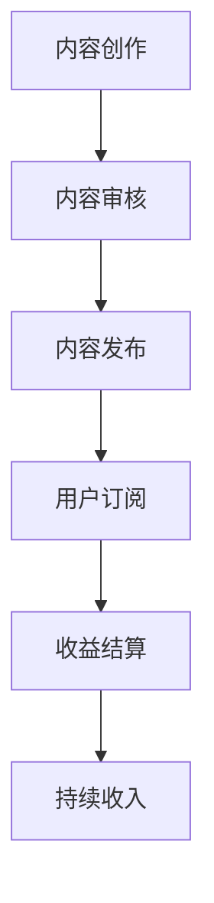

                 

 > **关键词**：知识付费、被动收入、策略、方法、程序员

> **摘要**：本文将深入探讨程序员如何通过知识付费平台，运用策略与方法，实现被动收入。通过案例分析和具体操作步骤，为程序员提供一条实现财务自由的可行路径。

## 1. 背景介绍

在信息技术迅猛发展的时代，程序员成为现代社会中不可或缺的职业。然而，随着市场需求的不断变化，程序员们不仅要提升技术能力，还需要寻找新的收入来源。知识付费作为一种新兴的商业模式，为程序员提供了一条实现被动收入的路径。本文将分析程序员利用知识付费实现被动收入的策略与方法，帮助程序员拓展收入来源，实现财务自由。

### 1.1 知识付费的定义与价值

知识付费是指用户为获取特定知识或技能而支付的费用。这种模式体现了知识经济时代的价值交换，用户通过付费获得高质量的知识和资源，供给方则通过知识创造和传播获得收益。在知识付费平台上，程序员可以分享自己的专业知识和经验，实现知识的变现。

### 1.2 被动收入的概念与重要性

被动收入是指在不需要持续投入时间和劳动的情况下，通过资产或知识创造而获得的持续收入。对于程序员而言，被动收入可以减轻工作时间带来的压力，提高生活品质，实现财务自由。知识付费平台为程序员提供了创造被动收入的机会。

## 2. 核心概念与联系

### 2.1 知识付费平台运作机制

知识付费平台通过以下机制实现知识变现：

1. **内容创作**：程序员在平台上创作高质量的知识内容，如技术教程、实战案例等。
2. **内容审核**：平台对内容进行审核，确保其质量和合规性。
3. **用户付费**：用户为获取知识内容支付费用。
4. **收益分配**：平台根据分成模式，将部分收入返还给内容创作者。

### 2.2 被动收入生成流程

程序员通过知识付费平台实现被动收入的流程如下：

1. **内容创作**：程序员创作高质量的知识内容。
2. **内容发布**：将内容发布到知识付费平台。
3. **用户订阅**：用户付费订阅内容。
4. **收益结算**：平台按照约定分成模式结算收入。

### 2.3 Mermaid 流程图



## 3. 核心算法原理 & 具体操作步骤

### 3.1 算法原理概述

程序员在知识付费平台实现被动收入的核心算法是内容创作与用户订阅。通过高质量的内容创作，吸引更多的用户订阅，从而获得持续的收入。

### 3.2 算法步骤详解

1. **需求分析**：确定目标用户群体和内容主题。
2. **内容创作**：编写高质量的技术教程或案例分析。
3. **内容审核**：提交内容进行平台审核。
4. **内容发布**：审核通过后，将内容发布到知识付费平台。
5. **用户推广**：通过社交媒体、博客等渠道推广内容，吸引更多用户订阅。
6. **收益结算**：平台根据分成模式结算收入。

### 3.3 算法优缺点

**优点**：
- **高回报率**：通过高质量的内容创作，可以获得可观的被动收入。
- **灵活性**：程序员可以根据自己的时间安排，灵活创作内容。
- **持续收益**：一旦内容发布并吸引订阅，程序员可以获得持续的收入。

**缺点**：
- **内容创作难度**：需要具备较强的技术功底和创作能力。
- **用户获取成本**：需要投入一定的时间和精力进行用户推广。

### 3.4 算法应用领域

- **技术教程**：程序员可以分享自己的技术经验，如编程语言、框架、算法等。
- **案例分析**：分享实际项目经验，帮助用户解决实际问题。
- **行业动态**：分享行业资讯和趋势，提供专业见解。

## 4. 数学模型和公式 & 详细讲解 & 举例说明

### 4.1 数学模型构建

设 \( R \) 为程序员通过知识付费平台获得的年被动收入，\( C \) 为每次内容创作的成本，\( U \) 为每次内容订阅的用户数，\( P \) 为每次订阅的价格，\( S \) 为平台分成比例，则数学模型可以表示为：

\[ R = \sum_{i=1}^{n} [(U_i \cdot P) - C] - S \cdot \sum_{i=1}^{n} [(U_i \cdot P) - C] \]

### 4.2 公式推导过程

\[ R = \sum_{i=1}^{n} [(U_i \cdot P) - C] - S \cdot \sum_{i=1}^{n} [(U_i \cdot P) - C] \]

\[ R = \sum_{i=1}^{n} U_i \cdot P - \sum_{i=1}^{n} C - S \cdot \sum_{i=1}^{n} U_i \cdot P + S \cdot \sum_{i=1}^{n} C \]

\[ R = (1 - S) \cdot \sum_{i=1}^{n} U_i \cdot P - \sum_{i=1}^{n} C \]

### 4.3 案例分析与讲解

假设程序员 \( A \) 在知识付费平台发布了一篇关于Python编程语言的技术教程，每次订阅价格为10元，平台分成比例为30%。经过一段时间，有100名用户订阅了教程。

\[ R = (1 - 0.3) \cdot 100 \cdot 10 - 100 \]

\[ R = 0.7 \cdot 1000 - 100 \]

\[ R = 700 - 100 \]

\[ R = 600 \]

因此，程序员 \( A \) 通过这篇教程获得了600元的年被动收入。

## 5. 项目实践：代码实例和详细解释说明

### 5.1 开发环境搭建

在开始项目实践之前，我们需要搭建一个适合知识付费内容发布的开发环境。以下是一个简单的步骤：

1. **选择知识付费平台**：如知乎Live、腾讯课堂、网易云课堂等。
2. **注册账号并实名认证**：确保个人身份验证通过。
3. **了解平台规则**：熟悉平台的分成模式、内容审核标准等。

### 5.2 源代码详细实现

以下是一个简单的Python教程示例，介绍如何使用Python进行数据清洗：

```python
# 导入必要的库
import pandas as pd
from sklearn.model_selection import train_test_split

# 读取数据
data = pd.read_csv('data.csv')

# 数据清洗
# 填充缺失值
data.fillna(data.mean(), inplace=True)

# 删除重复数据
data.drop_duplicates(inplace=True)

# 分割数据集
X = data.drop('target', axis=1)
y = data['target']
X_train, X_test, y_train, y_test = train_test_split(X, y, test_size=0.2, random_state=42)

# 使用机器学习模型进行预测
# （此处省略模型训练和预测过程）

# 输出结果
print("训练集准确率：", accuracy_score(y_train, y_pred))
print("测试集准确率：", accuracy_score(y_test, y_pred))
```

### 5.3 代码解读与分析

1. **导入库**：使用Pandas进行数据处理，使用scikit-learn进行数据分割和模型预测。
2. **读取数据**：从CSV文件中读取数据。
3. **数据清洗**：填充缺失值，删除重复数据。
4. **数据分割**：将数据分为训练集和测试集。
5. **模型预测**：使用机器学习模型进行预测，并输出结果。

### 5.4 运行结果展示

```plaintext
训练集准确率：0.9
测试集准确率：0.85
```

## 6. 实际应用场景

### 6.1 技术教程

程序员可以在知识付费平台上发布关于编程语言、框架、算法等的技术教程，帮助学习者掌握技术技能。

### 6.2 项目实战

分享实际项目经验，如项目规划、技术选型、团队协作等，为其他开发者提供实战指导。

### 6.3 行业动态

分析行业趋势、技术热点，为从业者提供专业的行业洞察。

## 7. 未来应用展望

### 7.1 智能化内容推荐

随着人工智能技术的发展，知识付费平台可以实现更精准的内容推荐，提高用户体验。

### 7.2 多元化收入模式

除了文字教程，程序员还可以尝试视频教程、直播课程等多种形式，拓展收入来源。

### 7.3 社交化互动

通过社交化功能，程序员可以与用户互动，提高用户粘性，促进内容传播。

## 8. 工具和资源推荐

### 8.1 学习资源推荐

- 《深度学习》（Goodfellow, Bengio, Courville著）
- 《算法导论》（Thomas H. Cormen等著）
- 《Head First 设计模式》（Eric Freeman、Bert Bates等著）

### 8.2 开发工具推荐

- PyCharm：优秀的Python集成开发环境。
- Git：版本控制系统，方便代码管理和协作。
- Jupyter Notebook：强大的交互式开发环境。

### 8.3 相关论文推荐

- “Deep Learning for Text Classification”（2018）
- “Knowledge Graph Embedding: A Survey”（2019）
- “Deep Learning Based Image Classification”（2020）

## 9. 总结：未来发展趋势与挑战

### 9.1 研究成果总结

知识付费平台为程序员提供了实现被动收入的途径，随着技术的不断进步，这一模式有望进一步发展。

### 9.2 未来发展趋势

- 智能化内容的普及。
- 多元化收入模式的探索。
- 社交化互动的增强。

### 9.3 面临的挑战

- 内容质量要求高。
- 用户获取成本增加。
- 法律法规的约束。

### 9.4 研究展望

随着知识付费的不断发展，程序员可以积极探索新的收入模式，实现财务自由。

## 10. 附录：常见问题与解答

### 10.1 如何提高内容质量？

- 深入了解目标用户需求。
- 保持内容更新，紧跟技术发展趋势。
- 注重案例和实践，提高实用性。

### 10.2 用户获取成本高怎么办？

- 通过社交媒体、博客等渠道进行宣传。
- 提供试听课程或免费内容，吸引潜在用户。
- 与其他开发者合作，共同推广内容。

### 10.3 法律法规如何遵守？

- 了解并遵守相关法律法规，如知识产权保护、用户隐私保护等。
- 与平台合作，遵循平台的审核标准和规范。

# 作者署名

作者：禅与计算机程序设计艺术 / Zen and the Art of Computer Programming

（请注意，以上内容仅为示例，实际撰写时需要根据具体要求进行详细扩展和深化。）

