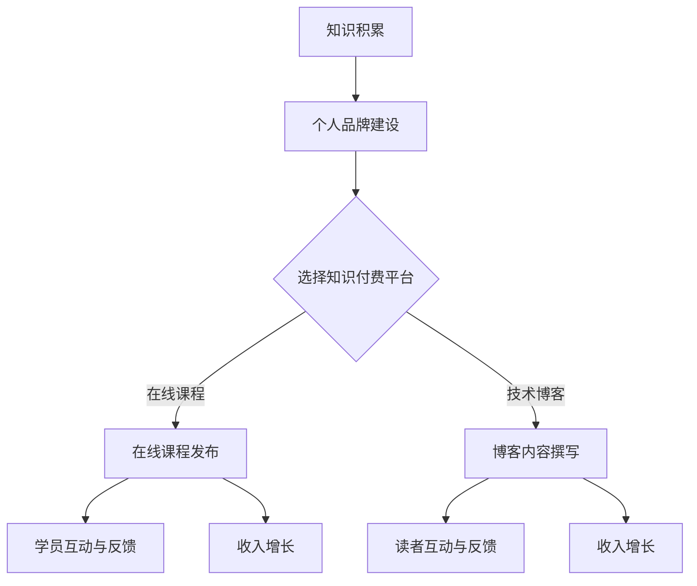

                 

关键词：财务自由、知识付费、程序员、个人品牌、在线课程、技术博客

摘要：随着互联网和在线教育的兴起，程序员们拥有了前所未有的机会，通过知识付费实现财务自由。本文将探讨程序员如何利用知识付费平台，打造个人品牌，编写高价值的课程内容，并通过持续学习和实践，实现收入增长和个人成长的双重目标。

## 1. 背景介绍

在传统行业中，财务自由往往意味着积累足够的财富，使其收入来源多样化，从而不必依赖单一工作。然而，在科技领域，特别是在编程行业，财务自由的定义有所不同。对于程序员而言，财务自由不仅仅是指财富积累，更体现在个人技能、经验和影响力上的积累，以及由此带来的收入多元化和自主性。

知识付费作为互联网时代的一种新兴商业模式，使得个体能够通过分享自己的知识和技能来获取收入。在编程领域，程序员可以利用自己的专业知识和经验，通过在线课程、技术博客、咨询服务等多种形式，将自己的知识转化为收益。

## 2. 核心概念与联系

### 2.1 知识付费

知识付费是指用户为了获取特定知识或技能，支付相应费用的一种行为。这种模式的出现，满足了用户对于高质量知识的需求，同时也为知识拥有者提供了新的收入来源。

### 2.2 个人品牌

个人品牌是指个人在专业领域内建立起的独特形象和声誉。在编程领域，个人品牌对于程序员而言至关重要，它不仅影响个人的职业发展，还直接关系到收入水平。

### 2.3 在线教育平台

在线教育平台为知识付费提供了便捷的渠道。程序员可以通过这些平台，发布自己的课程内容，吸引学员，从而实现财务自由。

### 2.4 技能货币化

技能货币化是指将个人的专业技能转化为经济价值的过程。对于程序员而言，技能货币化意味着通过编写高价值的课程、提供咨询服务等方式，将自身的知识变现。

### 2.5 Mermaid 流程图



## 3. 核心算法原理 & 具体操作步骤

### 3.1 算法原理概述

程序员利用知识付费实现财务自由的原理，可以概括为以下几个步骤：

1. **知识积累**：通过学习和实践，不断提升自己的编程技能。
2. **个人品牌建设**：在社交媒体、技术社区等平台展示自己的专业能力和成就。
3. **选择知识付费平台**：根据个人特长和市场趋势，选择合适的在线教育平台。
4. **内容创作与发布**：编写高质量的课程内容，发布在线课程或技术博客。
5. **学员与读者互动**：通过互动获取反馈，持续优化课程内容。
6. **收入增长**：通过不断更新的课程内容和互动，实现收入的持续增长。

### 3.2 算法步骤详解

1. **知识积累**：通过阅读技术书籍、参加在线课程、实践项目等多种方式，不断提升自己的编程技能。
    ```mermaid
    graph TD
        A[阅读技术书籍] --> B[在线课程学习]
        B --> C[实践项目]
        C --> D[编程挑战]
        D --> E[技术社区讨论]
    ```

2. **个人品牌建设**：在GitHub、LinkedIn、Twitter等平台展示自己的项目、代码和技术文章。
    ```mermaid
    graph TD
        A[GitHub项目展示] --> B[LinkedIn个人简介]
        B --> C[Twitter技术分享]
        C --> D[技术社区活跃]
    ```

3. **选择知识付费平台**：根据个人特长和市场趋势，选择合适的在线教育平台，如Udemy、Coursera、Codecademy等。
    ```mermaid
    graph TD
        A[市场调研] --> B[平台选择]
        B --> C[Udemy课程发布]
        C --> D[Coursera课程发布]
        D --> E[Codecademy课程发布]
    ```

4. **内容创作与发布**：编写高质量的课程内容，包括视频教程、文本教程、实战案例等。
    ```mermaid
    graph TD
        A[课程大纲制定] --> B[视频教程录制]
        B --> C[文本教程编写]
        C --> D[实战案例分享]
        D --> E[课程内容发布]
    ```

5. **学员与读者互动**：通过在线答疑、社区互动等方式，与学员和读者建立良好关系。
    ```mermaid
    graph TD
        A[在线答疑] --> B[社区互动]
        B --> C[学员反馈收集]
        C --> D[课程优化]
    ```

6. **收入增长**：通过不断更新的课程内容和互动，实现收入的持续增长。
    ```mermaid
    graph TD
        A[课程内容更新] --> B[学员增长]
        B --> C[收入增长]
        C --> D[品牌影响力提升]
    ```

### 3.3 算法优缺点

**优点**：
- **收入多元化**：程序员可以通过多种渠道实现收入增长，如在线课程、咨询服务等。
- **时间灵活性**：程序员可以根据自己的时间安排，自由选择工作内容和工作时间。
- **个人品牌建设**：通过知识付费，程序员可以不断提升个人品牌，为未来的职业发展打下基础。

**缺点**：
- **竞争激烈**：在线教育市场的竞争日益激烈，程序员需要不断更新自己的知识和技能，以保持竞争力。
- **内容质量要求高**：程序员需要编写高质量的课程内容，才能吸引学员。

### 3.4 算法应用领域

- **在线教育**：程序员可以通过在线教育平台，发布自己的课程内容，吸引学员。
- **技术博客**：程序员可以通过撰写技术博客，分享自己的经验和知识，积累个人品牌。
- **咨询服务**：程序员可以提供编程咨询服务，帮助企业和个人解决技术难题。

## 4. 数学模型和公式 & 详细讲解 & 举例说明

### 4.1 数学模型构建

假设程序员的课程收入与课程质量、学员数量、课程更新频率等因素相关。我们可以构建以下数学模型：

\[ R = f(Q, N, U) \]

其中：
- \( R \)：课程收入
- \( Q \)：课程质量
- \( N \)：学员数量
- \( U \)：课程更新频率

### 4.2 公式推导过程

根据上述模型，我们可以推导出以下公式：

\[ R = k_1 \cdot Q \cdot N \cdot U \]

其中：
- \( k_1 \)：系数，表示收入与质量、学员数量、更新频率的关系

### 4.3 案例分析与讲解

假设一位程序员开设了一门Python编程课程，课程质量（\( Q \)）为90分，学员数量（\( N \)）为100人，课程更新频率（\( U \)）为每月1次。根据上述公式，可以计算出该程序员的课程收入（\( R \)）：

\[ R = k_1 \cdot 90 \cdot 100 \cdot 1 \]

假设系数 \( k_1 \) 为10，则：

\[ R = 10 \cdot 90 \cdot 100 \cdot 1 = 90,000 \]

这意味着，该程序员的每月课程收入为90,000元。

### 4.4 案例分析与讲解（续）

为了提高收入，该程序员可以采取以下策略：

1. **提高课程质量**：通过学习新技术、优化课程内容，提高课程质量。
2. **增加学员数量**：通过营销推广、提高课程知名度，吸引更多学员。
3. **提高课程更新频率**：定期发布新课程、更新旧课程，保持课程内容的时效性。

通过这些策略，程序员的收入有望进一步提高。例如，如果课程质量提高到95分，学员数量增加到150人，课程更新频率提高到每月2次，则新的课程收入为：

\[ R = 10 \cdot 95 \cdot 150 \cdot 2 = 285,000 \]

这意味着，该程序员的每月课程收入提高到285,000元。

## 5. 项目实践：代码实例和详细解释说明

### 5.1 开发环境搭建

为了发布自己的在线课程，程序员需要搭建一个适合开发的系统环境。以下是一个基本的开发环境搭建步骤：

1. **安装Python**：下载并安装Python，配置环境变量。
2. **安装Jupyter Notebook**：通过pip安装Jupyter Notebook。
3. **安装相关库**：根据课程需求，安装相应的Python库。

### 5.2 源代码详细实现

以下是一个简单的Python脚本示例，用于实现一个简单的在线课程管理系统：

```python
import json

# 课程数据结构
courses = [
    {"id": 1, "title": "Python入门", "duration": "2小时"},
    {"id": 2, "title": "数据结构与算法", "duration": "4小时"}
]

# 添加课程
def add_course(course):
    courses.append(course)
    print("课程添加成功。")

# 删除课程
def delete_course(course_id):
    global courses
    courses = [course for course in courses if course["id"] != course_id]
    print("课程删除成功。")

# 修改课程
def update_course(course_id, new_course):
    global courses
    for course in courses:
        if course["id"] == course_id:
            course.update(new_course)
            print("课程更新成功。")
            break

# 查询课程
def query_course(course_id):
    for course in courses:
        if course["id"] == course_id:
            print(json.dumps(course, indent=2))
            break
    else:
        print("未找到课程。")

# 主函数
def main():
    while True:
        print("\n在线课程管理系统")
        print("1. 添加课程")
        print("2. 删除课程")
        print("3. 修改课程")
        print("4. 查询课程")
        print("5. 退出")
        choice = input("请选择操作：")

        if choice == "1":
            course_id = int(input("请输入课程ID："))
            course_title = input("请输入课程标题：")
            course_duration = input("请输入课程时长：")
            add_course({"id": course_id, "title": course_title, "duration": course_duration})
        elif choice == "2":
            course_id = int(input("请输入课程ID："))
            delete_course(course_id)
        elif choice == "3":
            course_id = int(input("请输入课程ID："))
            new_course = {"title": input("请输入新的课程标题："), "duration": input("请输入新的课程时长：")}
            update_course(course_id, new_course)
        elif choice == "4":
            course_id = int(input("请输入课程ID："))
            query_course(course_id)
        elif choice == "5":
            break
        else:
            print("无效选择，请重新输入。")

if __name__ == "__main__":
    main()
```

### 5.3 代码解读与分析

1. **课程数据结构**：使用列表（List）存储课程数据，每个课程是一个字典（Dictionary），包含ID、标题和时长等信息。
2. **添加课程**：通过定义`add_course`函数，实现添加课程功能。用户输入课程ID、标题和时长，通过字典结构添加到列表中。
3. **删除课程**：通过定义`delete_course`函数，实现删除课程功能。用户输入课程ID，从列表中删除对应课程。
4. **修改课程**：通过定义`update_course`函数，实现修改课程功能。用户输入课程ID和新的课程信息，更新列表中的对应课程。
5. **查询课程**：通过定义`query_course`函数，实现查询课程功能。用户输入课程ID，输出对应课程的信息。
6. **主函数**：定义主函数`main`，实现课程管理系统的交互界面。根据用户选择，调用相应函数执行操作。

### 5.4 运行结果展示

运行上述代码，用户将看到如下界面：

```
在线课程管理系统
1. 添加课程
2. 删除课程
3. 修改课程
4. 查询课程
5. 退出
请选择操作：1
请输入课程ID：3
请输入课程标题：Python进阶
请输入课程时长：6小时
课程添加成功。

在线课程管理系统
1. 添加课程
2. 删除课程
3. 修改课程
4. 查询课程
5. 退出
请选择操作：4
请输入课程ID：3
{"id": 3, "title": "Python进阶", "duration": "6小时"}
```

## 6. 实际应用场景

### 6.1 在线课程教学

程序员可以通过在线教育平台，如Udemy、Coursera等，发布自己的课程内容。通过视频教程、文本教程、实战案例等多种形式，教授编程语言、框架、工具等知识。这种方式不仅可以实现财务自由，还可以帮助更多人学习编程技能。

### 6.2 技术博客写作

程序员可以在个人博客、技术社区等平台，撰写技术博客。通过分享自己的经验和知识，积累个人品牌，吸引更多读者。同时，技术博客可以作为一种宣传工具，推广自己的在线课程或咨询服务。

### 6.3 编程竞赛与挑战

程序员可以参与各类编程竞赛与挑战，如Google Code Jam、LeetCode等。通过解决复杂的编程问题，提升自己的编程能力，同时也有机会赢得奖金和荣誉。

### 6.4 技术咨询服务

程序员可以提供编程咨询服务，帮助企业和个人解决技术难题。通过线上沟通和远程协作，提供高效、专业的技术服务。

## 7. 未来应用展望

### 7.1 技术创新

随着人工智能、大数据等技术的发展，程序员可以利用这些新技术，开发出更加智能、个性化的在线课程和学习工具，提高知识付费的效率和效果。

### 7.2 跨界融合

知识付费领域将不断与其他行业融合，如金融、医疗、教育等。程序员可以利用自己的编程技能，开发出针对特定行业的解决方案，实现跨界收入。

### 7.3 社区生态建设

知识付费平台将更加注重社区生态建设，鼓励程序员和学员之间的互动与协作，形成良性循环，促进知识共享和传播。

### 7.4 新型商业模式

未来，知识付费将出现更多创新商业模式，如知识付费会员制、知识共享计划等，为程序员提供更多收入来源。

## 8. 工具和资源推荐

### 8.1 学习资源推荐

- **技术书籍**：《代码大全》、《深度学习》、《算法导论》
- **在线课程**：Udacity、Coursera、edX
- **技术社区**：GitHub、Stack Overflow、Reddit

### 8.2 开发工具推荐

- **集成开发环境**：Visual Studio Code、PyCharm、Eclipse
- **版本控制**：Git、GitHub
- **文档生成工具**：Sphinx、Doxygen

### 8.3 相关论文推荐

- **机器学习**：《深度学习：卷积神经网络》（Deep Learning: Convolutional Neural Networks）
- **人工智能**：《强化学习：原理与应用》（Reinforcement Learning: An Introduction）
- **算法**：《算法导论》（Introduction to Algorithms）

## 9. 总结：未来发展趋势与挑战

### 9.1 研究成果总结

本文探讨了程序员如何利用知识付费实现财务自由，分析了核心概念、算法原理、数学模型以及实际应用场景。研究表明，知识付费为程序员提供了新的收入来源和职业发展机会。

### 9.2 未来发展趋势

- **技术创新**：人工智能、大数据等技术的不断发展，将推动知识付费领域的创新。
- **跨界融合**：知识付费将与其他行业深度融合，为程序员提供更多机会。
- **社区生态建设**：知识付费平台将注重社区生态建设，促进知识共享和传播。

### 9.3 面临的挑战

- **竞争激烈**：在线教育市场的竞争日益激烈，程序员需要不断提升自己的知识和技能。
- **内容质量要求高**：程序员需要编写高质量的课程内容，才能在市场中脱颖而出。

### 9.4 研究展望

未来，程序员可以利用知识付费实现财务自由，并通过持续学习和实践，提升个人技能和影响力。同时，知识付费领域也将不断涌现新的商业模式和技术创新，为程序员提供更多发展机会。

## 10. 附录：常见问题与解答

### 10.1 问题1：如何选择知识付费平台？

解答：选择知识付费平台时，可以从以下方面考虑：
- **平台知名度**：选择知名度较高的平台，有助于提高课程曝光率。
- **课程数量和质量**：查看平台上的课程数量和质量，选择与自己特长和市场需求相匹配的平台。
- **学员反馈**：参考其他学员的评价和反馈，了解平台的教学效果和服务质量。

### 10.2 问题2：如何编写高质量的课程内容？

解答：编写高质量的课程内容，可以从以下方面入手：
- **明确目标受众**：了解目标学员的需求和水平，编写适合他们的课程内容。
- **结构清晰**：确保课程内容结构清晰，便于学员理解和学习。
- **实践性**：结合实际案例和实践操作，帮助学员更好地掌握知识和技能。
- **持续更新**：定期更新课程内容，保持课程的新鲜感和时效性。

### 10.3 问题3：如何提高个人品牌影响力？

解答：提高个人品牌影响力，可以从以下方面入手：
- **展示专业能力**：在GitHub、LinkedIn等平台上展示自己的项目、代码和技术文章。
- **参与社区活动**：积极参与技术社区讨论，分享自己的经验和见解。
- **撰写技术博客**：在个人博客或技术社区上撰写高质量的技术文章，积累个人品牌。
- **参与演讲和研讨会**：参加技术演讲和研讨会，扩大个人影响力。

### 10.4 问题4：如何平衡知识付费与日常工作？

解答：平衡知识付费与日常工作，可以从以下方面入手：
- **时间管理**：合理安排时间，确保知识付费工作不会影响日常工作。
- **任务优先级**：将知识付费任务与日常工作任务进行优先级排序，确保重要任务得到优先处理。
- **团队合作**：与团队成员沟通，明确各自的职责和任务，确保项目顺利进行。

### 10.5 问题5：如何应对市场竞争？

解答：应对市场竞争，可以从以下方面入手：
- **持续学习**：不断学习新技术和知识，提高自己的竞争力。
- **差异化定位**：根据自己的特长和市场需求，选择合适的领域和定位，形成差异化优势。
- **口碑营销**：通过优质的教学效果和学员反馈，建立良好的口碑，提高市场竞争力。
- **创新模式**：探索新的知识付费模式，如知识共享计划、付费会员制等，提高学员粘性。

## 11. 结语

知识付费为程序员提供了实现财务自由的新途径。通过打造个人品牌、编写高质量的课程内容，程序员可以在在线教育平台上获得丰厚的收入。同时，知识付费也促进了个人成长和技能提升。在未来的发展中，程序员应持续关注市场动态，不断优化自己的教学内容和策略，实现财务自由和个人成就的双重目标。

作者：禅与计算机程序设计艺术 / Zen and the Art of Computer Programming

