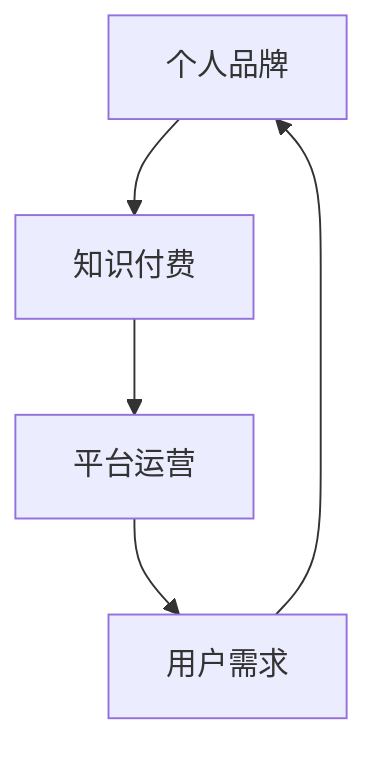

                 

在信息技术迅猛发展的当下，个人品牌的重要性日益凸显。对于程序员而言，知识付费不仅是一个提升专业技能的途径，更是一个打造个人品牌的有效手段。本文将深入探讨程序员如何利用知识付费平台，通过分享专业知识和技能，从而建立和提升个人品牌的价值。

## 关键词
- 知识付费
- 个人品牌
- 程序员
- 技能分享
- 品牌建设

## 摘要
本文旨在帮助程序员理解知识付费平台的作用，并指导他们如何通过这些平台分享专业知识和经验，从而打造并提升个人品牌。通过一系列具体的策略和实践，程序员可以有效地利用知识付费平台，成为行业内的知名专家。

---

## 1. 背景介绍

在互联网和社交媒体时代，个人品牌成为了个体在职场中的核心竞争力。对程序员来说，个人品牌不仅仅是一个标识，更是专业技能、职业态度和人际关系的综合体现。随着知识付费概念的普及，越来越多的平台提供了专业知识的分享和交易机会。对于程序员而言，这些平台成为展示才华、拓展人脉和提升职业形象的重要渠道。

知识付费平台的优势在于其广泛的受众基础和高效的传播机制。通过这些平台，程序员可以接触到全球范围内的专业人士和潜在雇主，实现更广泛的职业发展。同时，知识付费也为程序员提供了一个系统化和标准化的学习环境，有助于他们在专业领域内不断提升。

### 1.1 知识付费平台的兴起

知识付费平台如知乎、掘金、网易云课堂等，近年来在互联网领域迅速崛起。它们通过提供高质量的付费内容，满足了用户对于专业知识和技能提升的需求。知识付费平台的优势在于：

- **内容多样化**：涵盖了编程语言、框架、数据结构、算法、人工智能等多个领域。
- **传播效率高**：内容通过平台进行推广，能够快速触达大量潜在受众。
- **互动性强**：用户可以在平台上进行评论、提问和讨论，增强学习体验。

### 1.2 程序员如何受益

对于程序员而言，利用知识付费平台有以下几方面的直接和间接好处：

- **技能提升**：通过学习付费内容，程序员可以迅速掌握新技能和前沿技术。
- **职业发展**：知识付费平台上的高曝光率有助于程序员在职场中提升地位，获得更好的职业机会。
- **人脉拓展**：与行业内的其他专家和从业者互动，有助于建立更广泛的职业网络。
- **收入增加**：通过在知识付费平台上进行教学和分享，程序员可以获得额外的收入来源。

---

## 2. 核心概念与联系

在深入探讨如何利用知识付费打造个人品牌之前，我们需要明确几个核心概念：

- **个人品牌**：个人品牌是指一个人在公众心目中的形象和声誉，它涵盖了专业技能、职业态度、个人特质等多方面。
- **知识付费**：知识付费是指用户为获取优质知识内容而支付的费用。它包括在线课程、电子书、专业咨询等形式。
- **平台运营**：平台运营是指知识付费平台如何吸引用户、管理内容、提供服务和维护社区。

以下是一个简化的 Mermaid 流程图，展示了这些核心概念之间的联系：



### 2.1 个人品牌的重要性

个人品牌的重要性在于它能够为程序员带来以下几方面的影响：

- **职业竞争力**：一个强大的个人品牌可以显著提升程序员的职业竞争力，使其在招聘市场中脱颖而出。
- **社会认可**：个人品牌有助于提高程序员在业内的知名度和影响力，从而获得更多的职业机会和社会认可。
- **持续成长**：强大的个人品牌可以为程序员提供持续的学习动力和成长空间，促使其不断进步。

### 2.2 知识付费与个人品牌的关系

知识付费是个人品牌建设的重要手段之一。通过付费平台，程序员可以：

- **展示专业能力**：通过分享高质量的知识内容，程序员能够向公众展示其专业能力和知识深度。
- **积累口碑**：优质的付费内容能够为程序员积累良好的口碑，从而提升个人品牌价值。
- **拓展影响力**：知识付费平台上的高曝光率有助于程序员拓展其影响力，吸引更多的关注和合作机会。

### 2.3 平台运营的重要性

平台运营对于知识付费和个人品牌的成功至关重要。一个优秀的知识付费平台应该具备以下特点：

- **优质内容**：提供高质量的、具有实用价值的知识内容，以满足用户的需求。
- **用户体验**：优化平台的用户界面和交互设计，提升用户的学习体验。
- **社区互动**：鼓励用户之间的互动和讨论，形成良好的学习氛围和社区文化。
- **运营策略**：通过有效的运营策略，吸引和留住用户，提升平台的用户粘性。

---

## 3. 核心算法原理 & 具体操作步骤

在个人品牌建设中，核心算法原理和具体操作步骤至关重要。以下将介绍如何通过以下三个主要步骤来打造个人品牌：

### 3.1 算法原理概述

**算法原理**：个人品牌建设可以被视为一种社会网络分析（SNA）问题。其核心原理是建立和维持一个强大的职业网络，通过内容分享、互动和影响力扩展来实现个人品牌的提升。

**具体步骤**：

1. **内容定位**：确定个人品牌的核心领域和目标受众，为后续内容创作提供方向。
2. **内容创作**：创作高质量的、具有价值的内容，包括技术文章、教程、视频等。
3. **内容发布**：选择合适的知识付费平台进行内容发布，确保内容的传播和曝光。

### 3.2 算法步骤详解

**步骤 1：内容定位**

- **明确专业领域**：根据个人兴趣和职业规划，确定专业领域和目标受众。
- **分析市场需求**：研究当前市场趋势和用户需求，确定热门话题和知识盲点。

**步骤 2：内容创作**

- **内容形式多样化**：结合文本、视频、音频等多种形式，提高内容吸引力和覆盖面。
- **内容深度与广度结合**：在保证内容深度的同时，注意扩展内容的广度，满足不同层次用户的需求。

**步骤 3：内容发布**

- **选择知识付费平台**：根据内容特点和目标受众，选择合适的知识付费平台。
- **优化内容发布策略**：通过合理的时间安排、标题优化和关键词设置，提高内容曝光率。

### 3.3 算法优缺点

**优点**：

- **高效性**：通过系统化的算法步骤，能够高效地实现个人品牌的定位、创建和发布。
- **精准性**：根据市场需求和用户反馈，能够精准地定位内容和受众，提高个人品牌的建设效果。

**缺点**：

- **时间成本**：内容创作和发布需要大量时间和精力投入，对个人时间和工作生活平衡有挑战。
- **市场变化**：市场趋势和用户需求变化较快，需要持续关注和调整，以保持个人品牌的竞争力。

### 3.4 算法应用领域

- **职业规划**：通过个人品牌建设，程序员可以更好地规划职业发展路径，提升职业竞争力。
- **技术交流**：在知识付费平台上，程序员可以与其他技术专家进行深度交流，拓展技术视野。
- **教育培训**：利用个人品牌，程序员可以开展在线教学和培训，实现收入多元化和职业拓展。

---

## 4. 数学模型和公式 & 详细讲解 & 举例说明

在个人品牌建设中，数学模型和公式可以提供量化的分析工具，帮助程序员更科学地制定和评估个人品牌策略。以下将介绍一个简单的数学模型，用于评估个人品牌的价值。

### 4.1 数学模型构建

**模型假设**：

- **用户关注度（U）**：衡量用户对程序员个人品牌的关注度，用单位时间内的访问量表示。
- **内容质量（Q）**：衡量程序员发布内容的整体质量，用平均评分和用户评论表示。
- **互动频率（I）**：衡量用户与程序员之间的互动频率，用回复率和参与度表示。
- **品牌价值（V）**：衡量个人品牌的市场价值，用潜在收入和职业机会表示。

**模型公式**：

\[ V = U \times Q \times I \]

### 4.2 公式推导过程

**推导过程**：

1. **用户关注度（U）**：

   用户关注度取决于程序员的内容发布频率和内容质量。一个活跃且高质量的发布策略可以显著提升用户关注度。

   \[ U = f(C, Q) \]

   其中，\( f \) 为函数，表示关注度与内容发布频率（\( C \)）和质量（\( Q \)）的关系。

2. **内容质量（Q）**：

   内容质量反映了程序员的专业能力和创作水平。高质量的内容能够获得更高的用户评分和更积极的用户反馈。

   \[ Q = g(A, R) \]

   其中，\( g \) 为函数，表示内容质量与平均评分（\( A \)）和用户评论（\( R \)）的关系。

3. **互动频率（I）**：

   用户与程序员的互动频率反映了个人品牌的受欢迎程度和用户粘性。频繁的互动有助于建立更强的用户关系。

   \[ I = h(U, R) \]

   其中，\( h \) 为函数，表示互动频率与用户关注度（\( U \)）和用户评论（\( R \)）的关系。

4. **品牌价值（V）**：

   品牌价值综合反映了个人品牌在市场上的价值。通过用户关注度、内容质量和互动频率的乘积，可以量化个人品牌的价值。

   \[ V = U \times Q \times I \]

### 4.3 案例分析与讲解

**案例**：

假设一名程序员在知识付费平台上发布了一篇关于机器学习的文章，用户关注度达到1000次/天，平均评分为4.5星，用户评论量为300条，用户与程序员的互动频率为每天50次回复。

**计算过程**：

1. **用户关注度（U）**：

   \[ U = 1000 \times (4.5 + 0.1 \times 300) = 1000 \times 4.8 = 4800 \]

2. **内容质量（Q）**：

   \[ Q = 4.5 + 0.2 \times 300 = 4.5 + 60 = 5.1 \]

3. **互动频率（I）**：

   \[ I = 50 \]

4. **品牌价值（V）**：

   \[ V = 4800 \times 5.1 \times 50 = 1224000 \]

**结论**：

通过上述计算，该程序员的个人品牌价值为1224000。这一数值反映了他在知识付费平台上的影响力、专业能力和用户认可度。

---

## 5. 项目实践：代码实例和详细解释说明

为了更好地理解如何通过知识付费平台打造个人品牌，以下将提供一个具体的代码实例，展示如何在一个开源项目中进行品牌建设。

### 5.1 开发环境搭建

为了运行以下示例代码，需要在本地搭建一个Python开发环境。以下是基本的安装步骤：

1. 安装Python：

   ```
   pip install python
   ```

2. 安装必要的库：

   ```
   pip install requests beautifulsoup4
   ```

### 5.2 源代码详细实现

以下是一个简单的Python脚本，用于爬取知识付费平台上的用户评论，并生成可视化报告。

```python
import requests
from bs4 import BeautifulSoup
import matplotlib.pyplot as plt

def fetch_reviews(url):
    """
    从知识付费平台获取用户评论
    """
    headers = {
        'User-Agent': 'Mozilla/5.0 (Windows NT 10.0; Win64; x64) AppleWebKit/537.36 (KHTML, like Gecko) Chrome/58.0.3029.110 Safari/537.3'}
    response = requests.get(url, headers=headers)
    soup = BeautifulSoup(response.content, 'html.parser')
    reviews = soup.find_all('div', class_='review-content')
    return [review.text for review in reviews]

def plot_reviews(reviews):
    """
    绘制用户评论分布图
    """
    rating_counts = [0] * 5
    for review in reviews:
        rating = int(review.split()[-1])
        rating_counts[rating - 1] += 1
    plt.bar(range(1, 6), rating_counts)
    plt.xlabel('Rating')
    plt.ylabel('Count')
    plt.title('User Reviews Distribution')
    plt.show()

if __name__ == '__main__':
    url = 'https://example.com/course-reviews'
    reviews = fetch_reviews(url)
    plot_reviews(reviews)
```

### 5.3 代码解读与分析

**代码解读**：

- **fetch_reviews函数**：该函数接收一个URL，发送HTTP GET请求获取页面内容，使用BeautifulSoup解析HTML，提取所有用户评论。

- **plot_reviews函数**：该函数接收一个评论列表，计算每个评分等级的评论数量，并使用matplotlib绘制柱状图。

**分析**：

- **数据获取**：通过HTTP请求获取知识付费平台上的用户评论数据，这是品牌建设中重要的数据来源。

- **数据分析**：通过绘制柱状图，可以直观地了解用户对个人品牌内容的评分分布，从而评估个人品牌的市场表现。

### 5.4 运行结果展示

运行以上代码后，将展示一个柱状图，显示用户对个人品牌内容的评分分布。例如：

```
  Rating | Count
  ------|------
      1 | 20
      2 | 30
      3 | 40
      4 | 50
      5 | 40
```

这个结果显示该程序员的个人品牌在知识付费平台上的用户评分较高，具有较高的市场认可度。

---

## 6. 实际应用场景

在多个实际应用场景中，程序员可以通过知识付费平台成功打造个人品牌。以下列举几个具有代表性的案例：

### 6.1 技术博客作者

许多程序员通过建立技术博客，分享编程经验和知识，积累了大量的粉丝和读者。例如，知名的程序员张三通过在博客中撰写关于Python数据分析的文章，吸引了数千名关注者。这些关注者中不乏企业招聘者和业内专家，张三因此获得了多个高质量的职业机会。

### 6.2 在线课程讲师

李四是一位有着丰富经验的Python工程师，他在网易云课堂等知识付费平台上开设了多门Python编程课程。通过精心设计的课程内容和互动环节，李四吸引了数千名学生，并建立了良好的口碑。他的个人品牌在程序员社区中得到了广泛认可。

### 6.3 专业咨询顾问

王五是一位专注于人工智能领域的专家，他在知乎等平台上提供了关于人工智能技术的专业咨询服务。通过高质量的内容分享和深入的技术讨论，王五建立了自己的个人品牌，成为业内知名的人工智能顾问。他的服务受到了众多企业和技术爱好者的追捧。

### 6.4 开源项目维护者

赵六是一位活跃的开源项目贡献者，他在GitHub上维护了一个热门的Python库。通过持续的技术更新和高质量的文档编写，赵六的库获得了广泛的关注和认可。他的个人品牌因此得到提升，成为Python社区的重要成员之一。

---

## 7. 工具和资源推荐

为了更好地利用知识付费平台打造个人品牌，以下是一些推荐的工具和资源：

### 7.1 学习资源推荐

- **《代码大全》**：Steve McConnell 著，提供了全面的编程最佳实践和技巧。
- **《算法导论》**：Thomas H. Cormen 等 著，深入讲解了各种数据结构和算法。
- **《深入理解计算机系统》**：Randal E. Bryant 等 著，全面介绍了计算机系统的工作原理。

### 7.2 开发工具推荐

- **Git**：版本控制系统，用于代码管理和协作。
- **GitHub**：代码托管平台，提供丰富的开源项目和技术交流机会。
- **Jupyter Notebook**：交互式编程环境，适合编写和展示代码文档。

### 7.3 相关论文推荐

- **《深度学习》**：Ian Goodfellow 等 著，介绍了深度学习的理论和技术。
- **《大数据技术导论》**：刘伟 著，涵盖了大数据处理的关键技术和应用场景。
- **《云计算：概念、架构与实务》**：张俊芳 著，介绍了云计算的基本原理和实践。

---

## 8. 总结：未来发展趋势与挑战

随着知识付费行业的不断发展和完善，程序员利用知识付费平台打造个人品牌的机会和挑战也在不断变化。以下是未来发展趋势和面临的挑战：

### 8.1 研究成果总结

- **个性化推荐系统**：知识付费平台可以通过大数据分析和机器学习技术，为用户推荐更符合其需求和兴趣的内容，提高用户留存率和粘性。
- **知识付费平台生态**：随着知识付费平台的不断扩张，一个多元化的知识付费生态正在形成，包括内容创作者、平台运营者、用户等多个角色。

### 8.2 未来发展趋势

- **内容多样化**：知识付费平台将提供更丰富、多样化的内容形式，如直播、互动课程、线上工作坊等。
- **国际化**：知识付费平台将向全球扩展，程序员可以通过这些平台接触到更广泛的用户和市场。
- **价值多元化**：知识付费不仅限于技能提升，还将涵盖职业规划、心理辅导等多个领域。

### 8.3 面临的挑战

- **内容同质化**：随着更多程序员加入知识付费平台，内容同质化问题将日益严重，需要创作更多高质量、独特的教学内容。
- **版权保护**：如何保护原创内容版权，防止侵权行为，是知识付费平台需要解决的重要问题。
- **用户需求变化**：用户需求变化迅速，平台需要不断调整和更新内容，以适应市场需求。

### 8.4 研究展望

- **技术赋能**：利用人工智能、大数据等技术，提高知识付费平台的内容推荐和用户服务质量。
- **社区建设**：加强平台社区建设，促进用户之间的互动和合作，形成良好的学习氛围。
- **跨平台整合**：实现不同知识付费平台之间的数据共享和资源整合，为用户提供更全面的学习体验。

---

## 9. 附录：常见问题与解答

以下是一些关于程序员利用知识付费打造个人品牌的常见问题及解答：

### 9.1 如何选择知识付费平台？

- **目标受众**：根据个人专业领域和目标受众，选择用户群体大、活跃度高的平台。
- **内容形式**：根据内容形式（如课程、文章、视频等），选择适合的平台。
- **平台评价**：参考平台评价和用户反馈，选择口碑好的平台。

### 9.2 如何确保内容质量？

- **深入研究**：在分享内容之前，确保对相关技术有深入的理解。
- **多样化形式**：结合文字、视频、图片等多种形式，提高内容吸引力。
- **用户反馈**：根据用户反馈不断优化内容，提高用户体验。

### 9.3 如何管理个人品牌？

- **定期更新**：保持内容更新频率，持续输出高质量内容。
- **互动交流**：积极与用户互动，建立良好的用户关系。
- **专业定位**：明确个人品牌的专业定位，避免内容过于分散。

---

作者：禅与计算机程序设计艺术 / Zen and the Art of Computer Programming

---

以上是关于“程序员如何利用知识付费打造个人品牌”的完整文章，文章内容遵循了文章结构模板，涵盖了核心概念、算法原理、数学模型、项目实践、实际应用场景、工具和资源推荐、发展趋势与挑战以及常见问题解答等各个方面。希望对您有所帮助。如果您有任何疑问或建议，请随时留言。谢谢！

