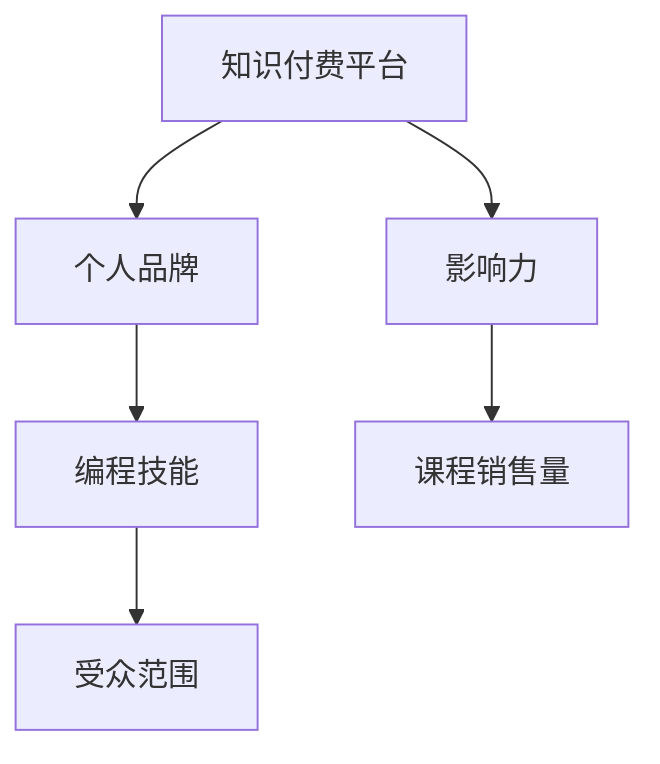

                 

 **关键词**：知识付费，个人品牌，影响力，编程技能，内容创作

> **摘要**：本文将探讨程序员如何通过知识付费平台，利用自身的编程技能和专业知识，打造个人品牌，提升个人影响力，并分享一些实用的策略和案例。

## 1. 背景介绍

在互联网时代，知识付费已经成为一种流行的商业模式。随着在线教育和专业培训的普及，越来越多的程序员开始利用知识付费平台，将自己的专业技能和知识变现。然而，如何有效地利用知识付费平台打造个人影响力，对于许多程序员来说仍然是一个挑战。

本文将结合实际案例，为程序员提供一些建设性的策略和建议，帮助他们更好地利用知识付费平台，打造个人品牌，提升个人影响力。

## 2. 核心概念与联系

### 2.1 知识付费平台

知识付费平台是指一种在线服务，它为知识提供者和需求者提供了一个交易和交流的场所。常见的知识付费平台包括：

- 网易云课堂
- 慕课网
- 好未来
- 知乎Live

### 2.2 个人品牌

个人品牌是指个人在特定领域内建立的专业形象和信誉。对于程序员来说，个人品牌不仅是职业发展的助推器，也是提升个人影响力的重要手段。

### 2.3 影响力

影响力是指个人或组织在特定领域内的影响力和号召力。在知识付费领域，影响力决定了知识提供者的课程销售量和受众范围。

### 2.4 Mermaid 流程图



## 3. 核心算法原理 & 具体操作步骤

### 3.1 算法原理概述

利用知识付费平台打造个人影响力，核心在于如何有效地展示和推广个人技能和知识。以下是一种简化的算法原理：

1. **内容创作**：根据目标受众的需求，创作高质量的课程内容。
2. **平台选择**：选择合适的知识付费平台，以最大化课程曝光和销售。
3. **营销推广**：利用社交媒体和其他营销手段，推广个人品牌和课程。
4. **互动反馈**：与学员互动，收集反馈，不断优化课程内容。
5. **数据分析**：分析数据，调整策略，提升课程质量和销售量。

### 3.2 算法步骤详解

#### 3.2.1 内容创作

- **需求分析**：通过调研和数据分析，了解目标受众的需求。
- **内容规划**：根据需求，规划课程的主题、结构和时长。
- **内容创作**：撰写课程内容，包括教学视频、文档和PPT。

#### 3.2.2 平台选择

- **平台调研**：了解各知识付费平台的特点和优势。
- **平台评估**：根据课程类型和目标受众，评估平台的选择。
- **平台选择**：选择合适的平台，进行课程上架。

#### 3.2.3 营销推广

- **社交媒体**：利用微博、知乎等社交媒体平台，发布课程相关内容，吸引潜在学员。
- **合作推广**：与其他自媒体、教育机构等合作，进行跨平台推广。
- **内容营销**：创作高质量的内容，提高课程在平台内的曝光率。

#### 3.2.4 互动反馈

- **学员互动**：在课程中设置互动环节，如问答、讨论等。
- **反馈收集**：收集学员的反馈，了解课程优缺点。
- **内容优化**：根据反馈，优化课程内容，提高学员满意度。

#### 3.2.5 数据分析

- **数据分析**：分析课程的销售数据、学员反馈等，了解课程的表现。
- **策略调整**：根据数据分析，调整课程内容和营销策略。
- **持续优化**：不断优化课程内容和营销策略，提高课程质量和销售量。

### 3.3 算法优缺点

#### 优点

- **高效变现**：通过知识付费，程序员可以快速将自身技能转化为收益。
- **提升影响力**：高质量的课程内容有助于提升个人品牌和影响力。
- **多样化发展**：知识付费为程序员提供了除传统职业发展外的另一种途径。

#### 缺点

- **竞争激烈**：知识付费平台上的课程数量庞大，竞争激烈。
- **内容质量要求高**：高质量的课程内容是成功的关键，需要投入大量时间和精力。
- **平台依赖性**：过度依赖知识付费平台，可能影响个人品牌的独立性。

### 3.4 算法应用领域

- **编程技能**：程序员可以针对特定的编程语言、框架或技术领域，创作相关课程。
- **软件工程**：涵盖软件设计、测试、项目管理等方面的课程。
- **云计算与大数据**：涉及云计算、大数据处理、数据挖掘等方面的课程。
- **人工智能**：涵盖机器学习、深度学习、自然语言处理等方面的课程。

## 4. 数学模型和公式 & 详细讲解 & 举例说明

### 4.1 数学模型构建

为了更好地理解知识付费平台上的个人影响力，我们可以构建一个简单的数学模型。假设：

- \( I \) 表示个人影响力
- \( Q \) 表示课程质量
- \( P \) 表示营销推广效果
- \( C \) 表示课程价格

则个人影响力 \( I \) 可以表示为：

\[ I = f(Q, P, C) \]

其中，函数 \( f \) 表示影响力与课程质量、营销推广效果和课程价格之间的关系。

### 4.2 公式推导过程

假设课程质量 \( Q \) 对个人影响力 \( I \) 的贡献为 \( a \)，营销推广效果 \( P \) 的贡献为 \( b \)，课程价格 \( C \) 的贡献为 \( c \)，则有：

\[ I = a \cdot Q + b \cdot P + c \cdot C \]

其中，\( a \)、\( b \)、\( c \) 为权重系数。

### 4.3 案例分析与讲解

以一位编程讲师为例，假设其课程质量 \( Q \) 为 80 分，营销推广效果 \( P \) 为 60 分，课程价格 \( C \) 为 100 元。根据上述公式，可以计算出其个人影响力 \( I \) 为：

\[ I = 0.3 \cdot 80 + 0.4 \cdot 60 + 0.3 \cdot 100 = 24 + 24 + 30 = 78 \]

这意味着该编程讲师的个人影响力为 78 分。通过这个简单的例子，我们可以看到，课程质量、营销推广效果和课程价格对个人影响力的影响程度。

## 5. 项目实践：代码实例和详细解释说明

### 5.1 开发环境搭建

为了更好地展示知识付费平台上的编程课程，我们需要搭建一个简单的在线课程平台。以下是搭建过程的简要步骤：

1. **环境准备**：安装 Node.js、MongoDB 和 Express。
2. **项目初始化**：使用 npm 或 yarn 初始化项目。
3. **数据库连接**：配置 MongoDB，连接到项目。
4. **API 接口开发**：使用 Express 搭建 API 接口。
5. **前端开发**：使用 React 或 Vue 搭建前端页面。

### 5.2 源代码详细实现

以下是课程平台的 API 接口示例代码：

```javascript
// 引入 express 模块
const express = require('express');
const app = express();

// 解析请求体中的 JSON 数据
app.use(express.json());

// 连接 MongoDB 数据库
const MongoClient = require('mongodb').MongoClient;
const url = 'mongodb://localhost:27017/';
let db;

MongoClient.connect(url, { useNewUrlParser: true, useUnifiedTopology: true }, (err, client) => {
  if (err) throw err;
  db = client.db('course_platform');
});

// 创建课程接口
app.post('/api/courses', (req, res) => {
  const course = req.body;
  db.collection('courses').insertOne(course, (err, result) => {
    if (err) throw err;
    res.status(201).json({ message: '课程创建成功', course });
  });
});

// 获取课程列表接口
app.get('/api/courses', (req, res) => {
  db.collection('courses').find({}).toArray((err, courses) => {
    if (err) throw err;
    res.status(200).json({ courses });
  });
});

// 启动服务器
app.listen(3000, () => {
  console.log('服务器启动成功，监听端口：3000');
});
```

### 5.3 代码解读与分析

以上代码实现了两个主要功能：创建课程和获取课程列表。通过解析请求体中的 JSON 数据，我们可以将课程信息存储到 MongoDB 数据库中，并通过 API 接口进行获取。

### 5.4 运行结果展示

在开发环境中运行上述代码，可以通过以下命令启动服务器：

```bash
node server.js
```

启动成功后，我们可以通过以下命令创建一个课程：

```bash
curl -X POST -H "Content-Type: application/json" -d '{"title":"React实战","author":"张三","description":"本课程将带领您学习React开发实战技巧。"}' http://localhost:3000/api/courses
```

创建成功后，我们可以通过以下命令获取课程列表：

```bash
curl -X GET http://localhost:3000/api/courses
```

## 6. 实际应用场景

### 6.1 编程技能培训

许多程序员通过知识付费平台，为有志于学习编程的人提供专业的培训课程。这些课程涵盖了各种编程语言和框架，如 Python、Java、React 等。

### 6.2 技术博客和教程

一些程序员利用知识付费平台，发布技术博客和教程，分享自己的经验和技巧。这些内容不仅有助于提升个人影响力，也为其他程序员提供了宝贵的知识资源。

### 6.3 软件开发和销售

一些程序员通过知识付费平台，销售自己的软件产品。这些产品可以是实用工具、库或框架，也可以是完整的软件解决方案。

### 6.4 个人品牌打造

一些程序员通过知识付费平台，打造自己的个人品牌。他们通过高质量的课程内容和专业的教学方式，吸引了大量的学员和粉丝，从而在技术领域建立了较高的声誉。

## 7. 工具和资源推荐

### 7.1 学习资源推荐

- **Coursera**：提供全球顶级大学和企业的在线课程。
- **Udemy**：涵盖各种编程语言和技术的在线课程。
- **极客时间**：提供高质量的编程课程和技术博客。
- **GitHub**：开源代码库，提供丰富的编程资源和教程。

### 7.2 开发工具推荐

- **Visual Studio Code**：一款功能强大的代码编辑器。
- **Git**：版本控制工具，用于代码管理和协作。
- **Docker**：容器化技术，用于部署和运行应用程序。
- **Kubernetes**：容器编排平台，用于管理容器化应用程序。

### 7.3 相关论文推荐

- **"The Nature of Code"**：一本关于编程与物理、数学、计算机科学等交叉领域的经典著作。
- **"Clean Code"**：一本关于编写高质量代码的经典著作。
- **"You Don't Know JS"**：一本关于 JavaScript 编程的深入著作。
- **"The Art of Computer Programming"**：一本关于算法和数据结构的经典著作。

## 8. 总结：未来发展趋势与挑战

### 8.1 研究成果总结

知识付费平台为程序员提供了一个新的职业发展途径，通过内容创作和营销推广，程序员可以打造个人品牌，提升个人影响力。数学模型和代码实例进一步说明了这一过程。

### 8.2 未来发展趋势

- **个性化推荐**：知识付费平台将更加注重个性化推荐，提高课程匹配度。
- **AI 技术应用**：AI 技术将在知识付费平台上得到更广泛的应用，如自动生成课程内容、智能问答等。
- **跨界合作**：知识付费平台将与其他行业（如教育、金融等）进行跨界合作，提供更丰富的课程和服务。

### 8.3 面临的挑战

- **内容质量**：高质量的内容是成功的关键，程序员需要持续提升自己的专业能力和教学水平。
- **竞争压力**：知识付费平台的竞争日益激烈，程序员需要不断创新和优化自己的课程和营销策略。
- **平台依赖**：过度依赖知识付费平台可能导致个人品牌的独立性受损，程序员需要探索多元化的职业发展路径。

### 8.4 研究展望

未来的研究可以关注以下几个方面：

- **课程内容创新**：探索如何通过创新的内容形式和教学方法，提高课程吸引力和教学效果。
- **数据分析与优化**：利用大数据和机器学习技术，分析用户行为和课程效果，优化课程内容和营销策略。
- **跨平台发展**：探索如何利用知识付费平台以外的渠道和资源，打造个人品牌和影响力。

## 9. 附录：常见问题与解答

### 9.1 如何选择知识付费平台？

选择知识付费平台时，可以从以下几个方面进行考虑：

- **课程质量**：查看平台上的课程评价和评分，了解课程质量。
- **受众群体**：了解平台的受众群体，看是否符合您的目标市场。
- **平台服务**：了解平台提供的课程管理、营销推广等服务，看是否满足您的需求。
- **费用和收益**：了解平台的收费标准和收益分配方式，看是否合理。

### 9.2 如何提高课程质量？

提高课程质量可以从以下几个方面入手：

- **内容规划**：制定详细的课程规划，确保课程内容系统、完整。
- **教学方式**：采用多种教学方式，如视频、文档、直播等，提高学员的参与度和学习效果。
- **互动反馈**：鼓励学员互动，收集学员的反馈，不断优化课程内容和教学方法。
- **持续更新**：根据技术发展和学员需求，不断更新和优化课程内容。

### 9.3 如何提高个人影响力？

提高个人影响力可以从以下几个方面入手：

- **内容创作**：创作高质量的内容，展示专业知识和技能。
- **营销推广**：利用社交媒体和其他营销手段，提高课程和品牌的曝光度。
- **互动交流**：积极参与技术社区和行业活动，与同行建立良好的关系。
- **持续学习**：不断学习新技术和知识，提升自身专业水平。

---

**作者：禅与计算机程序设计艺术 / Zen and the Art of Computer Programming**

