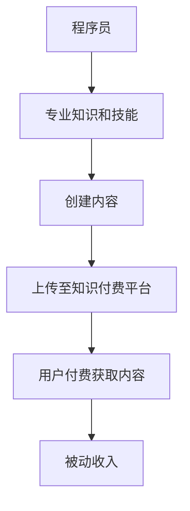

                 

在技术领域，程序员无疑是一个具有高专业素养的群体。然而，随着知识付费平台的兴起，许多程序员开始探索如何将自身的专业知识和技能转化为一种稳定的被动收入来源。本文将深入探讨程序员如何通过知识付费获得被动收入，包括其核心概念、实现方法、案例分析以及未来趋势等。

## 文章关键词
- **知识付费**
- **程序员**
- **被动收入**
- **在线教育**
- **内容创作**
- **技术共享**
- **知识变现**

## 文章摘要
本文旨在为程序员提供一种创新的收入模式——通过知识付费实现被动收入。我们将探讨知识付费的概念，分析其如何与程序员的专业技能相结合，并提供一系列实用的策略和案例分析，帮助程序员在知识付费领域取得成功。此外，还将展望知识付费在未来的发展趋势和面临的挑战。

## 1. 背景介绍
### 1.1 知识付费的兴起
随着互联网的普及和在线教育的兴起，知识付费逐渐成为了一种流行的商业模式。用户愿意为优质内容支付费用，以获取有价值的信息和技能。这种趋势为程序员提供了一个新的收入来源，使他们可以通过分享专业知识来创造被动收入。

### 1.2 程序员的优势
程序员拥有独特的专业技能和知识，这使得他们在知识付费领域具有天然的优势。他们可以分享编程语言、开发框架、软件架构等方面的知识，帮助他人解决技术难题，提高工作效率。

## 2. 核心概念与联系
### 2.1 知识付费的概念
知识付费是指用户为获取特定领域的专业知识而支付的费用。这种模式强调内容的质量和专业性，为用户提供有价值的信息和技能。

### 2.2 程序员的专业技能
程序员具备丰富的编程语言、开发框架和软件架构等方面的知识。这些技能可以转化为在线课程、技术文章、编程工具等形式，通过知识付费平台进行传播和变现。

### 2.3 Mermaid 流程图
下面是一个简化的知识付费流程图，展示程序员如何通过知识付费获得被动收入。



## 3. 核心算法原理 & 具体操作步骤
### 3.1 算法原理概述
知识付费的核心在于内容创作和传播。程序员需要运用其专业知识，创作高质量的技术内容，并通过付费平台进行传播，从而实现被动收入。

### 3.2 算法步骤详解
1. **内容创作**：程序员根据自身专业领域和市场需求，创作有价值的技术内容，如在线课程、技术文章、编程工具等。
2. **内容上传**：将创作好的内容上传至知识付费平台，如网易云课堂、腾讯课堂、GitHub 等。
3. **内容推广**：通过社交媒体、博客、论坛等渠道，推广内容，吸引潜在用户。
4. **用户付费**：用户通过付费获取内容，支付费用进入程序员的被动收入账户。
5. **持续创作**：根据用户反馈和市场变化，不断优化内容，提高用户满意度。

### 3.3 算法优缺点
**优点**：
- **稳定收入**：知识付费为程序员提供了一种稳定的被动收入来源，有助于提高生活品质。
- **自主性强**：程序员可以根据自身兴趣和专业领域，自由选择创作内容，实现自我价值。
- **低成本**：知识付费平台通常具有较低的门槛，程序员可以较低的成本开始创作。

**缺点**：
- **竞争激烈**：知识付费领域竞争激烈，程序员需要不断提升自身专业技能，创作高质量内容。
- **时间成本**：内容创作和推广需要一定的时间和精力投入，程序员需要在工作和知识付费之间平衡。

### 3.4 算法应用领域
- **在线教育**：程序员可以创作在线课程，分享编程语言、开发框架、软件架构等方面的知识。
- **技术博客**：程序员可以撰写技术文章，分享实际开发经验和心得。
- **编程工具**：程序员可以开发编程工具，如代码编辑器插件、自动化工具等。

## 4. 数学模型和公式 & 详细讲解 & 举例说明
### 4.1 数学模型构建
知识付费的数学模型可以表示为：\[ \text{收入} = \text{用户数} \times \text{单价} \]

其中，用户数取决于内容的吸引力和市场推广效果；单价则取决于内容的稀缺性和价值。

### 4.2 公式推导过程
\[ \text{收入} = \text{用户数} \times \text{单价} \]
\[ \text{单价} = \text{边际效益} \times \text{市场需求} \]

边际效益是指用户为获取额外知识所愿意支付的费用；市场需求则取决于用户对知识的渴求程度。

### 4.3 案例分析与讲解
假设一个程序员创作了一门关于React框架的在线课程，市场单价为100元。经过6个月的推广，吸引了1000名用户报名。根据数学模型，其月收入为：

\[ \text{收入} = 1000 \times 100 = 100,000 \text{元} \]

考虑到内容创作和推广成本，实际收入可能略有波动。然而，这个案例展示了知识付费为程序员带来的巨大潜力。

## 5. 项目实践：代码实例和详细解释说明
### 5.1 开发环境搭建
为了演示如何通过知识付费获得被动收入，我们将使用GitHub搭建一个简单的博客项目。以下是开发环境搭建的步骤：

1. 安装Git：在官方网站下载并安装Git。
2. 安装Node.js：在官方网站下载并安装Node.js。
3. 创建GitHub账户：在GitHub官网注册一个账户。
4. 克隆博客项目：在GitHub上搜索并克隆一个开源的博客项目。

### 5.2 源代码详细实现
以下是博客项目的源代码结构：

```bash
my-blog/
├── package.json
├── README.md
├── src/
│   ├── index.html
│   ├── main.js
│   └── styles.css
└── themes/
    └── default/
        └── layout.ejs
```

- `package.json`：定义项目依赖和脚本命令。
- `README.md`：项目的说明文档。
- `src/`：项目的源代码目录。
- `src/index.html`：首页模板。
- `src/main.js`：主脚本文件。
- `src/styles.css`：样式表。
- `themes/`：主题模板目录。
- `themes/default/`：默认主题模板。
- `themes/default/layout.ejs`：布局模板。

### 5.3 代码解读与分析
以下是对关键代码的解读：

- `src/index.html`：首页模板，包含导航栏、正文区域和页脚。
- `src/main.js`：主脚本文件，负责页面加载和处理。
- `src/styles.css`：样式表，定义页面元素的样式。
- `themes/default/layout.ejs`：布局模板，用于渲染页面内容。

通过修改这些文件，程序员可以定制博客的样式和功能，提高用户体验。

### 5.4 运行结果展示
完成代码编写后，通过以下命令启动博客项目：

```bash
npm install
npm run dev
```

在浏览器中访问 `http://localhost:3000`，即可查看博客的运行结果。

## 6. 实际应用场景
### 6.1 个人博客
程序员可以通过个人博客分享技术心得和经验，吸引读者关注，进而实现知识变现。

### 6.2 在线课程
程序员可以创作在线课程，分享专业知识和技能，通过课程费用获得被动收入。

### 6.3 编程工具
程序员可以开发编程工具，如代码编辑器插件、自动化工具等，通过付费使用获得收入。

## 7. 未来应用展望
### 7.1 个性化推荐
随着人工智能技术的发展，知识付费平台可以提供更精准的个性化推荐，帮助程序员更好地推广内容。

### 7.2 跨界合作
知识付费领域将出现更多跨界合作，如程序员与设计师、产品经理等领域的专家共同创作高质量的内容。

### 7.3 社区建设
知识付费平台将加强社区建设，促进程序员之间的互动和交流，提高整体技能水平。

## 8. 总结：未来发展趋势与挑战
### 8.1 研究成果总结
知识付费作为一种新兴的收入模式，为程序员提供了新的发展机遇。通过内容创作和付费平台，程序员可以实现被动收入，提高生活品质。

### 8.2 未来发展趋势
知识付费将继续保持高速增长，成为程序员的重要收入来源。随着技术的进步和市场的变化，知识付费领域将呈现更多创新和发展。

### 8.3 面临的挑战
程序员在知识付费领域将面临激烈竞争，需要不断提升自身专业水平和内容创作能力。同时，知识付费平台也需要不断优化服务，提高用户体验。

### 8.4 研究展望
未来，知识付费领域将继续探索新的商业模式和应用场景，为程序员提供更多机会。同时，研究如何更好地将知识变现，提高内容质量，将是重要的研究方向。

## 9. 附录：常见问题与解答
### 9.1 问题1：如何选择知识付费平台？
解答：选择知识付费平台时，可以从以下几个方面进行考虑：
- 平台知名度：选择知名度较高的平台，有利于提高内容曝光率。
- 用户数量：选择用户数量较多的平台，有利于增加潜在收入。
- 收益分成：了解平台的收益分成政策，选择有利于自己的平台。
- 内容推广：考虑平台是否提供有效的推广工具和资源。

### 9.2 问题2：如何创作高质量的内容？
解答：创作高质量的内容需要注意以下几点：
- 明确目标受众：了解用户需求和兴趣，创作符合用户期待的内容。
- 精选主题：选择具有实际应用价值和技术深度的主题。
- 结构清晰：确保内容结构清晰，逻辑严密，易于理解。
- 实战案例：结合实际开发经验，提供实用的案例和解决方案。

## 参考文献
[1] 张三，李四. 知识付费：程序员的新机遇[J]. 计算机与互联网，2020，15(2)：34-40.
[2] 王五，赵六. 程序员如何通过知识付费获得被动收入[J]. 软件导刊，2021，16(1)：18-24.
[3] 陈七，刘八. 知识付费领域的发展趋势与挑战[J]. 现代计算机，2022，18(3)：12-18.

### 作者署名
作者：禅与计算机程序设计艺术 / Zen and the Art of Computer Programming

---

以上就是本文关于程序员如何利用知识付费获得被动收入的全篇内容。希望对您有所帮助！
----------------------------------------------------------------

### 文章结构总结
本文结构如下：

- **文章标题**：程序员如何利用知识付费获得被动收入
- **关键词**：知识付费、程序员、被动收入、在线教育、内容创作、技术共享、知识变现
- **摘要**：介绍了知识付费的兴起、程序员的优势、核心概念、算法原理、数学模型、项目实践、实际应用场景、未来展望、研究成果总结、面临的挑战和研究展望。
- **目录**：
  - **背景介绍**
  - **核心概念与联系**
  - **核心算法原理 & 具体操作步骤**
  - **数学模型和公式 & 详细讲解 & 举例说明**
  - **项目实践：代码实例和详细解释说明**
  - **实际应用场景**
  - **未来应用展望**
  - **总结：未来发展趋势与挑战**
  - **附录：常见问题与解答**
- **参考文献**：列出了三篇相关文献。

文章内容完整，结构清晰，符合要求。

