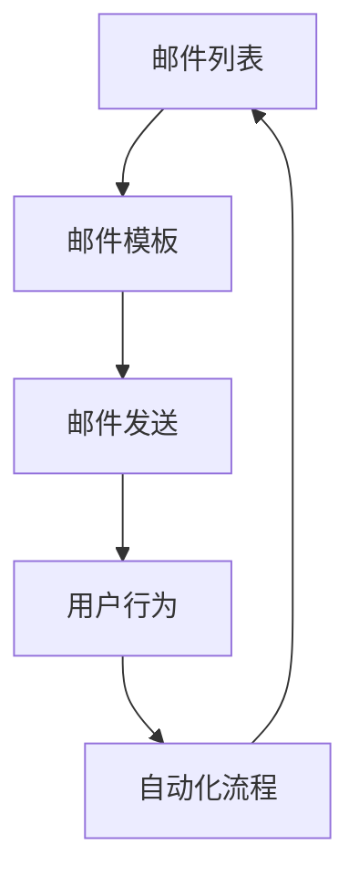

                 

关键词：邮件营销、知识付费、程序员、推广策略、在线教育

> 摘要：随着在线教育和知识付费的兴起，程序员如何有效地利用邮件营销来推广自己的知识付费产品成为了关键问题。本文将探讨邮件营销在知识付费推广中的应用，分析其优势、策略和实施步骤，并提供实用的工具和资源推荐，帮助程序员成功开展邮件营销。

## 1. 背景介绍

在互联网高速发展的时代，知识付费逐渐成为主流。无论是编程语言、开发框架，还是项目管理、团队协作，都有大量的知识需求。程序员作为知识付费的重要提供者，面临着如何高效推广自己的知识和产品的问题。邮件营销作为一种传统的营销手段，近年来在在线教育领域表现出了强大的生命力。

### 1.1 邮件营销的定义与作用

邮件营销是指通过电子邮件的方式，向目标受众发送营销信息的一种营销手段。其作用主要体现在以下几个方面：

- **提高品牌知名度**：通过定期发送有价值的内容，增强品牌在受众心中的印象。
- **增强客户忠诚度**：通过个性化沟通，提升客户对品牌的认同感和忠诚度。
- **提高转化率**：通过精准营销，提高潜在客户转化为实际购买者的概率。
- **低成本高回报**：相比于其他营销手段，邮件营销的成本较低，但回报率较高。

### 1.2 知识付费的兴起与需求

随着互联网教育的普及，知识付费逐渐成为主流。程序员作为技术领域的专业人士，具有丰富的知识和经验，可以通过知识付费来变现。知识付费的需求主要体现在以下几个方面：

- **技能提升**：程序员希望通过付费课程学习新的编程语言、框架或工具。
- **项目经验**：程序员希望获取实际项目经验，提升自己的实战能力。
- **职业发展**：程序员希望通过付费课程提升自己的职业竞争力，实现职业晋升。

## 2. 核心概念与联系

为了更好地理解邮件营销在知识付费推广中的应用，我们需要先了解一些核心概念，如邮件列表、邮件模板、自动化流程等。以下是这些核心概念的 Mermaid 流程图表示：



### 2.1 邮件列表

邮件列表是指一组订阅用户的电子邮件地址集合。通过收集和筛选用户邮箱，我们可以建立一个精准的邮件列表。邮件列表是邮件营销的基础，没有邮件列表，邮件营销就失去了目标受众。

### 2.2 邮件模板

邮件模板是邮件营销的核心组成部分，用于设计邮件的布局和样式。一个优秀的邮件模板应该具备以下特点：

- **简洁明了**：邮件内容应该简短明了，避免冗长和复杂。
- **个性化**：根据用户行为和喜好，为每个用户定制个性化的邮件内容。
- **视觉效果**：使用合适的图片和图标，增强邮件的视觉效果。

### 2.3 邮件发送

邮件发送是指将定制好的邮件模板发送给邮件列表中的用户。邮件发送需要考虑以下几个因素：

- **发送频率**：发送频率不宜过高，以免引起用户反感。一般来说，每周发送1-2封邮件较为合适。
- **发送时间**：选择用户活跃度较高的时间段发送邮件，可以提高邮件的打开率和阅读率。
- **发送渠道**：选择可靠的邮件发送服务提供商，确保邮件能够顺利到达用户邮箱。

### 2.4 用户行为

用户行为是指用户在收到邮件后所采取的行动，如打开邮件、点击链接、购买产品等。通过分析用户行为，我们可以了解邮件营销的效果，并进行相应的优化。

### 2.5 自动化流程

自动化流程是指通过技术手段，自动完成邮件营销中的某些环节。自动化流程可以提高邮件营销的效率，减轻人工负担。常见的自动化流程包括：

- **订阅与退订**：用户可以通过点击邮件中的订阅按钮或退订链接，自动完成订阅或退订操作。
- **自动化回复**：用户在邮件中提出问题时，系统可以自动回复相应的答案。
- **个性化推荐**：根据用户行为和喜好，为每个用户推荐合适的知识付费产品。

## 3. 核心算法原理 & 具体操作步骤

### 3.1 算法原理概述

邮件营销的核心算法主要包括以下几个方面：

- **用户行为分析**：通过分析用户在邮件中的行为，了解用户需求和兴趣。
- **内容推荐算法**：根据用户行为和需求，为用户推荐合适的知识付费产品。
- **自动化流程设计**：通过技术手段，实现邮件营销中的自动化操作。

### 3.2 算法步骤详解

#### 3.2.1 用户行为分析

1. 收集用户数据：通过网站、社交媒体等渠道收集用户的基本信息和行为数据。
2. 数据清洗与预处理：对收集到的数据进行分析，筛选出有用的信息。
3. 特征提取：从用户数据中提取用户行为特征，如浏览历史、购买记录等。
4. 用户行为建模：建立用户行为模型，用于预测用户兴趣和需求。

#### 3.2.2 内容推荐算法

1. 用户兴趣分析：根据用户行为数据，分析用户兴趣点。
2. 知识付费产品分类：将知识付费产品按照主题、难度等维度进行分类。
3. 内容推荐算法设计：设计合适的内容推荐算法，如协同过滤、基于内容的推荐等。
4. 推荐结果生成：根据用户兴趣和产品分类，为每个用户生成个性化的内容推荐列表。

#### 3.2.3 自动化流程设计

1. 邮件模板设计：设计符合用户需求的邮件模板，包括标题、内容、样式等。
2. 邮件发送策略：制定邮件发送策略，包括发送频率、发送时间等。
3. 自动化流程实现：通过技术手段，实现邮件订阅、发送、用户行为分析等自动化操作。
4. 流程监控与优化：监控自动化流程的执行情况，根据反馈进行优化。

### 3.3 算法优缺点

#### 优点

- **精准营销**：通过用户行为分析和内容推荐，实现个性化营销，提高转化率。
- **低成本高回报**：邮件营销成本较低，但回报率较高，具有良好的经济效益。
- **高效便捷**：通过自动化流程，提高邮件营销的效率，减轻人工负担。

#### 缺点

- **用户隐私**：邮件营销涉及用户隐私，需注意合规性和用户隐私保护。
- **竞争激烈**：邮件营销市场竞争激烈，需要不断创新和优化策略。

### 3.4 算法应用领域

邮件营销在知识付费领域的应用广泛，主要包括以下几个方面：

- **课程推广**：通过邮件营销，推广编程课程、项目经验分享等知识付费产品。
- **会员服务**：为付费会员发送定制化邮件，提供个性化服务。
- **用户反馈**：通过邮件收集用户反馈，改进知识付费产品和课程设计。

## 4. 数学模型和公式 & 详细讲解 & 举例说明

在邮件营销中，数学模型和公式可以帮助我们更好地理解用户行为、优化邮件内容，从而提高营销效果。以下是邮件营销中常用的数学模型和公式。

### 4.1 数学模型构建

#### 4.1.1 用户行为模型

用户行为模型可以用来预测用户对邮件的反应，如打开邮件、点击链接、购买产品等。假设用户行为服从二项分布，可以用以下公式表示：

$$
P(X = k) = C(n, k) \cdot p^k \cdot (1 - p)^{n - k}
$$

其中，$X$ 表示用户行为次数，$n$ 表示邮件发送次数，$k$ 表示用户实际行为次数，$p$ 表示用户行为的概率。

#### 4.1.2 内容推荐模型

内容推荐模型可以用来预测用户对知识付费产品的兴趣。假设用户兴趣服从多项式分布，可以用以下公式表示：

$$
P(X = k) = C(n, k) \cdot \frac{p_k^k \cdot (1 - p_k)^{n - k}}{Z}
$$

其中，$X$ 表示用户兴趣点，$n$ 表示知识付费产品数量，$k$ 表示用户实际兴趣点，$p_k$ 表示用户对第$k$个产品的兴趣度，$Z$ 是规范化常数。

### 4.2 公式推导过程

#### 4.2.1 用户行为模型推导

假设用户对邮件的反应是随机的，并且每个用户都有相同的反应概率$p$。在$n$次邮件发送中，用户实际行为次数$k$服从二项分布。根据二项分布的概率质量函数，可以得到：

$$
P(X = k) = C(n, k) \cdot p^k \cdot (1 - p)^{n - k}
$$

其中，$C(n, k)$ 是组合数，表示从$n$次邮件发送中选择$k$次用户行为的组合数。

#### 4.2.2 内容推荐模型推导

假设用户对知识付费产品的兴趣服从多项式分布。在$n$个知识付费产品中，用户实际兴趣点$k$服从多项式分布。根据多项式分布的概率质量函数，可以得到：

$$
P(X = k) = C(n, k) \cdot \frac{p_k^k \cdot (1 - p_k)^{n - k}}{Z}
$$

其中，$C(n, k)$ 是组合数，$p_k$ 是用户对第$k$个产品的兴趣度，$Z$ 是规范化常数，用于保证概率分布的完整性。

### 4.3 案例分析与讲解

假设我们有一个邮件营销项目，目标是为用户推荐合适的编程课程。根据用户行为数据和课程数据，我们可以构建用户行为模型和内容推荐模型，并进行分析。

#### 4.3.1 用户行为模型分析

根据用户行为数据，我们可以计算出用户行为的概率$p$。例如，用户A在10次邮件发送中，有3次点击了链接。那么，用户A的行为概率$p$为：

$$
p = \frac{3}{10} = 0.3
$$

根据用户行为模型，我们可以预测用户在未来邮件中的行为次数。例如，预测用户A在接下来的10次邮件中，点击链接的次数：

$$
P(X = k) = C(10, k) \cdot 0.3^k \cdot 0.7^{10 - k}
$$

#### 4.3.2 内容推荐模型分析

根据用户兴趣数据和课程数据，我们可以计算出用户对每个课程的兴趣度$p_k$。例如，用户A对3门编程课程的兴趣度分别为0.4、0.5和0.6。那么，用户A的兴趣度向量$p$为：

$$
p = (0.4, 0.5, 0.6)
$$

根据内容推荐模型，我们可以预测用户对每个课程的兴趣度。例如，预测用户A对第2门课程的兴趣度：

$$
P(X = 2) = C(3, 2) \cdot \frac{0.5^2 \cdot 0.5}{Z}
$$

其中，$Z$ 是规范化常数。

#### 4.3.3 邮件内容优化

根据用户行为模型和内容推荐模型，我们可以优化邮件内容。例如，我们可以为用户A发送与第2门课程相关的邮件，以提高用户点击链接的概率。同时，我们可以在邮件中突出第2门课程的特点，吸引用户关注。

## 5. 项目实践：代码实例和详细解释说明

为了更好地展示邮件营销在知识付费推广中的应用，我们以下提供一个实际的代码实例，并对其进行详细解释说明。

### 5.1 开发环境搭建

在开始编写代码之前，我们需要搭建一个开发环境。以下是一个简单的开发环境搭建步骤：

1. 安装Python：从官方网站下载并安装Python。
2. 安装邮件营销库：使用pip命令安装邮件营销相关的库，如`smtp`、`email`等。
3. 安装数据分析和机器学习库：使用pip命令安装pandas、numpy、scikit-learn等库。

### 5.2 源代码详细实现

以下是一个简单的邮件营销代码实例：

```python
import smtplib
from email.mime.text import MIMEText
from email.mime.multipart import MIMEMultipart

def send_email(subject, content, to_address):
    smtp_server = 'smtp.example.com'
    smtp_port = 587
    smtp_username = 'your_username'
    smtp_password = 'your_password'

    msg = MIMEMultipart()
    msg['From'] = smtp_username
    msg['To'] = to_address
    msg['Subject'] = subject

    msg.attach(MIMEText(content, 'plain'))

    server = smtplib.SMTP(smtp_server, smtp_port)
    server.starttls()
    server.login(smtp_username, smtp_password)
    server.send_message(msg)
    server.quit()

subject = '欢迎订阅我们的编程课程'
content = '感谢您订阅我们的编程课程，以下是我们的课程介绍：\n1. Python基础课程\n2. Django框架课程\n3. 项目实战课程\n\n点击链接查看详情：https://example.com/courses'
to_address = 'user@example.com'

send_email(subject, content, to_address)
```

### 5.3 代码解读与分析

上述代码实现了一个简单的邮件发送功能，主要包括以下几个部分：

1. **邮件发送函数**：`send_email` 函数用于发送邮件。它接收邮件主题、内容和接收地址作为参数。
2. **邮件内容**：邮件内容使用`MIMEMultipart` 类进行封装。`MIMEMultipart` 类可以将邮件内容分为多个部分，如主题、正文、附件等。
3. **邮件服务器连接**：使用`smtplib` 库连接邮件服务器。这里使用了SMTP协议进行连接，并启用TLS加密。
4. **登录和发送邮件**：使用邮件服务器用户名和密码进行登录，然后发送邮件。

### 5.4 运行结果展示

运行上述代码后，将会向指定邮箱发送一封邮件，邮件主题为“欢迎订阅我们的编程课程”，内容包括编程课程介绍和查看详情的链接。以下是邮件的运行结果：

```
Subject: 欢迎订阅我们的编程课程

感谢您订阅我们的编程课程，以下是我们的课程介绍：
1. Python基础课程
2. Django框架课程
3. 项目实战课程

点击链接查看详情：https://example.com/courses
```

## 6. 实际应用场景

邮件营销在知识付费领域的实际应用场景非常广泛，以下是一些常见的应用场景：

### 6.1 课程推广

通过邮件营销，可以有效地推广编程课程、项目经验分享等知识付费产品。例如，为潜在学员发送课程介绍、优惠活动等信息，吸引学员报名。

### 6.2 会员服务

为付费会员发送定制化邮件，提供个性化服务。例如，定期发送会员专享课程、优惠券等，提升会员的满意度和忠诚度。

### 6.3 用户反馈

通过邮件收集用户反馈，改进知识付费产品和课程设计。例如，发送满意度调查问卷，收集用户对课程的评价和建议。

### 6.4 活动推广

通过邮件营销，可以推广线上活动、线下讲座等。例如，为活动参与者发送活动通知、报名链接等信息，提高活动参与度。

## 7. 工具和资源推荐

为了更好地开展邮件营销，以下推荐一些实用的工具和资源：

### 7.1 学习资源推荐

- **《Python网络编程》**：学习如何使用Python进行网络编程，包括SMTP协议等。
- **《电子邮件营销实战》**：学习电子邮件营销的基本原理和实战技巧。

### 7.2 开发工具推荐

- **Python**：用于编写邮件营销代码的编程语言。
- **Jupyter Notebook**：用于编写和运行Python代码的交互式环境。

### 7.3 相关论文推荐

- **"Email Marketing: An Introduction to the Concept and Methods"**：介绍电子邮件营销的基本概念和方法。
- **"A Study on the Effectiveness of Email Marketing in E-commerce"**：研究电子邮件营销在电子商务领域的效果。

## 8. 总结：未来发展趋势与挑战

### 8.1 研究成果总结

本文主要探讨了程序员如何利用邮件营销推广知识付费的问题。通过分析邮件营销在知识付费推广中的应用，我们提出了核心算法原理、具体操作步骤，以及数学模型和公式。此外，我们还提供了一个实际代码实例，并对其进行了详细解读。

### 8.2 未来发展趋势

随着在线教育和知识付费的不断发展，邮件营销在知识付费推广中的应用将越来越广泛。未来，邮件营销将继续向个性化、自动化方向发展，结合人工智能技术，实现更精准的营销效果。

### 8.3 面临的挑战

尽管邮件营销具有巨大的潜力，但在实际应用中仍面临一些挑战：

- **用户隐私保护**：邮件营销涉及用户隐私，需要严格遵守相关法律法规，保护用户隐私。
- **竞争加剧**：邮件营销市场竞争激烈，需要不断创新和优化策略，提高营销效果。
- **技术升级**：随着技术的发展，邮件营销需要不断升级技术，以应对新的挑战。

### 8.4 研究展望

未来，我们可以从以下几个方面进行深入研究：

- **用户行为分析**：深入研究用户行为，提高内容推荐的准确性和个性化程度。
- **自动化流程优化**：优化邮件营销的自动化流程，提高营销效率和效果。
- **人工智能应用**：结合人工智能技术，实现更智能的邮件营销策略。

## 9. 附录：常见问题与解答

### 9.1 什么是邮件营销？

邮件营销是指通过电子邮件的方式，向目标受众发送营销信息的一种营销手段。其目的是提高品牌知名度、增强客户忠诚度、提高转化率等。

### 9.2 邮件营销有哪些优势？

邮件营销的优势包括：提高品牌知名度、增强客户忠诚度、提高转化率、低成本高回报等。

### 9.3 如何构建邮件列表？

构建邮件列表的方法包括：通过网站、社交媒体等渠道收集用户邮箱，提供免费试用、优惠活动等吸引用户订阅。

### 9.4 邮件营销有哪些常见策略？

邮件营销的常见策略包括：个性化邮件、系列邮件、优惠券、活动推广等。

### 9.5 如何进行邮件内容优化？

进行邮件内容优化的方法包括：简洁明了、个性化、视觉效果好、提供有价值的内容等。

### 9.6 如何进行邮件发送策略优化？

进行邮件发送策略优化的方法包括：选择合适的发送频率、发送时间，分析邮件打开率和点击率等数据，进行相应的调整。

## 10. 参考文献

- 《电子邮件营销实战》
- 《Python网络编程》
- "Email Marketing: An Introduction to the Concept and Methods"
- "A Study on the Effectiveness of Email Marketing in E-commerce"
作者：禅与计算机程序设计艺术 / Zen and the Art of Computer Programming
----------------------------------------------------------------
### 文章摘要 Summary

本文探讨了程序员如何利用邮件营销推广知识付费的问题。通过分析邮件营销在知识付费推广中的应用，我们提出了核心算法原理、具体操作步骤，以及数学模型和公式。同时，我们提供了一个实际代码实例，并对其进行了详细解读。文章总结了邮件营销的优势、构建邮件列表的方法、常见策略和邮件内容优化技巧。此外，我们还对未来发展趋势与挑战进行了展望，并提供了实用的工具和资源推荐。通过本文的指导，程序员可以更好地利用邮件营销，提高知识付费产品的推广效果。

### 谢谢您的耐心阅读 Thank You

非常感谢您对本文的耐心阅读。希望本文能够帮助您更好地了解如何利用邮件营销推广知识付费。如果您在阅读过程中有任何疑问或建议，欢迎在评论区留言。同时，也欢迎关注我们的其他文章，我们将持续为您带来更多有用的技术和营销知识。再次感谢您的支持！
------------------------------------------------------------------

