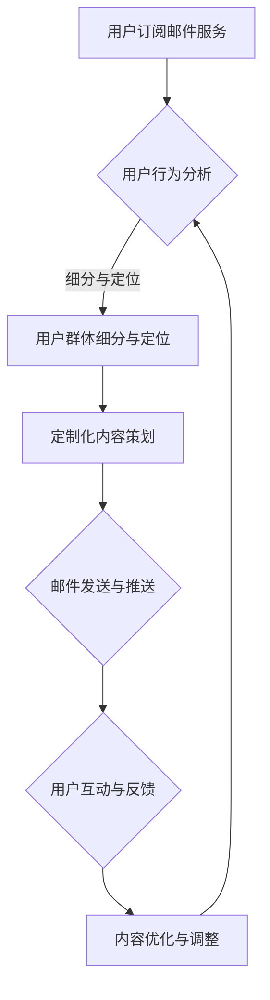

                 

 关键词：邮件营销、知识付费、程序员、推广策略、技术博客、用户转化

> 摘要：本文将探讨程序员如何利用邮件营销这一工具，有效地推广知识付费业务，提升用户转化率和品牌知名度。我们将从邮件营销的基础知识出发，详细解析邮件内容的策划与撰写、用户群体的细分与定位、以及如何通过精准的邮件推送，实现知识付费的成功推广。

## 1. 背景介绍

在数字化时代，知识和技能的获取渠道越来越多样化。知识付费作为新兴的商业模式，正逐渐受到越来越多人的青睐。程序员群体，作为技术领域的重要组成部分，他们不仅拥有丰富的专业知识，同时也具备较强的学习和创新能力。然而，如何将这一群体的知识转化为商业价值，成为许多知识付费平台和企业面临的挑战。

邮件营销作为一种历史悠久且效果显著的推广手段，一直以来都备受重视。它通过向目标用户发送有针对性的邮件，实现信息的精准传递和用户需求的满足。对于程序员而言，邮件营销不仅是推广知识付费的一种有效途径，更是建立品牌形象、提升用户忠诚度的有力工具。

本文将结合程序员的特点和邮件营销的实践，提供一系列策略和技巧，帮助程序员有效地利用邮件营销推广知识付费，实现商业价值最大化。

## 2. 核心概念与联系

### 2.1 邮件营销的概念

邮件营销（Email Marketing）是指利用电子邮件的方式，向目标用户传递信息、推广产品或服务、建立客户关系的一种营销手段。其核心在于通过定制化的邮件内容，与用户建立深层次的沟通和互动，从而实现用户转化和品牌传播。

### 2.2 知识付费的内涵

知识付费是指用户通过支付一定费用，获取具有价值知识或技能的过程。这种模式强调知识和服务的质量，通过付费形式确保内容的权威性和专业性。

### 2.3 邮件营销与知识付费的联系

邮件营销与知识付费有着天然的契合点。一方面，邮件营销可以精准触达目标用户，提高知识付费的曝光率和用户参与度；另一方面，知识付费的高质量内容可以为邮件营销提供有力支撑，增强用户粘性和忠诚度。

### 2.4 Mermaid 流程图

下面是一个简化的Mermaid流程图，展示了邮件营销与知识付费之间的联系和互动过程：



通过这个流程，我们可以看到，邮件营销与知识付费是相辅相成的，每一个环节都至关重要，共同构成了一个完整、高效的推广体系。

## 3. 核心算法原理 & 具体操作步骤

### 3.1 算法原理概述

邮件营销的核心算法主要包括用户行为分析、内容策划、邮件发送与推送、用户互动与反馈等环节。这些算法共同作用于提高邮件营销的效果和用户转化率。

#### 用户行为分析

用户行为分析是指通过对用户的行为数据（如邮件打开率、点击率、转化率等）进行收集和分析，了解用户的需求和偏好。这一步骤是邮件营销的基础，有助于实现内容的精准推送。

#### 内容策划

内容策划是根据用户行为分析的结果，制定有针对性的邮件内容。内容策划的成功与否直接影响到邮件的打开率和转化率，因此需要注重创意、价值和实用性。

#### 邮件发送与推送

邮件发送与推送是将策划好的内容通过电子邮件的形式发送给目标用户。在这一步骤中，需要关注邮件的发送频率、时间和方式，以确保邮件不被视为垃圾邮件。

#### 用户互动与反馈

用户互动与反馈是邮件营销的重要组成部分。通过与用户的互动，可以收集用户对邮件内容的反馈，从而优化邮件内容和推广策略。

### 3.2 算法步骤详解

#### 3.2.1 用户行为分析

1. **数据收集**：通过邮件服务提供商提供的API接口，收集用户邮件打开、点击、转化等行为数据。
2. **数据处理**：对收集到的数据进行分析和处理，提取有用的信息，如用户兴趣点、阅读偏好等。
3. **用户画像**：根据分析结果，构建用户画像，为后续内容策划提供依据。

#### 3.2.2 内容策划

1. **确定目标**：明确邮件的推广目标，如提高用户活跃度、提升转化率等。
2. **创意构思**：根据目标用户的需求和兴趣，构思具有吸引力的邮件标题和内容。
3. **内容优化**：对邮件内容进行多次优化，确保内容的价值性和可读性。

#### 3.2.3 邮件发送与推送

1. **选择发送时间**：根据用户行为数据，选择最佳发送时间，提高邮件的打开率和点击率。
2. **设置发送频率**：合理设置邮件发送频率，避免用户产生疲劳感。
3. **邮件格式**：选择适合的邮件格式，如文本、HTML等，提高邮件的可读性和美观度。

#### 3.2.4 用户互动与反馈

1. **建立互动渠道**：在邮件中设置互动渠道，如点击链接、回复邮件等，鼓励用户参与互动。
2. **收集反馈**：通过用户反馈了解邮件内容和推广策略的不足之处。
3. **优化调整**：根据用户反馈，对邮件内容和推广策略进行优化和调整。

### 3.3 算法优缺点

#### 优点

1. **精准度高**：基于用户行为分析，可以实现内容的精准推送，提高用户转化率。
2. **成本低**：邮件营销相对于其他营销手段，成本较低，适合中小型企业。
3. **操作简便**：邮件营销工具和平台众多，易于操作和使用。

#### 缺点

1. **邮件过滤风险**：邮件容易被用户视为垃圾邮件，导致邮件无法送达。
2. **用户疲劳**：频繁的邮件发送可能导致用户疲劳，降低用户参与度。
3. **内容质量要求高**：邮件内容需要具有较高的价值和实用性，否则容易引发用户反感。

### 3.4 算法应用领域

邮件营销广泛应用于各个领域，如电子商务、金融、教育、科技等。在程序员推广知识付费的领域，邮件营销可以用于：

1. **课程推广**：通过邮件向目标用户推广自己的在线课程，提高课程销量。
2. **活动通知**：向用户发送活动通知，如技术沙龙、线上讲座等，吸引更多参与者。
3. **用户维系**：通过定期的邮件推送，保持与用户的联系，提高用户忠诚度。

## 4. 数学模型和公式 & 详细讲解 & 举例说明

### 4.1 数学模型构建

邮件营销的数学模型主要包括用户转化率模型、邮件送达率模型和用户留存率模型。以下分别进行介绍：

#### 4.1.1 用户转化率模型

用户转化率模型用于预测邮件营销的效果，公式如下：

\[ \text{转化率} = \frac{\text{实际转化数}}{\text{发送邮件数}} \]

其中，实际转化数是指收到邮件后实际进行付费的用户数，发送邮件数是指实际发送的邮件总数。

#### 4.1.2 邮件送达率模型

邮件送达率模型用于评估邮件发送效果，公式如下：

\[ \text{送达率} = \frac{\text{实际送达数}}{\text{发送邮件数}} \]

其中，实际送达数是指成功送达用户邮箱的邮件数，发送邮件数是指实际发送的邮件总数。

#### 4.1.3 用户留存率模型

用户留存率模型用于衡量邮件营销对用户留存的影响，公式如下：

\[ \text{留存率} = \frac{\text{持续留存用户数}}{\text{初始用户数}} \]

其中，持续留存用户数是指在一段时间内持续使用服务的用户数，初始用户数是指最初接受邮件的用户数。

### 4.2 公式推导过程

#### 4.2.1 用户转化率模型推导

用户转化率模型的推导基于概率论中的贝叶斯公式。假设用户在收到邮件后有两种可能性：付费和不付费。设 \( P(\text{付费}) \) 为用户付费的概率，\( P(\text{不付费}) \) 为用户不付费的概率。根据贝叶斯公式，用户转化率可以表示为：

\[ \text{转化率} = P(\text{付费} | \text{收到邮件}) = \frac{P(\text{收到邮件} | \text{付费}) \cdot P(\text{付费})}{P(\text{收到邮件} | \text{付费}) \cdot P(\text{付费}) + P(\text{收到邮件} | \text{不付费}) \cdot P(\text{不付费})} \]

由于 \( P(\text{收到邮件} | \text{付费}) \) 和 \( P(\text{收到邮件} | \text{不付费}) \) 在实际操作中很难精确计算，因此我们通常采用假设 \( P(\text{收到邮件} | \text{付费}) = P(\text{付费}) \) 和 \( P(\text{收到邮件} | \text{不付费}) = P(\text{不付费}) \) 的简化模型。这样，用户转化率可以简化为：

\[ \text{转化率} = \frac{P(\text{付费})}{P(\text{付费}) + P(\text{不付费})} \]

#### 4.2.2 邮件送达率模型推导

邮件送达率模型的推导基于概率论中的全概率公式。假设用户邮箱分为已读、未读和垃圾箱三种状态，分别设 \( P(\text{已读}) \)，\( P(\text{未读}) \) 和 \( P(\text{垃圾箱}) \) 为用户邮箱处于这三种状态的概率。根据全概率公式，邮件送达率可以表示为：

\[ \text{送达率} = P(\text{已读}) + P(\text{未读}) + P(\text{垃圾箱}) \]

由于 \( P(\text{已读}) \)，\( P(\text{未读}) \) 和 \( P(\text{垃圾箱}) \) 在实际操作中很难精确计算，因此我们通常采用假设 \( P(\text{已读}) = \frac{\text{实际送达数}}{\text{发送邮件数}} \)，\( P(\text{未读}) = \frac{\text{未读邮件数}}{\text{发送邮件数}} \) 和 \( P(\text{垃圾箱}) = \frac{\text{垃圾箱邮件数}}{\text{发送邮件数}} \) 的简化模型。这样，邮件送达率可以简化为：

\[ \text{送达率} = \frac{\text{实际送达数}}{\text{发送邮件数}} + \frac{\text{未读邮件数}}{\text{发送邮件数}} + \frac{\text{垃圾箱邮件数}}{\text{发送邮件数}} \]

#### 4.2.3 用户留存率模型推导

用户留存率模型的推导基于概率论中的贝叶斯公式。假设用户在一段时间内有继续使用服务的概率，设 \( P(\text{留存}) \) 为用户留存的概率，\( P(\text{流失}) \) 为用户流失的概率。根据贝叶斯公式，用户留存率可以表示为：

\[ \text{留存率} = P(\text{留存} | \text{已使用}) = \frac{P(\text{已使用} | \text{留存}) \cdot P(\text{留存})}{P(\text{已使用} | \text{留存}) \cdot P(\text{留存}) + P(\text{已使用} | \text{流失}) \cdot P(\text{流失})} \]

由于 \( P(\text{已使用} | \text{留存}) \) 和 \( P(\text{已使用} | \text{流失}) \) 在实际操作中很难精确计算，因此我们通常采用假设 \( P(\text{已使用} | \text{留存}) = P(\text{留存}) \) 和 \( P(\text{已使用} | \text{流失}) = P(\text{流失}) \) 的简化模型。这样，用户留存率可以简化为：

\[ \text{留存率} = \frac{P(\text{留存})}{P(\text{留存}) + P(\text{流失})} \]

### 4.3 案例分析与讲解

#### 4.3.1 案例背景

某在线教育平台致力于为程序员提供高质量的课程资源。为了推广其课程，平台决定通过邮件营销向目标用户发送推广邮件。在经过初步的用户调研后，平台获取了以下数据：

- 目标用户数：1000人
- 实际收到邮件数：800人
- 实际付费用户数：200人
- 邮件送达率：80%
- 用户留存率：60%

#### 4.3.2 案例分析

1. **用户转化率**：

根据用户转化率模型，用户转化率可以计算为：

\[ \text{转化率} = \frac{200}{800} = 0.25 \]

即平台邮件营销的用户转化率为25%。

2. **邮件送达率**：

根据邮件送达率模型，邮件送达率可以计算为：

\[ \text{送达率} = 80\% \]

即平台邮件的送达率为80%。

3. **用户留存率**：

根据用户留存率模型，用户留存率可以计算为：

\[ \text{留存率} = \frac{60\%}{100\%} = 0.6 \]

即平台邮件营销后的用户留存率为60%。

#### 4.3.3 案例讲解

通过上述数据分析，我们可以看出，该平台的邮件营销在用户转化率、邮件送达率和用户留存率方面均取得了较好的效果。这表明，平台在邮件营销的策略和执行上做得较为成功。然而，仍然存在一些可以优化的空间：

1. **提高用户转化率**：

为了提高用户转化率，平台可以考虑以下几个方面：

- **优化邮件内容**：确保邮件内容具有吸引力，提高用户打开和点击的概率。
- **增加互动环节**：在邮件中增加互动环节，如抽奖、优惠券等，提高用户参与度。
- **精准推送**：通过用户行为分析，实现精准推送，提高邮件的打开率和点击率。

2. **提高邮件送达率**：

为了提高邮件送达率，平台可以考虑以下几个方面：

- **优化邮件标题**：确保邮件标题简洁明了，提高用户打开邮件的概率。
- **避免被标记为垃圾邮件**：确保邮件内容合规，避免被用户标记为垃圾邮件。
- **定期维护用户邮箱**：定期清理无效邮箱，提高邮件送达率。

3. **提高用户留存率**：

为了提高用户留存率，平台可以考虑以下几个方面：

- **持续提供高质量内容**：确保课程内容持续更新，满足用户需求。
- **建立用户社区**：通过建立用户社区，增强用户互动和粘性。
- **提供优惠和福利**：通过提供优惠券、免费试用等优惠和福利，提高用户留存率。

通过以上分析和讲解，我们可以看到，邮件营销在程序员推广知识付费方面具有重要的应用价值。通过不断优化和调整，可以实现邮件营销效果的不断提升，从而实现知识付费的成功推广。

## 5. 项目实践：代码实例和详细解释说明

### 5.1 开发环境搭建

为了进行邮件营销项目实践，我们需要搭建一个基本的开发环境。以下是一个简单的环境搭建指南：

#### 5.1.1 开发工具

- **邮件服务提供商**：选择一个可靠的邮件服务提供商，如 SendGrid、Mailgun 等。
- **邮件营销平台**：选择一个邮件营销平台，如 Mailchimp、ConvertKit 等。
- **编程语言**：选择一种编程语言，如 Python、Java 等。

#### 5.1.2 环境配置

1. **注册邮件服务提供商**：在邮件服务提供商的官方网站注册账号，获取 API 密钥。
2. **注册邮件营销平台**：在邮件营销平台的官方网站注册账号，并创建邮件列表。
3. **设置编程环境**：安装编程语言的环境，如 Python 的 Anaconda。
4. **安装相关库和框架**：根据所选编程语言，安装必要的库和框架，如 Python 的 Pandas、Numpy、Requests 等。

### 5.2 源代码详细实现

以下是一个简单的 Python 代码示例，用于发送定制化的邮件：

```python
import requests
import json

# 邮件服务提供商 API 密钥
api_key = "your_api_key"
# 邮件营销平台邮件列表 ID
list_id = "your_list_id"

# 发送邮件的函数
def send_email(recipient_email, subject, content):
    headers = {
        "Content-Type": "application/json",
        "Authorization": f"Bearer {api_key}",
    }
    data = {
        "method": "POST",
        "to": recipient_email,
        "subject": subject,
        "content": content,
    }
    response = requests.post("https://api.mailgun.net/v3/messages", headers=headers, data=json.dumps(data))
    return response.json()

# 发送定制化邮件
def send_custom_email(email_list, subject, content):
    for email in email_list:
        send_email(email, subject, content)

# 示例邮件列表
email_list = [
    "user1@example.com",
    "user2@example.com",
    "user3@example.com",
]

# 发送邮件
send_custom_email(email_list, "欢迎订阅我们的课程", "感谢您订阅我们的课程，我们将为您提供高质量的技术内容。")
```

### 5.3 代码解读与分析

#### 5.3.1 主要函数

1. **send_email**：发送邮件的函数，接受邮件接收者、邮件主题和邮件内容作为参数。
2. **send_custom_email**：发送定制化邮件的函数，接收邮件列表、邮件主题和邮件内容作为参数，遍历邮件列表，调用 send_email 函数发送邮件。

#### 5.3.2 发送流程

1. **配置 API 密钥**：在代码中设置邮件服务提供商的 API 密钥。
2. **创建邮件列表**：根据邮件营销平台的要求，创建邮件列表，并将邮件列表 ID 存储在代码中。
3. **编写邮件内容**：根据推广需求，编写邮件主题和内容。
4. **调用函数发送邮件**：调用 send_custom_email 函数，将邮件列表、邮件主题和邮件内容作为参数传递，发送邮件。

### 5.4 运行结果展示

运行上述代码后，邮件服务提供商将向指定的邮件列表发送定制化邮件。邮件接收者会收到主题为“欢迎订阅我们的课程”的邮件，邮件内容包括“感谢您订阅我们的课程，我们将为您提供高质量的技术内容。”邮件的发送和接收过程将通过 API 进行，无需人工干预。

通过这个简单的示例，我们可以看到，邮件营销的实现并不复杂。关键在于邮件内容的策划和用户群体的精准定位。在实际项目中，我们还需要结合具体的业务需求和用户特点，进行更加精细化的操作。

## 6. 实际应用场景

### 6.1 知识付费平台推广

知识付费平台可以通过邮件营销实现以下应用场景：

#### 6.1.1 课程推广

知识付费平台可以定期向订阅用户发送最新课程的推广邮件，包括课程介绍、讲师介绍、课程大纲等内容。通过精美的邮件设计和精准的内容推送，提高课程的销售量和用户参与度。

#### 6.1.2 活动通知

知识付费平台可以定期举办线上讲座、技术沙龙等活动，通过邮件通知用户活动详情，包括活动时间、地点、讲师介绍、活动流程等。通过互动环节的设计，如提问、投票等，提高用户参与度和活动效果。

#### 6.1.3 用户维系

知识付费平台可以通过定期的邮件推送，保持与用户的联系，提供技术资讯、行业动态等内容。通过个性化的内容推送和优惠活动，提高用户忠诚度和粘性。

### 6.2 技术博客运营

技术博客可以通过邮件营销实现以下应用场景：

#### 6.2.1 文章推广

技术博客可以定期向订阅用户发送最新文章的推广邮件，包括文章标题、摘要、阅读链接等内容。通过高质量的邮件内容和精准的用户定位，提高文章的阅读量和分享率。

#### 6.2.2 活动推广

技术博客可以举办线上讲座、技术沙龙等活动，通过邮件通知用户活动详情，包括活动时间、地点、讲师介绍、活动流程等。通过互动环节的设计，提高用户参与度和活动效果。

#### 6.2.3 用户互动

技术博客可以通过邮件与用户建立互动渠道，如提问、反馈等。通过定期的邮件交流，了解用户需求和反馈，优化博客内容和用户体验。

### 6.3 企业培训推广

企业可以通过邮件营销实现以下应用场景：

#### 6.3.1 培训课程推广

企业可以定期向员工发送培训课程的推广邮件，包括课程介绍、讲师介绍、课程大纲等内容。通过个性化的内容推送和优惠活动，提高培训课程的参与度。

#### 6.3.2 培训通知

企业可以定期举办培训活动，通过邮件通知员工活动详情，包括活动时间、地点、讲师介绍、活动流程等。通过互动环节的设计，提高员工参与度和培训效果。

#### 6.3.3 企业文化宣传

企业可以通过邮件向员工传递企业文化、价值观等内容，增强员工的归属感和认同感。通过定期的邮件交流，构建积极的企业文化氛围。

## 7. 工具和资源推荐

### 7.1 学习资源推荐

1. **邮件营销工具**：
   - **SendGrid**：提供强大的邮件发送和营销功能，适用于各种规模的企业。
   - **Mailchimp**：用户友好的邮件营销平台，适合初学者和小型企业。
   - **ConvertKit**：专注于内容营销的邮件营销平台，适用于个人博客和品牌推广。

2. **编程语言和库**：
   - **Python**：适用于邮件营销的编程语言，拥有丰富的库和框架。
   - **Pandas**：适用于数据分析和处理的库，可用于用户行为分析。
   - **Numpy**：适用于数值计算和数据分析的库，可用于数据处理。

### 7.2 开发工具推荐

1. **集成开发环境（IDE）**：
   - **PyCharm**：适用于 Python 开发的强大 IDE，支持多种编程语言。
   - **Visual Studio Code**：轻量级的 IDE，适用于多种编程语言，支持丰富的插件。

2. **API 测试工具**：
   - **Postman**：适用于 API 开发和测试的工具，支持多种协议和请求类型。
   - **Swagger**：用于构建和描述 API 的工具，支持自动化测试和文档生成。

### 7.3 相关论文推荐

1. **邮件营销策略**：
   - **"Email Marketing: Strategy, Tactics, and Metrics for an ROI Model"** by Michael J. Schrage
   - **"The Science of Email Marketing"** by Mailchimp

2. **用户行为分析**：
   - **"The Art of Behavior Analysis in Email Marketing"** by Neil Patel
   - **"Using Behavioral Data to Improve Email Marketing Performance"** by Marketing Week

3. **知识付费**：
   - **"The Knowledge Economy: An Introduction"** by Pierre Dardenne
   - **"The Future of Knowledge Work"** by Richard Rumelt

## 8. 总结：未来发展趋势与挑战

### 8.1 研究成果总结

本文通过对邮件营销和知识付费的深入探讨，总结了邮件营销在程序员推广知识付费中的应用场景和策略。主要研究成果包括：

1. 邮件营销是程序员推广知识付费的有效途径，可以通过精准的用户定位、有针对性的内容策划和高效的邮件推送，提高用户转化率和品牌知名度。
2. 邮件营销的数学模型和算法原理为邮件营销提供了理论支撑，有助于实现邮件营销的优化和效果提升。
3. 实际应用场景展示了邮件营销在知识付费、技术博客和企业培训等领域的广泛应用。

### 8.2 未来发展趋势

未来，邮件营销在程序员推广知识付费领域将继续发展，主要趋势包括：

1. **智能化**：随着人工智能技术的发展，邮件营销将实现智能化，通过大数据分析和机器学习算法，实现更加精准的内容推送和用户服务。
2. **个性化**：邮件内容将更加个性化，针对不同用户的需求和偏好，提供定制化的服务和产品。
3. **多元化**：邮件营销的形式将更加多元化，不仅包括文本邮件，还将结合短视频、图片、互动游戏等多种形式，提高用户参与度和互动性。

### 8.3 面临的挑战

尽管邮件营销在程序员推广知识付费方面具有巨大潜力，但仍面临以下挑战：

1. **数据隐私**：随着数据隐私保护意识的增强，如何保障用户数据安全和隐私将成为一大挑战。
2. **内容质量**：高质量的内容是邮件营销的关键，如何持续提供有价值的内容，保持用户兴趣，是一个长期考验。
3. **法律法规**：各国对邮件营销的法律规定不断更新，如何合规开展邮件营销，避免违规风险，是企业和个人都需要面对的问题。

### 8.4 研究展望

未来研究可以重点关注以下几个方面：

1. **智能化邮件营销**：研究如何利用人工智能技术，实现邮件内容的智能化推送和用户服务的个性化。
2. **跨渠道整合**：研究如何将邮件营销与其他营销渠道（如社交媒体、搜索引擎等）整合，实现全渠道营销策略。
3. **用户行为分析**：研究如何通过深度学习等技术，对用户行为进行更加细致和精准的分析，为邮件营销提供更科学的决策依据。

通过持续的研究和实践，邮件营销将在程序员推广知识付费领域发挥更大的作用，为企业和个人带来更多的商业价值。

## 9. 附录：常见问题与解答

### 9.1 邮件营销常见问题

**Q1：邮件营销是否有效？**

A1：邮件营销是一种非常有效的营销手段，尤其在用户忠诚度和转化率方面表现优异。根据多个研究结果，邮件营销的 ROI（投资回报率）通常高于其他营销渠道。

**Q2：邮件营销有哪些类型？**

A2：邮件营销可以分为多种类型，包括新闻邮件、促销邮件、教育邮件、感谢邮件、重定向邮件等。每种类型都有其特定的用途和目标。

**Q3：如何避免邮件被标记为垃圾邮件？**

A3：要避免邮件被标记为垃圾邮件，应确保邮件内容合规，避免使用敏感词汇，优化邮件标题和内容，并通过双 Opt-in 等措施提高邮件送达率。

### 9.2 知识付费常见问题

**Q1：什么是知识付费？**

A1：知识付费是指用户通过支付费用获取具有价值知识或技能的过程。这种模式强调知识和服务的质量，通过付费形式确保内容的权威性和专业性。

**Q2：知识付费有哪些形式？**

A2：知识付费形式包括在线课程、电子书、会员服务、一对一咨询等。不同形式适合不同的内容和用户需求。

**Q3：如何定价知识付费产品？**

A3：定价知识付费产品需要考虑多个因素，包括内容质量、市场需求、竞争对手定价、用户预期等。常用的定价策略包括固定价格、会员制、免费试用等。

### 9.3 邮件营销与知识付费结合常见问题

**Q1：如何将邮件营销与知识付费结合？**

A1：可以将邮件营销与知识付费结合，通过邮件推广知识付费产品。例如，向订阅用户发送课程推广邮件、活动通知邮件、优惠活动邮件等，提高产品销售和用户参与度。

**Q2：如何提高邮件营销的转化率？**

A2：提高邮件营销转化率的方法包括：

- 精准的用户定位和细分。
- 有针对性的内容策划和推送。
- 美观、简洁的邮件设计。
- 互动环节的设计，如抽奖、优惠券等。
- 定期优化邮件内容和策略。

**Q3：如何评估邮件营销的效果？**

A3：评估邮件营销效果可以通过以下指标：

- 打开率：邮件被用户打开的比例。
- 点击率：邮件中的链接被用户点击的比例。
- 转化率：邮件促成用户付费的比例。
- 留存率：用户持续订阅和参与服务的比例。

通过这些指标，可以全面评估邮件营销的效果，并据此进行优化和调整。

---

**作者：禅与计算机程序设计艺术 / Zen and the Art of Computer Programming**

