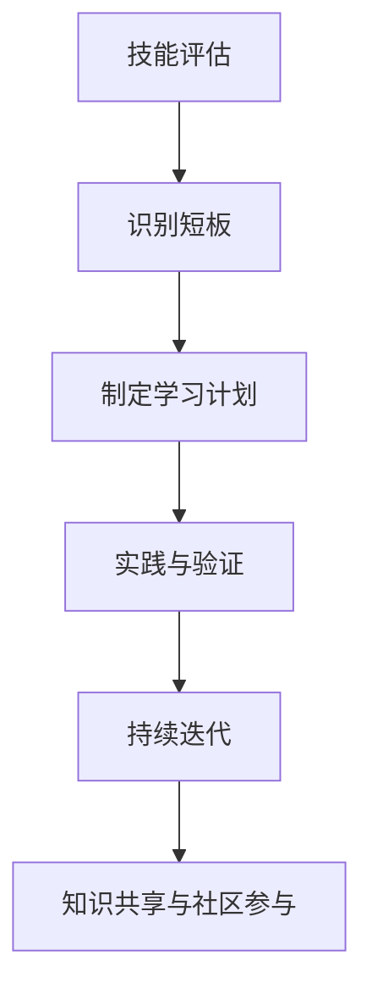
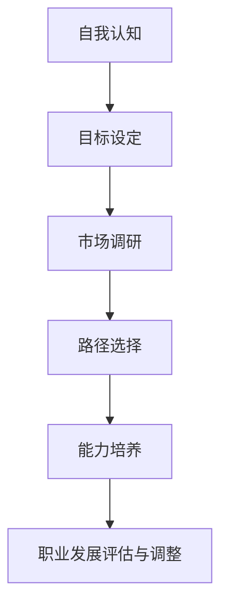
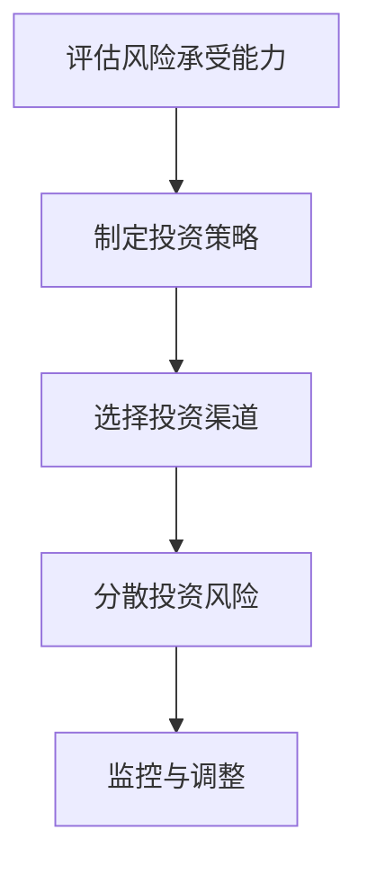
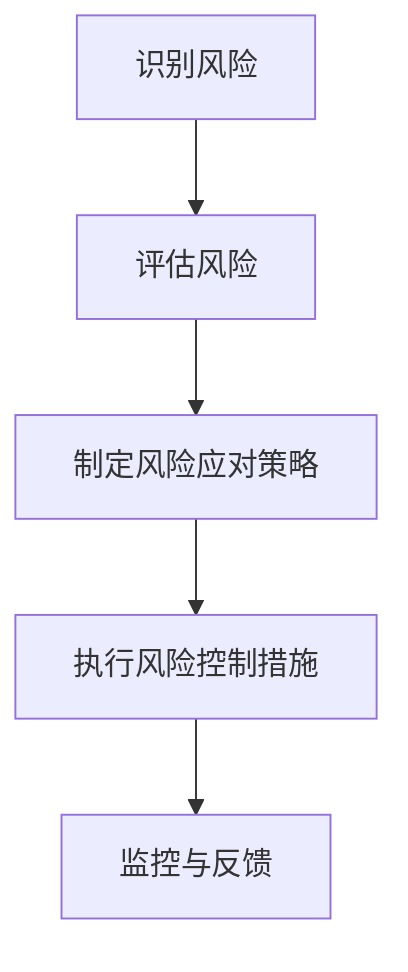

                 

关键词：经济衰退，程序员，保值，增值，技能提升，职业规划，投资理财，风险管理，技术趋势。

> 摘要：在经济衰退的背景下，程序员面临着前所未有的挑战。本文将探讨如何在这样的环境下保值增值，包括提升个人技能、合理规划职业路径、投资理财和风险管理等方面的策略。通过分析当前的技术趋势，我们希望能够为程序员提供一些实用的指导和建议。

## 1. 背景介绍

近年来，全球经济波动日益频繁，经济衰退的阴影时常笼罩。在这样的宏观经济环境下，各行各业都受到了不同程度的影响，IT行业也不例外。尽管软件行业在某些方面表现出较强的韧性，但也不能完全避免裁员、项目削减和预算紧缩等负面现象。对于程序员来说，如何在经济衰退中保值增值，成为了一个亟待解决的问题。

## 2. 核心概念与联系

### 2.1 个人技能提升

在IT行业，技能是程序员的核心资产。技能的提升不仅有助于提高个人职业竞争力，还能够应对市场的变化。以下是一个Mermaid流程图，展示了个人技能提升的路径：



### 2.2 职业规划

职业规划是确保程序员职业生涯顺利发展的重要步骤。以下是一个Mermaid流程图，展示了职业规划的步骤：



### 2.3 投资理财

投资理财是保值增值的重要手段之一。以下是一个Mermaid流程图，展示了投资理财的步骤：



### 2.4 风险管理

风险管理是保障程序员职业生涯稳定的重要环节。以下是一个Mermaid流程图，展示了风险管理的步骤：



## 3. 核心算法原理 & 具体操作步骤

### 3.1 算法原理概述

在经济衰退中保值增值，可以看作是一个优化问题，其目标是最大化个人财富或职业价值。以下是一个简化的算法原理：

1. **技能提升**：通过持续学习，提高个人技能水平。
2. **职业规划**：根据个人兴趣和市场需求，设定明确的职业目标。
3. **投资理财**：合理分配资金，实现财富增值。
4. **风险管理**：识别潜在风险，并采取相应的控制措施。

### 3.2 算法步骤详解

1. **技能提升**：
    - 定期进行技能评估，识别现有技能与市场需求之间的差距。
    - 制定详细的学习计划，包括学习资源、时间安排和学习目标。
    - 实践与验证所学技能，通过项目实践或实际应用检验学习成果。
    - 持续迭代，根据市场变化和个人发展需求调整学习计划。

2. **职业规划**：
    - 进行自我认知，了解自己的兴趣、价值观和优势。
    - 设定明确的职业目标，包括短期和长期目标。
    - 进行市场调研，了解行业趋势和职业发展路径。
    - 根据个人特点和市场需求，选择合适的职业发展路径。
    - 定期评估职业发展进度，并根据实际情况进行调整。

3. **投资理财**：
    - 评估自己的风险承受能力，确定投资策略。
    - 根据投资策略，选择合适的投资渠道，如股票、债券、基金等。
    - 分散投资风险，避免将所有资金集中在一个投资渠道。
    - 定期监控投资组合，根据市场变化和风险控制需要进行调整。

4. **风险管理**：
    - 识别可能影响职业生涯的风险，如技术变化、市场波动等。
    - 评估风险的影响程度和可能性。
    - 制定相应的风险应对策略，包括风险规避、风险减轻、风险接受等。
    - 实施风险控制措施，并监控风险状况，及时调整应对策略。

### 3.3 算法优缺点

优点：
- **提高竞争力**：通过技能提升和职业规划，提高个人在市场上的竞争力。
- **实现财富增值**：通过投资理财，实现个人财富的保值增值。
- **降低风险**：通过风险管理，降低职业生涯中的不确定性。

缺点：
- **需要持续投入**：技能提升和投资理财都需要持续的时间和精力投入。
- **市场不确定性**：经济衰退期间，市场环境变化较快，难以准确预测。

### 3.4 算法应用领域

- **个人发展**：适用于任何希望在职业生涯中保值增值的程序员。
- **企业培训**：可以作为企业内部培训材料，帮助员工提升技能和规划职业路径。
- **投资咨询**：为投资者提供理财策略和风险管理建议。

## 4. 数学模型和公式 & 详细讲解 & 举例说明

### 4.1 数学模型构建

保值增值的过程可以看作是一个优化问题，其目标函数为：

\[ \max \sum_{i=1}^{n} \text{价值}(x_i) \]

其中，\( x_i \) 表示第 \( i \) 个技能或投资，\(\text{价值}(x_i) \) 表示该技能或投资带来的价值。

约束条件为：

\[ \sum_{i=1}^{n} \text{成本}(x_i) \leq \text{预算} \]

其中，\(\text{成本}(x_i) \) 表示第 \( i \) 个技能或投资的成本，\(\text{预算} \) 表示可用的资金。

### 4.2 公式推导过程

假设技能 \( x_1, x_2, \ldots, x_n \) 的价值分别为 \( v_1, v_2, \ldots, v_n \)，成本分别为 \( c_1, c_2, \ldots, c_n \)。则目标函数可以表示为：

\[ \max \sum_{i=1}^{n} v_i \]

约束条件为：

\[ \sum_{i=1}^{n} c_i \leq B \]

其中，\( B \) 为预算。

### 4.3 案例分析与讲解

假设一个程序员有 10000 元的预算，他需要选择以下三个技能进行提升：

1. **前端开发**：价值 3000 元，成本 2000 元。
2. **人工智能**：价值 4000 元，成本 3000 元。
3. **区块链**：价值 5000 元，成本 4000 元。

则目标函数为：

\[ \max \sum_{i=1}^{3} v_i = v_1 + v_2 + v_3 \]

约束条件为：

\[ \sum_{i=1}^{3} c_i = c_1 + c_2 + c_3 \leq 10000 \]

通过计算，我们可以得到以下结果：

1. **仅学习前端开发**：总价值为 3000 元，总成本为 2000 元，符合预算。
2. **仅学习人工智能**：总价值为 4000 元，总成本为 3000 元，符合预算。
3. **仅学习区块链**：总价值为 5000 元，总成本为 4000 元，符合预算。
4. **同时学习前端开发和人工智能**：总价值为 7000 元，总成本为 5000 元，符合预算。
5. **同时学习前端开发和区块链**：总价值为 8000 元，总成本为 6000 元，符合预算。
6. **同时学习人工智能和区块链**：总价值为 9000 元，总成本为 7000 元，符合预算。
7. **同时学习前端开发、人工智能和区块链**：总价值为 12000 元，总成本为 9000 元，超出预算。

根据上述结果，该程序员可以选择以下三种方案之一：
- 仅学习前端开发。
- 仅学习人工智能。
- 仅学习区块链。

## 5. 项目实践：代码实例和详细解释说明

### 5.1 开发环境搭建

本文将使用Python编写一个简单的保值增值策略。以下是在Ubuntu系统上搭建Python开发环境的步骤：

1. 安装Python 3：

   ```bash
   sudo apt update
   sudo apt install python3
   ```

2. 安装相关依赖库：

   ```bash
   sudo apt install python3-pip
   pip3 install numpy pandas matplotlib
   ```

### 5.2 源代码详细实现

以下是一个简单的Python脚本，用于计算不同技能组合的保值增值策略。

```python
import numpy as np
import pandas as pd
import matplotlib.pyplot as plt

# 技能价值与成本
skills = {
    '前端开发': {'value': 3000, 'cost': 2000},
    '人工智能': {'value': 4000, 'cost': 3000},
    '区块链': {'value': 5000, 'cost': 4000}
}

# 预算
budget = 10000

# 计算不同技能组合的保值增值策略
results = []
for i in range(1, len(skills) + 1):
    for combination in itertools.combinations(skills.keys(), i):
        total_value = sum(skills[skill]['value'] for skill in combination)
        total_cost = sum(skills[skill]['cost'] for skill in combination)
        if total_cost <= budget:
            results.append((combination, total_value, total_cost))

# 排序并输出结果
results.sort(key=lambda x: x[1] - x[2])
for result in results:
    print(f"组合：{result[0]}, 总价值：{result[1]}, 总成本：{result[2]}")

# 可视化结果
df = pd.DataFrame(results, columns=['组合', '总价值', '总成本'])
df.plot(x='组合', y='总价值', kind='bar', color='skyblue', label='总价值')
df.plot(x='组合', y='总成本', kind='bar', color='salmon', label='总成本')
plt.xlabel('技能组合')
plt.ylabel('金额（元）')
plt.title('保值增值策略分析')
plt.legend()
plt.show()
```

### 5.3 代码解读与分析

- **数据结构**：使用字典 `skills` 存储每个技能的价值和成本。
- **计算组合**：使用 `itertools.combinations` 计算所有可能的技能组合。
- **计算总价值与总成本**：对于每个组合，计算其总价值和总成本。
- **排序与输出**：按照总价值减去总成本进行排序，并输出结果。
- **可视化**：使用 matplotlib 绘制条形图，展示不同技能组合的总价值与总成本。

### 5.4 运行结果展示

运行上述脚本后，会输出不同技能组合的保值增值策略，并展示对应的可视化图表。

## 6. 实际应用场景

在经济衰退中，程序员可以通过以下方式实现保值增值：

- **技能提升**：掌握前沿技术，如人工智能、区块链等，提升个人竞争力。
- **职业规划**：明确职业目标，选择合适的职业发展路径。
- **投资理财**：合理分配资金，实现财富增值。
- **风险管理**：识别潜在风险，并采取相应的控制措施。

## 7. 未来应用展望

随着技术的不断进步，程序员在保值增值方面将有更多机会。例如：

- **自动化与人工智能**：通过自动化工具和人工智能技术，提高工作效率。
- **远程办公**：随着远程办公的普及，程序员将有更多自由选择工作地点的机会。
- **区块链**：区块链技术将为程序员提供新的职业机会。

## 8. 总结：未来发展趋势与挑战

在未来，程序员需要关注以下发展趋势和挑战：

- **技能需求的变化**：持续关注技术趋势，及时更新技能。
- **职业竞争的加剧**：提高个人竞争力，保持持续的学习和进步。
- **经济环境的不确定性**：做好风险管理，应对经济波动。

## 9. 附录：常见问题与解答

### 9.1 如何在技能提升中平衡工作与学习？

**解答**：合理安排时间，利用碎片时间学习。制定学习计划，确保学习目标的实现。

### 9.2 投资理财是否有风险？

**解答**：是的，所有投资都有一定的风险。合理分配资金，分散投资风险，是降低风险的有效方法。

### 9.3 如何进行职业规划？

**解答**：进行自我认知，设定明确的职业目标，进行市场调研，选择合适的职业发展路径。

---

作者：禅与计算机程序设计艺术 / Zen and the Art of Computer Programming
```

