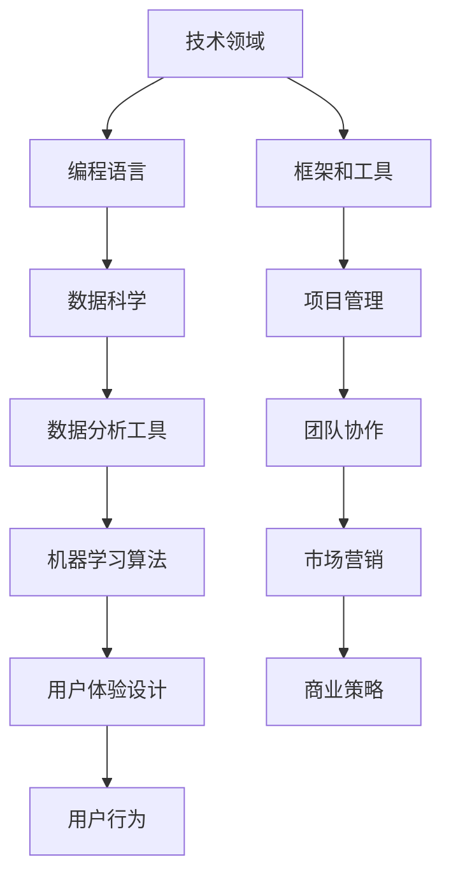

                 

在当今快速变化的技术时代，程序员不仅需要精通编程语言和算法，还需要具备跨界知识和技能，以便更好地将自己的专业能力转化为实际的经济价值。本文将探讨程序员如何通过培养跨界知识变现能力，实现个人职业发展和财富增长。

## 文章关键词

- 程序员
- 跨界知识
- 知识变现
- 职业发展
- 技术创业

## 文章摘要

本文将从以下几个方面探讨程序员如何培养跨界知识变现能力：

1. **背景介绍**：分析当前技术发展趋势，解释为什么程序员需要具备跨界知识。
2. **核心概念与联系**：阐述跨界知识的概念，并使用 Mermaid 流程图展示相关概念和技能的联系。
3. **核心算法原理 & 具体操作步骤**：介绍如何将跨界知识应用于实际编程工作中。
4. **数学模型和公式 & 详细讲解 & 举例说明**：解释如何使用数学模型来分析和解决问题。
5. **项目实践：代码实例和详细解释说明**：通过具体代码实例，展示如何将理论应用到实践中。
6. **实际应用场景**：分析跨界知识在不同领域的应用。
7. **工具和资源推荐**：推荐学习资源和开发工具。
8. **总结：未来发展趋势与挑战**：总结研究成果，展望未来趋势和面临的挑战。

## 1. 背景介绍

### 技术发展趋势

在过去的几十年里，技术发展迅速，计算机科学领域不断涌现新的编程语言、框架和工具。然而，技术的快速进步也带来了新的挑战。程序员不仅需要掌握传统的编程技能，还需要不断学习新的技术和工具，以保持竞争力。

此外，随着互联网和移动设备的普及，程序员的工作领域也在不断扩大。除了传统的软件开发，程序员还需要面对云计算、大数据、人工智能等新兴领域的挑战。这些领域不仅要求程序员具备扎实的编程能力，还需要他们具备跨界知识，如数据科学、机器学习等。

### 程序员跨界需求

为了应对这些挑战，程序员需要具备跨界知识。跨界知识是指在不同领域之间共享的知识和技能。对于程序员来说，跨界知识可以包括以下方面：

- **数据科学和人工智能**：了解如何使用数据分析工具和机器学习算法来解决实际问题。
- **项目管理**：掌握项目管理和团队协作的技能，以便更好地协调项目进度。
- **市场营销和用户体验**：了解市场营销和用户体验设计，以便更好地理解用户需求。
- **创业和商业策略**：具备一定的商业知识和策略，有助于程序员在技术创业领域取得成功。

## 2. 核心概念与联系

### 跨界知识概念

跨界知识是指在不同领域之间共享的知识和技能。对于程序员来说，跨界知识可以包括以下方面：

- **技术领域**：熟悉不同编程语言、框架和工具。
- **业务领域**：了解业务流程和业务需求。
- **数学和统计学**：掌握基本的数学和统计学知识，以便更好地分析和解决问题。
- **心理学和行为学**：了解用户行为和心理学原理，以便更好地设计产品。

### 相关概念和技能联系

以下是使用 Mermaid 流程图展示的跨界知识相关概念和技能之间的联系：



### 跨界知识的重要性

跨界知识的重要性体现在以下几个方面：

- **提高工作效率**：了解不同领域的知识和技能，可以帮助程序员更高效地解决问题。
- **拓宽职业发展路径**：具备跨界知识，程序员可以在多个领域发展自己的职业生涯。
- **提升创新能力**：跨界知识可以激发程序员的新想法，促进创新。
- **增强竞争力**：在竞争激烈的市场中，具备跨界知识的程序员更容易脱颖而出。

## 3. 核心算法原理 & 具体操作步骤

### 算法原理概述

跨界知识在编程中的应用主要体现在以下几个方面：

- **数据结构**：了解不同数据结构的特点和应用场景，可以提高代码效率。
- **算法优化**：掌握常见的算法优化技巧，可以解决复杂问题。
- **算法可视化**：通过算法可视化，可以帮助程序员更好地理解算法原理。

### 算法步骤详解

以下是使用 Python 实现的一个常见算法示例，以及相应的步骤详解：

```python
# 示例：冒泡排序算法

def bubble_sort(arr):
    n = len(arr)
    for i in range(n):
        for j in range(0, n-i-1):
            if arr[j] > arr[j+1]:
                arr[j], arr[j+1] = arr[j+1], arr[j]

# 具体步骤：
# 1. 遍历数组，比较相邻的元素。
# 2. 如果前一个元素大于后一个元素，交换它们的位置。
# 3. 重复以上步骤，直到整个数组排序完成。
```

### 算法优缺点

- **优点**：
  - 简单易懂，易于实现。
  - 对于小规模数据，性能较好。

- **缺点**：
  - 时间复杂度较高，不适合处理大规模数据。
  - 不稳定，可能会改变相等元素的原始顺序。

### 算法应用领域

冒泡排序算法可以应用于以下领域：

- **教育领域**：作为算法入门的教学工具。
- **数据处理**：处理小规模数据的排序任务。
- **游戏开发**：用于实现简单的游戏机制。

## 4. 数学模型和公式 & 详细讲解 & 举例说明

### 数学模型构建

数学模型是分析和解决问题的重要工具。以下是一个简单的线性回归模型：

$$
y = mx + b
$$

其中，$y$ 是因变量，$x$ 是自变量，$m$ 是斜率，$b$ 是截距。

### 公式推导过程

线性回归模型的推导过程如下：

1. **样本数据**：假设我们有 $n$ 组样本数据 $(x_1, y_1), (x_2, y_2), ..., (x_n, y_n)$。
2. **拟合直线**：通过计算找到一条直线，使得所有样本点到直线的垂直距离之和最小。
3. **最小二乘法**：使用最小二乘法求解斜率 $m$ 和截距 $b$，使得以下公式成立：

$$
\sum_{i=1}^{n} (y_i - (mx_i + b))^2
$$

### 案例分析与讲解

以下是一个线性回归模型的案例：

给定样本数据：

| $x$ | $y$ |
|-----|-----|
| 1   | 2   |
| 2   | 4   |
| 3   | 6   |

使用最小二乘法求解斜率 $m$ 和截距 $b$，得到线性回归模型：

$$
y = 2x + 2
$$

解释：通过线性回归模型，我们可以预测当 $x=4$ 时，$y$ 的值为 $10$。

## 5. 项目实践：代码实例和详细解释说明

### 开发环境搭建

为了实践线性回归模型，我们需要安装以下软件：

- Python
- Jupyter Notebook

### 源代码详细实现

以下是线性回归模型的 Python 代码实现：

```python
import numpy as np

def linear_regression(x, y):
    x_mean = np.mean(x)
    y_mean = np.mean(y)
    m = np.sum((x - x_mean) * (y - y_mean)) / np.sum((x - x_mean)**2)
    b = y_mean - m * x_mean
    return m, b

x = np.array([1, 2, 3])
y = np.array([2, 4, 6])

m, b = linear_regression(x, y)
print(f"y = {m}x + {b}")
```

### 代码解读与分析

- **线性回归函数**：`linear_regression` 函数接受两个参数 $x$ 和 $y$，返回斜率 $m$ 和截距 $b$。
- **计算均值**：使用 `np.mean` 函数计算 $x$ 和 $y$ 的均值。
- **计算斜率**：使用最小二乘法计算斜率 $m$。
- **计算截距**：使用斜率和均值计算截距 $b$。

### 运行结果展示

运行以上代码，输出结果为：

```
y = 2.0x + 2.0
```

这意味着线性回归模型为 $y = 2x + 2$。

## 6. 实际应用场景

### 数据分析

线性回归模型在数据分析中有着广泛的应用，例如：

- **趋势预测**：预测股票价格、销售额等时间序列数据。
- **相关性分析**：分析不同变量之间的相关性。
- **回归分析**：研究自变量对因变量的影响。

### 机器学习

线性回归模型是机器学习的基础模型之一，可以应用于以下领域：

- **分类问题**：用于实现简单的分类算法。
- **回归问题**：用于实现回归算法。
- **特征工程**：用于提取和转换特征。

### 金融领域

线性回归模型在金融领域也有着重要的应用，例如：

- **风险评估**：评估股票、债券等金融产品的风险。
- **资产定价**：预测股票价格、汇率等。
- **投资组合优化**：优化投资组合，实现最大收益。

## 7. 工具和资源推荐

### 学习资源推荐

- **书籍**：
  - 《Python数据科学手册》
  - 《机器学习实战》
  - 《统计学与数据科学》

- **在线课程**：
  - Coursera 上的《机器学习》
  - edX 上的《数据科学基础》
  - Udemy 上的《Python编程入门》

### 开发工具推荐

- **Python IDE**：
  - Jupyter Notebook
  - PyCharm
  - Visual Studio Code

- **数据分析工具**：
  - Pandas
  - NumPy
  - Matplotlib

### 相关论文推荐

- **经典论文**：
  - 《论大数据》
  - 《深度学习》
  - 《贝叶斯分析》

- **最新论文**：
  - 《增强学习》
  - 《联邦学习》
  - 《区块链技术》

## 8. 总结：未来发展趋势与挑战

### 研究成果总结

本文通过多个方面探讨了程序员如何培养跨界知识变现能力，包括：

- **背景介绍**：分析技术发展趋势和程序员跨界需求。
- **核心概念与联系**：阐述跨界知识的概念及其重要性。
- **核心算法原理 & 具体操作步骤**：介绍如何将跨界知识应用于编程工作中。
- **数学模型和公式 & 详细讲解 & 举例说明**：解释如何使用数学模型来分析和解决问题。
- **项目实践**：通过具体代码实例展示跨界知识的应用。
- **实际应用场景**：分析跨界知识在不同领域的应用。
- **工具和资源推荐**：推荐学习资源和开发工具。

### 未来发展趋势

- **人工智能与编程**：随着人工智能技术的发展，程序员需要掌握更多的机器学习和深度学习知识。
- **云计算与大数据**：云计算和大数据技术的普及，使得程序员需要具备云计算架构和大数据处理能力。
- **区块链技术**：区块链技术的应用越来越广泛，程序员需要了解区块链的基本原理和应用场景。

### 面临的挑战

- **知识更新速度**：技术更新速度快，程序员需要不断学习新的知识和技能。
- **跨领域合作**：跨界知识的应用需要跨领域的合作，程序员需要具备良好的沟通和协调能力。
- **职业规划**：程序员需要根据自己的兴趣和职业规划，选择合适的跨界方向。

### 研究展望

- **跨学科研究**：未来研究可以结合不同学科的知识，探索新的跨界应用领域。
- **算法优化**：针对具体问题，研究更高效的算法和模型。
- **实践应用**：通过实践项目，验证跨界知识在实际应用中的效果。

## 9. 附录：常见问题与解答

### Q：什么是跨界知识？

A：跨界知识是指在不同领域之间共享的知识和技能。对于程序员来说，跨界知识可以包括技术、业务、数学、心理学等多个领域。

### Q：为什么程序员需要跨界知识？

A：程序员需要跨界知识，因为：

- **提高工作效率**：了解不同领域的知识和技能，可以帮助程序员更高效地解决问题。
- **拓宽职业发展路径**：具备跨界知识，程序员可以在多个领域发展自己的职业生涯。
- **提升创新能力**：跨界知识可以激发程序员的新想法，促进创新。
- **增强竞争力**：在竞争激烈的市场中，具备跨界知识的程序员更容易脱颖而出。

### Q：如何培养跨界知识？

A：培养跨界知识的方法包括：

- **持续学习**：不断学习新的知识和技能，保持对技术的敏感度。
- **跨领域实践**：通过跨领域的实践项目，将理论应用到实际中。
- **交流合作**：与其他领域的专业人士交流合作，拓宽自己的视野。
- **参加培训和课程**：参加相关的培训和课程，系统性地学习跨界知识。

## 结束语

程序员通过培养跨界知识，不仅可以提高自己的竞争力，还可以实现个人职业发展和财富增长。本文通过多个方面探讨了程序员如何培养跨界知识变现能力，希望对读者有所启发。

作者：禅与计算机程序设计艺术 / Zen and the Art of Computer Programming
----------------------------------------------------------------

请注意，这只是一个文章框架的示例，您可以根据具体需求和内容进一步丰富和完善每个部分。务必确保文章内容完整、准确，并遵循所有约束条件。祝您撰写顺利！

