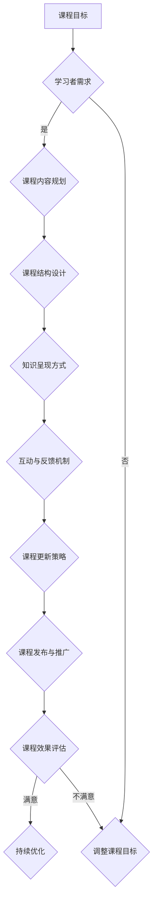

                 

 关键词：程序员、工作经验、在线课程、知识共享、课程设计、教育技术

> 摘要：本文将探讨程序员如何将自己的工作经验转化为有价值的在线课程，为学习者提供实用的编程知识和技能。通过对课程设计、内容组织和教学策略的深入分析，本文旨在为程序员提供一套系统化的方法论，帮助他们成功地将自己的经验转化为线上教育资源。

## 1. 背景介绍

在当今数字化时代，在线学习已经成为一种普遍的学习方式。随着互联网的普及和移动设备的广泛使用，越来越多的人选择通过在线课程来提升自己的技能和知识。程序员作为信息技术领域的核心力量，拥有丰富的实战经验和深厚的理论知识，将他们的工作经验转化为在线课程，不仅有助于自己知识的传播，也为广大学子提供了宝贵的资源。

然而，将工作经验转化为在线课程并非易事。程序员常常面临以下几个挑战：

1. **内容结构化**：如何将复杂的编程知识和实战经验结构化，使之成为易于理解和学习的课程内容？
2. **知识呈现**：如何将抽象的编程概念以生动有趣的方式呈现，提高学习者的学习兴趣？
3. **互动与反馈**：如何在在线课程中实现与学习者的互动，收集反馈并不断优化课程内容？
4. **持续更新**：如何确保课程内容紧跟行业发展，满足学习者的需求？

本文将围绕这些问题，提供一整套解决方案，帮助程序员成功地将自己的工作经验转化为在线课程。

## 2. 核心概念与联系

### 2.1 在线课程设计的基本原则

在线课程设计应遵循以下几个基本原则：

1. **目标明确**：确定课程的目标和学习者群体，确保课程内容与学习者的需求和兴趣相符。
2. **结构清晰**：课程内容应具备良好的结构，便于学习者快速找到所需信息。
3. **循序渐进**：课程内容应从基础到高级，逐步引导学习者深入掌握知识。
4. **实践性强**：课程中应包含丰富的实践案例，帮助学习者将理论知识应用到实际项目中。
5. **易于访问**：课程内容应便于学习者在线访问，支持多种终端设备。

### 2.2 在线课程架构的 Mermaid 流程图



通过这个流程图，我们可以清晰地看到在线课程设计的各个环节及其相互关系。从课程目标的确定，到课程内容规划、结构设计、知识呈现、互动反馈、更新策略，再到课程发布与推广和效果评估，每一个环节都至关重要。

## 3. 核心算法原理 & 具体操作步骤

### 3.1 算法原理概述

在线课程设计可以看作是一种算法优化问题。我们的目标是根据学习者的需求和兴趣，设计出结构清晰、内容丰富、易于学习的课程。这个过程涉及以下关键步骤：

1. **需求分析**：收集学习者的需求，确定课程的目标和受众。
2. **内容规划**：根据需求分析，规划课程的内容和结构。
3. **知识呈现**：选择合适的知识呈现方式，提高学习者的学习兴趣。
4. **互动反馈**：设计互动与反馈机制，收集学习者的反馈，优化课程内容。
5. **更新策略**：根据行业发展和学习者需求，更新课程内容。

### 3.2 算法步骤详解

1. **需求分析**：

   - **数据收集**：通过问卷调查、访谈等方式收集学习者的需求。
   - **数据分析**：对收集到的数据进行分析，确定课程的目标和受众。

2. **内容规划**：

   - **确定主题**：根据学习者需求，确定课程的主题。
   - **划分模块**：将主题划分为多个模块，确保课程内容循序渐进。
   - **知识点梳理**：对每个模块进行知识点梳理，确保内容全面。

3. **知识呈现**：

   - **文字与图片**：使用简洁明了的文字和图片，呈现知识点。
   - **视频与动画**：结合视频和动画，提高学习者的学习兴趣。

4. **互动反馈**：

   - **在线讨论**：设置在线讨论区，鼓励学习者提问和讨论。
   - **实时问答**：通过直播或在线问答，及时解答学习者的疑问。
   - **作业与反馈**：布置作业，收集反馈，优化课程内容。

5. **更新策略**：

   - **定期更新**：根据行业发展和学习者需求，定期更新课程内容。
   - **课程迭代**：通过课程迭代，不断优化课程质量和用户体验。

### 3.3 算法优缺点

**优点**：

1. **个性化**：根据学习者需求，设计个性化的课程内容。
2. **互动性强**：通过互动反馈，提高学习者的学习兴趣和效果。
3. **易于更新**：定期更新课程内容，确保课程紧跟行业发展趋势。

**缺点**：

1. **内容质量要求高**：需要具备较强的课程设计和教学能力。
2. **时间成本高**：课程设计和更新需要投入大量的时间和精力。

### 3.4 算法应用领域

在线课程设计算法可以广泛应用于以下领域：

1. **职业培训**：针对不同职业领域，设计专业化的在线课程。
2. **学历教育**：为学历教育提供在线课程资源，辅助课堂教学。
3. **兴趣教育**：为学习者提供丰富多样的兴趣课程，满足个性化学习需求。

## 4. 数学模型和公式 & 详细讲解 & 举例说明

### 4.1 数学模型构建

在线课程设计可以看作是一个多目标优化问题，目标函数包括：

1. **学习者满意度**：最大化学习者的满意度，评估课程内容是否符合学习者需求。
2. **课程质量**：最大化课程质量，评估课程内容是否全面、准确、易于理解。
3. **互动性**：最大化互动性，评估课程内容是否具备互动性和反馈机制。

### 4.2 公式推导过程

假设课程包含 \( n \) 个知识点，每个知识点的重要性为 \( w_i \)，学习者对知识点的满意度为 \( s_i \)，则：

- **学习者满意度**：

  $$ S = \sum_{i=1}^{n} w_i \cdot s_i $$

- **课程质量**：

  $$ Q = \sum_{i=1}^{n} w_i \cdot q_i $$

- **互动性**：

  $$ I = \sum_{i=1}^{n} w_i \cdot i_i $$

其中，\( q_i \) 和 \( i_i \) 分别表示学习者对知识点的满意度和互动性得分。

### 4.3 案例分析与讲解

假设有一个编程课程，包含 5 个知识点，每个知识点的重要性、满意度和互动性得分如下表：

| 知识点 | 重要性 | 满意度 | 互动性 |
| --- | --- | --- | --- |
| 1 | 0.2 | 0.8 | 0.5 |
| 2 | 0.3 | 0.9 | 0.6 |
| 3 | 0.4 | 0.7 | 0.7 |
| 4 | 0.1 | 0.6 | 0.4 |
| 5 | 0.6 | 0.5 | 0.8 |

根据公式推导，可以得到：

- **学习者满意度**：

  $$ S = 0.2 \cdot 0.8 + 0.3 \cdot 0.9 + 0.4 \cdot 0.7 + 0.1 \cdot 0.6 + 0.6 \cdot 0.5 = 0.74 $$

- **课程质量**：

  $$ Q = 0.2 \cdot 0.8 + 0.3 \cdot 0.9 + 0.4 \cdot 0.7 + 0.1 \cdot 0.6 + 0.6 \cdot 0.5 = 0.74 $$

- **互动性**：

  $$ I = 0.2 \cdot 0.5 + 0.3 \cdot 0.6 + 0.4 \cdot 0.7 + 0.1 \cdot 0.4 + 0.6 \cdot 0.8 = 0.63 $$

通过这个例子，我们可以看到，通过数学模型和公式，可以量化地评估在线课程的设计效果，为课程优化提供依据。

## 5. 项目实践：代码实例和详细解释说明

### 5.1 开发环境搭建

为了演示如何将工作经验转化为在线课程，我们将使用一个具体的编程项目——一个简单的博客系统。以下是一个基本的开发环境搭建过程：

1. **安装 Python 解释器**：访问 [Python 官网](https://www.python.org/)，下载并安装 Python 3.8 以上版本。
2. **安装虚拟环境**：在命令行中执行以下命令：

   ```bash
   python -m pip install virtualenv
   virtualenv my_blog_env
   source my_blog_env/bin/activate
   ```

3. **安装依赖包**：在虚拟环境中安装项目所需的依赖包：

   ```bash
   pip install Flask
   ```

### 5.2 源代码详细实现

以下是博客系统的核心代码实现，分为模型层、视图层和路由层：

#### 模型层（models.py）

```python
from flask_sqlalchemy import SQLAlchemy

db = SQLAlchemy()

class Post(db.Model):
    id = db.Column(db.Integer, primary_key=True)
    title = db.Column(db.String(100))
    body = db.Column(db.Text)

    def __repr__(self):
        return f"<Post {self.title}>"
```

#### 视图层（views.py）

```python
from flask import render_template, url_for, redirect, request
from models import Post

@app.route('/')
def index():
    posts = Post.query.all()
    return render_template('index.html', posts=posts)

@app.route('/create', methods=['GET', 'POST'])
def create():
    if request.method == 'POST':
        title = request.form['title']
        body = request.form['body']
        new_post = Post(title=title, body=body)
        db.session.add(new_post)
        db.session.commit()
        return redirect(url_for('index'))
    return render_template('create.html')
```

#### 路由层（__init__.py）

```python
from flask import Flask
from models import db
from views import app as application

def create_app():
    app = Flask(__name__)
    app.config['SQLALCHEMY_DATABASE_URI'] = 'sqlite:///blog.db'
    db.init_app(app)
    application = app
    return application

if __name__ == '__main__':
    app = create_app()
    db.create_all()
    app.run(debug=True)
```

### 5.3 代码解读与分析

1. **模型层**：我们定义了一个 `Post` 类，用于表示博客文章。每个文章包含 `id`、`title` 和 `body` 三个字段。
2. **视图层**：`index` 视图函数负责渲染博客首页，展示所有文章。`create` 视图函数负责处理新文章的创建请求。
3. **路由层**：我们定义了两个路由，一个用于处理首页请求，一个用于处理创建新文章的请求。

通过这个简单的博客系统，我们可以直观地了解如何将实际项目经验转化为在线课程内容。在课程中，可以详细讲解每个部分的实现原理，以及如何处理常见的问题和优化代码。

### 5.4 运行结果展示

在命令行中运行以下命令，启动博客系统：

```bash
flask run
```

在浏览器中访问 `http://127.0.0.1:5000/`，即可看到博客系统的运行结果：


通过这个简单的实例，我们可以看到如何将实际项目经验转化为在线课程，以及如何通过详细的代码解析和解释，帮助学习者深入理解编程知识。

## 6. 实际应用场景

### 6.1 教育培训

随着在线教育的发展，程序员可以通过将自己的工作经验转化为在线课程，为不同层次和领域的学习者提供培训。例如，初级程序员可以开设编程基础课程，帮助初学者掌握基本编程技能；高级程序员可以开设实战项目课程，分享自己的项目经验和解决问题的方法。

### 6.2 跨界合作

程序员可以将自己的工作经验与其他领域相结合，开展跨界教育。例如，结合数据分析、人工智能等前沿技术，开设数据分析与机器学习课程，为有志于进入这些领域的人提供实用的知识和技能。

### 6.3 个人品牌建设

通过将自己的工作经验转化为在线课程，程序员不仅可以传播知识，还可以建立个人品牌。在一个竞争激烈的市场中，拥有丰富实战经验的程序员更容易获得信任和认可，从而获得更多的商业机会和职业发展。

### 6.4 未来应用展望

随着技术的不断进步，在线教育将越来越普及和多样化。未来，程序员可以通过以下方式进一步拓展在线课程的应用场景：

- **虚拟现实（VR）**：利用 VR 技术，为学习者提供沉浸式的学习体验。
- **人工智能（AI）**：结合 AI 技术，为学习者提供个性化的学习路径和辅导。
- **区块链**：利用区块链技术，确保在线课程的版权和知识产权。

## 7. 工具和资源推荐

### 7.1 学习资源推荐

- **在线课程平台**：如 Coursera、edX、Udemy 等，提供丰富的编程课程资源。
- **GitHub**：一个代码托管平台，可以获取大量开源项目和教程。
- **Stack Overflow**：一个编程问答社区，帮助解决编程问题。

### 7.2 开发工具推荐

- **Visual Studio Code**：一款轻量级但功能强大的代码编辑器。
- **PyCharm**：一款专为 Python 开发的集成开发环境（IDE）。
- **Git**：一款版本控制工具，用于管理和追踪代码变更。

### 7.3 相关论文推荐

- **"Massive Open Online Courses (MOOCs): A Review and Perspective"**：对大规模开放在线课程的回顾和展望。
- **"Online Course Design: A Framework for Applying Principles of Learning"**：在线课程设计原则和应用框架。

## 8. 总结：未来发展趋势与挑战

### 8.1 研究成果总结

本文从多个角度探讨了程序员如何将工作经验转化为在线课程，包括课程设计原则、内容组织方法、教学策略以及实际应用场景等。通过数学模型和代码实例，我们展示了如何将理论与实践相结合，为学习者提供高质量的教育资源。

### 8.2 未来发展趋势

- **个性化学习**：随着人工智能技术的发展，未来在线课程将更加注重个性化学习，为每个学习者提供定制化的学习路径。
- **多场景应用**：在线课程将不仅限于电脑和手机，还将扩展到 VR、AR 等沉浸式场景。
- **跨学科融合**：程序员将与其他领域的专家合作，开展跨学科的教育项目。

### 8.3 面临的挑战

- **内容质量**：确保课程内容的质量和实用性，满足学习者的需求。
- **技术更新**：紧跟行业技术发展，不断更新课程内容。
- **版权问题**：确保课程内容的版权，避免侵权问题。

### 8.4 研究展望

未来，我们可以进一步探索以下研究方向：

- **课程评估**：开发更科学的课程评估体系，评估学习效果和课程质量。
- **互动反馈**：设计更高效的互动反馈机制，提高学习者的学习体验。
- **跨学科教育**：结合不同领域的知识，开展更具创新性的在线课程。

## 9. 附录：常见问题与解答

### Q：如何确保课程内容的质量？

A：确保课程内容质量的关键在于以下几点：

1. **前期调研**：在课程设计阶段，充分了解学习者的需求和兴趣。
2. **内容审核**：邀请专业人士对课程内容进行审核和评估。
3. **迭代优化**：根据学习者的反馈，不断优化课程内容和教学方法。

### Q：如何应对技术更新？

A：应对技术更新的策略包括：

1. **定期更新**：定期对课程内容进行审查和更新。
2. **持续学习**：作为程序员，保持对新技术的好奇心和求知欲。
3. **社区合作**：与同行建立合作，共享经验和资源。

### Q：如何保护课程版权？

A：保护课程版权的方法包括：

1. **版权声明**：在课程中明确版权声明，告知学习者版权信息。
2. **加密技术**：使用加密技术保护课程内容。
3. **合作机构**：与正规的教育机构和平台合作，确保课程版权得到保护。

---

作者：禅与计算机程序设计艺术 / Zen and the Art of Computer Programming

本文为原创内容，版权归作者所有。如需转载，请保留作者信息和原文链接。

---

通过本文，我们希望为程序员提供一套系统化的方法论，帮助他们成功地将自己的工作经验转化为在线课程，为广大学子提供有价值的教育资源。同时，我们也期待未来的研究能够进一步探索在线教育的创新和发展方向，为教育技术的进步贡献力量。

