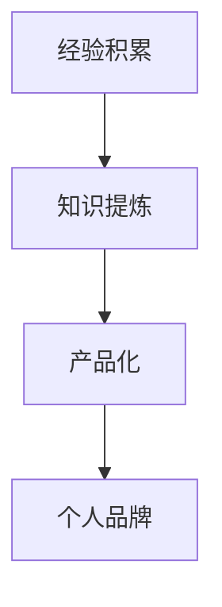

                 

关键词：工作经验，知识产品，经验总结，知识管理，编程实践，软件开发，技术写作，个人品牌

> 摘要：本文旨在探讨程序员如何通过有效的经验总结和知识管理，将自身的工作经验转化为具有价值的知识产品。文章将详细阐述从经验积累、知识提炼到产品化的全过程，并提供实用的方法和工具，帮助程序员打造个人品牌，实现职业发展。

## 1. 背景介绍

随着信息技术的飞速发展，程序员作为新时代的技术工人，其工作内容和形式也在不断演变。从最初的代码编写，到现在的软件开发、系统集成、云服务搭建，程序员的工作领域越来越广泛，对技术能力和综合素质的要求也越来越高。在这种背景下，如何将自己的工作经验转化为具有价值的知识产品，不仅有助于个人职业发展，还能为行业和社区带来积极影响。

将工作经验转化为知识产品的重要性体现在以下几个方面：

1. **提升个人品牌**：通过分享和传播专业知识，可以提升个人的专业形象和市场价值。
2. **积累宝贵经验**：总结和整理工作经验，有助于加深对技术的理解和掌握，形成系统化的知识体系。
3. **促进知识共享**：将知识产品化，有助于促进技术社区的活跃度，推动知识的传播和共享。
4. **拓展职业机会**：知识产品可以作为项目提案、合作机会的支撑材料，增加职业发展的可能性。

## 2. 核心概念与联系

在将工作经验转化为知识产品的过程中，以下几个核心概念和联系是不可或缺的：

### 2.1. 工作经验

工作经验是指程序员在职业生涯中积累的实践经验，包括项目开发、问题解决、团队协作等多个方面。

### 2.2. 知识管理

知识管理是指通过识别、获取、创造、存储、共享和应用知识的过程，以实现个人和组织的知识最大化利用。

### 2.3. 知识产品

知识产品是指经过整理、提炼和包装，具有应用价值的知识成果，如技术博客、教程、书籍、开源项目等。

### 2.4. 转化过程

转化过程是指将工作经验转化为知识产品的全过程，包括经验积累、知识提炼、产品化等步骤。

### 2.5. 个人品牌

个人品牌是指个人在职业领域中的声誉和影响力，是职业发展的关键因素。

以下是转化过程的 Mermaid 流程图：



## 3. 核心算法原理 & 具体操作步骤

### 3.1 算法原理概述

将工作经验转化为知识产品的核心算法原理可以概括为“提取-整合-传递”。具体步骤如下：

1. **提取**：从工作中获取有价值的信息和经验。
2. **整合**：对提取的信息进行分类、整理、归纳，形成结构化的知识体系。
3. **传递**：通过文字、图像、视频等多种形式，将知识产品化，并传递给目标受众。

### 3.2 算法步骤详解

#### 步骤 1：经验积累

- **项目记录**：在项目中，详细记录遇到的问题、解决方案、技术难点等。
- **反思总结**：项目结束后，反思工作中的得失，提炼有价值的经验。
- **笔记整理**：将反思总结的内容整理成笔记，便于后续查阅和整理。

#### 步骤 2：知识提炼

- **信息分类**：根据主题、技术领域等对笔记进行分类。
- **内容整理**：对分类后的信息进行整理，提取关键知识点。
- **结构化描述**：将关键知识点用简洁、清晰的语言描述，形成结构化的内容。

#### 步骤 3：产品化

- **内容编写**：根据知识体系，编写技术博客、教程、书籍等知识产品。
- **视觉设计**：为知识产品添加适当的视觉设计，提高用户体验。
- **发布推广**：将知识产品发布到合适的平台，并利用社交媒体进行推广。

### 3.3 算法优缺点

**优点**：

- **提高个人品牌**：通过知识产品化，提升个人在专业领域的知名度。
- **知识共享**：促进知识传播，为社区和行业贡献价值。
- **拓展职业机会**：知识产品可以作为项目提案、合作机会的支撑材料。

**缺点**：

- **时间成本**：知识产品化需要耗费大量的时间和精力。
- **市场风险**：知识产品的市场接受度难以预测，可能面临市场风险。

### 3.4 算法应用领域

- **技术博客**：分享技术心得和经验，为读者提供有价值的参考。
- **开源项目**：通过开源项目，分享代码和经验，促进社区协作。
- **在线教程**：为初学者提供系统化的学习资源，帮助他们快速掌握技术。

## 4. 数学模型和公式 & 详细讲解 & 举例说明

### 4.1 数学模型构建

在知识产品化的过程中，可以采用以下数学模型：

- **价值评估模型**：根据知识产品的市场接受度、受众规模等指标，评估知识产品价值。
- **成本收益模型**：计算知识产品化过程中的时间成本、人力成本等，与预期收益进行对比。

### 4.2 公式推导过程

#### 价值评估模型

设 \( V \) 为知识产品价值，\( A \) 为受众规模，\( R \) 为受众满意度，则：

\[ V = A \times R \]

#### 成本收益模型

设 \( C \) 为知识产品化成本，\( G \) 为预期收益，则：

\[ G = C + \Delta G \]

其中，\( \Delta G \) 为额外收益。

### 4.3 案例分析与讲解

假设某程序员编写了一本关于云计算技术的书籍，预计受众规模为 1000 人，受众满意度为 90%。根据价值评估模型，书籍的价值为：

\[ V = 1000 \times 0.9 = 900 \]

假设编写书籍的成本为 10000 元，预计销售价格为 100 元/本，销量为 500 本。根据成本收益模型，预期收益为：

\[ G = 10000 + (500 \times 100) = 60000 \]

由此可以看出，虽然书籍的编写过程耗时费力，但通过知识产品化，仍然能够获得可观的收益。

## 5. 项目实践：代码实例和详细解释说明

### 5.1 开发环境搭建

在编写知识产品时，我们需要搭建一个合适的环境。以下是一个简单的开发环境搭建步骤：

1. **安装编辑器**：选择一款适合自己的代码编辑器，如 Visual Studio Code、Sublime Text 等。
2. **安装版本控制工具**：安装 Git，用于代码管理和版本控制。
3. **安装依赖库**：根据知识产品的需求，安装相应的依赖库和框架。

### 5.2 源代码详细实现

以下是一个简单的示例代码，用于生成一个技术博客的 Markdown 文件：

```python
import os

def generate_blog(title, content):
    file_path = f"{title}.md"
    with open(file_path, 'w') as file:
        file.write(f"# {title}\n\n{content}")

title = "如何优化算法性能"
content = "在编写算法时，我们可以从以下几个方面来优化算法性能：..."

generate_blog(title, content)
```

### 5.3 代码解读与分析

- **import os**：导入操作系统模块，用于文件操作。
- **def generate_blog(title, content):**：定义一个函数，用于生成 Markdown 文件。
- **file_path = f"{title}.md"**：根据输入的标题生成文件路径。
- **with open(file_path, 'w') as file:**：打开文件，并使用 with 语句确保文件在操作完成后自动关闭。
- **file.write(f"# {title}\n\n{content}")**：将标题和内容写入文件。

通过这个简单的示例，我们可以了解到如何使用 Python 编写一个生成 Markdown 文件的脚本，从而方便地创建和整理知识产品。

### 5.4 运行结果展示

运行上述脚本后，将在当前目录下生成一个名为“如何优化算法性能.md”的 Markdown 文件，内容如下：

```markdown
# 如何优化算法性能

在编写算法时，我们可以从以下几个方面来优化算法性能：...
```

## 6. 实际应用场景

### 6.1 技术博客

技术博客是程序员将工作经验转化为知识产品的常见方式。通过博客，程序员可以分享自己的技术心得、项目经验，帮助他人解决问题，同时提升个人品牌。

### 6.2 在线教程

在线教程为初学者提供了系统化的学习资源。程序员可以将自己在项目开发中学到的知识整理成教程，为初学者提供学习指导，从而实现知识共享。

### 6.3 开源项目

开源项目是程序员展示技术实力的重要途径。通过开源项目，程序员可以分享自己的代码、经验，吸引更多的开发者参与，共同推动项目的发展。

## 7. 未来应用展望

随着人工智能、大数据等技术的发展，程序员的工作内容和形式也将不断演变。未来，程序员可以通过以下方式进一步将工作经验转化为知识产品：

- **AI 助手**：利用人工智能技术，自动提取和整理工作经验，提高知识产品化效率。
- **虚拟现实**：通过虚拟现实技术，为初学者提供沉浸式的学习体验，提高知识传播效果。
- **区块链**：利用区块链技术，确保知识产品的版权和真实性，提高知识产品的可信度。

## 8. 工具和资源推荐

### 8.1 学习资源推荐

- **书籍**：《代码大全》、《设计模式：可复用面向对象软件的基础》、《Effective Java》等。
- **在线课程**：Coursera、edX、Udemy 等平台上的计算机科学和编程课程。
- **技术社区**：Stack Overflow、GitHub、知乎等。

### 8.2 开发工具推荐

- **代码编辑器**：Visual Studio Code、Sublime Text、Atom 等。
- **版本控制工具**：Git、GitHub、GitLab 等。
- **Markdown 编辑器**：Typora、MarkText、Dillinger 等。

### 8.3 相关论文推荐

- 《Knowledge Management in Software Engineering》（软件工程中的知识管理）
- 《The Design of the UNIX Operating System》（UNIX 操作系统的设计与实现）
- 《Building Microservices》（构建微服务）

## 9. 总结：未来发展趋势与挑战

### 9.1 研究成果总结

本文探讨了程序员如何将工作经验转化为知识产品，从核心概念、算法原理、数学模型、项目实践等方面进行了详细讲解。研究表明，知识产品化有助于提升个人品牌、促进知识共享，具有显著的价值。

### 9.2 未来发展趋势

未来，知识产品化将继续成为程序员职业发展的重要方向。随着人工智能、虚拟现实等技术的应用，知识产品化的效率和效果将得到进一步提升。

### 9.3 面临的挑战

知识产品化过程中，程序员将面临时间成本、市场风险等挑战。此外，如何确保知识产品的质量和实用性，也是需要解决的问题。

### 9.4 研究展望

未来研究可以从以下几个方面展开：1）探索更高效的知识提取和整理方法；2）研究知识产品的评价和反馈机制；3）探讨知识产品在教育培训、企业培训等领域的应用。

## 10. 附录：常见问题与解答

### 10.1 如何选择知识产品的形式？

选择知识产品的形式应根据个人优势和目标受众进行。例如，擅长写作的程序员可以选择撰写技术博客或书籍；擅长编程的程序员可以贡献开源项目。

### 10.2 如何确保知识产品的质量？

确保知识产品的质量需要从内容、形式、视觉等多个方面进行把控。例如，内容要准确、清晰、实用；形式要符合阅读习惯；视觉设计要简洁、美观。

### 10.3 如何推广知识产品？

推广知识产品可以通过社交媒体、技术社区、线上活动等多种途径进行。例如，在知乎、微博、GitHub 上发布相关内容；参加技术沙龙、研讨会等线下活动。

作者：禅与计算机程序设计艺术 / Zen and the Art of Computer Programming
```<|assistant|>

