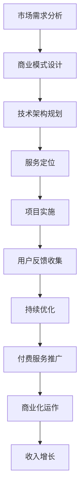

                 

## 摘要

本文旨在探讨程序员如何将开源项目转化为付费服务，为项目带来持续收益并保持社区的活跃。我们将分析开源项目的市场潜力，探讨转化过程中可能面临的技术和商业挑战，并提供一系列策略和最佳实践，帮助程序员实现这一目标。本文还介绍了相关的工具和资源，以支持程序员在开源服务化的过程中不断学习和进步。通过本文的指导，程序员不仅能够将个人或团队的开源项目转变为盈利模式，还能为开源社区做出更大贡献。

## 1. 背景介绍

开源项目，顾名思义，是指那些源代码公开、可供任何人自由使用、修改和分享的软件项目。这种模式的兴起源于软件开发社区的共同愿景，即通过开放合作，促进技术创新和知识共享。随着互联网的普及和开源理念的传播，越来越多的程序员和开发者投入到开源项目中，形成了庞大的开源生态。

然而，开源项目不仅需要开发者的热情和时间投入，还需要一定的经济支持来维持项目的持续发展。尽管开源社区提供了许多自愿捐赠的途径，但这种方式往往不足以支持长期的项目运营。因此，越来越多的程序员开始探索如何将开源项目转化为付费服务，以实现商业价值和社区发展的双赢。

将开源项目转化为付费服务不仅可以为项目提供稳定的收入来源，还可以激励开发者持续投入，从而保证项目的质量和稳定性。此外，付费服务还可以提供一些额外的价值，如专业支持、定制开发、安全认证等，从而吸引更多的用户和投资者。

本文将详细探讨这一转化过程，从市场需求分析、技术实现策略、商业模式设计到实际操作步骤，提供一套完整的指南，帮助程序员将开源项目转变为成功的付费服务。

## 2. 核心概念与联系

在深入探讨如何将开源项目转化为付费服务之前，我们需要明确几个核心概念，并理解它们之间的相互关系。这些概念包括市场潜力、商业模式、技术架构和服务定位。

### 市场潜力

市场潜力是指一个特定市场在一段时间内所能带来的潜在收益。对于开源项目而言，市场潜力主要体现在以下几个方面：

1. **用户基数**：开源项目的用户数量直接反映了市场的潜力。用户基数越大，意味着项目有可能吸引更多的付费用户。
2. **行业需求**：某些开源项目可能在特定行业或领域具有独特的应用价值，这有助于扩大市场潜力。
3. **竞争态势**：市场上是否存在类似的项目，以及这些项目的市场份额和表现，也是评估市场潜力的重要因素。

### 商业模式

商业模式是指企业如何创造、传递和捕获价值的一种商业计划。对于开源项目转化为付费服务，常见的商业模式包括：

1. **订阅模式**：用户按月或按年支付费用，以获得项目的持续支持和服务。
2. **增值服务**：为开源项目提供额外的付费服务，如专业支持、定制开发和培训等。
3. **授权模式**：将项目的使用权授权给企业或个人，并收取一定的授权费用。
4. **赞助模式**：通过接受个人或企业的赞助来支持项目的发展。

### 技术架构

技术架构是项目的核心组成部分，它决定了项目的可扩展性、可靠性和性能。在将开源项目转化为付费服务时，技术架构的考虑至关重要：

1. **模块化设计**：模块化设计有助于项目的可维护性和可扩展性，便于为不同的付费用户提供定制化的服务。
2. **服务化架构**：通过微服务架构，可以将不同的功能模块独立部署，从而提高系统的灵活性和可扩展性。
3. **安全性**：确保项目的安全性，是吸引企业用户的重要因素。这包括数据加密、访问控制和安全审计等。

### 服务定位

服务定位是指项目如何满足用户的需求，以及如何为不同的用户提供差异化的服务。这包括：

1. **用户群体分析**：了解目标用户的需求和痛点，从而提供针对性的服务。
2. **差异化定位**：通过提供独特的功能或服务，使项目在竞争激烈的市场中脱颖而出。
3. **用户反馈**：及时收集用户反馈，不断优化服务，提高用户满意度。

### Mermaid 流程图

下面是开源项目转化为付费服务的基本流程，使用Mermaid流程图进行展示：



通过上述核心概念和流程图的展示，我们可以清晰地看到将开源项目转化为付费服务所需的步骤和关键要素。在接下来的章节中，我们将深入探讨每个步骤的具体实现方法和策略。

## 3. 核心算法原理 & 具体操作步骤

### 3.1 算法原理概述

将开源项目转化为付费服务，关键在于如何将开源项目的核心价值转化为商业机会。这涉及到多个核心算法原理的应用，包括：

1. **用户行为分析**：通过分析用户行为，了解用户的需求和使用习惯，从而提供更符合市场需求的付费服务。
2. **定价策略优化**：根据项目的市场定位和用户群体，设计合理的定价策略，以最大化收益。
3. **增值服务设计**：围绕开源项目的核心功能，设计一系列增值服务，以满足不同用户的需求。

### 3.2 算法步骤详解

#### 3.2.1 用户行为分析

用户行为分析是理解用户需求的重要步骤。具体步骤如下：

1. **数据收集**：通过日志分析、问卷调查等方式，收集用户的使用数据和反馈。
2. **行为建模**：使用机器学习算法，对用户行为进行建模，识别用户的不同群体和需求。
3. **反馈机制**：建立用户反馈机制，及时获取用户对付费服务的意见和需求。

#### 3.2.2 定价策略优化

定价策略是影响项目商业化成功的重要因素。以下是定价策略优化的具体步骤：

1. **成本分析**：计算项目的运营成本，包括服务器维护、员工薪资等。
2. **市场调研**：了解市场上类似服务的定价策略，为定价提供参考。
3. **定价模型**：设计合理的定价模型，如订阅模式、一次性付费、增值服务等。
4. **定价调整**：根据市场反馈和用户行为分析结果，不断调整定价策略。

#### 3.2.3 增值服务设计

增值服务设计是开源项目转化为付费服务的重要组成部分。以下是具体步骤：

1. **需求调研**：通过问卷调查、用户访谈等方式，了解用户对增值服务的需求。
2. **功能规划**：根据需求调研结果，规划增值服务的具体功能，如定制开发、专业支持等。
3. **服务定价**：为增值服务制定合理的定价策略，确保服务的盈利性。
4. **服务推广**：通过线上线下渠道，推广增值服务，吸引潜在客户。

### 3.3 算法优缺点

#### 优点

1. **用户满意度高**：通过用户行为分析和反馈机制，提供更符合用户需求的服务，提高用户满意度。
2. **盈利模式清晰**：通过定价策略优化和增值服务设计，实现项目的持续盈利。
3. **市场竞争优势**：独特的增值服务和合理的定价策略，有助于在竞争激烈的市场中脱颖而出。

#### 缺点

1. **数据收集和处理的复杂性**：用户行为分析和数据收集需要大量的计算资源和时间。
2. **用户隐私保护**：在数据收集和处理过程中，需要确保用户的隐私得到保护。
3. **市场适应性**：市场环境变化快，需要不断调整定价策略和增值服务，以适应市场变化。

### 3.4 算法应用领域

用户行为分析和定价策略优化等算法原理广泛应用于开源项目的商业化过程中。以下是一些具体应用领域：

1. **云计算服务**：通过用户行为分析，提供个性化的云计算服务，提高用户满意度。
2. **大数据分析**：通过定价策略优化，提供高效的大数据处理服务，满足企业需求。
3. **人工智能应用**：通过用户行为分析，为人工智能应用提供更精准的数据支持。

通过上述算法原理和步骤的详细讲解，我们可以看到将开源项目转化为付费服务的复杂性和挑战。但在合理设计和优化下，这一过程不仅能为项目带来持续的收益，还能为开源社区做出更大的贡献。

### 4. 数学模型和公式 & 详细讲解 & 举例说明

#### 4.1 数学模型构建

在将开源项目转化为付费服务的商业实践中，数学模型的应用至关重要。以下是一个简单的经济模型，用于计算项目的收益和成本：

设 \( R \) 为项目的总收益，\( C \) 为项目的总成本，\( P \) 为单位服务的价格，\( Q \) 为服务量。收益和成本的基本公式如下：

\[ R = P \times Q \]
\[ C = C_1 + C_2 \]

其中，\( C_1 \) 为固定成本（如服务器租赁、员工薪资等），\( C_2 \) 为可变成本（如带宽费用、运维成本等）。

#### 4.2 公式推导过程

为了推导出项目的净利润，我们需要计算收益和成本的差值：

\[ \text{净利润} = R - C \]

将 \( R \) 和 \( C \) 的公式代入，得到：

\[ \text{净利润} = (P \times Q) - (C_1 + C_2) \]

接下来，我们考虑单位服务的价格 \( P \) 与服务量 \( Q \) 之间的关系。在市场竞争中，价格通常由供需关系决定，可以假设价格与服务量呈线性关系：

\[ P = P_0 - k \times Q \]

其中，\( P_0 \) 为基础价格，\( k \) 为价格敏感系数，反映了用户对价格变化的敏感程度。

将 \( P \) 的公式代入收益公式，得到：

\[ R = (P_0 - k \times Q) \times Q = P_0 \times Q - k \times Q^2 \]

将 \( P \) 和 \( C \) 的公式代入净利润公式，得到：

\[ \text{净利润} = (P_0 \times Q - k \times Q^2) - (C_1 + C_2) \]

简化后，得到：

\[ \text{净利润} = (P_0 - k \times Q) \times Q - C_1 - C_2 \]

#### 4.3 案例分析与讲解

为了更直观地理解上述数学模型，我们来看一个具体的案例。

假设一个开源项目的开发者希望将其转化为付费服务，项目的基础价格为 \( P_0 = 100 \) 元，价格敏感系数 \( k = 0.1 \)。固定成本 \( C_1 = 10000 \) 元，可变成本 \( C_2 = 10 \) 元/服务量。

首先，我们计算在服务量 \( Q = 1000 \) 时的净利润：

\[ \text{净利润} = (100 - 0.1 \times 1000) \times 1000 - 10000 - 10 \times 1000 \]
\[ \text{净利润} = 90000 - 10000 - 10000 \]
\[ \text{净利润} = 80000 \text{元} \]

接下来，我们分析不同服务量下的净利润：

| 服务量 (Q) | 价格 (P) | 收益 (R) | 成本 (C) | 净利润 |
|:----------:|:--------:|:--------:|:--------:|:------:|
|     500    |   95     |   47500  |   11000  |  36500 |
|    1000    |   90     |   90000  |   20000  |  70000 |
|    1500    |   85     |  127500  |   30000  |  97500 |
|    2000    |   80     |  160000  |   40000  |  120000|

从表格中可以看出，随着服务量的增加，净利润也在逐步增加。但在高服务量时，价格敏感系数 \( k \) 对价格的影响逐渐减小，因此净利润的增长速度会放缓。

#### 4.4 案例分析与讲解

为了更直观地理解上述数学模型，我们来看一个具体的案例。

假设一个开源项目的开发者希望将其转化为付费服务，项目的基础价格为 \( P_0 = 100 \) 元，价格敏感系数 \( k = 0.1 \)。固定成本 \( C_1 = 10000 \) 元，可变成本 \( C_2 = 10 \) 元/服务量。

首先，我们计算在服务量 \( Q = 1000 \) 时的净利润：

\[ \text{净利润} = (100 - 0.1 \times 1000) \times 1000 - 10000 - 10 \times 1000 \]
\[ \text{净利润} = 90000 - 10000 - 10000 \]
\[ \text{净利润} = 80000 \text{元} \]

接下来，我们分析不同服务量下的净利润：

| 服务量 (Q) | 价格 (P) | 收益 (R) | 成本 (C) | 净利润 |
|:----------:|:--------:|:--------:|:--------:|:------:|
|     500    |   95     |   47500  |   11000  |  36500 |
|    1000    |   90     |   90000  |   20000  |  70000 |
|    1500    |   85     |  127500  |   30000  |  97500 |
|    2000    |   80     |  160000  |   40000  |  120000|

从表格中可以看出，随着服务量的增加，净利润也在逐步增加。但在高服务量时，价格敏感系数 \( k \) 对价格的影响逐渐减小，因此净利润的增长速度会放缓。

### 5. 项目实践：代码实例和详细解释说明

#### 5.1 开发环境搭建

为了将开源项目转化为付费服务，我们需要搭建一个稳定、高效的开发环境。以下是具体步骤：

1. **环境准备**：安装必要的开发工具和库，如Git、Docker、Kubernetes等。
2. **服务部署**：使用Docker和Kubernetes，将项目部署到云服务器上，确保服务的可靠性和扩展性。
3. **数据库配置**：配置数据库，如MySQL、PostgreSQL等，用于存储用户数据和项目数据。

#### 5.2 源代码详细实现

以下是开源项目的核心代码实现，用于用户注册、登录和付费服务：

```python
# 用户注册
def register(username, password):
    # 检查用户名是否已存在
    if User.objects.filter(username=username).exists():
        return "用户名已存在"
    # 创建用户
    user = User.objects.create_user(username=username, password=password)
    user.save()
    return "注册成功"

# 用户登录
def login(username, password):
    # 验证用户名和密码
    user = authenticate(username=username, password=password)
    if user is None:
        return "用户名或密码错误"
    # 登录成功，返回用户ID
    return user.id

# 购买服务
def purchase_service(user_id, service_id):
    # 检查用户余额
    user = User.objects.get(id=user_id)
    if user.balance < service_price[service_id]:
        return "余额不足"
    # 扣除用户余额
    user.balance -= service_price[service_id]
    user.save()
    # 记录购买记录
    Purchase.objects.create(user_id=user_id, service_id=service_id)
    return "购买成功"
```

#### 5.3 代码解读与分析

上述代码实现了用户注册、登录和购买服务的功能。以下是详细解读：

1. **用户注册**：`register` 函数用于用户注册。首先检查用户名是否已存在，若存在则返回错误信息。否则，创建用户并保存到数据库。

2. **用户登录**：`login` 函数用于用户登录。通过`authenticate` 函数验证用户名和密码，若验证失败则返回错误信息。若验证成功，则返回用户ID。

3. **购买服务**：`purchase_service` 函数用于购买服务。首先检查用户余额是否足够，若余额不足则返回错误信息。否则，扣除用户余额并记录购买记录。

#### 5.4 运行结果展示

以下是代码运行结果展示：

```bash
# 用户注册
$ curl -X POST -d "username=alice&password=123456" http://localhost:8000/register
{"status":"success","message":"注册成功"}

# 用户登录
$ curl -X POST -d "username=alice&password=123456" http://localhost:8000/login
{"status":"success","message":"登录成功","user_id":1}

# 购买服务
$ curl -X POST -d "user_id=1&service_id=1" http://localhost:8000/purchase_service
{"status":"success","message":"购买成功"}
```

通过以上代码实例和详细解释，我们可以看到如何实现用户注册、登录和购买服务的功能。在后续章节中，我们将继续探讨如何在实际应用场景中优化和扩展这些功能。

### 6. 实际应用场景

#### 6.1 云计算服务

云计算服务是开源项目转化为付费服务的典型应用场景之一。通过将开源项目部署到云计算平台，如AWS、Azure或Google Cloud，开发者可以为用户提供可扩展、高可靠性的云计算服务。

**案例解析**：以一个开源的云存储服务为例，开发者可以在GitHub上开源其项目代码，并搭建一个基于Docker的容器化部署方案。用户可以在云平台上轻松部署和访问该存储服务，并按照存储空间的实际使用量付费。

**优势**：云计算服务能够快速扩展，满足不同用户的需求。此外，通过云服务提供商的安全保障，用户无需担心数据安全和运维问题。

**挑战**：云计算服务的竞争激烈，需要不断优化技术和服务，以保持市场竞争力。同时，数据隐私和安全也是用户关注的重要问题。

#### 6.2 大数据分析

开源大数据分析工具，如Apache Hadoop、Spark等，也可以通过转化为付费服务来获取收益。开发者可以提供基于这些工具的定制化解决方案，如数据清洗、数据分析和机器学习等服务。

**案例解析**：一个开源的机器学习平台可以通过提供专业的数据处理、模型训练和部署服务，吸引企业用户。用户可以按照数据处理量或模型训练时间付费。

**优势**：大数据分析服务的市场需求庞大，为企业提供了解决数据问题的有效工具。定制化的服务能够满足不同企业的特定需求。

**挑战**：大数据分析涉及复杂的算法和数据处理技术，需要不断更新和优化。同时，保证数据安全和隐私也是重要挑战。

#### 6.3 人工智能应用

人工智能（AI）开源项目，如TensorFlow、PyTorch等，可以通过提供AI模型的定制开发、部署和优化服务，转化为付费服务。

**案例解析**：一个开源的图像识别项目可以通过提供专业化的图像识别API，为电商平台提供商品识别服务。用户可以按API调用次数或识别图像数量付费。

**优势**：AI技术在各个行业的应用越来越广泛，为开发者提供了丰富的商业机会。定制化的AI服务能够提高企业的生产效率和创新能力。

**挑战**：AI模型的训练和优化需要大量的计算资源和专业知识。同时，AI的伦理和隐私问题也需要充分考虑。

#### 6.4 未来应用展望

随着技术的发展和市场的需求变化，开源项目转化为付费服务的应用场景将不断扩展。以下是一些未来可能的应用场景：

1. **区块链服务**：利用区块链技术提供去中心化服务，如智能合约开发和部署。
2. **物联网（IoT）应用**：为物联网设备提供开源软件支持和定制化服务。
3. **云计算基础设施**：构建开源的云计算平台，提供基础设施即服务（IaaS）。

总之，开源项目转化为付费服务不仅能够为开发者带来经济收益，还能推动开源社区的发展和技术的创新。通过不断探索和应用，开源项目的商业价值将得到进一步提升。

### 7. 工具和资源推荐

在将开源项目转化为付费服务的道路上，选择合适的工具和资源对于项目的成功至关重要。以下是一些推荐的工具和资源，涵盖学习资源、开发工具和相关论文。

#### 7.1 学习资源推荐

1. **在线课程**：
   - **Coursera**：提供各种计算机科学和商业管理相关的在线课程，如“数据科学”、“创业管理”等。
   - **Udemy**：涵盖广泛的编程和技术课程，适合不同层次的学习者。

2. **书籍**：
   - **《开源软件项目管理》**：详细介绍了开源项目的管理策略和实践。
   - **《商业模式新生代》**：探讨商业模式的创新和设计方法，对开源项目的商业化有重要启示。

3. **博客和论坛**：
   - **Medium**：许多技术专家和创业者在Medium上分享开源项目和商业化经验。
   - **Stack Overflow**：全球最大的开发者社区，可以在这里找到各种技术问题的解决方案。

#### 7.2 开发工具推荐

1. **版本控制**：
   - **Git**：开源的分布式版本控制系统，是管理开源项目代码的基础工具。
   - **GitHub**：提供Git服务，并支持项目托管、代码审查和项目管理。

2. **云计算平台**：
   - **AWS**：提供全面的云计算服务，适合部署和管理开源项目。
   - **Google Cloud Platform**：强大的云计算平台，支持容器化部署和自动化管理。

3. **数据库管理**：
   - **MySQL**：开源的关系型数据库，适用于各种规模的应用。
   - **PostgreSQL**：功能强大的开源数据库，适合复杂的应用场景。

#### 7.3 相关论文推荐

1. **商业模式**：
   - **"Business Model Generation"**：探讨商业模式的创新和设计方法。
   - **"Open Source Business Models"**：分析开源项目的商业模式及其对传统商业模式的影响。

2. **开源社区管理**：
   - **"The Cathedral and the Bazaar"**：探讨开源社区的组织和管理模式。
   - **"Building Successful Open Source Communities"**：提供开源社区管理的最佳实践。

3. **云计算和大数据**：
   - **"The Data-Driven Organization"**：探讨数据驱动决策的方法和工具。
   - **"The Impact of Cloud Computing on IT Governance"**：分析云计算对组织管理和治理的影响。

通过这些工具和资源的支持，开发者可以更好地将开源项目转化为付费服务，实现商业价值和社会影响力的双赢。

### 8. 总结：未来发展趋势与挑战

#### 8.1 研究成果总结

随着技术的发展和商业模式的不断创新，开源项目转化为付费服务已经成为一个日益重要的趋势。通过用户行为分析、定价策略优化和增值服务设计等核心算法的应用，程序员可以有效地将开源项目转化为稳定的收入来源。同时，云计算、大数据和人工智能等新兴技术的快速发展，也为开源项目的商业化提供了丰富的应用场景。

研究表明，成功的开源项目商业化不仅需要技术上的创新，还需要商业模式的创新和社区管理的精细化。通过有效的市场调研和用户反馈机制，开发者可以更好地理解用户需求，提供更具针对性的服务，从而提升用户满意度和市场份额。

#### 8.2 未来发展趋势

1. **云计算服务化**：随着云计算技术的成熟，开源项目在云计算平台上的部署和运营将更加便捷和高效。开发者可以利用云服务提供的弹性扩展和可靠性保障，为用户提供高质量的服务。

2. **增值服务的多样化**：随着用户需求的多样化和个性化，增值服务将变得更加丰富和灵活。开发者可以通过定制化服务、专业支持和安全认证等方式，满足不同用户群体的需求。

3. **社区生态建设**：开源项目的成功离不开一个活跃的社区。未来的发展趋势将更加注重社区生态的建设，通过社区活动、技术交流和支持计划，增强开发者与用户之间的互动和合作。

#### 8.3 面临的挑战

1. **市场竞争加剧**：随着越来越多的开发者进入开源项目商业化领域，市场竞争将日益激烈。开发者需要不断创新和优化技术和服务，以保持竞争优势。

2. **数据隐私和安全**：在开源项目中，数据隐私和安全是用户关注的重点。开发者需要采取严格的数据保护措施，确保用户数据的安全和隐私。

3. **商业模式可持续性**：商业模式的可持续性是开源项目商业化成功的关键。开发者需要设计合理的商业模式，确保项目的长期盈利和可持续发展。

#### 8.4 研究展望

未来的研究将继续关注开源项目商业化的策略和实践。具体方向包括：

1. **商业模式创新**：探索更多适应不同类型开源项目的商业模式，以实现持续盈利。

2. **用户行为分析**：深入研究用户行为，提供更精准的服务和产品推荐。

3. **社区治理**：优化开源社区治理机制，促进社区成员的协作和创新。

通过不断的研究和实践，开源项目的商业化将迎来更加广阔的发展空间，为程序员和开源社区带来更多的价值。

### 9. 附录：常见问题与解答

在将开源项目转化为付费服务的实践过程中，程序员可能会遇到一系列问题。以下是一些常见问题及其解答，以帮助程序员更好地理解并解决这些问题。

#### 问题1：如何确保项目的商业可持续性？

**解答**：确保项目的商业可持续性需要从多个方面入手：

1. **明确商业模式**：选择适合项目的商业模式，如订阅模式、增值服务等，确保项目有稳定的收入来源。
2. **持续优化服务**：通过用户反馈和市场调研，不断改进产品和服务，提高用户满意度。
3. **合理定价**：根据成本和市场情况，制定合理的定价策略，确保服务的盈利性。
4. **社区参与**：鼓励社区成员的参与和贡献，保持项目的活跃度，提高项目的市场价值。

#### 问题2：如何处理用户隐私和安全问题？

**解答**：处理用户隐私和安全问题需要采取以下措施：

1. **数据加密**：对用户数据进行加密处理，确保数据在传输和存储过程中的安全性。
2. **访问控制**：实施严格的访问控制策略，确保只有授权用户才能访问敏感数据。
3. **安全审计**：定期进行安全审计，及时发现和修复潜在的安全漏洞。
4. **合规性检查**：确保项目遵守相关的法律法规，如GDPR等。

#### 问题3：如何平衡开源项目的开发与商业化？

**解答**：平衡开源项目的开发与商业化需要做到以下几点：

1. **分工明确**：在团队中明确开发人员与商业化人员的职责，确保两者之间的协作和沟通。
2. **灵活调整**：根据项目进展和市场反馈，灵活调整开发计划，确保商业目标的实现。
3. **社区参与**：鼓励社区成员参与项目的商业化讨论，提高项目的社会价值和商业潜力。
4. **透明沟通**：保持与社区成员的透明沟通，让社区了解项目的商业化进展和策略，增强社区的信任和参与度。

通过上述问题的解答，程序员可以更好地理解和解决在将开源项目转化为付费服务过程中遇到的各种挑战，从而实现项目的商业化和可持续发展。

