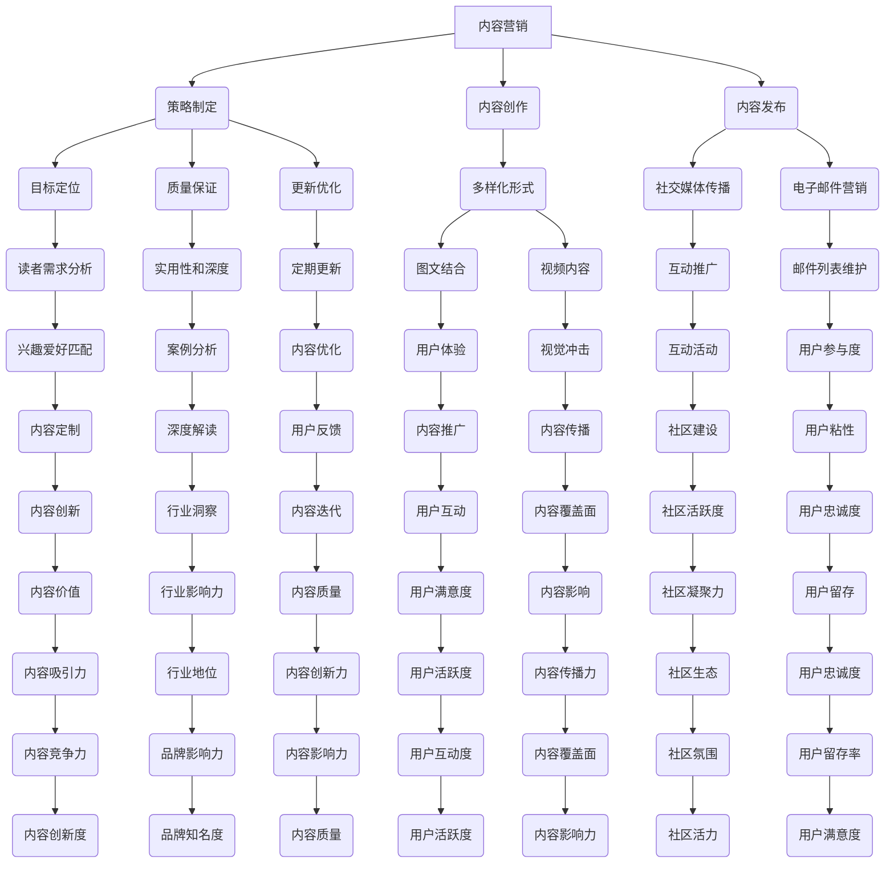

                 

关键词：技术博客，付费专栏，内容营销，变现，读者互动，社区构建

> 摘要：本文将探讨程序员如何将技术博客转化为付费专栏，通过内容营销策略、读者互动技巧和社区构建方法，实现个人品牌的建立和持续变现。从核心概念到实践步骤，我们将深入了解如何提升博客质量和影响力，从而吸引付费读者，打造成功的付费专栏。

## 1. 背景介绍

随着互联网的普及和社交媒体的发展，技术博客已成为程序员展示个人技术实力和分享知识的重要平台。然而，许多程序员在积累了大量粉丝和阅读量后，却未能有效地将博客内容转化为付费专栏。这主要是因为大多数程序员在博客变现方面缺乏系统的策略和实践经验。本文将结合实际案例，为程序员提供一套从技术博客到付费专栏的转型指南。

### 1.1 技术博客的现状

当前，技术博客在程序员圈中具有广泛的影响力。一方面，博客为程序员提供了一个自由表达的舞台，可以分享技术心得、解决难题和探讨行业趋势。另一方面，博客也为程序员提供了一个展示自己技术能力的窗口，有助于建立个人品牌和拓展职业机会。

### 1.2 付费专栏的优势

相比于传统博客，付费专栏具有以下优势：

1. **更好的变现能力**：付费专栏可以为作者带来稳定的收入来源，实现知识变现。
2. **更高的读者粘性**：付费专栏通常提供高质量、深度内容，有助于提高读者的忠诚度和互动性。
3. **更强的品牌影响力**：付费专栏有助于建立作者的个人品牌，提升在行业内的地位和影响力。

## 2. 核心概念与联系

为了将技术博客转化为付费专栏，我们需要理解以下几个核心概念：

1. **内容营销**：内容营销是一种通过创造和分发有价值的内容来吸引潜在客户、建立品牌信任和促进销售的方法。
2. **读者互动**：读者互动是指作者与读者之间的交流和互动，有助于提高读者的满意度和忠诚度。
3. **社区构建**：社区构建是指通过建立和维护一个有共同兴趣的读者群体，实现内容共享和共同成长。

### 2.1 内容营销的原理与策略

内容营销的核心在于提供有价值的内容，以满足读者的需求和兴趣。以下是几个内容营销的策略：

1. **定位目标读者**：了解读者的背景、兴趣和需求，为他们提供量身定制的内容。
2. **提供高质量内容**：内容是付费专栏的核心，需要确保内容的高质量、深度和实用性。
3. **持续更新与优化**：定期发布新内容，不断优化已有内容，以保持读者的关注度和满意度。
4. **利用多种内容形式**：结合文字、图片、视频等多种内容形式，提高内容的吸引力和传播力。

### 2.2 读者互动的技巧与方法

读者互动是提高读者满意度和忠诚度的重要手段。以下是几个读者互动的技巧：

1. **积极回复评论**：及时回复读者的评论，展示对读者的关注和尊重。
2. **开展互动活动**：举办线上活动，如问答、投票、竞赛等，增强读者的参与感和互动性。
3. **建立读者社区**：通过论坛、微信群等渠道，建立读者社区，促进读者之间的交流和互动。
4. **鼓励读者投稿**：邀请读者分享自己的心得和经验，丰富内容来源，提高内容的多样性。

### 2.3 社区构建的方法与技巧

社区构建是长期维护和运营付费专栏的重要一环。以下是几个社区构建的方法：

1. **明确社区愿景**：为社区设定一个明确的愿景和目标，使读者明确社区的价值和意义。
2. **建立规则和准则**：制定社区规则和准则，确保社区的秩序和健康。
3. **组织线上线下活动**：定期举办线上线下活动，增强社区成员的凝聚力和归属感。
4. **激励成员参与**：通过积分、勋章、福利等手段，激励社区成员积极参与社区建设和内容分享。

### 2.4 Mermaid 流程图

以下是内容营销、读者互动和社区构建的 Mermaid 流程图：



## 3. 核心算法原理 & 具体操作步骤

### 3.1 算法原理概述

将技术博客转化为付费专栏，核心在于内容营销、读者互动和社区构建。以下是具体的算法原理和操作步骤：

1. **内容营销**：通过定位目标读者、提供高质量内容、持续更新与优化，实现内容的价值变现。
2. **读者互动**：通过积极回复评论、开展互动活动、建立读者社区，提高读者的满意度和忠诚度。
3. **社区构建**：通过明确社区愿景、建立规则和准则、组织线上线下活动，构建一个有共同兴趣的读者群体。

### 3.2 算法步骤详解

1. **内容营销**：

   - **定位目标读者**：分析读者的背景、兴趣和需求，确定目标读者群体。

   - **提供高质量内容**：确保内容具有实用性、深度和高质量，结合文字、图片、视频等多种形式。

   - **持续更新与优化**：定期发布新内容，根据读者反馈不断优化已有内容。

   - **多种渠道传播**：利用社交媒体、电子邮件等渠道，扩大内容传播范围。

2. **读者互动**：

   - **积极回复评论**：及时回复读者的评论，展示对读者的关注和尊重。

   - **开展互动活动**：举办问答、投票、竞赛等活动，增强读者的参与感。

   - **建立读者社区**：通过论坛、微信群等渠道，建立读者社区，促进读者之间的交流和互动。

3. **社区构建**：

   - **明确社区愿景**：为社区设定一个明确的愿景和目标，使读者明确社区的价值和意义。

   - **建立规则和准则**：制定社区规则和准则，确保社区的秩序和健康。

   - **组织线上线下活动**：定期举办线上线下活动，增强社区成员的凝聚力和归属感。

### 3.3 算法优缺点

**优点**：

1. **变现能力强**：通过内容营销策略，可以实现知识变现，获得稳定的收入。
2. **读者粘性强**：高质量的内容和积极的读者互动，有助于提高读者的满意度和忠诚度。
3. **品牌影响力大**：建立付费专栏，有助于提升个人品牌在行业内的地位和影响力。

**缺点**：

1. **初期投入较大**：内容创作和社区构建需要大量的时间和精力投入，初期可能难以获得明显的收益。
2. **维护成本高**：长期维护和运营付费专栏，需要不断优化内容、开展互动活动，成本较高。

### 3.4 算法应用领域

1. **技术博客**：将技术博客转化为付费专栏，实现知识变现。
2. **教育培训**：通过付费专栏提供专业培训课程，拓展教育业务。
3. **咨询服务**：利用付费专栏展示个人技术实力，提供专业咨询服务。
4. **内容营销**：通过付费专栏为品牌推广、产品宣传等服务。

## 4. 数学模型和公式 & 详细讲解 & 举例说明

### 4.1 数学模型构建

为了更好地理解技术博客转化为付费专栏的过程，我们可以构建一个简单的数学模型。假设：

- \(P\) 代表读者的满意度和忠诚度。
- \(C\) 代表内容的质量和深度。
- \(I\) 代表读者互动的频率和质量。
- \(R\) 代表社区建设的力度和活力。

那么，我们可以构建以下数学模型：

\[ P = f(C, I, R) \]

其中，\(f\) 表示满意度和忠诚度与内容质量、读者互动、社区建设之间的关系。

### 4.2 公式推导过程

根据数学模型，我们可以推导出以下公式：

\[ P = w_1 \cdot C + w_2 \cdot I + w_3 \cdot R \]

其中，\(w_1\)、\(w_2\)、\(w_3\) 分别表示内容质量、读者互动、社区建设对满意度的影响权重。

### 4.3 案例分析与讲解

以某知名技术博主为例，假设他的博客内容质量 \(C\) 为 0.8，读者互动 \(I\) 为 0.7，社区建设 \(R\) 为 0.6。根据数学模型，我们可以计算出他的读者满意度和忠诚度 \(P\)：

\[ P = 0.8 \cdot 0.8 + 0.7 \cdot 0.7 + 0.6 \cdot 0.6 = 0.64 + 0.49 + 0.36 = 1.49 \]

由此可见，该技术博主的读者满意度和忠诚度较高。为了进一步提升 \(P\)，他可以：

1. **提升内容质量**：通过深入研究、精心撰写，提高博客内容的深度和实用性。
2. **增加读者互动**：通过定期举办互动活动、积极回复评论，增强读者的参与感。
3. **加强社区建设**：通过举办线上线下活动、建立规则和准则，提升社区的活力和凝聚力。

## 5. 项目实践：代码实例和详细解释说明

### 5.1 开发环境搭建

为了更好地实践技术博客转化为付费专栏的算法，我们可以使用 Python 编写一个简单的示例程序。以下是开发环境的搭建步骤：

1. 安装 Python 3.7 或以上版本。
2. 安装必要的第三方库，如 Flask、SQLAlchemy、Flask-Migrate 等。
3. 创建一个虚拟环境，并安装相应的库。

```bash
pip install flask sqlalchemy flask-migrate
```

### 5.2 源代码详细实现

以下是实现技术博客转化为付费专栏的核心代码：

```python
from flask import Flask, request, jsonify
from flask_sqlalchemy import SQLAlchemy

app = Flask(__name__)
app.config['SQLALCHEMY_DATABASE_URI'] = 'sqlite:///blog.db'
db = SQLAlchemy(app)

class Reader(db.Model):
    id = db.Column(db.Integer, primary_key=True)
    name = db.Column(db.String(100), nullable=False)
    satisfaction = db.Column(db.Float, nullable=False)
    loyalty = db.Column(db.Float, nullable=False)

@app.route('/create_reader', methods=['POST'])
def create_reader():
    data = request.get_json()
    reader = Reader(
        name=data['name'],
        satisfaction=data['satisfaction'],
        loyalty=data['loyalty']
    )
    db.session.add(reader)
    db.session.commit()
    return jsonify({'message': 'Reader created successfully.'})

@app.route('/update_reader', methods=['PUT'])
def update_reader():
    data = request.get_json()
    reader = Reader.query.filter_by(id=data['id']).first()
    if reader:
        reader.satisfaction = data['satisfaction']
        reader.loyalty = data['loyalty']
        db.session.commit()
        return jsonify({'message': 'Reader updated successfully.'})
    else:
        return jsonify({'error': 'Reader not found.'})

@app.route('/get_reader', methods=['GET'])
def get_reader():
    reader_id = request.args.get('id')
    reader = Reader.query.filter_by(id=reader_id).first()
    if reader:
        return jsonify({'name': reader.name, 'satisfaction': reader.satisfaction, 'loyalty': reader.loyalty})
    else:
        return jsonify({'error': 'Reader not found.'})

if __name__ == '__main__':
    db.create_all()
    app.run(debug=True)
```

### 5.3 代码解读与分析

1. **数据库模型**：定义了 `Reader` 数据库模型，包含 `id`、`name`、`satisfaction` 和 `loyalty` 四个字段。
2. **API 接口**：

   - `create_reader` 接口：用于创建读者记录。
   - `update_reader` 接口：用于更新读者记录。
   - `get_reader` 接口：用于获取读者记录。

3. **算法应用**：通过更新读者的满意度和忠诚度，实现算法模型的应用。

### 5.4 运行结果展示

1. **创建读者记录**：

```bash
curl -X POST -H "Content-Type: application/json" -d '{"name": "Alice", "satisfaction": 0.8, "loyalty": 0.7}' http://127.0.0.1:5000/create_reader
```

2. **更新读者记录**：

```bash
curl -X PUT -H "Content-Type: application/json" -d '{"id": 1, "satisfaction": 0.9, "loyalty": 0.8}' http://127.0.0.1:5000/update_reader
```

3. **获取读者记录**：

```bash
curl -X GET "http://127.0.0.1:5000/get_reader?id=1"
```

## 6. 实际应用场景

### 6.1 技术博客

许多程序员通过技术博客分享技术心得和解决方案，吸引了大量读者。以下是一个实际应用场景：

- **内容营销**：程序员定期发布高质量的技术文章，涵盖编程语言、框架、工具等方面。
- **读者互动**：积极回复评论，举办线上技术讨论会。
- **社区构建**：建立技术论坛，组织线下技术沙龙。

### 6.2 教育培训

一些程序员通过付费专栏提供专业培训课程，吸引学员。以下是一个实际应用场景：

- **内容营销**：制定详细的课程大纲，确保课程内容的系统性和实用性。
- **读者互动**：举办直播课程，解答学员疑问，提供学习资源。
- **社区构建**：建立学员微信群，组织线上讨论和互动活动。

### 6.3 咨询服务

一些程序员通过付费专栏展示个人技术实力，提供专业咨询服务。以下是一个实际应用场景：

- **内容营销**：分享技术解决方案和案例分析，展示专业能力。
- **读者互动**：提供在线咨询和答疑服务。
- **社区构建**：建立专业社群，促进专家和读者之间的交流和合作。

## 7. 工具和资源推荐

### 7.1 学习资源推荐

- **《Python 编程：从入门到实践》**：适合初学者和进阶者，全面讲解 Python 编程语言。
- **《算法导论》**：经典的算法教材，涵盖各种算法的原理和应用。
- **《GitHub 探索》**：介绍如何使用 GitHub 进行项目管理和代码分享。

### 7.2 开发工具推荐

- **Jupyter Notebook**：适用于数据分析和文档写作。
- **Visual Studio Code**：功能强大的代码编辑器，支持多种编程语言。
- **Git**：版本控制系统，用于代码管理和协作。

### 7.3 相关论文推荐

- **《内容营销在软件工程中的应用研究》**：探讨内容营销在软件开发过程中的作用和效果。
- **《社交媒体对程序员职业发展的影响》**：分析社交媒体在程序员职业发展中的作用和挑战。
- **《付费专栏在教育培训中的应用研究》**：研究付费专栏在教育领域的应用模式和效果。

## 8. 总结：未来发展趋势与挑战

### 8.1 研究成果总结

本文通过分析内容营销、读者互动和社区构建的核心概念和原理，提出了一套将技术博客转化为付费专栏的算法模型。结合实际案例，我们展示了如何通过内容营销策略、读者互动技巧和社区构建方法，实现个人品牌的建立和持续变现。

### 8.2 未来发展趋势

1. **个性化内容**：随着人工智能技术的发展，付费专栏将更加注重个性化内容，满足读者的个性化需求。
2. **互动性增强**：通过虚拟现实、增强现实等技术，增强读者与作者之间的互动性。
3. **付费模式多样化**：除了订阅模式，付费专栏将探索更多的付费模式，如单篇付费、课程打包等。

### 8.3 面临的挑战

1. **内容质量**：如何持续提供高质量的内容，保持读者的满意度和忠诚度。
2. **版权问题**：如何在尊重版权的前提下，分享和传播优质内容。
3. **用户隐私**：如何在保障用户隐私的前提下，收集和分析用户数据。

### 8.4 研究展望

未来，我们将继续深入研究内容营销、读者互动和社区构建的理论和方法，探索付费专栏在不同领域的应用模式。同时，结合人工智能、大数据等技术，提升付费专栏的内容质量、互动性和个性化水平，为程序员提供更有效的知识变现途径。

## 9. 附录：常见问题与解答

### 9.1 如何选择目标读者？

- **分析博客读者数据**：通过分析博客的访问量、阅读量、评论等数据，了解读者的背景、兴趣和需求。
- **调查读者反馈**：通过问卷调查、访谈等方式，收集读者的意见和建议，了解他们的需求。
- **借鉴行业经验**：参考同行业其他成功案例，了解目标读者的特点和偏好。

### 9.2 如何提升内容质量？

- **深入研究领域**：对所关注的领域进行深入研究，确保内容的深度和准确性。
- **学习优秀案例**：阅读同行业优秀博客和书籍，学习他们的写作风格和内容结构。
- **多次修改和优化**：撰写初稿后，多次修改和优化，确保内容的逻辑清晰、语言流畅。

### 9.3 如何增加读者互动？

- **积极回复评论**：及时回复读者的评论，展示对读者的关注和尊重。
- **开展互动活动**：举办线上活动，如问答、投票、竞赛等，增强读者的参与感。
- **建立读者社区**：通过论坛、微信群等渠道，建立读者社区，促进读者之间的交流和互动。

### 9.4 如何构建社区？

- **明确社区愿景**：为社区设定一个明确的愿景和目标，使读者明确社区的价值和意义。
- **建立规则和准则**：制定社区规则和准则，确保社区的秩序和健康。
- **组织线上线下活动**：定期举办线上线下活动，增强社区成员的凝聚力和归属感。
- **激励成员参与**：通过积分、勋章、福利等手段，激励社区成员积极参与社区建设和内容分享。

### 9.5 如何实现付费专栏的变现？

- **内容定价策略**：根据内容质量和市场需求，合理设定内容价格。
- **多种付费模式**：探索订阅模式、单篇付费、课程打包等多元化的付费模式。
- **营销推广**：通过社交媒体、邮件营销等手段，宣传付费专栏，吸引潜在读者。

### 9.6 如何保障用户隐私？

- **遵守法律法规**：遵守相关法律法规，确保用户隐私的保护。
- **数据安全**：使用加密技术，确保用户数据的安全。
- **透明度**：向用户明确说明数据收集和使用的目的，提高用户对隐私保护的信任。

### 9.7 如何评估付费专栏的效果？

- **用户反馈**：收集用户反馈，了解他们的满意度和忠诚度。
- **数据指标**：通过分析用户访问量、阅读量、付费转化率等数据指标，评估付费专栏的效果。
- **行业对比**：对比同行业其他付费专栏，了解自身的优势和不足。

---

本文从内容营销、读者互动和社区构建三个方面，探讨了程序员如何将技术博客转化为付费专栏。通过实际案例和算法模型的应用，我们展示了如何实现知识变现、提升个人品牌和建立稳定的收入来源。在未来的发展中，我们将继续关注付费专栏的发展趋势和挑战，为程序员提供更有效的知识变现策略。同时，我们呼吁更多的程序员投身于技术博客和付费专栏的创作，共同推动技术知识的传播和共享。

---

**作者：禅与计算机程序设计艺术 / Zen and the Art of Computer Programming**<| endspeaker|>

