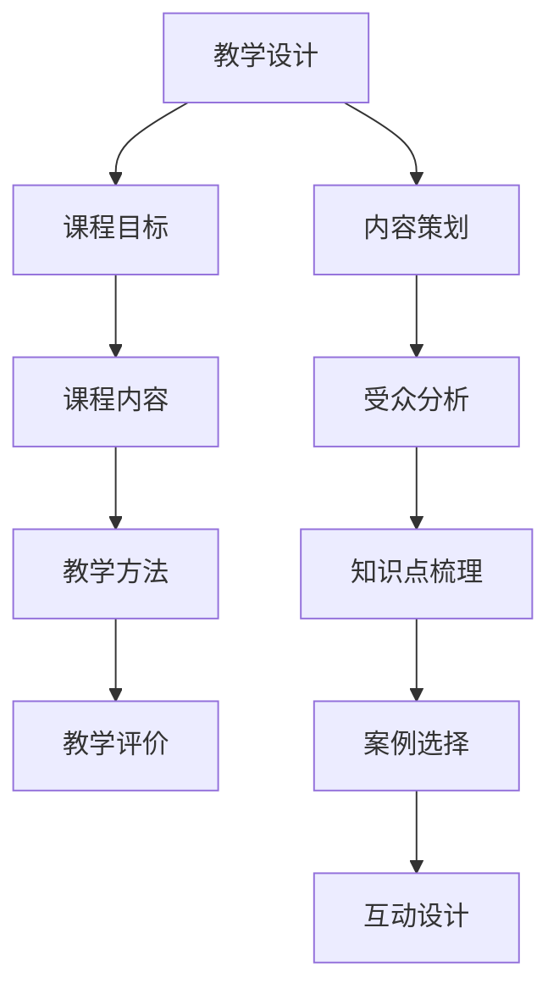
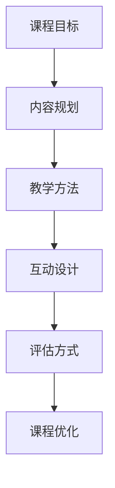

                 

关键词：技术咨询，在线课程，内容创作，教学设计，IT技能传授，编程教学，技术传播

> 摘要：本文将探讨程序员如何有效地将自身在技术领域积累的经验和知识转化为在线课程，以实现个人品牌影响力的提升和知识传播的广度。通过分析教学设计的要点、课程内容策划、技术深度把控以及实际操作步骤，本文旨在为程序员提供一套系统的、实用的在线课程创作指南。

## 1. 背景介绍

在信息时代，在线教育已经成为了知识传播的重要渠道。随着互联网技术的飞速发展，越来越多的程序员希望通过在线课程分享自己的技术心得，这不仅能够扩大技术影响力，还可以通过知识变现获得收益。然而，如何将技术咨询服务转化为系统、有条理的在线课程，对于很多程序员来说是一个不小的挑战。

### 1.1 技术咨询的优势

技术咨询服务通常包括对客户需求的分析、问题解决方案的提供、技术难点攻克等内容。程序员在长期的咨询工作中积累了丰富的实战经验，这些经验对于初学者和有经验的开发者都是宝贵的。将这部分经验转化为在线课程，可以实现以下优势：

- **知识系统的化**：技术咨询服务往往是零散的，转化为课程可以系统化、结构化地传授。
- **资源共享**：通过在线课程，程序员可以将知识传授给更多的人，实现知识的快速扩散。
- **品牌影响力**：高质量的课程能够提升个人或团队的品牌影响力，增强在技术社区的声望。

### 1.2 在线教育的趋势

在线教育已经成为全球教育发展的重要方向。根据市场研究机构的报告，在线教育市场规模逐年增长，尤其在疫情期间，线上学习需求激增。对于程序员来说，抓住这一趋势，不仅能够拓展职业发展空间，还可以在日益竞争激烈的就业市场中占据一席之地。

## 2. 核心概念与联系

### 2.1 教学设计

教学设计是课程开发的核心环节，它决定了课程的质量和影响力。一个优秀的教学设计应包括以下要素：

- **课程目标**：明确课程要达成的目标，包括知识目标、技能目标和情感目标。
- **课程内容**：根据目标选择合适的知识点和教学材料。
- **教学方法**：结合课程内容选择合适的教学方法，如讲授、案例教学、互动讨论等。
- **教学评价**：通过测试、作业、讨论等方式评价学生的学习效果。

### 2.2 内容策划

内容策划是课程开发的关键步骤，它决定了课程的内容质量和吸引力。内容策划应考虑以下几个方面：

- **受众分析**：了解目标学员的特点和需求，为其提供有价值的内容。
- **知识点梳理**：将零散的知识点系统化，形成有逻辑的章节结构。
- **案例选择**：选择具有代表性的案例，帮助学员更好地理解和掌握知识。
- **互动设计**：增加互动环节，提高学员的参与度和学习兴趣。

### 2.3 技术深度把控

作为程序员，技术深度是课程质量的重要保证。在课程开发过程中，应确保以下几点：

- **技术深度适宜**：根据学员的水平选择合适的技术深度，避免过于浅显或过于复杂。
- **实时更新**：技术领域更新迅速，课程内容需要及时更新，以保持其时效性。
- **代码示例**：提供详细的代码示例，帮助学员更好地理解和应用知识。

### 2.4 Mermaid 流程图



## 3. 核心算法原理 & 具体操作步骤

### 3.1 算法原理概述

在课程开发过程中，算法原理的讲解是核心部分。一个优秀的算法讲解应包括以下步骤：

- **算法背景**：介绍算法的应用场景和背景知识。
- **算法思路**：讲解算法的总体思路和核心步骤。
- **算法实现**：提供详细的代码实现，并解释关键代码的逻辑。

### 3.2 算法步骤详解

#### 3.2.1 算法背景

以排序算法为例，介绍常用的快速排序算法。

#### 3.2.2 算法思路

快速排序的基本思想是选择一个基准元素，通过一趟排序将待排序的数据分割成独立的两部分，其中一部分的所有数据都比另一部分的所有数据要小，然后再按此方法对这两部分数据分别进行快速排序，整个排序过程可以递归进行，以此达到整个数据变成有序序列。

#### 3.2.3 算法实现

以下是快速排序的 Python 实现示例：

```python
def quick_sort(arr):
    if len(arr) <= 1:
        return arr
    pivot = arr[len(arr) // 2]
    left = [x for x in arr if x < pivot]
    middle = [x for x in arr if x == pivot]
    right = [x for x in arr if x > pivot]
    return quick_sort(left) + middle + quick_sort(right)

# 示例
arr = [3, 6, 8, 10, 1, 2, 1]
print(quick_sort(arr))
```

### 3.3 算法优缺点

#### 优点

- **高效**：平均时间复杂度为 O(nlogn)，在最坏情况下也为 O(nlogn)。
- **原地排序**：只需少量额外的存储空间。

#### 缺点

- **最坏情况**：当输入数据几乎有序时，快速排序的性能会降到 O(n^2)。
- **递归深度**：快速排序的递归深度可能达到 O(n)，这可能导致栈溢出。

### 3.4 算法应用领域

快速排序广泛应用于各种排序需求，特别是在数据处理和算法竞赛中。此外，它也是许多高级数据结构（如堆、堆排序）的基础。

## 4. 数学模型和公式 & 详细讲解 & 举例说明

### 4.1 数学模型构建

在课程开发中，数学模型的讲解是不可或缺的。以下是构建数学模型的基本步骤：

- **问题定义**：明确需要解决的问题和目标。
- **数据收集**：收集与问题相关的数据，包括历史数据、实验数据等。
- **模型假设**：对问题进行简化和假设，以建立数学模型。
- **模型构建**：根据假设和目标，构建相应的数学模型。

### 4.2 公式推导过程

以线性回归模型为例，介绍公式推导过程：

- **假设**：我们假设目标变量 \(Y\) 与自变量 \(X\) 之间存在线性关系，即 \(Y = \beta_0 + \beta_1 X + \epsilon\)，其中 \(\epsilon\) 为误差项。
- **最小二乘法**：为了估计 \(\beta_0\) 和 \(\beta_1\)，我们使用最小二乘法，即最小化残差平方和 \(S = \sum (Y_i - (\beta_0 + \beta_1 X_i))^2\)。
- **求解过程**：对 \(S\) 关于 \(\beta_0\) 和 \(\beta_1\) 求导并令其导数为零，得到以下方程组：
  \[
  \begin{cases}
  \frac{\partial S}{\partial \beta_0} = -2 \sum (Y_i - (\beta_0 + \beta_1 X_i)) = 0 \\
  \frac{\partial S}{\partial \beta_1} = -2 \sum (Y_i - (\beta_0 + \beta_1 X_i)) X_i = 0
  \end{cases}
  \]
  解这个方程组，我们可以得到 \(\beta_0\) 和 \(\beta_1\) 的估计值。

### 4.3 案例分析与讲解

以房价预测为例，说明线性回归模型的应用：

- **数据收集**：收集某一地区的房屋销售数据，包括房屋价格、面积、位置等信息。
- **数据预处理**：对数据进行清洗和预处理，如缺失值处理、异常值处理等。
- **模型训练**：使用预处理后的数据训练线性回归模型，得到 \(\beta_0\) 和 \(\beta_1\) 的估计值。
- **模型评估**：使用交叉验证等方法评估模型的性能，调整模型参数。
- **应用预测**：使用训练好的模型预测新的房屋价格。

## 5. 项目实践：代码实例和详细解释说明

### 5.1 开发环境搭建

为了实践在线课程的教学，我们需要搭建一个合适的开发环境。以下是步骤：

- **选择编程语言**：根据课程内容选择合适的编程语言，如 Python、Java 等。
- **安装开发工具**：安装代码编辑器（如 Visual Studio Code）、集成开发环境（如 PyCharm）、版本控制系统（如 Git）等。
- **配置环境变量**：配置必要的环境变量，如 Python 的 PATH 等等。

### 5.2 源代码详细实现

以下是一个简单的 Python 快速排序示例：

```python
def quick_sort(arr):
    if len(arr) <= 1:
        return arr
    pivot = arr[len(arr) // 2]
    left = [x for x in arr if x < pivot]
    middle = [x for x in arr if x == pivot]
    right = [x for x in arr if x > pivot]
    return quick_sort(left) + middle + quick_sort(right)

# 示例
arr = [3, 6, 8, 10, 1, 2, 1]
print(quick_sort(arr))
```

### 5.3 代码解读与分析

在这个示例中，`quick_sort` 函数是一个递归函数，用于对列表 `arr` 进行快速排序。函数首先检查列表的长度，如果长度小于等于 1，则直接返回列表。否则，选择列表的中位数作为基准元素 `pivot`，然后将列表划分为三个部分：小于 `pivot` 的部分 `left`、等于 `pivot` 的部分 `middle` 和大于 `pivot` 的部分 `right`。最后，递归地对 `left` 和 `right` 进行快速排序，并将结果与 `middle` 拼接起来，形成排序后的列表。

### 5.4 运行结果展示

执行以上代码，输出结果为 `[1, 1, 2, 3, 6, 8, 10]`，即原始列表 `[3, 6, 8, 10, 1, 2, 1]` 被成功排序。

## 6. 实际应用场景

在线课程的应用场景非常广泛，以下是一些典型的应用场景：

- **技能培训**：针对特定的编程语言、框架或工具进行技能培训，如 Python、Django、TensorFlow 等。
- **项目实战**：通过实际项目案例，教授如何解决实际问题，如 Web 开发、数据分析、机器学习等。
- **技术讲座**：分享技术领域的最新动态、研究成果或实践经验，如区块链、云计算、物联网等。
- **职业规划**：为开发者提供职业规划建议，如简历优化、面试技巧、职业发展等。

### 6.1 技能培训

技能培训是程序员在线课程的重要应用场景之一。通过在线课程，程序员可以教授以下技能：

- **编程语言**：如 Python、Java、C++ 等。
- **框架和库**：如 Django、React、TensorFlow 等。
- **数据库**：如 MySQL、MongoDB、Redis 等。
- **云计算和大数据**：如 AWS、Azure、Hadoop、Spark 等。

### 6.2 项目实战

项目实战课程通过实际项目案例，帮助学员掌握项目开发的全流程，包括需求分析、设计、开发、测试、部署等。以下是一些典型的项目实战课程：

- **Web 开发实战**：通过构建一个完整的 Web 应用，教授 HTML、CSS、JavaScript、框架（如 Django、React）等技能。
- **数据分析实战**：通过分析真实数据集，教授 Python、Pandas、NumPy、Matplotlib 等数据分析工具。
- **机器学习实战**：通过构建机器学习模型，教授 Python、Scikit-learn、TensorFlow、PyTorch 等机器学习框架。

### 6.3 技术讲座

技术讲座课程可以分享技术领域的最新动态、研究成果或实践经验。以下是一些常见的技术讲座主题：

- **区块链技术**：介绍区块链的基本原理、应用场景、安全性等问题。
- **云计算和大数据**：分析云计算的发展趋势、大数据处理技术、大数据应用案例等。
- **物联网**：探讨物联网的技术架构、应用场景、安全等问题。
- **人工智能**：介绍人工智能的基本概念、应用领域、发展趋势等。

### 6.4 未来应用展望

随着在线教育的普及和技术的不断进步，程序员在线课程的应用场景将更加广泛。未来，我们可以期待以下发展趋势：

- **个性化学习**：通过大数据和人工智能技术，实现个性化学习路径推荐，提高学习效果。
- **混合式教育**：将线上和线下教学相结合，发挥各自优势，提高教学质量。
- **跨学科融合**：结合计算机科学与其他学科，开发跨学科的课程，如计算机+心理学、计算机+艺术等。
- **全球教育资源共享**：通过在线教育平台，实现全球教育资源的共享，促进教育公平。

## 7. 工具和资源推荐

### 7.1 学习资源推荐

- **在线编程平台**：如 Codecademy、freeCodeCamp、LeetCode 等，提供丰富的编程练习和项目实战。
- **开源代码库**：如 GitHub、GitLab 等，可以学习他人的代码，获取灵感和经验。
- **技术博客**：如 Medium、Dev.to、Stack Overflow 等，可以阅读技术文章，了解行业动态。
- **在线课程平台**：如 Udemy、Coursera、edX 等，可以学习各种技术课程。

### 7.2 开发工具推荐

- **代码编辑器**：如 Visual Studio Code、Atom、Sublime Text 等，提供丰富的插件和功能。
- **集成开发环境**：如 PyCharm、Eclipse、IntelliJ IDEA 等，集成代码编辑、调试、版本控制等功能。
- **版本控制系统**：如 Git、SVN 等，用于代码管理和团队协作。
- **测试工具**：如 JUnit、Selenium、JMeter 等，用于测试代码质量和性能。

### 7.3 相关论文推荐

- **《深度学习》**：介绍深度学习的基本概念、算法和应用。
- **《大数据技术导论》**：分析大数据的概念、技术和应用。
- **《区块链：从数字货币到智能合约》**：探讨区块链的基本原理和应用。
- **《云计算基础设施：架构与设计》**：分析云计算的技术架构和设计原则。

## 8. 总结：未来发展趋势与挑战

### 8.1 研究成果总结

本文探讨了程序员如何将技术咨询转化为在线课程，分析了教学设计的要点、课程内容策划、技术深度把控以及实际操作步骤。通过实例和案例分析，本文为程序员提供了一套系统的、实用的在线课程创作指南。

### 8.2 未来发展趋势

随着在线教育的普及和技术的不断进步，程序员在线课程的发展趋势包括：

- **个性化学习**：通过大数据和人工智能技术，实现个性化学习路径推荐，提高学习效果。
- **混合式教育**：将线上和线下教学相结合，发挥各自优势，提高教学质量。
- **跨学科融合**：结合计算机科学与其他学科，开发跨学科的课程，如计算机+心理学、计算机+艺术等。
- **全球教育资源共享**：通过在线教育平台，实现全球教育资源的共享，促进教育公平。

### 8.3 面临的挑战

尽管程序员在线课程具有广阔的发展前景，但在实际操作中仍面临以下挑战：

- **内容质量**：如何确保课程内容的质量和实用性，满足学员的需求。
- **技术更新**：如何及时更新课程内容，跟上技术发展的步伐。
- **教学互动**：如何在在线课程中实现有效的教学互动，提高学员的参与度和学习兴趣。
- **版权保护**：如何保护课程内容的版权，防止侵权和盗版。

### 8.4 研究展望

未来，在线课程创作研究可以从以下几个方面展开：

- **教学效果评估**：研究如何更有效地评估在线课程的教学效果，为课程优化提供依据。
- **学习数据分析**：通过学习数据分析，挖掘学员的学习行为和需求，实现个性化教学。
- **跨平台融合**：研究如何实现不同在线教育平台的融合，提供一站式学习体验。
- **开源资源共享**：鼓励开源资源的共享，提高在线课程的内容质量和教学效果。

## 9. 附录：常见问题与解答

### 9.1 如何选择课程主题？

选择课程主题时，应考虑以下因素：

- **个人兴趣**：选择自己擅长和感兴趣的领域，有利于提高课程质量。
- **市场需求**：研究当前市场的需求和趋势，选择具有市场前景的领域。
- **受众需求**：了解目标学员的需求和背景，为其提供有价值的内容。

### 9.2 如何确保课程质量？

确保课程质量可以从以下几个方面入手：

- **课程策划**：进行充分的课程策划，明确课程目标、内容、教学方法和评价方式。
- **内容审核**：对课程内容进行严格审核，确保知识的准确性和实用性。
- **教学测试**：在课程发布前进行教学测试，收集反馈意见，进行优化。
- **持续更新**：定期更新课程内容，保持其时效性和实用性。

### 9.3 如何提高学员参与度？

提高学员参与度可以采取以下措施：

- **互动设计**：增加课程中的互动环节，如讨论区、问答环节等，鼓励学员参与。
- **激励措施**：设置积分、证书等激励措施，提高学员的学习积极性。
- **案例教学**：通过案例教学，将理论知识与实际应用相结合，提高学员的兴趣。
- **教学反馈**：及时收集学员的反馈意见，并根据反馈进行课程优化。

### 9.4 如何进行课程推广？

进行课程推广可以采取以下策略：

- **社交媒体**：利用社交媒体平台（如微博、微信公众号、知乎等）进行课程宣传。
- **线上活动**：举办线上活动（如直播、讲座、竞赛等），吸引学员关注。
- **合作推广**：与其他教育机构、培训机构或专业人士进行合作，扩大课程的影响力。
- **广告投放**：在相关网站、APP 或社交媒体上进行广告投放，提高课程曝光率。

---

### 结尾

感谢您阅读本文。本文旨在为程序员提供一套系统的、实用的在线课程创作指南，帮助其在技术领域取得更大的成就。希望本文能对您的课程创作工作有所启发和帮助。如果您有任何疑问或建议，欢迎在评论区留言，让我们一起探讨和进步！

---

作者：禅与计算机程序设计艺术 / Zen and the Art of Computer Programming
----------------------------------------------------------------
### 逻辑清晰、结构紧凑、简单易懂的文章结构模板

为了确保文章的逻辑清晰、结构紧凑、简单易懂，我们可以按照以下模板进行组织：

---

## 1. 引言

**1.1 写作背景**

**1.2 阅读对象**

**1.3 文章目的**

## 2. 核心概念与原理

**2.1 关键概念定义**

**2.2 基本原理阐述**

**2.3 Mermaid 流程图（如适用）**

## 3. 实践操作步骤

**3.1 准备工作**

**3.2 具体步骤详解**

**3.3 步骤示例**

## 4. 数学模型与公式

**4.1 数学模型构建**

**4.2 公式推导过程**

**4.3 案例说明**

## 5. 项目实践

**5.1 环境搭建**

**5.2 代码实现**

**5.3 代码分析**

## 6. 应用场景分析

**6.1 场景一**

**6.2 场景二**

**6.3 场景三**

## 7. 工具与资源推荐

**7.1 学习资源**

**7.2 开发工具**

**7.3 相关论文**

## 8. 总结与展望

**8.1 文章总结**

**8.2 未来展望**

**8.3 挑战与应对**

## 9. 附录

**9.1 常见问题解答**

**9.2 进一步阅读建议**

---

### 文章撰写实例

以下是一个文章撰写实例，根据上述模板进行组织：

---

## 1. 引言

**1.1 写作背景**

随着互联网技术的快速发展，在线教育已经成为了知识传播的重要途径。本文旨在探讨如何将在线教育平台上的技术课程设计得更加有效和吸引人，以提升学生的学习体验和参与度。

**1.2 阅读对象**

本文适合对在线教育和技术课程设计感兴趣的教育工作者、技术讲师以及希望提升自己在线课程质量的个人。

**1.3 文章目的**

本文将提供一套系统的课程设计指南，涵盖从课程策划到实践操作，再到资源推荐的各个环节，旨在帮助读者设计和优化自己的在线课程。

## 2. 核心概念与原理

**2.1 关键概念定义**

- **在线教育**：通过互联网平台提供的学习服务，包括课程内容、互动交流、作业评估等。
- **课程设计**：包括课程目标、内容规划、教学方法、评估方式等多个方面的系统规划。

**2.2 基本原理阐述**

有效的课程设计应遵循以下原则：

- **以学生为中心**：课程内容应贴合学生的需求和兴趣。
- **系统性**：课程内容应具有逻辑性和系统性，使学生能够循序渐进地学习。
- **互动性**：通过互动设计，提高学生的参与度和学习积极性。

**2.3 Mermaid 流程图**



## 3. 实践操作步骤

**3.1 准备工作**

- **确定课程目标**：明确课程要达成的学习目标和预期效果。
- **选择教学平台**：根据课程特点和目标选择合适的在线教育平台。

**3.2 具体步骤详解**

1. **内容规划**：
   - **确定课程大纲**：列出课程的主要章节和知识点。
   - **编写教学大纲**：详细说明每个章节的教学目标、内容和教学方法。

2. **教学方法**：
   - **讲授**：通过视频、PPT 等方式讲解知识点。
   - **互动**：设置讨论区、问答环节，鼓励学生提问和讨论。

3. **互动设计**：
   - **作业与练习**：布置与课程内容相关的作业和练习。
   - **反馈与评价**：及时对学生的作业和讨论进行反馈。

**3.3 步骤示例**

以下是课程设计的一个示例步骤：

- **第1步：确定课程目标**：帮助学生掌握基本的编程技能。
- **第2步：内容规划**：包括编程基础、数据结构、算法等章节。
- **第3步：教学方法**：使用视频讲解和在线练习。
- **第4步：互动设计**：设置每周的编程挑战，鼓励学生参与。

## 4. 数学模型与公式

**4.1 数学模型构建**

在课程设计中，数学模型可以帮助我们更好地理解和分析教学效果。以下是构建一个简单的学习效果评估模型的过程：

- **模型假设**：假设学习效果与课程的互动性、内容深度和学生的投入程度成正比。
- **公式构建**：学习效果 \(E\) 可以表示为 \(E = f(I, D, S)\)，其中 \(I\) 是互动性，\(D\) 是内容深度，\(S\) 是学生投入程度。

**4.2 公式推导过程**

通过分析互动性 \(I\)、内容深度 \(D\) 和学生投入程度 \(S\) 之间的关系，我们可以推导出以下公式：

\[ E = I \times D \times S \]

**4.3 案例说明**

以一门编程课程为例，如果互动性 \(I = 0.8\)、内容深度 \(D = 0.9\)、学生投入程度 \(S = 0.75\)，则学习效果 \(E\) 为：

\[ E = 0.8 \times 0.9 \times 0.75 = 0.54 \]

这意味着该课程的学习效果为54%。

## 5. 项目实践

**5.1 环境搭建**

为了更好地实践课程设计，我们需要搭建一个在线教育环境，包括教学平台、课程内容、互动工具等。

**5.2 代码实现**

以下是一个简单的在线课程页面搭建的示例代码：

```html
<!DOCTYPE html>
<html>
<head>
    <title>我的在线课程</title>
</head>
<body>
    <h1>欢迎来到我的在线课程</h1>
    <section>
        <h2>课程目录</h2>
        <ul>
            <li><a href="ch01.html">第一章：编程基础</a></li>
            <li><a href="ch02.html">第二章：数据结构</a></li>
            <li><a href="ch03.html">第三章：算法</a></li>
        </ul>
    </section>
</body>
</html>
```

**5.3 代码分析**

这段代码创建了一个简单的 HTML 页面，包含了课程标题和目录链接。通过扩展，可以添加更多功能，如课程内容、互动讨论区等。

## 6. 应用场景分析

**6.1 场景一：技能提升课程**

在技能提升课程中，课程设计应注重实践操作，通过实际案例和项目训练，提高学生的编程能力。

**6.2 场景二：基础入门课程**

对于基础入门课程，课程设计应从简单到复杂，逐步引导学生掌握编程基础。

**6.3 场景三：专业深化课程**

专业深化课程则应侧重于深入探讨某一特定领域的知识和技术。

## 7. 工具与资源推荐

**7.1 学习资源**

- **在线编程平台**：如 Codecademy、freeCodeCamp
- **开源代码库**：如 GitHub、GitLab

**7.2 开发工具**

- **代码编辑器**：如 Visual Studio Code、Atom
- **教学平台**：如 Coursera、Udemy

**7.3 相关论文**

- **《在线教育的未来发展趋势》**
- **《互动性对在线教育效果的影响研究》**

## 8. 总结与展望

**8.1 文章总结**

本文提供了在线教育课程设计的基本原则和实践步骤，并介绍了数学模型和项目实践，旨在帮助读者设计和优化自己的在线课程。

**8.2 未来展望**

随着技术的不断进步，在线教育将更加个性化、智能化。未来，我们可以期待更多创新的教学模式和工具的出现。

**8.3 挑战与应对**

课程设计面临的挑战包括内容质量、技术更新、教学互动等。应对策略包括持续学习、及时更新课程内容、增加互动环节等。

## 9. 附录

**9.1 常见问题解答**

- **如何选择课程主题？**
  选择与自身专业背景和市场需求相符的主题。

- **如何确保课程质量？**
  通过内容审核、教学测试和学员反馈来确保课程质量。

- **如何提高学员参与度？**
  通过互动设计、激励措施和案例教学来提高学员参与度。

**9.2 进一步阅读建议**

- **《在线教育实践指南》**
- **《教育心理学》**

---

通过以上实例，我们可以看到文章的结构是如何逻辑清晰、紧凑且有层次感地构建的。每个部分都有明确的标题，内容紧密相关，条理清晰，便于读者阅读和理解。同时，文章结合了具体实例和实践操作，使得理论知识和实践应用紧密结合。这样的文章结构能够有效地传递信息，提升文章的可读性和实用性。

