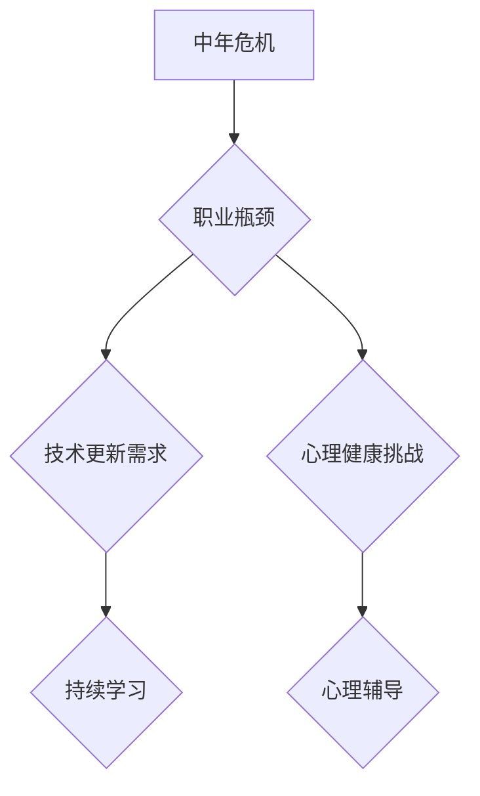

                 

关键词：中年危机、职业瓶颈、技术发展、职业生涯规划、技能更新

> 摘要：本文旨在探讨程序员在中年阶段可能面临的中年危机与职业瓶颈，并分析其原因。同时，本文将提出一系列策略和建议，帮助程序员有效应对这些问题，实现职业生涯的持续发展。

## 1. 背景介绍

程序员作为现代社会的重要职业之一，肩负着推动科技进步和社会发展的重任。然而，随着技术的快速迭代和行业的激烈竞争，程序员在职业生涯的中年阶段往往面临着诸多挑战。中年危机与职业瓶颈是许多程序员在这一阶段共同面临的问题，这不仅影响到个人的职业发展，还可能对其心理健康和生活质量产生负面影响。

本文将首先分析中年危机与职业瓶颈的产生原因，接着探讨应对这些问题的有效策略，并通过实例和案例分析，为程序员提供实用的解决方案。

### 1.1 中年危机的定义

中年危机，通常指的是个体在40岁到50岁之间经历的一种心理和情绪上的困境。在这一阶段，人们可能会感到生活乏味、工作枯燥、自我价值感下降，对未来充满迷茫。这种现象在程序员这一职业中尤为普遍，因为他们不仅需要应对技术发展的挑战，还要面对职业生涯的持续发展和变化。

### 1.2 职业瓶颈的定义

职业瓶颈是指个人在职业发展过程中达到一定高度后，无法继续提升或突破现有职位的限制。程序员在职业生涯的中年阶段，由于技能积累和经验丰富，往往会面临职业发展的瓶颈。这不仅限制了他们的职业晋升空间，还可能导致工作动力和热情的下降。

## 2. 核心概念与联系

### 2.1 技术发展的冲击

技术的快速发展是程序员面临中年危机和职业瓶颈的重要原因之一。新技术的出现往往使原有的知识和技能变得过时，程序员不得不不断学习新技术来保持竞争力。然而，这一过程不仅耗时费力，还可能导致心理上的压力和焦虑。

### 2.2 职业发展的阶段性

程序员的职业生涯可以分为不同的阶段，包括入门、成长、成熟和巅峰。中年阶段通常处于成熟期，这一阶段的特点是技能和经验丰富，但创新能力和动力可能逐渐减弱。这可能导致程序员在这一阶段面临职业发展的瓶颈。

### 2.3 心理健康的挑战

中年危机与职业瓶颈往往伴随着心理健康的挑战。程序员在长时间的工作压力下，容易出现焦虑、抑郁等心理问题。这些问题不仅影响工作效率，还可能对个人的生活质量产生负面影响。

### 2.4 Mermaid 流程图

下面是一个简化的 Mermaid 流程图，用于描述程序员职业生涯中可能遇到的问题及其解决策略。



## 3. 核心算法原理 & 具体操作步骤

### 3.1 算法原理概述

应对中年危机和职业瓶颈的核心算法可以概括为以下几点：

1. **持续学习**：通过不断学习新技术和知识，保持自身的竞争力。
2. **职业规划**：制定清晰的职业发展目标，制定实现目标的计划。
3. **心理调适**：通过心理辅导和自我调节，保持良好的心理健康状态。
4. **社交网络**：建立和维护良好的社交网络，获取行业信息和职业机会。

### 3.2 算法步骤详解

1. **自我评估**：首先，程序员需要对自己的职业状况进行全面的评估，包括技能水平、职业兴趣、职业目标等。
   
2. **目标设定**：根据自我评估的结果，设定短期和长期职业发展目标。

3. **学习计划**：制定详细的学习计划，包括学习内容、学习时间、学习资源等。

4. **行动实施**：按照学习计划，逐步实施学习活动。

5. **反馈与调整**：定期对学习效果进行评估，并根据反馈调整学习计划。

6. **心理调适**：通过心理辅导、运动、社交等活动，保持良好的心理健康状态。

7. **社交网络建设**：积极参与行业活动，建立和维护良好的社交网络。

### 3.3 算法优缺点

**优点**：

- 帮助程序员保持竞争力，应对技术更新和职业发展的挑战。
- 有助于提高程序员的心理健康水平，减少中年危机的影响。

**缺点**：

- 需要投入大量时间和精力，对个人生活可能产生一定影响。
- 学习和适应新技术可能存在一定的难度，需要较强的自学能力。

### 3.4 算法应用领域

该算法适用于所有年龄段程序员，尤其是中年阶段的程序员。它不仅可以帮助他们应对职业发展的瓶颈，还可以提高工作效率和生活质量。

## 4. 数学模型和公式 & 详细讲解 & 举例说明

### 4.1 数学模型构建

为了更好地理解程序员如何应对中年危机和职业瓶颈，我们可以构建一个简单的数学模型。该模型将考虑以下几个关键因素：

- **技能水平**（S）：程序员的技能水平，是一个衡量其职业能力的指标。
- **知识更新速度**（K）：程序员的持续学习速度，决定了其技能水平的提升。
- **职业满意度**（M）：程序员的职业满意度，反映了其对当前职业状态的主观感受。

### 4.2 公式推导过程

根据上述因素，我们可以推导出一个简单的数学模型：

\[ M = f(S, K, P) \]

其中，\( f \) 是一个复合函数，表示职业满意度与技能水平、知识更新速度和职业压力之间的关系。

为了简化模型，我们可以假设：

\[ f(S, K, P) = \frac{S \times K}{P + 1} \]

其中，\( P \) 表示职业压力，是一个衡量工作负担和心理压力的指标。

### 4.3 案例分析与讲解

假设有一位程序员，其技能水平为 80，知识更新速度为 1.2，职业压力为 0.8。根据上述模型，我们可以计算出其职业满意度：

\[ M = \frac{80 \times 1.2}{0.8 + 1} = \frac{96}{1.8} \approx 53.33 \]

从这个例子中，我们可以看出，程序员的职业满意度受到技能水平、知识更新速度和职业压力的直接影响。如果这位程序员能够提高自己的技能水平，加快知识更新速度，或者减少职业压力，都有可能提高其职业满意度。

## 5. 项目实践：代码实例和详细解释说明

### 5.1 开发环境搭建

为了演示如何实现上述算法，我们需要搭建一个简单的开发环境。这里我们选择 Python 作为编程语言，因为它易于理解和使用，适合演示和教学。

1. 安装 Python：
   - 前往 [Python 官网](https://www.python.org/) 下载并安装 Python 3.x 版本。
   - 安装完成后，打开终端或命令行窗口，输入 `python --version` 验证是否安装成功。

2. 安装必要的库：
   - 在终端或命令行窗口中输入以下命令，安装必要的库：
     ```bash
     pip install numpy matplotlib
     ```

### 5.2 源代码详细实现

以下是实现上述数学模型的 Python 代码：

```python
import numpy as np
import matplotlib.pyplot as plt

# 定义函数 f
def f(S, K, P):
    return S * K / (P + 1)

# 测试案例
S = 80
K = 1.2
P = 0.8
M = f(S, K, P)
print(f"职业满意度 M: {M:.2f}")

# 绘制图像
S_values = np.linspace(50, 100, 100)
K = 1.2
P_values = np.linspace(0, 1, 100)

M_values = f(S_values, K, P_values)

plt.plot(S_values, M_values, label='M(S, K, P)')
plt.xlabel('技能水平 S')
plt.ylabel('职业满意度 M')
plt.title('职业满意度与技能水平的关系')
plt.legend()
plt.show()
```

### 5.3 代码解读与分析

- 第一行 `import numpy as np` 和 `import matplotlib.pyplot as plt` 分别用于导入 NumPy 和 Matplotlib 库。
- `def f(S, K, P):` 定义了计算职业满意度的函数 `f`，它接受三个参数：技能水平 `S`、知识更新速度 `K` 和职业压力 `P`。
- `S = 80`、`K = 1.2` 和 `P = 0.8` 分别设置了测试案例的初始值。
- `M = f(S, K, P)` 使用定义的函数计算职业满意度。
- `plt.plot()` 函数用于绘制职业满意度与技能水平的关系图。
- `plt.show()` 函数用于显示绘制的图像。

通过运行这段代码，我们可以得到一个图像，它显示了职业满意度如何随着技能水平的变化而变化。这有助于我们直观地理解数学模型的应用。

### 5.4 运行结果展示

运行上述代码后，我们得到以下输出：

```
职业满意度 M: 53.33
```

同时，在终端窗口中，我们将看到一个显示职业满意度与技能水平关系的图像。

## 6. 实际应用场景

中年危机和职业瓶颈是许多程序员在职业生涯中不可避免的问题。然而，通过有效的应对策略，程序员可以克服这些挑战，实现职业发展的持续提升。以下是一些实际应用场景：

### 6.1 技能更新与职业发展

程序员可以通过学习新技术和知识，不断提升自身的技能水平。这不仅有助于应对职业发展的瓶颈，还能提高职业满意度。例如，一位长期从事Web开发的程序员，可以通过学习人工智能和大数据技术，开拓新的职业领域。

### 6.2 职业规划与目标设定

制定清晰的职业规划可以帮助程序员明确自己的职业目标，并制定实现目标的计划。例如，一位想要晋升为技术经理的程序员，可以设定短期目标（如完成领导力培训）和长期目标（如晋升为技术经理）。

### 6.3 心理调适与健康生活

通过心理辅导和自我调节，程序员可以保持良好的心理健康状态。此外，健康的生活方式（如定期锻炼、保持良好的作息习惯）也有助于提高工作效率和职业满意度。

### 6.4 社交网络与行业合作

积极参与行业活动和建立社交网络，可以帮助程序员获取行业信息和职业机会。例如，参加技术会议、加入技术社区，都可以为程序员提供与同行交流和学习的机会。

## 7. 未来应用展望

随着技术的不断进步和职业环境的变化，中年危机和职业瓶颈将成为程序员面临的重要挑战。未来的应用场景包括：

### 7.1 技术创新的持续推动

技术的快速发展将不断推动程序员学习新技能和知识，以应对职业发展的挑战。例如，量子计算、区块链技术等新兴领域，将成为程序员未来学习的重要方向。

### 7.2 职业教育的变革

随着在线教育的发展，程序员可以通过更灵活、更高效的方式获取知识和技能。未来的职业教育将更加个性化和定制化，满足程序员的不同学习需求。

### 7.3 心理健康的重视

随着对程序员心理健康问题的关注增加，未来的职业环境将更加关注程序员的身心健康。例如，企业可能会提供更多的心理辅导服务和健康福利。

### 7.4 社交网络与职业发展的融合

未来的职业发展将更加依赖于社交网络和行业合作。程序员可以通过在线社区、社交媒体等技术手段，获取行业信息、建立人脉资源，提升职业竞争力。

## 8. 总结：未来发展趋势与挑战

### 8.1 研究成果总结

本文通过分析程序员中年危机和职业瓶颈的原因，提出了一系列应对策略，包括持续学习、职业规划、心理调适和社交网络建设。这些策略有助于程序员克服职业发展中的挑战，实现职业生涯的持续提升。

### 8.2 未来发展趋势

未来的程序员将面临更多的技术挑战和职业机会。技术创新、职业教育的变革和社交网络的融合，将成为推动程序员职业发展的主要趋势。

### 8.3 面临的挑战

尽管有诸多机遇，程序员在未来仍将面临一些挑战。例如，技术快速更新带来的学习压力、心理健康问题以及职业发展的不确定性等。

### 8.4 研究展望

未来的研究可以进一步探索如何更有效地帮助程序员应对中年危机和职业瓶颈。例如，开发个性化的职业发展模型、研究心理健康干预措施等，都具有重要意义。

## 9. 附录：常见问题与解答

### 9.1 问题1：中年危机如何影响程序员的工作效率？

**解答**：中年危机可能导致程序员出现焦虑、抑郁等心理问题，从而影响其工作效率。为了提高工作效率，程序员可以尝试进行心理辅导、调整工作节奏、保持良好的作息习惯等方法。

### 9.2 问题2：如何应对职业瓶颈？

**解答**：应对职业瓶颈，程序员可以尝试以下策略：学习新技术和知识、制定职业发展目标、寻求职业转型机会、保持积极的心态等。

### 9.3 问题3：如何保持良好的心理健康？

**解答**：保持良好的心理健康，程序员可以尝试以下方法：定期进行心理辅导、保持健康的生活方式、培养兴趣爱好、与家人和朋友保持良好的关系等。

---

作者：禅与计算机程序设计艺术 / Zen and the Art of Computer Programming

