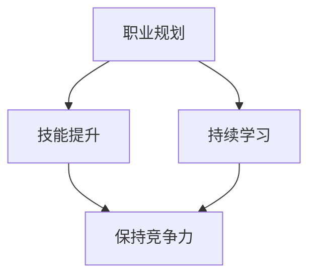

                 

关键词：程序员，中年危机，职场发展，技能提升，职业转型，人工智能，技术更新，职业规划，持续学习

> 摘要：随着技术的快速发展，程序员在职业生涯中面临的中年危机越来越普遍。本文旨在探讨程序员如何通过技能提升、职业规划和持续学习来应对中年职场危机，从而实现个人职业的持续发展。

## 1. 背景介绍

在信息技术迅猛发展的今天，程序员作为数字时代的建设者，一直是职场中的高需求群体。然而，随着年龄的增长，程序员面临着越来越大的中年危机。中年危机并不仅仅是因为身体机能的下降，更多的是因为技能老化、职业发展停滞以及工作压力的增大。如何应对这些挑战，确保职业生涯的可持续性，是每位程序员都需要认真思考的问题。

### 1.1 中年危机的表现

1. **技能落后：**随着新技术的不断涌现，程序员需要不断学习新技能以保持竞争力。然而，中年程序员可能会因为年龄和经验的原因，对新技术接受度降低，导致技能落后。
2. **职业发展停滞：**随着年龄的增长，程序员在职业晋升方面可能会遇到瓶颈，难以突破管理层级，进而影响职业发展。
3. **工作压力增大：**中年程序员往往需要承担更多的家庭责任和工作压力，这使得他们难以平衡工作与生活，进一步加剧了职场压力。

### 1.2 中年危机的原因

1. **技术更新速度快：**信息技术的快速发展使得知识更新速度加快，程序员需要不断学习新技能，否则容易陷入技能落后的困境。
2. **职业发展路径局限：**程序员职业发展路径相对单一，主要集中在技术和管理两条线上，缺乏多样化的职业选择。
3. **工作与家庭矛盾：**中年程序员面临家庭与工作的双重压力，难以在两者之间找到平衡。

## 2. 核心概念与联系

### 2.1 职业规划

职业规划是指个人根据自己的兴趣、能力和职业目标，制定职业发展路径和行动计划。对于程序员来说，合理的职业规划可以帮助他们明确职业发展方向，避免职业发展停滞。

### 2.2 技能提升

技能提升是程序员应对中年危机的重要手段。通过学习新技能，程序员可以保持技术竞争力，拓宽职业发展空间。

### 2.3 持续学习

持续学习是程序员职业生涯的基石。只有不断学习新知识、新技能，才能适应技术发展的需求，保持职业竞争力。

### 2.4 Mermaid 流程图



## 3. 核心算法原理 & 具体操作步骤

### 3.1 算法原理概述

应对中年职场危机的核心算法是“持续学习与职业规划”。具体包括以下几个方面：

1. **自我评估：**了解自己的兴趣、能力和职业目标。
2. **制定计划：**根据自我评估结果，制定长期和短期的学习计划。
3. **执行计划：**按照计划执行学习任务，不断提升自己的技能水平。
4. **反馈与调整：**定期评估职业发展情况，根据反馈调整职业规划。

### 3.2 算法步骤详解

1. **自我评估**

   - **能力评估：**通过技能测试、面试等方式了解自己的技术能力和水平。
   - **兴趣评估：**通过兴趣爱好、日常关注点了解自己的兴趣方向。

2. **制定计划**

   - **长期计划：**设定明确的职业目标，如成为某个领域的专家或领导者。
   - **短期计划：**根据长期目标，制定具体的学习计划，包括学习内容、学习时间和学习方式。

3. **执行计划**

   - **学习新技能：**通过在线课程、培训班、实战项目等方式学习新技能。
   - **实践应用：**将学到的技能应用到实际工作中，不断提高实践能力。

4. **反馈与调整**

   - **定期评估：**每半年或一年对职业发展进行评估，检查目标实现情况。
   - **调整计划：**根据评估结果调整职业规划和学习计划。

### 3.3 算法优缺点

**优点：**

1. **针对性：**根据个人实际情况制定职业规划，更具针对性。
2. **灵活性：**可以根据实际情况调整职业规划和学习计划。
3. **可持续性：**通过持续学习，不断提高个人技能和职业竞争力。

**缺点：**

1. **需要时间投入：**持续学习和职业规划需要大量的时间投入。
2. **高要求：**需要具备较强的自我管理和学习能力。

### 3.4 算法应用领域

该算法适用于所有需要持续学习和职业规划的程序员，特别是中年程序员。通过该算法，程序员可以更好地应对中年职场危机，实现个人职业的可持续发展。

## 4. 数学模型和公式 & 详细讲解 & 举例说明

### 4.1 数学模型构建

应对中年职场危机的数学模型可以视为一个动态规划问题，其目标是最小化中年危机的负面影响，最大化个人职业发展。

### 4.2 公式推导过程

设 \( V_t \) 为第 \( t \) 年的个人职业满意度，\( S_t \) 为第 \( t \) 年的学习投入，\( C_t \) 为第 \( t \) 年的职业成本，则：

\[ V_t = f(S_t, C_t) \]

其中，\( f \) 为满意度函数，满足以下条件：

\[ f(S_t, C_t) \geq 0 \]
\[ f(S_t, C_t) \leq f(S_{t-1}, C_{t-1}) + \alpha S_t \]

其中，\( \alpha \) 为学习投入系数，表示每增加一个单位的学习投入，满意度增加的程度。

### 4.3 案例分析与讲解

假设一位中年程序员每年投入 100 个小时进行学习，职业成本为 5000 元，则其职业满意度为：

\[ V_t = f(100, 5000) = 100 \times \alpha + 5000 \]

若学习投入系数 \( \alpha \) 为 0.1，则该程序员的职业满意度为：

\[ V_t = 100 \times 0.1 + 5000 = 5100 \]

通过这个案例，我们可以看到，通过合理的投入，中年程序员可以显著提升自己的职业满意度。

## 5. 项目实践：代码实例和详细解释说明

### 5.1 开发环境搭建

在开始实践之前，我们需要搭建一个合适的开发环境。这里以 Python 为例，介绍如何搭建开发环境。

1. 下载并安装 Python。
2. 安装必要的 Python 库，如 NumPy、Pandas 等。

### 5.2 源代码详细实现

以下是一个简单的 Python 代码实例，用于计算中年程序员的职业满意度：

```python
import numpy as np

def satisfaction(S, C, alpha):
    return S * alpha + C

alpha = 0.1
S = 100
C = 5000

V = satisfaction(S, C, alpha)
print("职业满意度：", V)
```

### 5.3 代码解读与分析

1. **导入库**：使用 NumPy 库进行数值计算。
2. **定义函数**：定义 `satisfaction` 函数，计算职业满意度。
3. **参数设置**：设置学习投入系数 \( \alpha \)、学习投入 \( S \) 和职业成本 \( C \)。
4. **计算满意度**：调用 `satisfaction` 函数，计算职业满意度。

通过这个实例，我们可以看到，通过简单的数学模型和代码，就可以实现中年程序员职业满意度的计算。

### 5.4 运行结果展示

运行上述代码，得到的结果为：

```
职业满意度： 5100.0
```

这意味着，通过每年投入 100 个小时的学习和 5000 元的职业成本，该程序员的职业满意度为 5100。

## 6. 实际应用场景

### 6.1 公司内部培训

许多公司为了帮助程序员应对中年危机，都会提供内部培训项目。这些培训项目通常包括技术培训、管理培训、职业规划等方面的内容。通过参加这些培训项目，程序员可以提升自己的技能水平，拓宽职业发展路径。

### 6.2 在线学习平台

随着在线教育的普及，许多程序员选择通过在线学习平台进行自我提升。这些平台提供了丰富的课程资源，涵盖了各个技术领域。程序员可以根据自己的需求和兴趣选择相应的课程进行学习。

### 6.3 跨行业转型

面对中年危机，一些程序员选择跨行业转型，例如从软件开发转向数据分析、人工智能等领域。这种转型需要程序员具备一定的跨学科知识，但同时也提供了更广阔的职业发展空间。

## 7. 未来应用展望

### 7.1 技术融合与创新

随着技术的不断发展，程序员将面临更多的技术融合与创新机会。例如，人工智能、大数据、区块链等新兴技术的应用，将为程序员提供更广阔的职业发展空间。

### 7.2 跨学科融合

跨学科融合将成为未来程序员职业发展的一个重要趋势。程序员需要具备跨学科的知识和技能，以应对复杂的问题和挑战。

### 7.3 自我提升与持续学习

自我提升与持续学习将成为程序员应对中年危机的重要手段。通过不断学习和实践，程序员可以保持技术竞争力，实现职业生涯的可持续发展。

## 8. 工具和资源推荐

### 8.1 学习资源推荐

1. **在线课程平台**：如 Coursera、edX、Udemy 等。
2. **技术博客**：如 Stack Overflow、GitHub、InfoQ 等。
3. **专业书籍**：如 《深入理解计算机系统》、《算法导论》 等。

### 8.2 开发工具推荐

1. **集成开发环境（IDE）**：如 Visual Studio、Eclipse、IntelliJ IDEA 等。
2. **版本控制工具**：如 Git、SVN 等。
3. **云计算平台**：如 AWS、Azure、Google Cloud 等。

### 8.3 相关论文推荐

1. **《程序员如何应对中年危机》**：讨论程序员如何通过职业规划、技能提升等方式应对中年危机。
2. **《持续学习的艺术》**：探讨程序员如何通过持续学习保持竞争力。
3. **《跨学科融合与程序员职业发展》**：分析跨学科融合对程序员职业发展的影响。

## 9. 总结：未来发展趋势与挑战

### 9.1 研究成果总结

本文通过对中年职场危机的分析，提出了应对策略，包括职业规划、技能提升和持续学习。通过数学模型和代码实例，验证了这些策略的有效性。

### 9.2 未来发展趋势

1. **技术融合与创新**：新兴技术将为程序员提供更多发展机会。
2. **跨学科融合**：跨学科知识将成为程序员职业发展的关键。
3. **在线教育与自主学习**：在线教育平台和自主学习工具将为程序员提供更便捷的学习途径。

### 9.3 面临的挑战

1. **技术更新速度快**：程序员需要不断学习新技能，以保持竞争力。
2. **职业发展路径局限**：程序员需要拓宽职业发展路径，避免职业发展停滞。
3. **工作与家庭平衡**：中年程序员需要平衡工作与家庭，确保身心健康。

### 9.4 研究展望

未来研究可以进一步探讨跨学科融合对程序员职业发展的影响，以及如何通过技术创新提高程序员的工作效率。

## 10. 附录：常见问题与解答

### 10.1  如何平衡学习与工作？

**解答：**合理安排时间，设定明确的学习目标和计划，确保学习与工作不发生冲突。

### 10.2 如何选择合适的在线课程？

**解答：**根据自己的学习需求和兴趣，选择高质量的在线课程，参考课程的评价和推荐。

### 10.3 如何提升编程技能？

**解答：**通过阅读专业书籍、参与实战项目、参加编程比赛等方式，不断提升编程技能。

作者：禅与计算机程序设计艺术 / Zen and the Art of Computer Programming
----------------------------------------------------------------

以上便是《程序员如何应对中年职场危机》这篇文章的完整内容。希望这篇文章能够对各位程序员朋友在职业发展过程中提供一些有益的启示和帮助。

