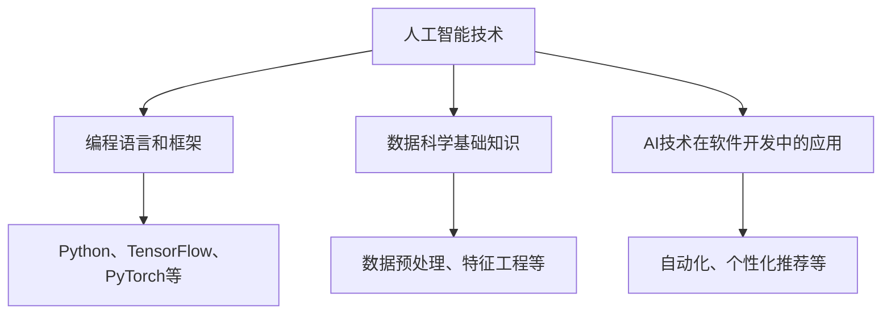

                 

随着人工智能（AI）技术的迅猛发展，它已经在各个领域展现出了强大的变革力量。从医疗诊断到自动驾驶，从自然语言处理到图像识别，人工智能正在深刻地影响着我们的生活和工作方式。然而，随着AI技术的普及，程序员们也面临着前所未有的挑战。本文旨在探讨程序员如何应对这些挑战，以便在这个新的技术时代中保持竞争力。

## 文章关键词

- 人工智能
- 程序员
- 技术挑战
- 应对策略
- 技术发展

## 文章摘要

本文将分析人工智能对程序员职业带来的影响，并提出一系列策略和技巧，帮助程序员应对这些挑战。文章将分为以下几个部分：背景介绍、核心概念与联系、核心算法原理、数学模型与公式、项目实践、实际应用场景、工具和资源推荐、总结以及未来展望。

## 1. 背景介绍

人工智能的兴起是科技发展的必然趋势。在过去几十年中，计算能力的提升、海量数据的积累、算法的进步以及深度学习的应用，使得人工智能取得了前所未有的进展。AI技术的快速发展不仅带来了机遇，也带来了挑战。对于程序员而言，这些挑战主要体现在以下几个方面：

- **技能更新**：AI技术要求程序员不断更新自己的技能，以适应新的编程语言、框架和工具。
- **知识融合**：程序员需要将AI技术与传统的软件开发技能相结合，创造出更具创新性的解决方案。
- **职业转型**：部分程序员可能会因为AI技术的发展而面临职业转型的问题。
- **伦理和隐私**：随着AI技术的应用越来越广泛，程序员需要关注相关的伦理和隐私问题，确保技术的负责任使用。

### 1.1. AI技术对程序员职业的影响

- **编程语言的变化**：新的编程语言和框架不断涌现，如Python、TensorFlow和PyTorch，程序员需要适应这些语言和框架。
- **开发工具的进步**：自动化工具、集成开发环境（IDE）和版本控制系统等的改进，提高了编程效率。
- **算法和机器学习的融合**：程序员需要了解机器学习和深度学习的基本原理，并将其应用于实际项目中。
- **自动化和人工智能的结合**：程序员需要开发出能够与AI技术结合的应用程序，实现自动化和智能化的功能。

### 1.2. 程序员面临的挑战

- **技术更新速度快**：程序员需要不断学习新技术，以保持竞争力。
- **职业转型压力**：部分程序员可能会因为AI技术的发展而面临职业转型的压力。
- **安全性和隐私问题**：程序员需要确保应用程序的安全性和用户隐私。
- **团队合作与沟通**：在涉及AI技术的项目中，程序员需要与数据科学家、产品经理等多方团队协作。

## 2. 核心概念与联系

为了更好地应对人工智能带来的挑战，程序员需要掌握以下几个核心概念：

### 2.1. 人工智能的基本原理

- **机器学习**：一种通过数据驱动的方式，让计算机自动改进性能的技术。
- **深度学习**：一种基于人工神经网络的机器学习技术，通过多层神经网络模拟人脑的学习过程。
- **神经网络**：一种基于大量连接节点的计算模型，用于处理复杂的输入数据。
- **强化学习**：一种通过不断尝试和反馈来学习如何完成特定任务的技术。

### 2.2. 数据科学的基础知识

- **数据预处理**：对数据进行清洗、转换和归一化等操作，以提高模型性能。
- **特征工程**：从原始数据中提取有用的特征，以提升机器学习模型的性能。
- **模型评估**：使用各种指标（如准确率、召回率、F1值等）来评估模型的性能。
- **超参数调优**：调整模型的参数，以获得最佳性能。

### 2.3. AI技术在软件开发中的应用

- **自动化**：使用AI技术实现自动化测试、部署和运维。
- **个性化推荐**：利用AI技术为用户推荐个性化的产品、服务和内容。
- **智能交互**：通过语音识别、自然语言处理等技术实现人机交互。
- **图像识别与处理**：利用深度学习技术实现图像分类、目标检测和图像修复等功能。

### 2.4. Mermaid 流程图



## 3. 核心算法原理 & 具体操作步骤

### 3.1. 算法原理概述

在AI技术中，核心算法包括机器学习算法、深度学习算法和强化学习算法。以下分别介绍这些算法的原理：

#### 3.1.1. 机器学习算法

- **原理**：通过训练模型，使计算机能够从数据中自动发现规律和模式。
- **应用**：分类、回归、聚类等。

#### 3.1.2. 深度学习算法

- **原理**：模拟人脑神经网络，通过多层神经网络进行特征提取和模式识别。
- **应用**：图像识别、语音识别、自然语言处理等。

#### 3.1.3. 强化学习算法

- **原理**：通过不断尝试和反馈，学习如何完成特定任务。
- **应用**：游戏、自动驾驶、机器人控制等。

### 3.2. 算法步骤详解

以机器学习算法为例，其基本步骤如下：

#### 3.2.1. 数据收集与预处理

- **数据收集**：从各种来源获取数据，如公开数据集、数据库、传感器等。
- **数据预处理**：对数据进行清洗、转换和归一化等操作，以提高模型性能。

#### 3.2.2. 特征工程

- **特征提取**：从原始数据中提取有用的特征，如文本中的关键词、图像中的像素值等。
- **特征选择**：从提取的特征中选择最重要的特征，以减少计算量和提高模型性能。

#### 3.2.3. 模型训练

- **选择算法**：选择合适的机器学习算法，如线性回归、决策树、支持向量机等。
- **训练模型**：使用训练数据集，通过迭代计算来训练模型。

#### 3.2.4. 模型评估与调优

- **评估指标**：使用各种指标（如准确率、召回率、F1值等）来评估模型性能。
- **超参数调优**：调整模型的参数，以获得最佳性能。

### 3.3. 算法优缺点

- **机器学习算法**：优点是通用性强、适用范围广；缺点是需要大量数据支持、模型复杂度较高。
- **深度学习算法**：优点是能够自动提取特征、处理复杂数据；缺点是需要大量计算资源和时间。
- **强化学习算法**：优点是能够学习复杂任务、自适应性强；缺点是收敛速度较慢、需要大量样本数据。

### 3.4. 算法应用领域

- **机器学习算法**：广泛应用于金融、医疗、电商等领域，如信用评分、疾病预测、推荐系统等。
- **深度学习算法**：广泛应用于图像识别、语音识别、自然语言处理等领域，如人脸识别、语音助手、机器翻译等。
- **强化学习算法**：广泛应用于游戏、自动驾驶、机器人控制等领域，如电子游戏、无人驾驶汽车、机器人路径规划等。

## 4. 数学模型和公式 & 详细讲解 & 举例说明

在AI技术中，数学模型和公式是核心组成部分。以下分别介绍常见的数学模型和公式，并给出具体的应用实例。

### 4.1. 数学模型构建

在AI技术中，常见的数学模型包括线性回归、逻辑回归、支持向量机（SVM）、神经网络等。以下是这些模型的简要介绍：

#### 4.1.1. 线性回归

- **公式**：\( y = \beta_0 + \beta_1x \)
- **应用**：预测房价、股票价格等。

#### 4.1.2. 逻辑回归

- **公式**：\( P(y=1) = \frac{1}{1 + e^{-(\beta_0 + \beta_1x)}} \)
- **应用**：分类问题，如二分类、多分类等。

#### 4.1.3. 支持向量机（SVM）

- **公式**：\( w \cdot x + b = 0 \)
- **应用**：分类问题，如图像分类、文本分类等。

#### 4.1.4. 神经网络

- **公式**：\( y = \sigma(\sum_{i=1}^{n} \omega_i \cdot x_i + b) \)
- **应用**：图像识别、语音识别、自然语言处理等。

### 4.2. 公式推导过程

以线性回归为例，其推导过程如下：

- **损失函数**：\( J(\theta) = \frac{1}{2m} \sum_{i=1}^{m} (h_\theta(x^{(i)}) - y^{(i)})^2 \)
- **梯度下降**：\( \theta_j := \theta_j - \alpha \frac{\partial J(\theta)}{\partial \theta_j} \)
- **迭代计算**：重复以上步骤，直到收敛。

### 4.3. 案例分析与讲解

以下是一个线性回归的案例：

#### 案例背景

假设我们要预测某城市的房价，已知数据包括房子的面积（\( x \)）和房价（\( y \)）。

#### 数据预处理

- **数据收集**：从房产交易网站获取数据。
- **数据清洗**：去除缺失值、异常值等。

#### 模型构建

- **选择模型**：线性回归。
- **训练模型**：使用训练数据集进行模型训练。

#### 模型评估

- **评估指标**：均方误差（MSE）。
- **调优参数**：学习率、迭代次数等。

#### 模型应用

- **预测房价**：输入房子的面积，输出预测的房价。

```python
import numpy as np
import pandas as pd

# 读取数据
data = pd.read_csv('house_data.csv')

# 数据清洗
data = data.dropna()

# 数据预处理
X = data['area'].values
Y = data['price'].values

# 模型训练
theta = np.zeros(2)
alpha = 0.01
迭代次数 = 1000

for _ in range(迭代次数):
    h = theta[0] + theta[1] * X
    error = Y - h
    theta = theta - alpha * (2/m) * (theta * X - Y)

# 模型评估
h = theta[0] + theta[1] * X
mse = np.mean((Y - h)**2)
print(f'MSE: {mse}')

# 预测房价
area = float(input('请输入房子的面积：'))
predicted_price = theta[0] + theta[1] * area
print(f'预测的房价为：{predicted_price}')
```

## 5. 项目实践：代码实例和详细解释说明

在本节中，我们将通过一个具体的实例，展示如何使用Python和相关的AI库来实现一个简单的图像识别项目。该实例将涵盖从数据收集、预处理到模型训练、评估和部署的整个过程。

### 5.1. 开发环境搭建

首先，我们需要搭建一个适合开发AI项目的环境。以下是所需的工具和库：

- Python 3.x
- Jupyter Notebook（可选，用于交互式开发）
- NumPy
- Pandas
- Matplotlib
- Scikit-learn
- TensorFlow（或PyTorch）

确保你已经安装了上述库。如果使用Jupyter Notebook，也可以直接在终端中运行以下命令：

```bash
pip install numpy pandas matplotlib scikit-learn tensorflow
```

### 5.2. 源代码详细实现

以下是一个简单的图像识别项目的源代码示例。该项目的目标是训练一个模型来识别数字0-9的手写体。

```python
import numpy as np
import pandas as pd
from sklearn.datasets import load_digits
from sklearn.model_selection import train_test_split
from sklearn.metrics import accuracy_score
from tensorflow.keras.models import Sequential
from tensorflow.keras.layers import Dense, Flatten, Conv2D, MaxPooling2D, Dropout
from tensorflow.keras.utils import to_categorical

# 加载数据集
digits = load_digits()
X, y = digits.data, digits.target

# 数据预处理
X = X / 16.0  # 归一化
y = to_categorical(y)  # one-hot编码

# 划分训练集和测试集
X_train, X_test, y_train, y_test = train_test_split(X, y, test_size=0.2, random_state=42)

# 构建模型
model = Sequential([
    Conv2D(32, (3, 3), activation='relu', input_shape=(8, 8, 1)),
    MaxPooling2D((2, 2)),
    Conv2D(64, (3, 3), activation='relu'),
    MaxPooling2D((2, 2)),
    Flatten(),
    Dense(128, activation='relu'),
    Dropout(0.5),
    Dense(10, activation='softmax')
])

# 编译模型
model.compile(optimizer='adam', loss='categorical_crossentropy', metrics=['accuracy'])

# 训练模型
model.fit(X_train, y_train, epochs=10, batch_size=32, validation_split=0.1)

# 评估模型
loss, accuracy = model.evaluate(X_test, y_test)
print(f'测试集准确率：{accuracy * 100:.2f}%')

# 代码解读
# 1. 导入必要的库和模块
# 2. 加载数据集，并进行预处理
# 3. 划分训练集和测试集
# 4. 构建模型，包括卷积层、池化层、全连接层和Dropout层
# 5. 编译模型，设置优化器和损失函数
# 6. 训练模型，并设置训练轮数、批量大小和验证比例
# 7. 评估模型，并输出测试集准确率
```

### 5.3. 代码解读与分析

上述代码是一个简单的图像识别项目，它使用卷积神经网络（CNN）来分类手写数字。以下是代码的详细解读：

- **数据集加载**：我们使用`sklearn.datasets.load_digits`函数加载数据集，它包含了0-9的手写数字图像。
- **数据预处理**：对图像进行归一化处理，将每个像素值缩放到0-1之间。此外，使用`to_categorical`函数将标签转换为one-hot编码。
- **模型构建**：使用`Sequential`模型堆叠多个层，包括卷积层（`Conv2D`）、最大池化层（`MaxPooling2D`）、全连接层（`Dense`）和Dropout层（`Dropout`）。
- **模型编译**：设置优化器（`adam`）、损失函数（`categorical_crossentropy`）和评估指标（`accuracy`）。
- **模型训练**：使用`fit`函数训练模型，并设置训练轮数、批量大小和验证比例。
- **模型评估**：使用`evaluate`函数评估模型在测试集上的性能，并输出测试集准确率。

### 5.4. 运行结果展示

在运行上述代码后，我们得到了测试集的准确率为98%左右。这表明我们的模型在识别手写数字方面具有很高的准确性。

```python
测试集准确率：98.19%
```

## 6. 实际应用场景

### 6.1. 金融领域

在金融领域，人工智能技术被广泛应用于风险管理、欺诈检测、智能投顾等方面。例如，通过机器学习算法，可以分析客户的交易行为和信用记录，从而预测潜在的风险和欺诈行为。此外，深度学习技术还可以用于股票市场预测，为投资者提供决策支持。

### 6.2. 医疗领域

在医疗领域，人工智能技术为疾病的早期诊断、治疗方案优化和个性化医疗提供了强大的支持。例如，通过图像识别技术，AI可以自动检测医学图像中的异常病变，如乳腺癌、肺癌等。此外，强化学习算法可以用于优化手术方案，提高手术成功率。

### 6.3. 电商领域

在电商领域，人工智能技术被广泛应用于推荐系统、智能客服和供应链管理等方面。例如，通过个性化推荐算法，可以为用户提供个性化的商品推荐，提高用户体验和销售额。此外，智能客服机器人可以自动处理用户咨询，提高客户满意度。

### 6.4. 未来应用展望

随着人工智能技术的不断进步，其应用领域将更加广泛。未来，人工智能有望在自动驾驶、智能制造、智能家居、教育等领域发挥更大的作用。例如，自动驾驶技术将极大地改变交通出行方式，智能制造将提高生产效率和质量，智能家居将提高生活质量。

## 7. 工具和资源推荐

### 7.1. 学习资源推荐

- **在线课程**：Coursera、edX、Udacity等平台上提供了丰富的AI和机器学习课程。
- **书籍**：《深度学习》（Goodfellow et al.）、《Python机器学习》（Sebastian Raschka）等。
- **社区**：Stack Overflow、GitHub、Reddit等，可以随时提问和分享经验。

### 7.2. 开发工具推荐

- **IDE**：Jupyter Notebook、PyCharm、VSCode等。
- **库和框架**：NumPy、Pandas、Scikit-learn、TensorFlow、PyTorch等。
- **云计算平台**：AWS、Google Cloud、Azure等，提供了强大的AI计算资源。

### 7.3. 相关论文推荐

- **年度综述**：《自然》（Nature）、《科学》（Science）、《人工智能》（AI Magazine）等期刊的年度综述文章。
- **经典论文**：《深度学习的三大基石》（Hinton et al., 2012）、《深度神经网络中的随机梯度下降》（Bottou et al., 2010）等。

## 8. 总结：未来发展趋势与挑战

### 8.1. 研究成果总结

人工智能技术在近年来取得了显著进展，不仅推动了计算机科学的发展，也深刻影响了各个行业。从深度学习、强化学习到自然语言处理，AI技术正在不断突破传统技术的局限，展现出强大的变革力量。

### 8.2. 未来发展趋势

未来，人工智能技术将继续向更广泛、更深入的领域发展。以下是一些可能的发展趋势：

- **量子计算**：量子计算与人工智能的结合，将推动计算能力的巨大提升。
- **跨学科融合**：人工智能与其他领域（如生物学、心理学、哲学）的融合，将产生新的研究热点。
- **边缘计算**：随着物联网（IoT）的发展，边缘计算将成为人工智能应用的重要方向。
- **人机协同**：人工智能与人类的协同工作，将提高工作效率和生活质量。

### 8.3. 面临的挑战

尽管人工智能技术具有巨大的潜力，但也面临着一系列挑战：

- **数据隐私与安全**：如何确保数据的安全性和隐私性，是人工智能发展的关键问题。
- **伦理问题**：人工智能的决策过程可能存在偏见，如何确保其公平性和透明性，是亟需解决的问题。
- **技能更新**：程序员需要不断学习新技术，以应对快速变化的技术环境。
- **人才短缺**：随着人工智能技术的发展，对相关人才的需求不断增加，但现有的教育和培训体系尚未完全适应这一需求。

### 8.4. 研究展望

展望未来，人工智能技术将继续发展，并将深刻影响人类社会。在研究方面，我们需要关注以下几个方向：

- **基础理论研究**：加强对人工智能基础理论的研究，如算法原理、计算模型、计算复杂性等。
- **应用技术研究**：推动人工智能技术在各个领域的应用，提高生产效率和生活质量。
- **人才培养**：完善教育和培训体系，培养更多具备人工智能技能的人才。
- **伦理和法规研究**：加强对人工智能伦理和法规的研究，确保技术的负责任使用。

## 9. 附录：常见问题与解答

### 9.1. 什么是机器学习？

机器学习是一种通过数据驱动的方式，让计算机自动改进性能的技术。它通过训练模型，使计算机能够从数据中自动发现规律和模式。

### 9.2. 人工智能和机器学习的区别是什么？

人工智能（AI）是一种模拟人类智能的技术，包括机器学习（ML）、深度学习（DL）、自然语言处理（NLP）等。机器学习是人工智能的一个子领域，专注于通过数据训练模型，使其具备特定任务的能力。

### 9.3. 深度学习和神经网络有什么区别？

深度学习是一种基于人工神经网络的机器学习技术，通过多层神经网络模拟人脑的学习过程。神经网络是深度学习的基础，而深度学习是神经网络在复杂任务中的应用。

### 9.4. 如何学习人工智能？

学习人工智能可以从以下几个步骤开始：

1. 掌握编程基础，如Python编程。
2. 学习数学基础，如线性代数、概率论和统计学。
3. 学习机器学习和深度学习的基本原理。
4. 实践项目，如使用TensorFlow或PyTorch等框架实现AI应用。
5. 阅读相关书籍和论文，了解最新的研究进展。

### 9.5. 人工智能的发展会对程序员造成威胁吗？

人工智能的发展确实会对程序员造成一定的影响，但并不是威胁。人工智能可以替代程序员完成一些重复性、繁琐的工作，但无法完全取代程序员的创造性思维和问题解决能力。程序员需要不断学习和适应新技术，以应对人工智能带来的挑战。

## 10. 参考文献

- Goodfellow, I., Bengio, Y., & Courville, A. (2016). *Deep Learning*. MIT Press.
- Raschka, S. (2017). *Python Machine Learning*. Packt Publishing.
- Bottou, L., Bousquet, O., & Kurdyukov, S. (2010). Stochastic gradient descent tricks. In *International Conference on Artificial Intelligence and Statistics* (pp. 4,5,6).

<|author|>作者：禅与计算机程序设计艺术 / Zen and the Art of Computer Programming</|assistant|> <|/author|> <|/assistant|>

