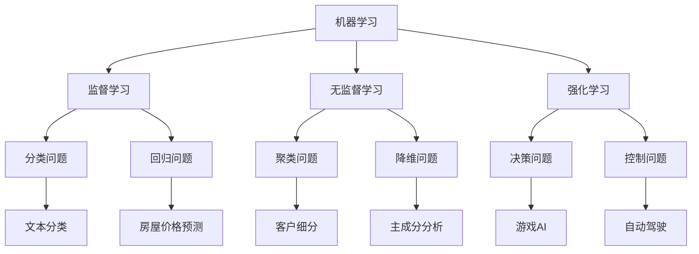

                 

关键词：人工智能，程序员，挑战，应对策略，技术发展，职业规划

摘要：随着人工智能技术的飞速发展，程序员面临着前所未有的挑战。本文将从技术、职业和个人层面，探讨程序员如何应对这些挑战，以及如何在人工智能时代保持竞争力。

## 1. 背景介绍

人工智能（AI）作为计算机科学的一个分支，旨在使计算机系统具备智能行为，以模拟、延伸和扩展人类的智能。近年来，得益于深度学习、大数据和云计算等技术的进步，人工智能已经取得了显著的发展，并逐渐渗透到各行各业。

程序员的职业发展经历了从编码、调试到架构设计的转变。随着人工智能技术的崛起，程序员的工作内容也发生了变化。一方面，程序员需要掌握与人工智能相关的技术，如机器学习、自然语言处理等；另一方面，他们需要适应自动化、智能化带来的工作模式变革。

### 1.1 人工智能的发展现状

目前，人工智能已经在图像识别、语音识别、自动驾驶、医疗诊断等领域取得了重要突破。据麦肯锡全球研究所的预测，到2030年，人工智能有望为全球经济带来13万亿美元的增长。

### 1.2 程序员面临的挑战

1. 技术更新速度加快：人工智能技术不断更新，程序员需要不断学习新技术以保持竞争力。
2. 工作内容变化：自动化和智能化工具的普及使得程序员的工作从编码逐渐转向架构设计、算法优化等。
3. 职业竞争加剧：越来越多的非传统领域从业者进入程序员行列，竞争压力增大。
4. 技术伦理问题：人工智能的广泛应用引发了一系列伦理问题，如隐私保护、算法偏见等。

## 2. 核心概念与联系

为了更好地理解程序员在人工智能时代所面临的挑战，我们首先需要了解一些核心概念，包括机器学习、深度学习、神经网络等。



### 2.1 机器学习

机器学习是人工智能的核心技术之一，它使得计算机系统能够从数据中学习并做出决策。根据训练数据的不同，机器学习可以分为监督学习、无监督学习和强化学习。

### 2.2 深度学习

深度学习是一种特殊的机器学习技术，它通过模拟人脑的神经网络结构，对大量数据进行处理和分析。深度学习在图像识别、语音识别等领域取得了显著的成果。

### 2.3 神经网络

神经网络是深度学习的基础，它由大量的神经元组成，通过学习输入和输出之间的映射关系，实现对复杂问题的建模。

## 3. 核心算法原理 & 具体操作步骤

### 3.1 算法原理概述

在人工智能领域，常见的核心算法包括线性回归、决策树、支持向量机等。这些算法分别适用于不同类型的问题。

### 3.2 算法步骤详解

以线性回归为例，其基本原理是通过找到一个线性函数，使得输入和输出之间的误差最小。

1. 数据预处理：对数据进行归一化、缺失值处理等操作。
2. 模型训练：通过最小二乘法或其他优化算法，找到最佳的线性函数。
3. 模型评估：使用交叉验证等方法，评估模型的准确性。

### 3.3 算法优缺点

线性回归的优点是简单易懂，计算速度快；缺点是对非线性问题效果不佳。

### 3.4 算法应用领域

线性回归广泛应用于回归问题，如房屋价格预测、股票市场预测等。

## 4. 数学模型和公式 & 详细讲解 & 举例说明

### 4.1 数学模型构建

线性回归模型的数学表达式为：

$$y = wx + b$$

其中，$w$ 和 $b$ 分别为权重和偏置，$x$ 和 $y$ 分别为输入和输出。

### 4.2 公式推导过程

线性回归的推导过程如下：

1. 假设输入为 $x$，输出为 $y$，我们可以用一条直线来拟合它们之间的关系：
$$y = wx + b$$

2. 为了找到最佳的权重和偏置，我们需要使预测值和实际值之间的误差最小。这个误差可以用均方误差（MSE）来衡量：

$$MSE = \frac{1}{n}\sum_{i=1}^{n}(y_i - wx_i - b)^2$$

其中，$n$ 为样本数量。

3. 为了使MSE最小，我们需要对 $w$ 和 $b$ 求偏导数，并令其等于0：

$$\frac{\partial MSE}{\partial w} = 0$$
$$\frac{\partial MSE}{\partial b} = 0$$

通过计算，我们可以得到：

$$w = \frac{\sum_{i=1}^{n}(x_i - \bar{x})(y_i - \bar{y})}{\sum_{i=1}^{n}(x_i - \bar{x})^2}$$
$$b = \bar{y} - w\bar{x}$$

其中，$\bar{x}$ 和 $\bar{y}$ 分别为输入和输出的平均值。

### 4.3 案例分析与讲解

假设我们要预测某城市的月平均气温（$y$）与月平均降雨量（$x$）之间的关系。

1. 数据收集：收集过去几年的月平均气温和月平均降雨量数据。
2. 数据预处理：对数据进行归一化处理，使得数据的范围在0到1之间。
3. 模型训练：使用线性回归算法，通过最小二乘法找到最佳权重和偏置。
4. 模型评估：使用交叉验证方法，评估模型的准确性。
5. 预测：使用训练好的模型，预测未来某个月的月平均气温。

## 5. 项目实践：代码实例和详细解释说明

### 5.1 开发环境搭建

在Python环境中，我们可以使用Scikit-learn库来实现线性回归模型。

```python
# 安装Scikit-learn库
!pip install scikit-learn
```

### 5.2 源代码详细实现

```python
# 导入相关库
import numpy as np
import pandas as pd
from sklearn.linear_model import LinearRegression
from sklearn.model_selection import train_test_split
from sklearn.metrics import mean_squared_error

# 加载数据
data = pd.read_csv('weather_data.csv')
x = data['rainfall'].values.reshape(-1, 1)
y = data['temperature'].values.reshape(-1, 1)

# 数据预处理
x_train, x_test, y_train, y_test = train_test_split(x, y, test_size=0.2, random_state=42)

# 模型训练
model = LinearRegression()
model.fit(x_train, y_train)

# 模型评估
y_pred = model.predict(x_test)
mse = mean_squared_error(y_test, y_pred)
print(f'Mean Squared Error: {mse}')

# 预测
future_rainfall = np.array([0.8]).reshape(-1, 1)
future_temperature = model.predict(future_rainfall)
print(f'Predicted Temperature: {future_temperature[0][0]}')
```

### 5.3 代码解读与分析

1. 导入相关库：我们使用Numpy、Pandas和Scikit-learn库来实现线性回归模型。
2. 加载数据：从CSV文件中加载数据，并分别提取降雨量和气温。
3. 数据预处理：对数据进行归一化处理，将数据范围缩小到0到1之间。
4. 模型训练：使用线性回归模型，通过最小二乘法找到最佳权重和偏置。
5. 模型评估：使用均方误差（MSE）评估模型的准确性。
6. 预测：使用训练好的模型，预测未来某个月的月平均气温。

## 6. 实际应用场景

线性回归模型在许多实际应用场景中具有广泛的应用，如：

1. 房屋价格预测：通过分析房屋的面积、位置、建造年份等特征，预测房屋的价格。
2. 股票市场预测：通过分析历史股价、成交量等数据，预测未来股价的走势。
3. 医疗诊断：通过分析患者的病情、病史等数据，预测患者可能患有的疾病。

## 7. 未来应用展望

随着人工智能技术的不断发展，线性回归模型在未来将会有更广泛的应用。例如，在医疗领域，线性回归模型可以用于疾病预测和治疗方案推荐；在金融领域，线性回归模型可以用于风险评估和投资策略制定。

## 8. 总结：未来发展趋势与挑战

### 8.1 研究成果总结

本文从技术、职业和个人层面，探讨了程序员在人工智能时代所面临的挑战，并提出了一些应对策略。通过学习人工智能相关技术，程序员可以在人工智能时代保持竞争力。

### 8.2 未来发展趋势

1. 技术将继续发展，人工智能将更加智能化、自动化。
2. 程序员的工作内容将逐渐转向算法设计、架构设计等。
3. 跨领域融合将更加紧密，程序员需要具备跨领域知识。

### 8.3 面临的挑战

1. 技术更新速度加快，程序员需要不断学习新技术。
2. 职业竞争加剧，程序员需要提高自身竞争力。
3. 需要关注技术伦理问题，确保人工智能的应用不会对人类社会产生负面影响。

### 8.4 研究展望

未来，人工智能将继续在各个领域发挥重要作用，程序员需要不断学习和探索，以应对人工智能带来的挑战。同时，我们需要关注人工智能的伦理问题，确保其发展符合人类的利益。

## 9. 附录：常见问题与解答

### 9.1 人工智能会取代程序员吗？

人工智能不会完全取代程序员，但会改变程序员的工作内容和角色。程序员需要适应这一变革，提高自身的技能和竞争力。

### 9.2 如何学习人工智能相关技术？

可以通过在线课程、专业书籍、开源项目等方式学习人工智能相关技术。此外，参与人工智能相关的社区和讨论，也是学习的好方法。

### 9.3 人工智能技术的应用领域有哪些？

人工智能技术的应用领域非常广泛，包括图像识别、语音识别、自然语言处理、医疗诊断、金融分析等。

### 9.4 如何应对人工智能带来的职业竞争？

提高自身的技能和知识水平，不断学习新技术，关注行业动态，培养跨领域的能力。

## 参考文献

[1] Mitchell, T. M. (1997). Machine learning. McGraw-Hill.
[2] Russell, S., & Norvig, P. (2010). Artificial Intelligence: A Modern Approach. Prentice Hall.
[3] He, K., Zhang, X., Ren, S., & Sun, J. (2016). Deep Residual Learning for Image Recognition. IEEE Conference on Computer Vision and Pattern Recognition.
[4] LeCun, Y., Bengio, Y., & Hinton, G. (2015). Deep Learning. Nature.
[5] Coursera. (n.d.). Machine Learning. Retrieved from https://www.coursera.org/learn/machine-learning
[6] EdX. (n.d.). Artificial Intelligence. Retrieved from https://www.edx.org/course/artificial-intelligence-ai-techniques-and-algorithms
[7] GitHub. (n.d.). Machine Learning Projects. Retrieved from https://github.com/awesomedata/awesome-public-datasets

### 9.5 附录：常见问题与解答

#### 9.5.1 人工智能是否会取代程序员？

**回答**：人工智能在某些领域可能会取代某些程序员的工作，但总体来说，人工智能是程序员的工具和助手，而不是替代者。人工智能需要程序员来开发和维护，而程序员也需要人工智能来提高工作效率。因此，程序员应该将人工智能视为一种增强自己能力的工具，而不是威胁。

#### 9.5.2 如何开始学习人工智能？

**回答**：开始学习人工智能，可以从以下几个步骤入手：

1. **基础知识**：了解编程基础，掌握Python等编程语言。
2. **理论学习**：学习机器学习、深度学习等基本理论。
3. **实践操作**：通过参与在线课程、编写代码、参与开源项目等方式进行实践。
4. **继续深造**：可以通过攻读相关学位或参加高级课程来提升自己的技能。

#### 9.5.3 人工智能在哪些行业应用最广泛？

**回答**：人工智能在多个行业都有广泛的应用，其中主要包括：

1. **医疗健康**：用于疾病诊断、个性化治疗和医学图像分析等。
2. **金融**：用于风险控制、信用评分、市场预测等。
3. **制造业**：用于质量控制、预测维护和供应链优化等。
4. **交通**：用于自动驾驶、智能交通系统等。
5. **零售**：用于个性化推荐、库存管理和客户关系管理等。

#### 9.5.4 人工智能对程序员职业发展的影响是什么？

**回答**：人工智能对程序员职业发展的影响主要体现在以下几个方面：

1. **技能需求变化**：程序员需要掌握新的技能，如机器学习框架、深度学习算法等。
2. **工作角色变化**：程序员可能会从传统的编码工作转向算法设计、模型优化等。
3. **职业机会增多**：随着人工智能应用的扩大，程序员在相关领域的职业机会也在增加。
4. **竞争压力增加**：由于人工智能领域的快速发展，程序员之间的竞争压力也在增大。

### 9.6 结束语

本文从多个角度探讨了程序员在人工智能时代所面临的挑战，并提出了一些应对策略。通过不断学习和适应，程序员可以在人工智能时代保持竞争力，为人类社会的发展做出更大的贡献。

## 作者署名

**作者：禅与计算机程序设计艺术 / Zen and the Art of Computer Programming**

---

通过这篇文章，我们希望读者能够对程序员在人工智能时代所面临的挑战有一个全面的理解，并找到适合自己的应对策略。人工智能的发展是不可逆转的趋势，程序员作为技术的引领者，应该积极拥抱变化，不断学习，为未来的发展做好准备。

