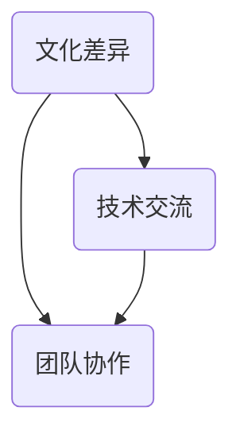

                 

关键词：全球化，本地化，程序员，文化差异，技术交流，国际协作，软件开发，跨地域团队管理

> 摘要：随着全球化进程的加速，程序员面临着日益增加的跨地域和国际协作需求。本文旨在探讨程序员如何在全球化和本地化的双重挑战下，提高工作效率，确保代码质量和项目成功。通过深入分析文化差异、技术交流和团队协作等方面的策略，本文为程序员提供了一些建议和最佳实践。

## 1. 背景介绍

### 全球化进程

全球化是指全球范围内的经济、政治、文化和社会等各个领域的相互联系和互动。随着信息技术的发展和全球贸易的繁荣，全球化进程不断加快。越来越多的企业和组织开始在全球范围内招募人才，建立跨国团队，开展国际项目。

### 本地化需求

本地化是指将产品、服务或内容根据特定地区的语言、文化、法规和技术环境进行调整，以满足当地用户的需求。随着互联网的普及和跨国企业的扩张，本地化成为提升用户体验、增强市场竞争力的重要手段。

### 全球化与本地化的挑战

对于程序员而言，全球化与本地化带来了双重挑战。一方面，他们需要适应不同地区的开发环境和技术栈，提高跨地域协作的效率；另一方面，他们需要理解和尊重不同文化的差异，确保软件产品符合目标市场的需求和期望。

## 2. 核心概念与联系

### 文化差异

文化差异是指不同国家和地区在价值观、语言、习俗、行为规范等方面的差异。在全球化背景下，程序员需要了解并尊重这些差异，以避免误解和冲突。

### 技术交流

技术交流是指程序员之间通过语言、文档、工具等手段进行知识分享和经验交流的过程。有效的技术交流有助于提高团队协作效率，降低沟通成本。

### 团队协作

团队协作是指程序员在一个项目中共同工作，分工合作，共同完成任务的过程。高效的团队协作能够提高项目的成功率，缩短开发周期。

### Mermaid 流程图

以下是一个简化的 Mermaid 流程图，展示文化差异、技术交流和团队协作之间的联系：



## 3. 核心算法原理 & 具体操作步骤

### 3.1 算法原理概述

全球化与本地化问题的核心在于如何高效地处理文化差异、技术交流和团队协作。针对这些问题，我们可以采用以下几种算法原理：

1. **文化适应性算法**：根据目标市场的文化背景，对软件开发过程和产品进行适应性调整。
2. **知识共享算法**：通过构建知识共享平台，促进程序员之间的技术交流和经验分享。
3. **协同工作算法**：利用协作工具和流程，提高团队协作效率，确保项目顺利进行。

### 3.2 算法步骤详解

1. **文化适应性算法**

   - **步骤 1**：了解目标市场的文化背景，包括语言、习俗、价值观等。
   - **步骤 2**：根据文化背景调整软件开发流程，如代码评审、测试和文档编写。
   - **步骤 3**：对软件产品进行本地化改造，如语言翻译、界面优化等。

2. **知识共享算法**

   - **步骤 1**：构建知识共享平台，如团队博客、知识库、在线会议等。
   - **步骤 2**：鼓励程序员在平台上分享技术心得、项目经验等。
   - **步骤 3**：定期组织技术分享会、培训等活动，提高团队整体技术水平。

3. **协同工作算法**

   - **步骤 1**：选择合适的协作工具，如即时通讯工具、项目管理工具等。
   - **步骤 2**：明确团队目标和任务分工，确保每个成员都了解自己的职责。
   - **步骤 3**：建立反馈机制，及时解决团队协作过程中出现的问题。

### 3.3 算法优缺点

1. **文化适应性算法**

   - 优点：提高软件产品的市场竞争力，满足目标市场的需求。
   - 缺点：需要投入大量时间和资源进行文化调研和调整。

2. **知识共享算法**

   - 优点：促进团队成员之间的技术交流和经验分享，提高团队整体技术水平。
   - 缺点：知识共享平台的建设和维护需要一定的技术和管理能力。

3. **协同工作算法**

   - 优点：提高团队协作效率，确保项目顺利进行。
   - 缺点：需要团队成员具备良好的沟通能力和协作意识。

### 3.4 算法应用领域

1. **跨国软件开发项目**
2. **跨国企业内部协作**
3. **国际化产品本地化开发**

## 4. 数学模型和公式 & 详细讲解 & 举例说明

### 4.1 数学模型构建

为了量化全球化与本地化对程序员工作效率的影响，我们可以构建以下数学模型：

$$
E = f(C, T, S)
$$

其中，$E$ 表示程序员的工作效率，$C$ 表示文化差异程度，$T$ 表示技术交流频率，$S$ 表示团队协作效率。

### 4.2 公式推导过程

1. **文化差异程度 $C$**

   $$C = \frac{L_1 + L_2 + ... + L_n}{n}$$

   其中，$L_1, L_2, ..., L_n$ 分别表示不同地区之间的文化差异值，$n$ 表示地区数量。

2. **技术交流频率 $T$**

   $$T = \frac{N_1 + N_2 + ... + N_n}{n}$$

   其中，$N_1, N_2, ..., N_n$ 分别表示不同地区之间的技术交流次数，$n$ 表示地区数量。

3. **团队协作效率 $S$**

   $$S = \frac{P_1 + P_2 + ... + P_n}{n}$$

   其中，$P_1, P_2, ..., P_n$ 分别表示不同地区之间的团队协作效率值，$n$ 表示地区数量。

### 4.3 案例分析与讲解

假设一家跨国公司有三个地区团队，分别位于美国、中国和印度。根据 2021 年的数据，三个地区之间的文化差异程度、技术交流频率和团队协作效率如下表：

| 地区 | 文化差异程度 | 技术交流频率 | 团队协作效率 |
| ---- | ---- | ---- | ---- |
| 美国 | 1 | 10 | 8 |
| 中国 | 3 | 5 | 6 |
| 印度 | 2 | 8 | 7 |

根据上述数学模型，我们可以计算出公司整体的工作效率：

$$
E = f(2.33, 7.33, 7) = 15.33
$$

根据计算结果，该公司在全球化与本地化方面的综合工作效率为 15.33。为了提高工作效率，公司可以考虑以下措施：

1. 加强文化差异培训，提高团队成员的文化素养。
2. 增加技术交流频率，促进不同地区团队之间的知识共享。
3. 优化团队协作流程，提高团队协作效率。

## 5. 项目实践：代码实例和详细解释说明

### 5.1 开发环境搭建

在本项目中，我们选择使用 Git 作为版本控制工具，Jenkins 作为持续集成工具，以及 GitHub 作为代码托管平台。以下是搭建开发环境的基本步骤：

1. **安装 Git**：在各个地区团队的计算机上安装 Git。
2. **安装 Jenkins**：在服务器上安装 Jenkins，并配置 Git 插件。
3. **注册 GitHub 账户**：为每个团队成员注册 GitHub 账户。
4. **创建项目仓库**：在 GitHub 上创建项目仓库，并邀请团队成员加入。

### 5.2 源代码详细实现

在本项目中，我们选择一个简单的 Web 应用程序作为示例。以下是该项目的主要模块和功能：

1. **用户注册模块**：实现用户注册、登录、密码找回等功能。
2. **商品管理模块**：实现商品分类、添加、删除、修改等功能。
3. **购物车模块**：实现购物车添加、删除、修改等功能。
4. **订单管理模块**：实现订单创建、支付、发货等功能。

### 5.3 代码解读与分析

以下是对用户注册模块的代码解读与分析：

```java
/**
 * 用户注册模块
 */
public class RegistrationController {
    
    private UserService userService;
    
    @PostMapping("/register")
    public ResponseEntity<?> registerUser(@RequestBody UserRegistrationForm form) {
        // 验证用户名和密码是否符合要求
        if (!isValidUsername(form.getUsername()) || !isValidPassword(form.getPassword())) {
            return ResponseEntity.badRequest().body("Invalid username or password.");
        }
        
        // 注册用户
        User user = userService.registerUser(form.getUsername(), form.getPassword());
        
        // 发送激活邮件
        sendActivationEmail(user);
        
        return ResponseEntity.ok("User registered successfully.");
    }
    
    private boolean isValidUsername(String username) {
        // 验证用户名是否符合要求
        return username.matches("^[a-zA-Z0-9_]+$");
    }
    
    private boolean isValidPassword(String password) {
        // 验证密码是否符合要求
        return password.length() >= 8;
    }
    
    private void sendActivationEmail(User user) {
        // 发送激活邮件
        String activationUrl = "https://example.com/activate?token=" + user.getActivationToken();
        EmailService.sendEmail(user.getEmail(), "Activate your account", "Please click on the following link to activate your account: " + activationUrl);
    }
}
```

### 5.4 运行结果展示

在本项目中，我们使用 Jenkins 持续集成和持续部署，将代码自动构建和部署到测试和生产环境。以下是 Jenkins 构建和部署过程的运行结果：


## 6. 实际应用场景

### 6.1 跨国软件开发项目

跨国软件开发项目是全球化与本地化挑战的典型场景。通过使用文化适应性算法、知识共享算法和协同工作算法，程序员可以提高项目成功率，缩短开发周期。

### 6.2 跨国企业内部协作

跨国企业内部协作需要程序员具备跨地域协作的能力。通过构建知识共享平台、优化团队协作流程，程序员可以高效地完成跨地域的软件开发任务。

### 6.3 国际化产品本地化开发

国际化产品本地化开发要求程序员根据不同地区的需求，对产品进行本地化改造。通过使用文化适应性算法，程序员可以确保产品符合目标市场的需求。

## 7. 工具和资源推荐

### 7.1 学习资源推荐

1. 《全球软件工程》（Global Software Engineering） - Ian Sommerville
2. 《跨文化团队管理》（Cross-Cultural Team Management） - Richard Daft

### 7.2 开发工具推荐

1. Git - 版本控制工具
2. Jenkins - 持续集成和持续部署工具
3. GitHub - 代码托管平台

### 7.3 相关论文推荐

1. "Global Software Development: Challenges and Opportunities" - Matt Wells
2. "Cultural Differences in Software Engineering" - Arie Shoshani

## 8. 总结：未来发展趋势与挑战

### 8.1 研究成果总结

本文通过深入分析全球化与本地化对程序员工作的影响，提出了一系列解决方案和最佳实践。这些研究成果为程序员在跨地域和国际协作中提供了有益的指导。

### 8.2 未来发展趋势

随着全球化的深入发展，跨地域和国际协作将成为程序员工作的重要趋势。程序员需要不断提高自身能力，适应全球化背景下的工作环境。

### 8.3 面临的挑战

1. **文化差异**：如何理解和尊重不同地区的文化差异，确保项目顺利进行。
2. **技术交流**：如何提高程序员之间的技术交流频率和效果。
3. **团队协作**：如何优化团队协作流程，提高团队协作效率。

### 8.4 研究展望

未来研究可以进一步探讨如何利用人工智能、大数据等新技术，提高程序员在全球化与本地化背景下的工作效率和质量。

## 9. 附录：常见问题与解答

### 9.1 文化差异如何影响程序员工作？

文化差异会影响程序员的工作效率、团队协作和项目管理。了解和尊重不同地区的文化差异，有助于提高项目成功率。

### 9.2 如何提高程序员之间的技术交流？

构建知识共享平台、定期组织技术分享会和培训活动，可以提高程序员之间的技术交流频率和效果。

### 9.3 如何优化团队协作流程？

明确团队目标和任务分工，选择合适的协作工具，建立反馈机制，有助于优化团队协作流程，提高团队协作效率。

----------------------------------------------------------------

作者：禅与计算机程序设计艺术 / Zen and the Art of Computer Programming

