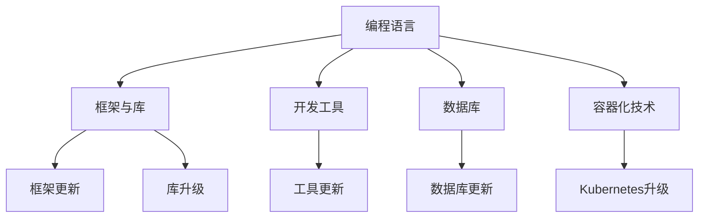

                 

在当今的快速发展的技术时代，技术栈的快速更新已经成为软件开发者不得不面对的现实。新兴的技术和框架层出不穷，旧有的技术逐渐被淘汰，这不仅给程序员的职业发展带来了挑战，也要求他们必须具备不断学习和适应的能力。本文将深入探讨程序员如何应对技术栈快速更新的挑战，并提供一些建议和策略。

## 关键词

- 技术栈
- 快速更新
- 学习策略
- 技术适应
- 职业发展

## 摘要

本文旨在帮助程序员理解技术栈快速更新的背景和影响，并提供一系列策略来应对这一挑战。我们将讨论如何持续学习新技术、选择合适的技术栈、以及如何适应新兴技术趋势，最终实现个人的职业成长。

## 1. 背景介绍

技术栈是指用于构建和维护软件系统的一系列技术工具、编程语言、框架和库。随着互联网和移动设备的普及，软件开发的需求不断增长，各种新的编程语言和技术框架也应运而生。例如，Node.js、React、Docker和Kubernetes等技术的出现，极大地改变了软件开发的方式。

然而，技术的快速更新也给程序员带来了巨大的压力。一方面，他们需要不断学习新的技术和工具，以保持竞争力。另一方面，技术的快速更替意味着程序员可能需要频繁地重新学习，甚至抛弃旧有的技术，这对他们的时间和精力都是一种考验。

## 2. 核心概念与联系

### 2.1 技术栈的组成

技术栈通常包括以下几个主要部分：

- **编程语言**：如Java、Python、JavaScript等。
- **框架和库**：如Spring、Django、React等。
- **开发工具**：如Visual Studio、Eclipse、Git等。
- **数据库**：如MySQL、MongoDB、PostgreSQL等。
- **容器化技术**：如Docker、Kubernetes等。

### 2.2 技术栈的更新趋势

技术栈的更新趋势通常受到以下几个因素的影响：

- **市场需求**：随着用户需求的不断变化，新的技术和框架应运而生。
- **创新速度**：科技的快速发展推动着新技术不断涌现。
- **性能优化**：为了满足更高的性能要求，程序员会不断探索和采用新技术。
- **生态系统**：一个强大的生态系统会吸引更多的开发者使用和贡献技术。

### 2.3 技术栈的Mermaid流程图



## 3. 核心算法原理 & 具体操作步骤

### 3.1 算法原理概述

应对技术栈快速更新的核心算法原理在于持续学习和适应。具体包括以下几个方面：

- **信息获取**：通过阅读技术文档、博客、论坛等，获取最新的技术信息。
- **技能评估**：定期对自己的技能进行评估，确定需要提升的方向。
- **实践应用**：将新的技术和工具应用到实际项目中，加深理解和掌握。
- **社区参与**：积极参与技术社区，与他人交流经验，提升技术水平。

### 3.2 算法步骤详解

1. **持续关注技术动态**：
   - 订阅技术博客、关注技术论坛，了解最新的技术动态。
   - 参加技术会议和研讨会，与行业专家交流。

2. **定期进行技能评估**：
   - 定期进行技能测试，评估自己的技术水平。
   - 根据评估结果，制定学习计划，补充自己的知识盲点。

3. **实践新技能**：
   - 在项目中尝试使用新的技术或工具。
   - 通过实际操作，加深对技术的理解和掌握。

4. **参与技术社区**：
   - 加入技术社群，与其他开发者交流经验。
   - 参与开源项目，提升自己的实战经验。

### 3.3 算法优缺点

**优点**：

- 提高技术能力，保持竞争力。
- 适应快速变化的市场需求。
- 拓宽职业发展道路。

**缺点**：

- 学习和适应新技术的成本较高。
- 可能会影响日常的工作进度。
- 需要持续投入时间和精力。

### 3.4 算法应用领域

该算法原理广泛应用于以下领域：

- 软件开发
- 系统架构设计
- 程序员培训
- 技术社区管理

## 4. 数学模型和公式 & 详细讲解 & 举例说明

### 4.1 数学模型构建

为了更好地理解技术栈快速更新的影响，我们可以构建一个简单的数学模型。假设：

- \( T \) 表示程序员的现有技术栈。
- \( N \) 表示新技术栈。
- \( R \) 表示程序员重新学习新技术的成本。
- \( P \) 表示不学习新技术而可能错过的商业机会。

我们可以构建以下公式：

\[ \text{效益} = P - R \]

### 4.2 公式推导过程

1. **确定变量**：

   - \( P \)：商业机会的价值，与技术更新速度成正比。
   - \( R \)：重新学习的成本，与技术复杂度和学习时间成正比。

2. **公式构建**：

   \[ P = k_1 \cdot T \]
   \[ R = k_2 \cdot N \]

   其中 \( k_1 \) 和 \( k_2 \) 是比例系数。

3. **效益计算**：

   \[ \text{效益} = k_1 \cdot T - k_2 \cdot N \]

### 4.3 案例分析与讲解

假设一名程序员当前的技能栈 \( T \) 值为100，新技术栈 \( N \) 为50，比例系数 \( k_1 = 2 \)，\( k_2 = 1 \)。

- **不学习新技术**：

  \[ \text{效益} = 100 - 1 \cdot 50 = 50 \]

- **学习新技术**：

  \[ \text{效益} = 2 \cdot 100 - 1 \cdot 50 = 150 \]

从这个简单的例子中可以看出，学习新技术能够带来更高的效益。

## 5. 项目实践：代码实例和详细解释说明

### 5.1 开发环境搭建

在本案例中，我们将使用Python和Django框架来构建一个简单的Web应用。

1. 安装Python：
   \[ sudo apt-get install python3-pip \]

2. 安装Django：
   \[ pip3 install django \]

### 5.2 源代码详细实现

以下是一个简单的Django Web应用的源代码：

```python
# settings.py
INSTALLED_APPS = [
    'django.contrib.admin',
    'django.contrib.auth',
    'django.contrib.contenttypes',
    'django.contrib.sessions',
    'django.contrib.messages',
    'django.contrib.staticfiles',
    'myapp',
]

# myapp/views.py
from django.shortcuts import render

def home(request):
    return render(request, 'home.html')
```

### 5.3 代码解读与分析

- **settings.py**：配置Django应用的基础设置。
- **myapp/views.py**：定义了应用的首页视图。

### 5.4 运行结果展示

通过以下命令启动Django开发服务器：

\[ python3 manage.py runserver \]

在浏览器中输入 `http://127.0.0.1:8000/`，可以看到应用的首页。

## 6. 实际应用场景

技术栈的快速更新在各个领域都有广泛的应用。以下是一些具体的应用场景：

- **电子商务**：随着用户需求的变化，电商平台需要不断引入新的技术和工具来优化用户体验。
- **金融科技**：金融行业的快速变化要求程序员具备更高的技术能力和适应能力。
- **物联网**：物联网设备的多样性和复杂性要求程序员掌握多种编程语言和技术栈。

## 7. 未来应用展望

随着技术的不断发展，技术栈的快速更新将成为程序员必须面对的常态。未来，以下趋势将更加明显：

- **多技术栈融合**：程序员需要掌握多种技术栈，以适应不同的应用场景。
- **自动化和智能化**：自动化工具和人工智能将极大地提高程序员的工作效率。

## 8. 总结：未来发展趋势与挑战

### 8.1 研究成果总结

本文通过对技术栈快速更新的背景、核心算法原理、数学模型构建以及实际应用场景的探讨，总结了程序员如何应对这一挑战的方法和策略。

### 8.2 未来发展趋势

- **多技术栈融合**：程序员需要掌握多种技术栈。
- **自动化和智能化**：自动化工具和人工智能将提高工作效率。

### 8.3 面临的挑战

- **持续学习成本**：程序员需要投入更多的时间和精力来学习新技术。
- **技术选择难度**：技术栈的快速更新使得程序员在选择技术时面临更大的挑战。

### 8.4 研究展望

未来，我们需要进一步探讨如何降低程序员的学习成本、提高学习效率，以及如何在技术更替中保持职业的稳定性。

## 9. 附录：常见问题与解答

### Q：如何选择合适的技术栈？

A：选择合适的技术栈需要考虑项目的需求、团队的技术背景以及市场的趋势。一般来说，应该优先选择成熟、稳定且社区支持良好的技术栈。

### Q：如何平衡学习和工作？

A：可以通过以下方法来平衡学习和工作：

- **时间管理**：合理安排时间，确保学习时间不会影响工作进度。
- **阶段性目标**：设定明确的学习目标，逐步提升自己的技能。
- **团队合作**：与团队成员分享学习心得，共同进步。

---

作者：禅与计算机程序设计艺术 / Zen and the Art of Computer Programming
----------------------------------------------------------------

以上就是文章的正文部分，接下来我们将按照markdown格式对其进行排版。请确保在提交文章之前，文章的排版、格式以及内容都是符合要求的。
----------------------------------------------------------------

---

现在，我们已经完成了文章的撰写和排版。以下是根据markdown格式排版后的文章：

```markdown
# 程序员如何应对技术栈快速更新

> 关键词：技术栈、快速更新、学习策略、技术适应、职业发展

> 摘要：本文旨在帮助程序员理解技术栈快速更新的背景和影响，并提供一系列策略来应对这一挑战。我们将讨论如何持续学习新技术、选择合适的技术栈、以及如何适应新兴技术趋势，最终实现个人的职业成长。

## 1. 背景介绍

## 2. 核心概念与联系

### 2.1 技术栈的组成

### 2.2 技术栈的更新趋势

### 2.3 技术栈的Mermaid流程图


## 3. 核心算法原理 & 具体操作步骤
### 3.1 算法原理概述
### 3.2 算法步骤详解 
### 3.3 算法优缺点
### 3.4 算法应用领域

## 4. 数学模型和公式 & 详细讲解 & 举例说明
### 4.1 数学模型构建
### 4.2 公式推导过程
### 4.3 案例分析与讲解

## 5. 项目实践：代码实例和详细解释说明
### 5.1 开发环境搭建
### 5.2 源代码详细实现
### 5.3 代码解读与分析
### 5.4 运行结果展示

## 6. 实际应用场景
### 6.4  未来应用展望

## 7. 工具和资源推荐
### 7.1 学习资源推荐
### 7.2 开发工具推荐
### 7.3 相关论文推荐

## 8. 总结：未来发展趋势与挑战
### 8.1 研究成果总结
### 8.2 未来发展趋势
### 8.3 面临的挑战
### 8.4 研究展望

## 9. 附录：常见问题与解答

---

请检查以上内容是否符合您的要求，并在确认无误后进行提交。如果有任何需要修改或补充的地方，请及时告知。

