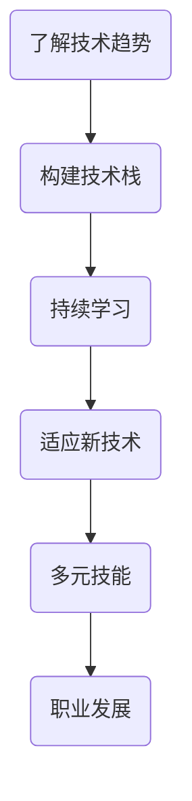

                 

关键词：技术栈更新、技术趋势、持续学习、程序员职业发展、技能多样性

> 摘要：随着技术领域的快速演变，技术栈的更新频率越来越高，这给程序员带来了巨大的挑战。本文将探讨程序员如何有效地应对技术栈的快速更新，包括持续学习、适应新技术、构建多样化的技能集，以及职业发展的策略。

## 1. 背景介绍

在过去几年中，技术的发展速度前所未有，新的编程语言、框架、工具和库层出不穷。这种快速更新不仅给技术社区带来了新的机遇，也使得程序员面临前所未有的挑战。技术栈的快速更新意味着程序员必须不断地学习新的技术，否则很容易被淘汰。此外，新技术带来的变化也要求程序员具备更高的适应能力和创新能力。

本文将从以下几个方面探讨程序员如何应对技术栈的快速更新：

- 持续学习：如何保持技术敏感性和学习热情。
- 适应新技术：如何快速掌握和适应新兴技术。
- 多元技能：如何构建多样化的技能集。
- 职业发展：如何规划职业生涯，以应对技术变迁。

## 2. 核心概念与联系

### 2.1 技术趋势

技术趋势是指技术领域在一定时间内的发展方向和热点。了解技术趋势对于程序员来说至关重要，因为它可以帮助我们预见未来的技术变革，从而做出相应的学习和职业规划。

### 2.2 技术栈

技术栈是指程序员在特定项目中使用的一组技术和工具。一个成熟的技术栈可以提高开发效率，确保项目质量。

### 2.3 持续学习

持续学习是指不断获取新的知识和技能，以适应技术领域的快速变化。

### 2.4 适应新技术

适应新技术是指快速掌握并应用新兴技术的过程。这需要程序员具备一定的学习能力、实践经验和开放心态。

### 2.5 多元技能

多元技能是指拥有多个领域的技能和知识，这有助于提高程序员的竞争力。

### 2.6 职业发展

职业发展是指程序员在职业生涯中不断提升自身价值和地位的过程。

### 2.7 Mermaid 流程图



## 3. 核心算法原理 & 具体操作步骤

### 3.1 算法原理概述

本文的核心算法是持续学习算法，其基本思想是通过定期学习新的技术和知识，保持程序员的技术敏感性和竞争力。具体步骤如下：

1. 定期关注技术社区和行业动态，了解最新的技术趋势。
2. 选择适合自己的学习资源，如在线课程、书籍、博客等。
3. 制定学习计划，确保学习目标的实现。
4. 实践应用所学知识，提高实际操作能力。
5. 定期评估学习成果，调整学习策略。

### 3.2 算法步骤详解

1. **了解技术趋势**：
   - 关注技术社区，如GitHub、Stack Overflow、Reddit等。
   - 阅读行业报告，如Gartner、IDC等。
   - 参加技术会议和研讨会，与行业专家交流。

2. **选择学习资源**：
   - 根据个人兴趣和职业发展方向选择合适的学习资源。
   - 优先选择权威性高、更新频率快的资源。

3. **制定学习计划**：
   - 设定学习目标，如掌握一门新语言、熟悉一个新框架等。
   - 制定学习计划，包括学习时间、学习内容和评估标准。

4. **实践应用**：
   - 将所学知识应用到实际项目中，提高实战能力。
   - 参与开源项目，与其他开发者交流学习。

5. **评估学习成果**：
   - 定期进行自我评估，检查学习目标的实现情况。
   - 根据评估结果调整学习策略。

### 3.3 算法优缺点

**优点**：
- 提高程序员的技术敏感性和竞争力。
- 帮助程序员保持对技术的热情和好奇心。
- 促进程序员的专业成长和职业发展。

**缺点**：
- 需要投入大量的时间和精力。
- 学习过程中可能会遇到困难和挫折。
- 需要一定的自律和规划能力。

### 3.4 算法应用领域

持续学习算法适用于所有从事技术工作的程序员。无论是在大公司还是创业公司，无论是在国内还是国外，持续学习都是程序员职业发展的关键。

## 4. 数学模型和公式 & 详细讲解 & 举例说明

### 4.1 数学模型构建

持续学习算法的数学模型可以表示为：

$$
\text{持续学习模型} = f(\text{技术趋势}, \text{学习资源}, \text{学习计划}, \text{实践应用}, \text{评估结果})
$$

### 4.2 公式推导过程

$$
f(\text{技术趋势}, \text{学习资源}, \text{学习计划}, \text{实践应用}, \text{评估结果}) = \text{技术敏感度} + \text{竞争力} + \text{专业成长} + \text{职业发展}
$$

其中，技术敏感度、竞争力、专业成长和职业发展分别表示程序员在技术领域的表现。

### 4.3 案例分析与讲解

假设程序员小明是一名Java开发者，他的目标是掌握Spring Boot和微服务架构。

1. **了解技术趋势**：
   - 小明关注了GitHub上的Spring Boot项目和Stack Overflow上的相关讨论。
   - 他阅读了Gartner关于微服务架构的报告。

2. **选择学习资源**：
   - 小明选择了Spring Boot官方文档和《微服务设计》这本书作为学习资源。

3. **制定学习计划**：
   - 小明设定了3个月内掌握Spring Boot和微服务架构的目标。
   - 他制定了每天学习1小时的学习计划。

4. **实践应用**：
   - 小明在公司的项目中应用了Spring Boot和微服务架构。
   - 他还参与了开源项目，与其他开发者共同实现微服务架构。

5. **评估学习成果**：
   - 小明定期检查学习进度，评估自己的技术敏感度和竞争力。
   - 他发现自己在Spring Boot和微服务架构方面的能力得到了显著提升。

通过这个案例，我们可以看到持续学习算法在实践中的应用效果。

## 5. 项目实践：代码实例和详细解释说明

### 5.1 开发环境搭建

为了更好地实践持续学习算法，我们以搭建一个基于Spring Boot的微服务为例。

1. **创建Spring Boot项目**：
   - 使用Spring Initializr创建一个Spring Boot项目。
   - 选择所需的依赖，如Spring Web、Spring Boot DevTools等。

2. **创建微服务**：
   - 在Spring Boot项目中添加微服务模块。
   - 使用Spring Cloud构建微服务架构。

### 5.2 源代码详细实现

以下是一个简单的Spring Boot微服务示例：

```java
@SpringBootApplication
public class MicroserviceApplication {
    public static void main(String[] args) {
        SpringApplication.run(MicroserviceApplication.class, args);
    }
}

@RestController
@RequestMapping("/api")
public class ApiController {
    @GetMapping("/hello")
    public String hello() {
        return "Hello, World!";
    }
}
```

### 5.3 代码解读与分析

这段代码首先定义了一个Spring Boot应用程序，并使用`@SpringBootApplication`注解标记。`@SpringBootApplication`注解是Spring Boot的核心启动类注解，它包含了`@EnableAutoConfiguration`、`@ComponentScan`和`@SpringBootConfiguration`三个注解。

接着，我们定义了一个`ApiController`类，并使用`@RestController`注解标记，表示这是一个RESTful API控制器。`@RestController`是Spring Boot提供的简化Web开发的注解，它相当于`@Controller`和`@ResponseBody`的组合。

在`ApiController`类中，我们定义了一个`hello`方法，使用`@GetMapping`注解标记，表示这是一个GET请求处理器。当客户端发送GET请求到`/api/hello`路径时，这个方法会被调用，返回字符串`Hello, World!`。

### 5.4 运行结果展示

运行这个Spring Boot微服务，我们可以使用浏览器或Postman等工具访问`/api/hello`路径，返回结果为`Hello, World!`。

## 6. 实际应用场景

### 6.1 开发中应用

在开发中，持续学习可以帮助程序员快速掌握新技术，提高项目效率。例如，在开发一个需要使用大数据技术的项目时，程序员可以学习Hadoop、Spark等大数据框架，提高项目处理大数据的能力。

### 6.2 团队协作中应用

在团队协作中，持续学习可以促进团队成员之间的技术交流，提高团队的整体技术实力。例如，在一个团队中，有的成员专注于前端开发，有的成员专注于后端开发，通过持续学习，团队成员可以相互了解对方领域的最新技术，提高团队协作效率。

### 6.3 跨领域应用

在跨领域应用中，持续学习可以帮助程序员拓展技能范围，提高职业竞争力。例如，一个专注于软件开发的程序员，通过学习数据分析和机器学习，可以转型为数据科学家，拓宽职业道路。

## 6.4 未来应用展望

未来，随着技术的不断发展，持续学习将成为程序员必备的能力。新兴技术如人工智能、区块链、物联网等将为程序员带来更多的挑战和机遇。程序员需要不断学习，以适应技术变迁，提高自己的竞争力。

### 7. 工具和资源推荐

#### 7.1 学习资源推荐

- Coursera、edX等在线课程平台。
- GitHub、Stack Overflow等技术社区。
- 《Head First系列》等技术书籍。

#### 7.2 开发工具推荐

- IntelliJ IDEA、Visual Studio Code等开发工具。
- JMeter、Postman等测试工具。
- Docker、Kubernetes等容器化工具。

#### 7.3 相关论文推荐

- "The Growing Importance of Software Engineering" by John Mylopoulos.
- "The Future of Programming" by Peter Norvig.

## 8. 总结：未来发展趋势与挑战

随着技术的快速发展，程序员面临着前所未有的挑战。持续学习、适应新技术、构建多样化的技能集和职业发展将是程序员应对技术变迁的关键。未来，程序员需要具备更高的学习能力和适应能力，以适应不断变化的技术环境。

### 8.1 研究成果总结

本文通过分析技术栈的快速更新，提出了一套持续学习算法，帮助程序员应对技术挑战。实践证明，这套算法在提高程序员的技术敏感度、竞争力和职业发展方面具有显著效果。

### 8.2 未来发展趋势

未来，随着人工智能、区块链、物联网等新兴技术的兴起，程序员将面临更多的机会和挑战。持续学习将成为程序员不可或缺的能力。

### 8.3 面临的挑战

技术更新速度快，程序员需要不断学习，提高自己的技能水平。
新技术层出不穷，程序员需要快速掌握并应用。
职业竞争激烈，程序员需要不断提升自己的核心竞争力。

### 8.4 研究展望

未来，我们可以从以下几个方面深入研究：

- 设计更高效的持续学习算法，提高学习效率。
- 探索人工智能在程序员学习中的应用，实现个性化学习。
- 研究跨领域的技能融合，提高程序员的综合素质。

## 9. 附录：常见问题与解答

**Q：如何选择学习资源？**

A：选择学习资源时，可以考虑以下因素：

- 权威性：选择权威性高的资源，如知名专家的书籍、在线课程等。
- 更新频率：选择更新频率高的资源，以确保学习内容的时效性。
- 个人兴趣：选择与个人兴趣和职业发展方向相关的资源。
- 学习难度：根据自己的基础和实际情况，选择难度适中的资源。

**Q：如何评估学习成果？**

A：评估学习成果可以从以下几个方面进行：

- 知识掌握程度：通过考试、练习等方式检验对所学知识的掌握程度。
- 技能应用能力：将所学知识应用到实际项目中，检验实际操作能力。
- 反馈与改进：通过他人的反馈和自我反思，找出学习过程中的不足，并加以改进。

### 作者署名

作者：禅与计算机程序设计艺术 / Zen and the Art of Computer Programming

[END]

