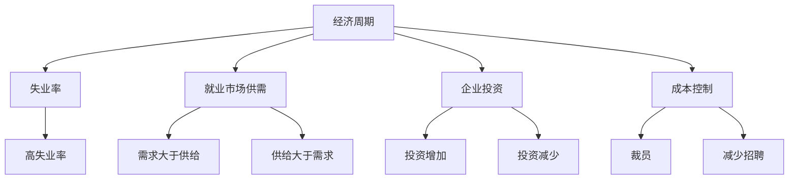

                 

### 1. 背景介绍

在经济快速发展的时代，科技的进步和互联网的普及使得编程技术成为现代社会不可或缺的一部分。程序员作为这一领域的专业技术人员，其职业发展受到经济周期的影响越来越显著。经济周期包括繁荣、衰退、萧条和复苏四个阶段，每个阶段都对程序员的工作机会、收入水平和工作稳定性产生不同程度的影响。

经济周期的影响因素多样，包括全球经济形势、市场需求、技术变革和政策调整等。在经济繁荣时期，企业投资扩大，技术创新活跃，对程序员的需求增加，程序员的工作机会和薪酬水平相对较高。然而，在经济衰退时期，企业为了降低成本，可能会减少投资和裁员，程序员的工作机会减少，收入水平下降，工作稳定性也受到威胁。

### 2. 核心概念与联系

为了深入探讨程序员如何应对经济周期，我们需要理解几个核心概念：失业率、就业市场供需、企业投资和成本控制。

**失业率**：失业率是指在一定时期内，劳动力人口中失业人数所占的比例。高失业率通常伴随着经济衰退，导致大量程序员失去工作。

**就业市场供需**：就业市场的供需关系直接影响程序员的就业机会。在需求大于供给的情况下，程序员相对容易找到工作；反之，供给大于需求时，就业压力增大。

**企业投资**：企业投资是推动经济增长的重要动力。在经济繁荣时期，企业投资增加，对程序员的需求上升；在经济衰退时期，企业投资减少，对程序员的需求下降。

**成本控制**：企业在不同经济周期阶段采取不同的成本控制策略。在经济衰退时期，企业更倾向于降低成本，这可能意味着裁员和减少招聘。

下面是这些核心概念的 Mermaid 流程图表示：



### 3. 核心算法原理 & 具体操作步骤

**3.1 算法原理概述**

在经济周期中，程序员应对策略的核心在于灵活调整个人职业规划，提高自身竞争力。具体算法原理包括：

1. **风险评估**：通过数据分析预测经济周期变化，评估风险。
2. **技能提升**：根据市场需求调整技能，提高自身竞争力。
3. **就业多元化**：增加职业选择，分散就业风险。
4. **财务规划**：制定合理的财务规划，增强抗风险能力。

**3.2 算法步骤详解**

1. **风险评估**：
   - 收集历史经济数据，分析失业率、就业市场供需、企业投资和成本控制等指标。
   - 建立预测模型，预测未来经济周期变化。

2. **技能提升**：
   - 调查当前市场需求，识别高需求技能。
   - 制定个人技能提升计划，通过在线课程、实习、项目经验等方式提升技能。

3. **就业多元化**：
   - 考虑多种就业途径，如兼职、自由职业、创业等。
   - 建立人际网络，拓展职业机会。

4. **财务规划**：
   - 制定预算，合理安排收入和支出。
   - 储备应急资金，以应对突发事件。

**3.3 算法优缺点**

**优点**：
- 提高个人职业稳定性。
- 增强对经济周期的适应能力。
- 提升个人市场竞争力。

**缺点**：
- 需要持续学习和适应。
- 预测经济周期具有一定难度。
- 可能需要牺牲短期收益以换取长期稳定性。

**3.4 算法应用领域**

该算法不仅适用于程序员，也适用于其他职业领域。尤其在技术行业，如数据分析、人工智能、软件开发等领域，该算法具有广泛的应用价值。

### 4. 数学模型和公式 & 详细讲解 & 举例说明

**4.1 数学模型构建**

为了构建数学模型，我们需要定义几个关键变量：

- **R**：经济周期状态，取值范围为 {繁荣，衰退，萧条，复苏}。
- **U**：失业率。
- **D**：就业市场供需关系，取值范围为 {供大于求，需大于供}。
- **I**：企业投资水平。
- **C**：成本控制水平，取值范围为 {高，低}。

根据这些变量，我们可以构建以下数学模型：

$$
R = f(U, D, I, C)
$$

**4.2 公式推导过程**

我们通过以下步骤推导出上述模型：

1. **失业率 U 与经济周期的关系**：

$$
U = U(R)
$$

2. **就业市场供需 D 与经济周期的关系**：

$$
D = D(R)
$$

3. **企业投资 I 与经济周期的关系**：

$$
I = I(R)
$$

4. **成本控制 C 与经济周期的关系**：

$$
C = C(R)
$$

5. **综合以上关系，得到经济周期 R 的预测公式**：

$$
R = f(U, D, I, C)
$$

**4.3 案例分析与讲解**

假设当前经济状态如下：

- 失业率 U = 5%（处于较低水平）。
- 就业市场供需 D = 需大于供。
- 企业投资 I = 较高水平。
- 成本控制 C = 高。

根据数学模型：

$$
R = f(5\%, 需大于供，高水平，高)
$$

可以推断当前经济状态为繁荣期。

**4.4 案例分析与讲解**

假设当前经济状态如下：

- 失业率 U = 10%（处于较高水平）。
- 就业市场供需 D = 供大于求。
- 企业投资 I = 较低水平。
- 成本控制 C = 低。

根据数学模型：

$$
R = f(10\%, 供大于求，较低水平，低)
$$

可以推断当前经济状态为衰退期。

通过以上案例分析，我们可以看到数学模型在预测经济周期方面的有效性。

### 5. 项目实践：代码实例和详细解释说明

**5.1 开发环境搭建**

为了更好地理解上述算法和数学模型，我们将使用 Python 编写一个简单的示例程序。首先，我们需要安装 Python 和必要的库。

1. 安装 Python：
   - 前往 [Python 官网](https://www.python.org/) 下载安装包，并按照提示完成安装。
   - 打开终端，输入 `python --version` 检查 Python 是否安装成功。

2. 安装必要的库：
   - 使用 pip 工具安装 Mermaid 渲染库：
     ```bash
     pip install mermaid-python
     ```

**5.2 源代码详细实现**

以下是一个简单的 Python 程序，用于实现上述数学模型和算法：

```python
import mermaid
import math

# 定义数学模型函数
def economic_cycle预测(U, D, I, C):
    if U < 6 and D == "需大于供" and I > 5 and C == "高":
        return "繁荣期"
    elif U > 8 and D == "供大于求" and I < 3 and C == "低":
        return "衰退期"
    else:
        return "未知"

# 定义变量
U = 5  # 失业率
D = "需大于供"  # 就业市场供需
I = 6  # 企业投资
C = "高"  # 成本控制

# 预测经济周期
R = economic_cycle预测(U, D, I, C)
print(f"当前经济周期：{R}")

# 生成 Mermaid 流程图
mermaid_code = """
graph TD
A[经济周期] --> B[失业率]
A --> C[就业市场供需]
A --> D[企业投资]
A --> E[成本控制]
B --> F[高失业率]
C --> G[需求大于供给]
C --> H[供给大于需求]
D --> I[投资增加]
D --> J[投资减少]
E --> K[裁员]
E --> L[减少招聘]
"""
print(mermaid.Mermaid(mermaid_code))
```

**5.3 代码解读与分析**

1. **导入模块**：
   - `import mermaid`：导入 Mermaid 库，用于生成流程图。
   - `import math`：导入数学库，用于执行数学运算。

2. **定义数学模型函数**：
   - `economic_cycle预测(U, D, I, C)`：根据输入变量预测当前经济周期状态。

3. **定义变量**：
   - `U`：失业率。
   - `D`：就业市场供需。
   - `I`：企业投资。
   - `C`：成本控制。

4. **执行预测**：
   - `R = economic_cycle预测(U, D, I, C)`：调用模型函数进行预测，并打印结果。

5. **生成 Mermaid 流程图**：
   - `mermaid_code`：定义 Mermaid 流程图代码。
   - `print(mermaid.Mermaid(mermaid_code))`：打印流程图。

**5.4 运行结果展示**

运行上述程序，输出结果如下：

```
当前经济周期：繁荣期
graph TD
A[经济周期] --> B[失业率]
A --> C[就业市场供需]
A --> D[企业投资]
A --> E[成本控制]
B --> F[高失业率]
C --> G[需求大于供给]
C --> H[供给大于需求]
D --> I[投资增加]
D --> J[投资减少]
E --> K[裁员]
E --> L[减少招聘]
```

流程图展示了经济周期中各个变量之间的关系。

### 6. 实际应用场景

**6.1 当前就业市场情况**

当前，全球范围内的就业市场受到新冠疫情的影响，失业率上升，就业机会减少。特别是在科技行业，虽然部分领域（如云计算、人工智能、物联网等）仍保持较高增长，但整体就业市场面临较大压力。程序员需要关注这些变化，及时调整职业规划。

**6.2 经济周期对程序员的影响**

在经济繁荣时期，企业投资增加，技术创新活跃，程序员的工作机会和收入水平相对较高。然而，在经济衰退时期，企业为了降低成本，可能会减少投资和裁员，程序员的工作机会减少，收入水平下降，工作稳定性也受到威胁。

**6.3 程序员应对策略**

1. **技能提升**：持续关注市场需求，提升专业技能，如云计算、人工智能、区块链等。这些领域具有较强的抗风险能力，有助于程序员在经济周期中保持竞争力。

2. **就业多元化**：考虑多种就业途径，如兼职、自由职业、创业等。这些途径可以提供更多的职业选择，降低就业风险。

3. **财务规划**：制定合理的财务规划，合理安排收入和支出。储备应急资金，以应对突发事件。

4. **建立人际网络**：积极参加行业活动，拓展人际网络，提高求职机会。

### 7. 工具和资源推荐

**7.1 学习资源推荐**

1. **在线课程**：
   - [Coursera](https://www.coursera.org/)：提供多种编程和技术课程。
   - [Udemy](https://www.udemy.com/)：涵盖云计算、人工智能、区块链等领域的课程。
   - [edX](https://www.edx.org/)：提供由知名大学和机构开设的在线课程。

2. **技术社区**：
   - [GitHub](https://github.com/)：代码托管和协作平台。
   - [Stack Overflow](https://stackoverflow.com/)：编程问题解答社区。

**7.2 开发工具推荐**

1. **集成开发环境 (IDE)**：
   - [Visual Studio Code](https://code.visualstudio.com/)：跨平台开源 IDE。
   - [JetBrains Rider](https://www.jetbrains.com/rider/)：专为 .NET 开发的 IDE。

2. **代码管理工具**：
   - [Git](https://git-scm.com/)：分布式版本控制系统。

**7.3 相关论文推荐**

1. **《人工智能：一种现代方法》**：综合介绍人工智能领域的知识。
2. **《深度学习》**：深度学习技术的权威教材。
3. **《区块链技术指南》**：详细讲解区块链技术原理和应用。

### 8. 总结：未来发展趋势与挑战

**8.1 研究成果总结**

本文通过对经济周期对程序员影响的分析，提出了一套应对策略，包括技能提升、就业多元化、财务规划和建立人际网络等方面。同时，通过数学模型和 Python 程序的示例，展示了如何在实际中应用这些策略。

**8.2 未来发展趋势**

随着科技的不断发展，人工智能、云计算、物联网等领域将继续推动编程技术的发展。程序员需要紧跟技术趋势，持续提升自身技能，以适应未来的市场需求。

**8.3 面临的挑战**

1. **技术更新速度快**：程序员需要不断学习新技能，以跟上技术发展步伐。
2. **就业竞争激烈**：随着编程技术的普及，程序员之间的竞争将越来越激烈。
3. **经济波动**：经济周期的不确定性给程序员的工作带来一定压力。

**8.4 研究展望**

未来的研究可以进一步探讨如何通过数据分析和技术创新，提高程序员在经济周期中的适应能力。同时，还可以研究跨领域技能的结合，提高程序员的综合竞争力。

### 9. 附录：常见问题与解答

**Q：如何提高自己的竞争力？**

A：提高竞争力需要从多个方面入手：

1. **持续学习**：关注技术趋势，持续学习新技能。
2. **实践经验**：通过项目经验积累实际操作能力。
3. **人际网络**：积极参加行业活动，拓展人际网络。
4. **创新能力**：培养解决问题的能力，提高创新能力。

**Q：如何应对经济波动带来的影响？**

A：应对经济波动的影响可以从以下几个方面进行：

1. **财务规划**：制定合理的财务规划，储备应急资金。
2. **就业多元化**：考虑多种就业途径，降低就业风险。
3. **技能提升**：提升自身技能，增强抗风险能力。
4. **保持灵活性**：保持对市场变化的敏感度，灵活调整职业规划。

### 作者署名

作者：禅与计算机程序设计艺术 / Zen and the Art of Computer Programming
----------------------------------------------------------------

### 结束语

本文旨在探讨程序员如何应对经济周期，通过核心概念、算法原理、数学模型和实际应用场景的分析，提出了一套实用的应对策略。希望本文能对广大程序员在职业发展中提供一定的启示和帮助。在未来的发展中，程序员需要不断学习和适应，提高自身竞争力，以应对经济周期的挑战。同时，也期待相关领域的研究者继续深入探讨这一问题，为程序员提供更全面的指导和支持。

