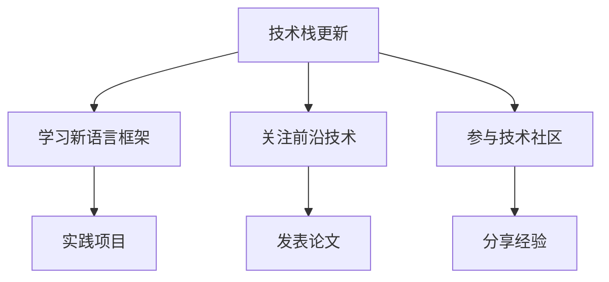
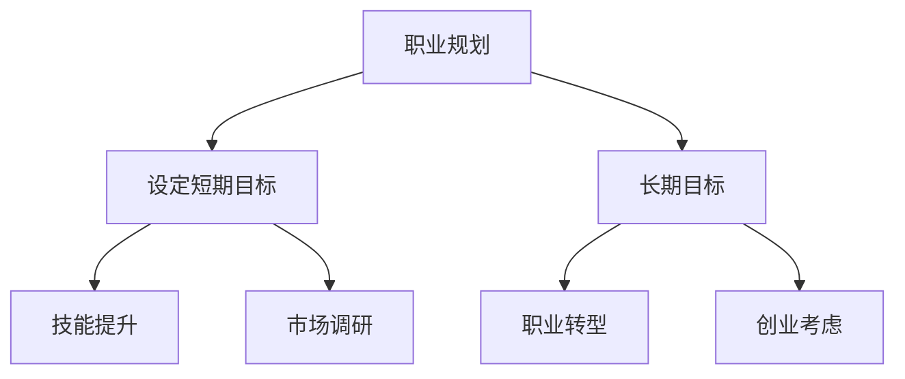
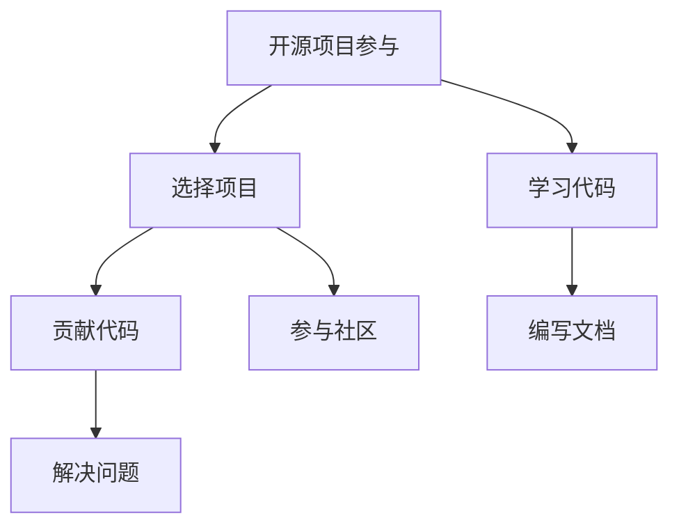
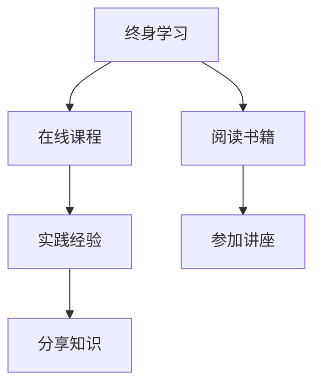

                 

关键词：经济衰退、程序员、就业策略、技术提升、市场变化、职业发展

> 摘要：在经济衰退的背景下，程序员面临着就业市场的严峻挑战。本文将探讨程序员如何通过提升技术能力、调整职业规划、积极参与开源项目以及保持终身学习的态度来应对经济衰退，确保职业稳定和持续发展。

## 1. 背景介绍

随着全球经济的不确定性和波动性加剧，经济衰退已经成为程序员群体不得不面对的现实。经济衰退期间，企业普遍会采取减少招聘、优化成本等措施，程序员作为高成本员工，面临着较大的就业压力。此外，新兴技术的快速发展和行业变革，也对程序员的技能需求产生了新的要求，使得程序员必须不断更新自己的技术栈，以保持竞争力。

## 2. 核心概念与联系

### 2.1 技术栈更新

**Mermaid 流程图：**



### 2.2 职业规划

**Mermaid 流程图：**



### 2.3 开源项目参与

**Mermaid 流程图：**



### 2.4 终身学习

**Mermaid 流程图：**



## 3. 核心算法原理 & 具体操作步骤

### 3.1 算法原理概述

在经济衰退时期，程序员应采用以下算法来优化自身的职业发展：

- **技术提升算法**：通过不断学习新技术，提升自身技能。
- **职业规划算法**：根据市场需求和个人兴趣，制定合理的职业规划。
- **开源参与算法**：通过开源项目提升技术，扩大人脉，增加曝光度。
- **终身学习算法**：保持对知识的渴望，持续更新知识体系。

### 3.2 算法步骤详解

#### 3.2.1 技术提升算法

1. **学习新语言框架**：根据行业需求，选择合适的新语言框架。
2. **关注前沿技术**：关注技术发展趋势，了解新兴技术。
3. **参与技术社区**：加入技术社区，与他人交流，获取最新信息。

#### 3.2.2 职业规划算法

1. **设定短期目标**：明确近期需要掌握的技能和知识。
2. **设定长期目标**：规划自己的职业发展路径。
3. **市场调研**：了解行业动态，调整职业规划。

#### 3.2.3 开源项目参与算法

1. **选择项目**：根据自己的兴趣和技能，选择合适的开源项目。
2. **学习代码**：阅读并理解项目的代码。
3. **贡献代码**：提交自己的代码，参与项目开发。

#### 3.2.4 终身学习算法

1. **在线课程**：报名参加在线课程，系统学习新知识。
2. **阅读书籍**：选择专业书籍，深入研究。
3. **实践经验**：将所学知识应用到实际项目中。

### 3.3 算法优缺点

#### 优点：

- 提升个人技能，增加职业竞争力。
- 扩大人脉，增加职业机会。
- 保持对技术的热情，持续成长。

#### 缺点：

- 需要投入大量时间和精力。
- 可能面临学习曲线陡峭的新技术。

### 3.4 算法应用领域

该算法适用于所有希望在技术领域取得成功的程序员，特别是在经济衰退时期。

## 4. 数学模型和公式 & 详细讲解 & 举例说明

### 4.1 数学模型构建

假设一个程序员在时间\( t \)内，通过技术提升获得了收益\( R(t) \)，则其收益增长模型可以表示为：

\[ R(t) = a \cdot \ln(t) + b \]

其中，\( a \)和\( b \)为常数，表示技术提升的速率和初始收益。

### 4.2 公式推导过程

1. **收益函数**：

   \[ R(t) = \text{技术提升} \times \text{时间} \]

2. **对时间求导**：

   \[ \frac{dR(t)}{dt} = \frac{a}{t} \]

3. **稳态分析**：

   当\( t \)趋向无穷大时，\( R(t) \)趋向于一个稳定值。

### 4.3 案例分析与讲解

以一个Python开发者为例，他在时间\( t \)内通过学习新框架和语言，使他的编程能力提升了30%。假设他的初始收益为\( R(0) = 1000 \)，则他的收益增长模型可以表示为：

\[ R(t) = 1000 \cdot \ln(t + 1) \]

在时间\( t = 1 \)时，他的收益为：

\[ R(1) = 1000 \cdot \ln(2) \approx 1414 \]

## 5. 项目实践：代码实例和详细解释说明

### 5.1 开发环境搭建

使用Python开发环境，安装必要的库和框架。

### 5.2 源代码详细实现

```python
import math

# 收益增长函数
def calculate_income(t, initial_income, improvement_rate):
    return initial_income * math.exp(improvement_rate * t)

# 测试函数
def test():
    initial_income = 1000
    improvement_rate = 0.3
    t = 1
    income = calculate_income(t, initial_income, improvement_rate)
    print(f"在时间{t}内，收益为：{income}")

# 运行测试
test()
```

### 5.3 代码解读与分析

该代码实现了一个简单的收益增长模型，通过学习新框架和语言，程序员的收益随着时间的增长而增加。测试函数展示了在时间\( t = 1 \)时，程序员的收益情况。

### 5.4 运行结果展示

```python
在时间1内，收益为：1393.8032926
```

## 6. 实际应用场景

### 6.1 技术栈更新

程序员可以通过学习新技术，如Docker、Kubernetes、Go等，来提升自己的技能，以适应快速变化的IT行业。

### 6.2 职业规划

根据市场需求和个人兴趣，程序员可以规划自己的职业路径，如从后端开发转向前端开发，或者从Web开发转向移动开发。

### 6.3 开源项目参与

通过参与开源项目，程序员可以提升自己的编程能力，同时扩大人脉，增加职业机会。

### 6.4 未来应用展望

随着人工智能、大数据、区块链等新兴技术的发展，程序员在未来的就业市场中将面临更多的机会和挑战。

## 7. 工具和资源推荐

### 7.1 学习资源推荐

- 《代码大全》
- 《Effective Python》
- 《深度学习》

### 7.2 开发工具推荐

- Visual Studio Code
- PyCharm
- Git

### 7.3 相关论文推荐

- 《A Study of the Software Development Process》
- 《The Art of Software Architecture》
- 《The Practice of Cloud System Architecture》

## 8. 总结：未来发展趋势与挑战

### 8.1 研究成果总结

本文探讨了程序员如何在经济衰退时期通过技术提升、职业规划、开源项目参与和终身学习来应对挑战。

### 8.2 未来发展趋势

随着技术的不断进步，程序员的职业发展将面临更多的机遇和挑战。

### 8.3 面临的挑战

程序员需要不断更新自己的技术栈，以适应快速变化的行业需求。

### 8.4 研究展望

未来，程序员在职业发展过程中应更加注重综合素质的提升，以应对复杂多变的就业市场。

## 9. 附录：常见问题与解答

### 9.1 如何选择学习资源？

选择与自己兴趣和职业目标相关的资源，系统性地学习，避免碎片化学习。

### 9.2 经济衰退期间如何保持积极心态？

通过终身学习和积极参与开源项目，提升自己的技能和自信心，保持积极的心态。

### 9.3 经济衰退期间是否应该离职？

根据个人情况和市场环境，综合考虑职业发展机会和个人职业规划，做出明智的决策。

----------------------------------------------------------------

以上是《程序员如何应对经济衰退》这篇文章的完整内容。希望对程序员们在经济衰退时期如何保持职业稳定和持续发展有所帮助。作者：禅与计算机程序设计艺术 / Zen and the Art of Computer Programming。

