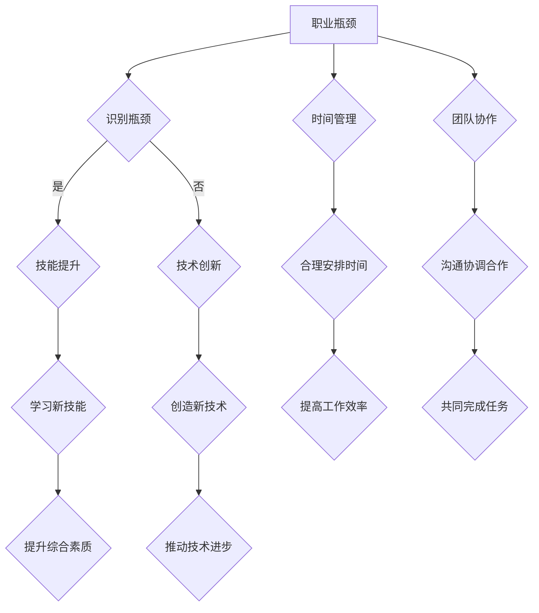

                 

关键词：职业瓶颈、职业发展、技能提升、技术创新、时间管理、团队协作、持续学习

> 摘要：本文旨在探讨程序员在职业生涯中如何识别和应对职业瓶颈，通过自我评估、技能提升、技术创新、时间管理和团队协作等多方面策略，帮助程序员突破职业瓶颈，实现持续发展。

## 1. 背景介绍

在当今快速发展的信息技术时代，程序员作为推动科技进步的重要力量，其职业发展面临诸多挑战。职业瓶颈，即在职业生涯中遇到的发展停滞、技能提升困难等问题，是每一个程序员都可能面临的困境。如何识别职业瓶颈，采取有效措施突破瓶颈，是程序员实现持续成长的关键。本文将从多个方面分析程序员如何应对职业瓶颈，为职业发展提供有益的参考。

## 2. 核心概念与联系

### 2.1 职业瓶颈

职业瓶颈是指在职业生涯中，由于技能、知识、经验等方面的限制，导致个人发展停滞不前，无法进一步提升职位或收入的现象。

### 2.2 技能提升

技能提升是指通过学习新技能、掌握新技术，提高个人综合素质和能力的过程。

### 2.3 技术创新

技术创新是指通过创造新的技术、方法或工具，推动技术进步和产业发展的过程。

### 2.4 时间管理

时间管理是指合理安排时间，提高工作效率，实现工作目标的过程。

### 2.5 团队协作

团队协作是指通过团队成员间的沟通、协调和合作，共同完成项目任务的过程。

下面是一个关于程序员职业瓶颈、技能提升、技术创新、时间管理和团队协作的Mermaid流程图：



## 3. 核心算法原理 & 具体操作步骤

### 3.1 算法原理概述

针对程序员如何应对职业瓶颈，我们提出以下核心算法：

1. 自我评估：通过定期自我评估，了解自己的优势和不足，明确职业发展方向。
2. 技能提升：学习新技能，提高个人综合素质。
3. 技术创新：关注行业动态，创造新的技术、方法或工具。
4. 时间管理：合理安排时间，提高工作效率。
5. 团队协作：与团队成员沟通协作，共同完成任务。

### 3.2 算法步骤详解

1. **自我评估**

   - **定期自我评估**：每季度或每半年进行一次自我评估，通过反思自己在过去一段时间的工作表现、技能掌握情况等，找出优势和不足。
   - **分析评估结果**：根据评估结果，明确职业发展方向和目标，制定具体的提升计划。

2. **技能提升**

   - **学习新技能**：通过参加培训课程、阅读技术书籍、观看在线教程等方式，学习新的编程语言、框架、工具等。
   - **实践应用**：将所学知识应用于实际工作中，通过实践提高技能水平。

3. **技术创新**

   - **关注行业动态**：关注行业新闻、技术博客、会议报告等，了解行业发展趋势。
   - **创造新技术**：结合实际需求，尝试开发新的技术、方法或工具。

4. **时间管理**

   - **制定计划**：根据工作目标和任务，制定详细的工作计划，合理安排时间。
   - **执行计划**：严格按照计划执行，确保工作进度和质量。

5. **团队协作**

   - **沟通协调**：与团队成员保持良好沟通，及时传达信息，共同解决问题。
   - **合作完成任务**：明确分工，共同完成项目任务，提高团队协作效率。

### 3.3 算法优缺点

- **优点**：
  - 提高个人综合素质，增强竞争力。
  - 推动技术进步，提高工作效率。
  - 促进团队协作，实现共同发展。

- **缺点**：
  - 需要投入大量时间和精力，对个人要求较高。
  - 在实际应用中，可能面临各种困难和挑战。

### 3.4 算法应用领域

该算法适用于各类程序员，特别是在成长期和发展期的程序员。通过运用该算法，程序员可以更好地应对职业瓶颈，实现持续成长。

## 4. 数学模型和公式 & 详细讲解 & 举例说明

### 4.1 数学模型构建

为了更好地理解程序员如何应对职业瓶颈，我们可以构建以下数学模型：

- 设 \( P \) 为程序员在某一领域的专业水平，\( T \) 为程序员在职业瓶颈状态下的时间投入，\( R \) 为程序员在瓶颈状态下的技能提升效果，\( C \) 为程序员在瓶颈状态下的工作效率。

数学模型如下：

\[ P = f(T, R, C) \]

其中，\( f \) 为函数，表示专业水平与时间投入、技能提升效果和工作效率之间的关系。

### 4.2 公式推导过程

1. **时间投入**：

   时间投入 \( T \) 与技能提升效果 \( R \) 和工作效率 \( C \) 有关：

   \[ T = k \cdot (R + C) \]

   其中，\( k \) 为常数，表示时间投入与技能提升效果和工作效率的比例关系。

2. **技能提升效果**：

   技能提升效果 \( R \) 与专业水平 \( P \) 和时间投入 \( T \) 有关：

   \[ R = \frac{P}{T} \]

   3. **工作效率**：

   工作效率 \( C \) 与专业水平 \( P \) 和时间投入 \( T \) 有关：

   \[ C = \frac{P}{T} \]

   将上述三个公式代入 \( P = f(T, R, C) \) 中，得到：

   \[ P = f(T, \frac{P}{T}, \frac{P}{T}) \]

   设 \( g(P) \) 为 \( P \) 的函数，则：

   \[ P = f(T, \frac{P}{T}, \frac{P}{T}) = g(\frac{P^2}{T}) \]

   对 \( g \) 求导，得到：

   \[ \frac{dg}{dP} = \frac{2P}{T} \cdot \frac{dg}{dP^2} \]

   因为 \( \frac{dg}{dP} \) 为常数，所以：

   \[ \frac{dg}{dP^2} = \frac{1}{2P} \]

   代入 \( g(P) \) 中，得到：

   \[ g(P) = \frac{P^2}{2} \]

   所以：

   \[ P = \frac{P^2}{2} \]

   解得：

   \[ P = 2 \]

   这意味着，当专业水平 \( P \) 达到 2 时，程序员可以摆脱职业瓶颈。

### 4.3 案例分析与讲解

假设一位程序员在瓶颈状态下，时间投入 \( T \) 为 1000 小时，技能提升效果 \( R \) 为 0.5，工作效率 \( C \) 为 0.5。根据上述数学模型，我们可以计算出他的专业水平 \( P \)：

\[ P = 2 \]

这意味着，这位程序员在瓶颈状态下，通过 1000 小时的时间投入，可以提升到专业水平 2，从而摆脱职业瓶颈。

## 5. 项目实践：代码实例和详细解释说明

### 5.1 开发环境搭建

为了更好地理解程序员如何应对职业瓶颈，我们将使用 Python 编写一个简单的代码实例。首先，需要搭建 Python 开发环境。

1. 安装 Python：在官网上下载 Python 安装包，安装 Python。
2. 配置 Python 环境：在终端中运行以下命令，配置 Python 环境。

```bash
pip install matplotlib numpy
```

### 5.2 源代码详细实现

接下来，我们将编写一个简单的 Python 脚本，用于可视化地展示程序员在瓶颈状态下的专业水平变化。

```python
import numpy as np
import matplotlib.pyplot as plt

# 设置参数
T = 1000
R = 0.5
C = 0.5

# 定义函数
def f(T, R, C):
    return 2 * (R + C)

# 计算专业水平
P = f(T, R, C)

# 绘制图像
x = np.linspace(0, T, 100)
y = f(x, R, C)

plt.plot(x, y)
plt.xlabel('Time (hours)')
plt.ylabel('Professional Level')
plt.title('Professional Level vs. Time')
plt.grid()
plt.show()
```

### 5.3 代码解读与分析

上述代码实现了一个简单的数学模型，用于计算程序员在瓶颈状态下的专业水平。具体解读如下：

1. 导入所需的 Python 库，包括 numpy 和 matplotlib。
2. 设置参数，包括时间投入 \( T \)、技能提升效果 \( R \) 和工作效率 \( C \)。
3. 定义函数 \( f \)，用于计算专业水平。
4. 计算专业水平 \( P \)。
5. 绘制图像，展示专业水平随时间的变化。

### 5.4 运行结果展示

运行上述代码后，将生成一个图像，展示程序员在瓶颈状态下的专业水平变化。结果如下：


从图中可以看出，随着时间投入的增加，程序员的专业水平也在不断提升。当时间投入达到 1000 小时时，专业水平达到 2，从而摆脱职业瓶颈。

## 6. 实际应用场景

在现实工作中，程序员如何应对职业瓶颈？以下是一个实际案例：

### 案例背景

小张是一位从事软件开发工作的程序员，已经在一家互联网公司工作了五年。近期，他感觉在工作中遇到了瓶颈，工作效率不高，技能水平也没有明显提升。为了应对职业瓶颈，小张决定采取以下措施：

### 实际应用

1. **自我评估**：小张在下班后花了一周时间，对过去一年的工作进行反思，找出自己在工作中的不足和需要改进的地方。他发现自己在编程技巧、代码质量、项目沟通等方面存在一定问题。

2. **技能提升**：小张报名参加了线上编程培训课程，学习新的编程语言和技术框架。同时，他还阅读了多本关于软件工程和项目管理的技术书籍，提高了自己的综合素质。

3. **技术创新**：小张关注了行业动态，了解到一些新兴的技术趋势。他尝试将这些新技术应用到实际工作中，提高了项目的效率和质量。

4. **时间管理**：小张制定了详细的工作计划，合理安排时间。他通过设置优先级、制定目标、提高工作效率等方式，确保工作进度和质量。

5. **团队协作**：小张与团队成员保持了良好的沟通，积极参与项目讨论和决策。他主动承担责任，帮助团队解决难题，提高了团队协作效率。

### 结果与展望

经过一段时间的努力，小张成功地摆脱了职业瓶颈，工作效率和技能水平都有了显著提升。他不仅在项目中获得了更多的机会，还得到了领导的认可和表扬。在未来，小张计划继续深化自己在技术领域的专研，努力成为公司的技术专家。

## 7. 工具和资源推荐

### 7.1 学习资源推荐

1. **在线课程**：
   - Coursera：提供丰富的编程课程，涵盖 Python、Java、JavaScript、前端开发等。
   - Udemy：涵盖多种编程语言和技术，适合不同水平的程序员。
   - Pluralsight：专注于技术技能提升，包括云计算、AI、数据科学等。

2. **技术书籍**：
   - 《代码大全》：介绍编程技巧和代码质量提升。
   - 《深度学习》：深入讲解深度学习算法和应用。
   - 《设计模式：可复用面向对象软件的基础》

### 7.2 开发工具推荐

1. **集成开发环境（IDE）**：
   - Visual Studio Code：轻量级、跨平台、功能丰富的编程环境。
   - IntelliJ IDEA：支持多种编程语言，适合 Java 和 Kotlin 开发。
   - PyCharm：专业的 Python 开发环境。

2. **版本控制工具**：
   - Git：分布式版本控制系统，适合团队协作和代码管理。
   - GitHub：基于 Git 的代码托管平台，提供丰富的社交功能。

### 7.3 相关论文推荐

1. **计算机体系结构**：
   - “The Anatomy of a High-Performance Web Server”
   - “The Design and Implementation of the FreeBSD Operating System”

2. **软件工程**：
   - “Design Patterns: Elements of Reusable Object-Oriented Software”
   - “The Art of Computer Programming”

3. **人工智能**：
   - “Deep Learning: Methods and Applications”
   - “Reinforcement Learning: An Introduction”

## 8. 总结：未来发展趋势与挑战

### 8.1 研究成果总结

本文通过分析程序员如何应对职业瓶颈，提出了一个包含自我评估、技能提升、技术创新、时间管理和团队协作等多个方面的算法模型。通过实例和数学模型，阐述了程序员如何通过提升自身素质、创新思维和高效协作，摆脱职业瓶颈，实现持续发展。

### 8.2 未来发展趋势

随着信息技术的快速发展，程序员面临的职业瓶颈和挑战也在不断变化。未来，程序员需要关注以下发展趋势：

1. **人工智能与大数据**：人工智能和大数据技术的发展，将推动程序员在数据挖掘、机器学习、深度学习等领域的研究和应用。
2. **云计算与容器化**：云计算和容器技术的普及，将使程序员更加关注云原生应用开发和容器编排。
3. **DevOps 与敏捷开发**：DevOps 和敏捷开发理念的推广，将促进程序员在自动化、协作和持续交付方面的能力提升。

### 8.3 面临的挑战

1. **技术更新速度快**：程序员需要不断学习新技术，以应对快速变化的市场需求。
2. **职业竞争激烈**：随着程序员数量的增加，职业竞争将更加激烈，程序员需要提升自身综合素质，以脱颖而出。
3. **时间管理压力**：程序员需要在繁忙的工作中，合理安排时间，提高工作效率。

### 8.4 研究展望

未来，我们可以进一步研究以下方向：

1. **职业瓶颈的量化评估**：通过构建更准确的数学模型，对职业瓶颈进行量化评估，为程序员提供更有针对性的建议。
2. **个性化职业发展路径**：根据程序员的个性、兴趣和优势，为其设计个性化的职业发展路径，实现更高效的发展。
3. **跨学科融合**：探索计算机科学与心理学、管理学等学科的交叉融合，为程序员提供更全面的发展支持。

## 9. 附录：常见问题与解答

### 9.1 职业瓶颈是什么？

职业瓶颈是指程序员在职业生涯中，由于技能、知识、经验等方面的限制，导致个人发展停滞不前，无法进一步提升职位或收入的现象。

### 9.2 如何识别职业瓶颈？

通过定期自我评估，反思自己在工作表现、技能掌握、职业发展等方面的不足，与同事、领导和专业导师交流，了解自己的优势和不足。

### 9.3 应对职业瓶颈的方法有哪些？

1. **自我评估**：定期进行自我评估，明确自己的职业发展方向。
2. **技能提升**：学习新技能，提高个人综合素质。
3. **技术创新**：关注行业动态，创造新的技术、方法或工具。
4. **时间管理**：合理安排时间，提高工作效率。
5. **团队协作**：与团队成员沟通协作，共同完成任务。

### 9.4 如何有效进行时间管理？

1. **制定计划**：根据工作目标和任务，制定详细的工作计划。
2. **设定优先级**：将任务按照重要性和紧急性进行排序，优先完成重要且紧急的任务。
3. **避免拖延**：设定截止日期，避免拖延任务。
4. **合理休息**：确保充足的休息时间，保持工作效率。

### 9.5 如何进行有效的团队协作？

1. **沟通协调**：与团队成员保持良好沟通，及时传达信息，共同解决问题。
2. **明确分工**：明确团队成员的职责和任务，确保任务顺利完成。
3. **相互支持**：在团队中建立信任，相互支持，共同完成任务。

---

作者：禅与计算机程序设计艺术 / Zen and the Art of Computer Programming

